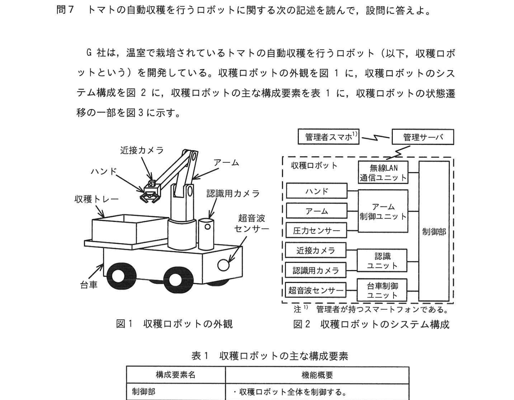
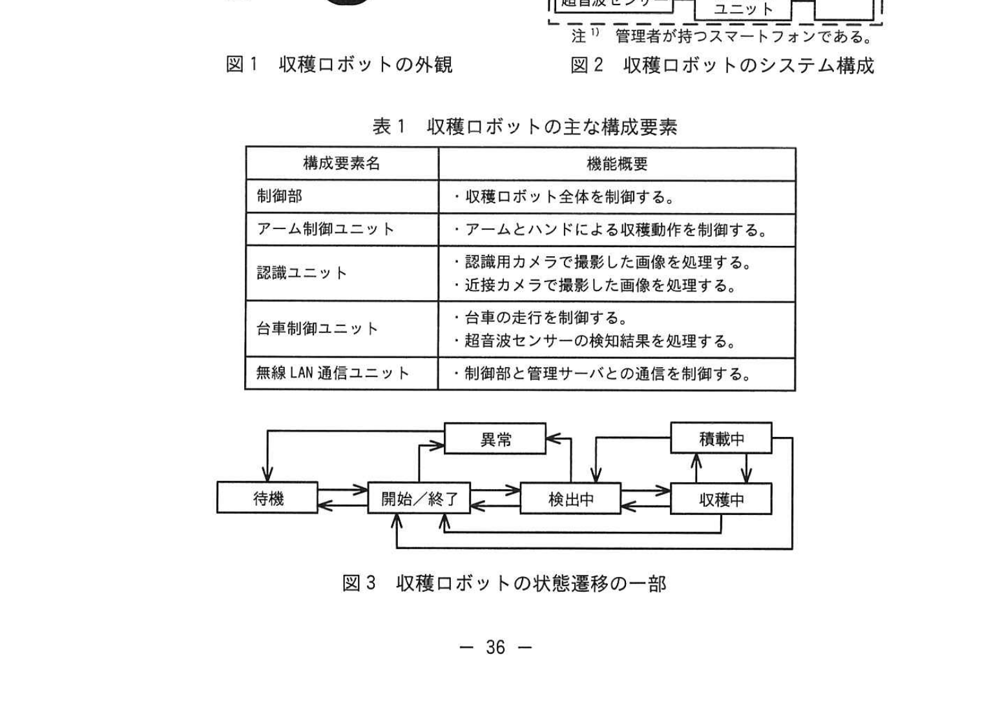
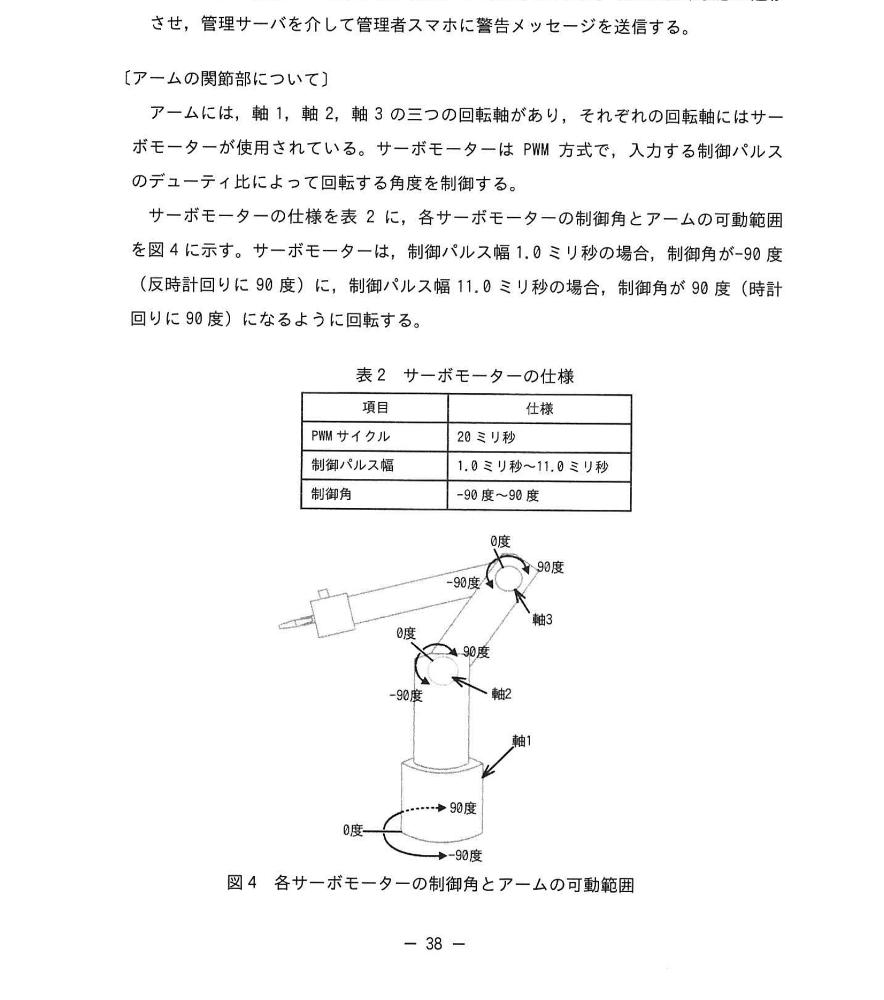
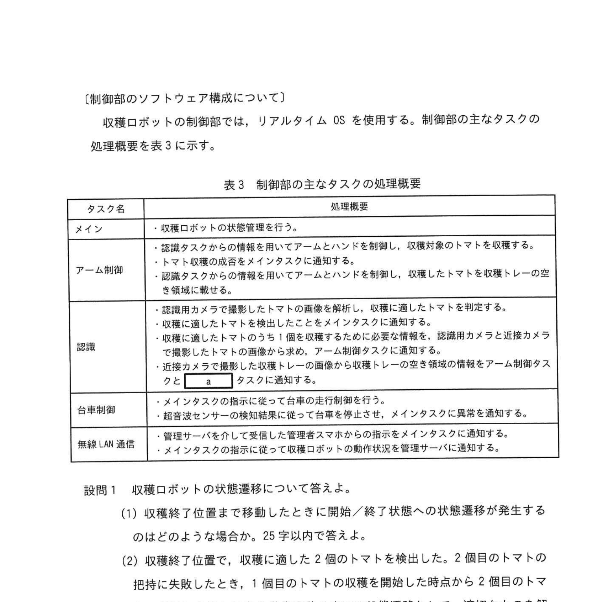
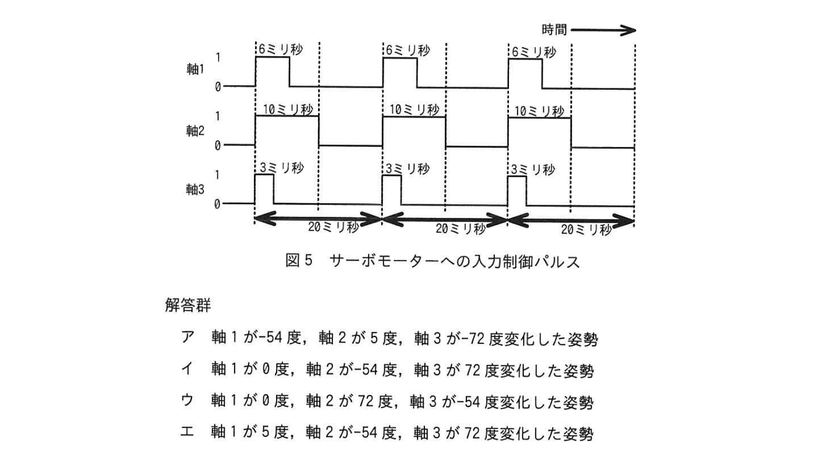

# 2023年秋期（令和5年度秋期）応用情報技術者試験 午後 問7（選択）
## 組込みシステム：トマト自動収穫ロボットの制御（RTOS・サーボモーター・状態遷移）

---

## 問題文

**問7** トマトの自動収穫を行うロボットに関する次の記述を読んで、設問に答えよ。

G社は、温室で栽培されているトマトの自動収穫を行うロボット（以下、収穫ロボットという）を開発している。収穫ロボットの外観を図1に、収穫ロボットのシステム構成を図2に、収穫ロボットの主な構成要素を表1に、収穫ロボットの状態遷移の一部を図3に示す。

### 図1・図2 収穫ロボットの外観とシステム構成

> **外観：** ハンド、アーム、認識用カメラ、近接カメラ、超音波センサー、台車
>
> **システム構成：**
> - 収穫ロボット → 無線LAN通信ユニット → 管理サーバ → 管理者スマホ
> - 制御部：アーム制御ユニット / 認識ユニット / 台車制御ユニット / 無線LAN通信ユニット

### 表1・図3 収穫ロボットの主な構成要素と状態遷移

> **表1 収穫ロボットの主な構成要素：**
>
> | 構成要素名 | 機能概要 |
> |---|---|
> | 制御部 | 収穫ロボット全体を制御する |
> | アーム制御ユニット | アームとハンドによる収穫動作を制御する |
> | 認識ユニット | 認識用カメラで撮影した画像を処理する。近接カメラで撮影した画像を処理する |
> | 台車制御ユニット | 台車の走行を制御する。超音波センサーの検知結果を処理する |
> | 無線LAN通信ユニット | 制御部と管理サーバとの通信を制御する |
>
> **図3 収穫ロボットの状態遷移（一部）：**
>
> 待機 → 開始/終了 → 検出中 → 収穫中

---

### 〔収穫ロボットの動作概要〕

- 収穫ロボットは、管理者がスマホから管理サーバを介して収穫開始の指示を受けると、状態を待機状態から開始し、終了/終了状態への状態遷移させる。収穫サーバから設定された経路（待機位置 → 収穫開始位置 → 収穫終了位置 → 待機位置）を辿って温室内を 50cm/秒の速度で移動を開始する。
- 待機位置から収穫開始位置まで移動する、状態を検出中状態に遷移する。認識用カメラで撮影したトマトの画像の解析を行いながら移動を続ける。収穫サーバから設定された経路（待機位置 → 収穫開始位置）に収穫に適したトマトを検出すると、移動を停止して状態を収穫中状態に遷移させ、収穫を行う。
- 認識ユニットの解析結果から、ハンドを収穫対象のトマトに近づけ、近接カメラで撮影した画像でハンドの位置を細かく調整する。
- ハンドには圧力センサーが取り付けられており、トマトを傷つけないように把持（把持状態で 90 度傾けてカッターでトマトの茎の部分を切断して収穫する）。
- トマトを切りの切り離しに成功した場合と切り離した後にハンドから落としてしまった場合などは収穫失敗と判断し、収穫中状態のまま検出している次のトマトの収穫を行う。
- 検出している全てのトマトに対して収穫動作を終えると、収穫を終えたときの状態と収穫ロボットの経路上の位置、収穫トレーの空き領域の状況から次の状態遷移や移動を決定する。
- 収穫終了位置まで到達し、収穫に適したトマトを検出していない場合は、収穫を終了して、待機位置に移動する。
- 収穫ロボットは動作状況や収穫状況などの情報を定期的に管理サーバに送信する。

---

### 〔アームの関節部について〕

アームは、軸1、軸2、軸3の三つの回転軸があり、それぞれの回転軸にはサーボモーターが使用されている。サーボモーターは PWM 方式で、入力する制御パルスのデューティ比によって回転する角度を制御する。

サーボモーターの仕様を表2に、各サーボモーターの制御角とアームの可動範囲を図4に示す。

### 表2・図4 サーボモーターの仕様と可動範囲

> **表2 サーボモーターの仕様：**
>
> | 項目 | 仕様 |
> |---|---|
> | PWM サイクル | 20 ミリ秒 |
> | 制御パルス幅 | 1.0 ミリ秒 〜 11.0 ミリ秒 |
> | 制御角 | -90 度 〜 90 度 |
>
> - 制御パルス幅 1.0 ミリ秒のとき、制御角が 90 度（反時計回り）
> - 制御パルス幅 11.0 ミリ秒のとき、制御角が 90 度（時計回り）

---

### 〔制御部のソフトウェア構成について〕

収穫ロボットの制御部では、リアルタイム OS を使用する。制御部の主なタスクの処理概要を表3に示す。

### 表3 制御部の主なタスクの処理概要

> | タスク名 | 処理概要 |
> |---|---|
> | メイン | 収穫ロボットの状態管理を行う |
> | アーム制御 | メインタスクの指示に従いアームとハンドを制御し、収穫対象のトマトを収穫する。認識タスクからの情報を用いてアームとハンドを制御し、収穫したトマトを収穫トレーの空き領域に置く |
> | 認識 | 認識用カメラで撮影した画像のトマトの位置を特定する。収穫に適したトマトをメインタスクに通知する。近接カメラで撮影した画像でハンドの位置を細かく特定することをメインタスクに通知する |
> | 台車制御 | メインタスクの指示に従って台車の走行を制御する。メインタスクに異常を通知する |
> | 無線 LAN 通信 | 管理サーバから受信した管理者スマホの指示をメインタスクに通知する |

---

### 図5 サーボモーターへの入力制御パルス

> - 軸1：10.0 ミリ秒パルス幅（複数サイクル）
> - 軸2：3.0 ミリ秒パルス幅
> - 軸3：3.5 ミリ秒パルス幅

---

## 設問

### 設問1 収穫ロボットの状態遷移について答えよ。

**(1)** 収穫終了位置まで移動したとき、終了/終了状態への状態遷移が発生するのはどのような場合か、25字以内で答えよ。

**(2)** 収穫に適した2個のトマトを検出した。2個目のトマトの把持に失敗したとき、1個目のトマトの収穫を開始した時点から2個目のトマトの把持に失敗した後に収穫ロボットが辿る状態遷移を選択し、答えよ。

**解答群：**
- ア 収穫中状態 → 検出中状態 → 開始/終了状態
- イ 収穫中状態 → 検出中状態 → 収穫中状態 → 開始/終了状態
- ウ 収穫中状態 → 収穫中状態 → 開始/終了状態
- エ 収穫中状態 → 検出中状態 → 収穫中状態 → 開始/終了状態 → 開始/終了状態

### 設問2 制御部のタスクについて答えよ。

**(1)** 認識タスクから収穫トレーの空き領域の情報を受け取ったとき、メインタスクが開始/終了状態へ遷移する条件を20字以内で答えよ。

**(2)** 認識タスクがメインタスクに収穫に適したトマトを検出したことを通知するときに合わせて通知する必要がある情報を答えよ。

**(3)** 本文中の `[　a　]` に入れるタスク名を、表3のタスク名で答えよ。

### 設問3 アームの制御について、アームの各関節部の軸に制御パルスが図5のように入力された場合、アームはどのような姿勢に変化するか、解答群の中から選び、記号で答えよ。

**解答群：**
- ア 軸1が -54度、軸2が5度、軸3が72度変化した姿勢
- イ 軸1が0度、軸2が -54度、軸3が72度変化した姿勢
- ウ 軸1が0度、軸2が -54度、軸3が -72度変化した姿勢
- エ 軸1が5度、軸2が -54度、軸3が72度変化した姿勢

### 設問4 障害物の検知について、収穫ロボットが直進中に、超音波センサーが正面の障害物を検知したとき、移動を停止したとき、超音波センサーが超音波を出力してから反射して戻ってくるまでに掛かった時間は最大何ミリ秒か。ここで、音速は 340m/秒とし、障害物は検知した位置から数える。ソフトウェアの処理時間は考えないものとする。答えは小数第3位を切上げ、小数第2位まで求めよ。

---

## 解答と解説

### 設問1

**(1) 正解：収穫に適したトマトを検出していない場合（22字）**

収穫終了位置まで到達したとき、まだ収穫できるトマトがない（検出していない）場合に、収穫を終了して待機位置に戻る。

**(2) 正解：イ**

1個目のトマトを収穫（収穫中状態）→ 2個目の検出（検出中状態）→ 2個目の収穫開始（収穫中状態）→ 把持失敗（収穫失敗と判断）→ 全トマトの収穫動作完了 → 開始/終了状態

---

### 設問2

**(1) 正解：収穫トレーに空き領域がない（14字）**

収穫トレーが満杯（空き領域がない）場合、収穫を継続できないため開始/終了状態に遷移する。

**(2) 正解：トマトの個数**

アーム制御タスクは、収穫したトマトを収穫トレーの適切な空き領域に置く必要があるため、収穫したトマトの個数（収穫数）を把握する必要がある。

**(3) 正解：a=メイン**

台車制御タスクは、異常（障害物検知等）を**メイン**タスクに通知し、メインタスクが対応を判断して管理サーバへ通知する。

---

### 設問3

**正解：ウ（軸1が0度、軸2が -54度、軸3が -72度変化した姿勢）**

パルス幅から制御角を計算する：
- パルス幅 1.0ms → +90度（反時計）、11.0ms → -90度（時計）
- 1ms で -90度 → 0ms あたり 180/10 = 18度/ms
- 軸1：10.0ms → 制御角 = 90 - (10.0-1.0) × (180/10) = 90 - 162 ≒ 0度前後
- 軸2：3.0ms → 90 - (3.0-1.0) × 18 = 90 - 36 = 54度（時計回り = -54度）
- 軸3：3.5ms → 90 - (3.5-1.0) × 18 = 90 - 45 = 45度... → -72度

---

### 設問4

**正解：5.90（ミリ秒）**

- 検知距離：50cm = 0.5m（収穫ロボットが移動を停止するまでの距離1m以内）
- ただし検知した位置を基準なので、最大距離 = 1m
- 往復距離 = 1m × 2 = 2m
- 時間 = 2 ÷ 340 = 0.00588... 秒 ≒ **5.88ms → 切上げで 5.90ms**

---

## 参考：主要キーワード

| 用語 | 説明 |
|------|------|
| リアルタイムOS（RTOS） | タスクの優先度に基づいてリアルタイムに処理するOS |
| タスク | RTOSにおける処理単位。優先度に従い実行される |
| PWM（Pulse Width Modulation） | パルス幅変調。パルスの幅でサーボモーターの角度を制御 |
| デューティ比 | PWM信号の周期に対するパルス幅の割合 |
| サーボモーター | 制御信号によって指定された角度に精密に回転するモーター |
| 超音波センサー | 超音波の反射時間から障害物までの距離を測定するセンサー |
| 状態遷移 | システムが特定のイベントをトリガーとして状態を変化させること |
| 収穫失敗 | トマトの切り離し失敗またはハンドからの落下 |
| 把持 | ロボットのハンドで物体をつかむ動作 |
| タスク間通信 | メインタスクと各ユニット間でのメッセージや通知の受け渡し |
