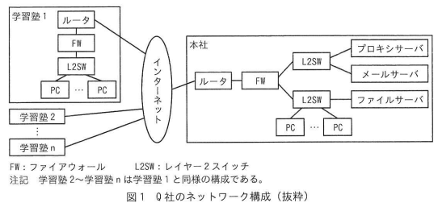
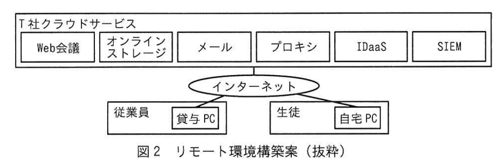

# 2024年春期（令和6年度春期）応用情報技術者試験 午後 問1（必須）
## 情報セキュリティ：リモート環境のセキュリティ対策（ゼロトラスト）

---

## 問題文

**問1** リモート環境のセキュリティ対策に関する次の記述を読んで、設問に答えよ。

Q社は、首都圏で複数の学習塾を経営する会社であり、各学習塾で対面授業を行っている。生徒及び生徒の保護者からはリモートでも受講が可能なハイブリッド型授業の導入要望があり、Q社の従業員からはテレワーク勤務の導入要望がある。

---

### 〔Q社の現状のネットワーク構成〕

Q社のネットワーク構成（抜粋）を図1に示す。

### 図1 Q社のネットワーク構成（抜粋）

> - 学習塾1: ルータ → FW → L2SW → PC群（学習塾2〜nも同様の構成）
> - 学習塾1〜n → インターネット → 本社
> - 本社: ルータ → FW → L2SW → プロキシサーバ / メールサーバ（上段L2SW）
> - 本社: FW → L2SW → ファイルサーバ / PC群（下段L2SW）
> - FW: ファイアウォール、L2SW: レイヤー2スイッチ

---

### 〔Q社の現状のセキュリティ対策〕

Q社のセキュリティ対策は次のとおりである。

- パケットフィルタリングポリシーに従った通信だけをFWで許可し、その他の通信を遮断している。
- 業務上必要なサイトのURL情報を基に、URLフィルタリングを行うソフトウェアをプロキシサーバに導入して、業務上不要なサイトへの接続を禁止している。
- PC及びサーバ機器には、外部媒体の使用ができない設定をした上で、マルウェア対策ソフトを導入して、マルウェア感染対策を行っている。
- PC、ネットワーク機器及びサーバ機器には、脆弱性に対応する修正プログラム（以下、セキュリティパッチという）を定期的に確認した後、適用する方法で、脆弱性対策を行っている。

---

### 〔Q社の現状のセキュリティ対策に関する課題〕

- ネットワーク機器及びサーバ機器のEOL（End Of Life）時期が近づいており、機器の更新が必要である。
- セキュリティパッチが提供されているかの調査及び適用してよいかの判断に時間が掛かることがある。
- ルータとFWを利用した①<u>境界型防御</u>によるセキュリティ対策では、防御しきれない攻撃がある。
- セキュリティインシデントの発生を、迅速に検知する仕組みがない。

Q社では、ハイブリッド型授業とテレワーク勤務が行えるリモート環境を実現し、Q社のセキュリティに関する課題を解決する新たな環境を、クラウドサービスを利用して構築することになり、情報システム部のR課長が担当することになった。

---

### 〔リモート環境の構築方針〕

R課長は、境界型防御の環境に代えて、いかなる通信も信頼しないという `[　a　]` の考え方に基づくリモート環境を構築することにした。

R課長は、リモート環境について次の構築方針を立てた。

- クラウドサービスへの移行に伴い、ネットワーク機器及びサーバ機器は廃棄し、今後のQ社としてのEOL対応を不要とする。
- ②<u>課題となっている作業</u>を不要にするために、クラウドサービスはSaaS型を利用する。
- セキュリティインシデントの発生を迅速に検知する仕組みを導入する。
- 従業員にモバイルルータとセキュリティ対策を実施したノートPC（以下、貸与PCという）を貸与する。今後は、本社、学習塾及びテレワークでの全ての業務において、貸与PCとモバイルルータを使用してクラウドサービスを利用する。
- 貸与PCから業務上不要なサイトへの接続は禁止とする。
- 生徒は、自宅などのPC（以下、自宅PCという）からクラウドサービスを利用してリモートでも授業を受講できる。

---

### 〔リモート環境構築案の検討〕

R課長はリモート環境の構築方針を部下のS君に説明し、構築する環境の検討を指示した。

S君はリモート環境構築案を検討した。

- リモート環境の構築には、T社クラウドサービスを利用する。
- 貸与PCからWebサイトを閲覧する際は、③<u>プロキシを経由する</u>。
- 貸与PCからインターネットを経由して接続するWeb会議、オンラインストレージ及び電子メール（以下、メールという）を利用することで、Q社の業務及びリモートでの授業を行う。
- 貸与PCからT社クラウドサービスへのログインは、ログインを集約管理するクラウドサービスであるIDaaS（Identity as a Service）を利用する。従業員はIDとパスワードを用いてシングルサインオンで接続してクラウドサービスを利用する。
- ④<u>SIEM（Security Information and Event Management）</u>の導入と、アラート発生時に対応する体制の構築を行う。
- 貸与PCには、マルウェア対策ソフトを導入し、外部媒体が使用できない設定を行う。また、⑤<u>紛失時の情報漏えいリスクを低減する対策をとる</u>。
- 生徒は、自宅PCからインターネット経由で、Web会議に接続して、リモートで授業を受講できる。

S君が検討したリモート環境構築案（抜粋）を図2に示す。

### 図2 リモート環境構築案（抜粋）

> **T社クラウドサービス：** Web会議 / オンラインストレージ / メール / プロキシ / IDaaS / SIEM
> - 従業員（貸与PC）／生徒（自宅PC）→ インターネット → T社クラウドサービス

---

### 〔構築案への指摘と追加対策の検討〕

S君は検討した構築案についてR課長に説明した。すると、セキュリティ対策の不足に起因するセキュリティインシデントの発生を懸念したR課長は、"`[　a　]` では、クラウドサービスにアクセスする通信を信頼せずセキュリティ対策を行う必要があるので、エンドポイントである貸与PCと自宅PCに対する攻撃への対策及びクラウドサービスのユーザー認証を強化する対策が必要である。追加の対策を検討するように。"と指摘した。

R課長が懸念したセキュリティインシデント（抜粋）を表1に示す。

### 表1 R課長が懸念したセキュリティインシデント（抜粋）

| 項番 | 分類 | セキュリティインシデント |
|---|---|---|
| 1 | 貸与PC | ゼロデイ攻撃によるマルウェア感染 |
| 2 | 貸与PC | ファイルレスマルウェア攻撃によるマルウェア感染 |
| 3 | 自宅PC | マルウェア感染した自宅PCからWeb会議への不正アクセス |
| 4 | クラウドサービスのユーザー認証 | 不正ログインによる情報漏えい |

S君は、R課長の指摘に対して、表1のセキュリティインシデントに対応した次の対策を追加することにした。

- 項番1、2の対策として、貸与PCに⑥<u>EDR（Endpoint Detection and Response）ソフトを導入する</u>。
- 項番3の対策として、T社クラウドサービスは不正アクセス及びマルウェア感染の対策がとられていることを確認した。
- 項番4の対策として、知識情報であるIDとパスワードによる認証に加えて、所持情報である従業員のスマートフォンにインストールしたアプリケーションソフトウェアに送信されるワンタイムパスワードを組み合わせて認証を行う、`[　b　]` を採用する。

S君は、これらの対策を追加した構築案をR課長に報告し、構築案は了承された。

---

## 設問

### 設問1

本文中の下線①について、**防御できる**攻撃を解答群の中から選び、記号で答えよ。

**解答群：**
- ア システム管理者による内部犯行
- イ パケットフィルタリングのポリシーで許可していない通信による、内部ネットワークへの侵入
- ウ 標的型メール攻撃での、添付ファイル開封による未知のマルウェア感染
- エ ルータの脆弱性を利用した、インターネット接続の切断

### 設問2

〔リモート環境の構築方針〕について答えよ。

**(1)** 本文中の `[　a　]` に入れる適切な字句を6字で答えよ。

**(2)** 本文中の下線②について、課題となっている作業を25字以内で答えよ。

### 設問3

〔リモート環境構築案の検討〕について答えよ。

**(1)** 本文中の下線③で実現すべきセキュリティ対策を、本文中の字句を用いて15字以内で答えよ。

**(2)** 本文中の下線④を導入した目的を、〔Q社の現状のセキュリティ対策に関する課題〕と〔リモート環境の構築方針〕とを考慮して30字以内で答えよ。

**(3)** 本文中の下線⑤について、対策として適切なものを解答群の中から**全て**選び、記号で答えよ。

**解答群：**
- ア 貸与PCのストレージ全体を暗号化する。
- イ 貸与PCのモニターにのぞき見防止フィルムを貼付する。
- ウ リモートロック及びリモートワイプの機能を導入する。

### 設問4

〔構築案への指摘と追加対策の検討〕について答えよ。

**(1)** 本文中の下線⑥について、表1の項番1、2のセキュリティインシデントが発生した場合のEDRソフトの動作として適切なものを解答群の中から選び、記号で答えよ。

**解答群：**
- ア 貸与PCをネットワークから遮断し、不審なプロセスを終了する。
- イ 登録された振る舞いを行うマルウェアの侵入を防御する。
- ウ 登録した機密情報の外部へのデータ送信をブロックする。
- エ パターン情報に登録されているマルウェアの侵入を防御する。

**(2)** 本文中の `[　b　]` に入れる適切な字句を5字で答えよ。

---

## 解答と解説

### 設問1

**正解：イ（パケットフィルタリングのポリシーで許可していない通信による、内部ネットワークへの侵入）**

境界型防御（FW＋パケットフィルタリング）が**防御できる**攻撃は「許可していない通信による内部ネットワークへの侵入」。内部犯行（ア）、標的型メールでの未知マルウェア（ウ）、ルータ脆弱性を突く攻撃（エ）は境界型防御では防御しきれない。

**IPA公式：イ**

---

### 設問2

**(1) 正解：a=ゼロトラスト（6字）**

「いかなる通信も信頼しない」という考え方は**ゼロトラスト**セキュリティモデル。境界型防御の対概念。

**IPA公式：ゼロトラスト**

**(2) 正解：セキュリティパッチの提供の調査と適用の判断（20字）**

下線②「課題となっている作業」は、〔課題〕の「セキュリティパッチが提供されているかの調査及び適用してよいかの判断」。SaaS型ではベンダーがパッチ適用を担うため、この作業が不要になる。

**IPA公式：セキュリティパッチ提供の調査及び適用の判断**

---

### 設問3

**(1) 正解：URLフィルタリング（9字）**

プロキシを経由することで、プロキシサーバに導入したURLフィルタリングによって業務上不要なサイトへの接続を禁止できる。

**IPA公式：URLフィルタリング／業務上不要なサイトへの接続禁止**

**(2) 正解：セキュリティインシデントの発生を迅速に検知するため（24字）**

〔課題〕に「セキュリティインシデントの発生を迅速に検知する仕組みがない」、〔構築方針〕に「迅速に検知する仕組みを導入する」とあり、SIEMはログを収集・相関分析してインシデントを迅速に検知するために導入する。

**IPA公式：セキュリティインシデントの発生を迅速に検知するため**

**(3) 正解：ア、ウ**

下線⑤は貸与PCの**紛失時**の情報漏えいリスク低減対策。
- **ア（ストレージ暗号化）：正しい** - 紛失しても記憶内容を読み取られない。
- **ウ（リモートロック・リモートワイプ）：正しい** - 紛失時に遠隔でロック・データ消去できる。
- **イ（のぞき見防止フィルム）：誤り** - 紛失時の情報漏えい対策ではない（利用中ののぞき見対策）。

**IPA公式：ア、ウ**

---

### 設問4

**(1) 正解：ア（貸与PCをネットワークから遮断し、不審なプロセスを終了する）**

EDR（Endpoint Detection and Response）は、エンドポイントの挙動を監視し、マルウェア感染などのインシデントを検知した後に、端末のネットワーク遮断や不審プロセスの停止といった対応（Response）を行う。イ・エは侵入を事前に防御するパターンマッチング型（EPP）の動作で、ゼロデイやファイルレスには無力。ウはDLPの動作。

**IPA公式：ア**

**(2) 正解：b=多要素認証（5字）**

IDとパスワード（知識情報）＋スマートフォンのワンタイムパスワード（所持情報）の組合せは**多要素認証（MFA）**。

**IPA公式：多要素認証　又は　2要素認証（多段階認証　又は　2段階認証も可）**

---

## 参考：主要キーワード

| 用語 | 説明 |
|------|------|
| ゼロトラスト | 「いかなる通信も信頼しない」を原則とするセキュリティモデル。境界型防御の限界を補う |
| 境界型防御 | FW等でネットワーク境界を守るモデル。内部は信頼する前提。内部脅威に弱い |
| SaaS（Software as a Service） | クラウドで提供するソフトウェア。ベンダーがパッチ適用・インフラ管理を担う |
| EDR（エンドポイント検知・対応） | PCやサーバの挙動を監視してマルウェアを検知し、遮断・停止など対応するツール |
| SIEM（セキュリティ情報・イベント管理） | ログを一元収集・分析し、インシデントをリアルタイムに検知するシステム |
| IDaaS（Identity as a Service） | クラウドでID管理・認証を提供するサービス。シングルサインオン等を実現 |
| 多要素認証（MFA） | 知識情報・所持情報・生体情報の複数要素を組み合わせた認証 |
| URLフィルタリング | アクセス先URLをリストと照合して不要・危険サイトへのアクセスを遮断 |
| ゼロデイ攻撃 | セキュリティパッチが未公開・未適用の脆弱性を狙った攻撃 |
| ファイルレスマルウェア | ファイルを作成せずメモリ上で動作するマルウェア。従来のウイルス対策を回避 |
| リモートワイプ | 紛失・盗難時に遠隔操作で端末のデータを消去する機能 |
| EOL（End of Life） | 製品のサポート終了。セキュリティパッチ提供が停止されリスクが高まる |
