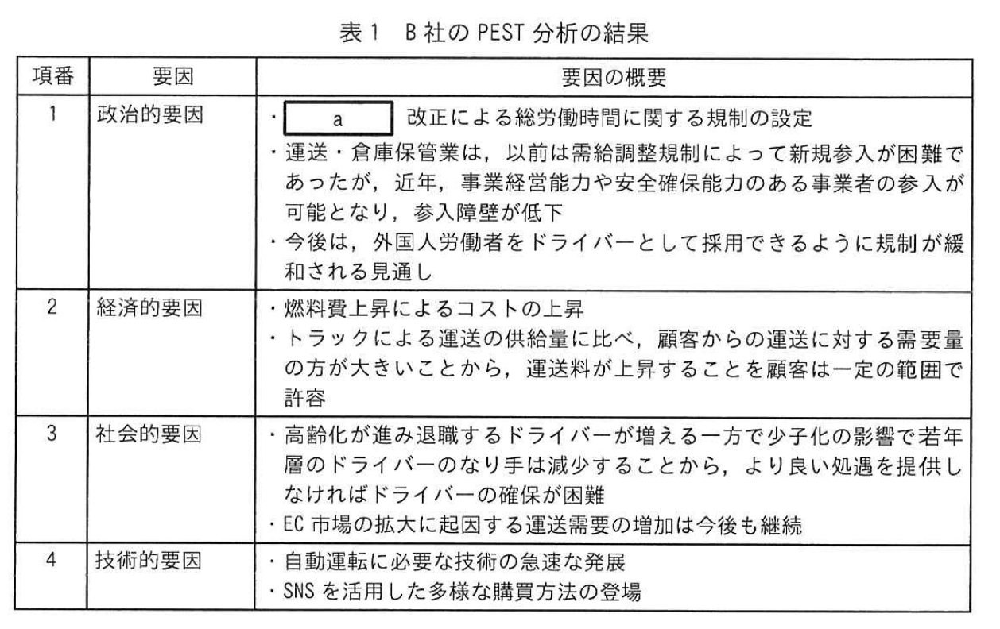
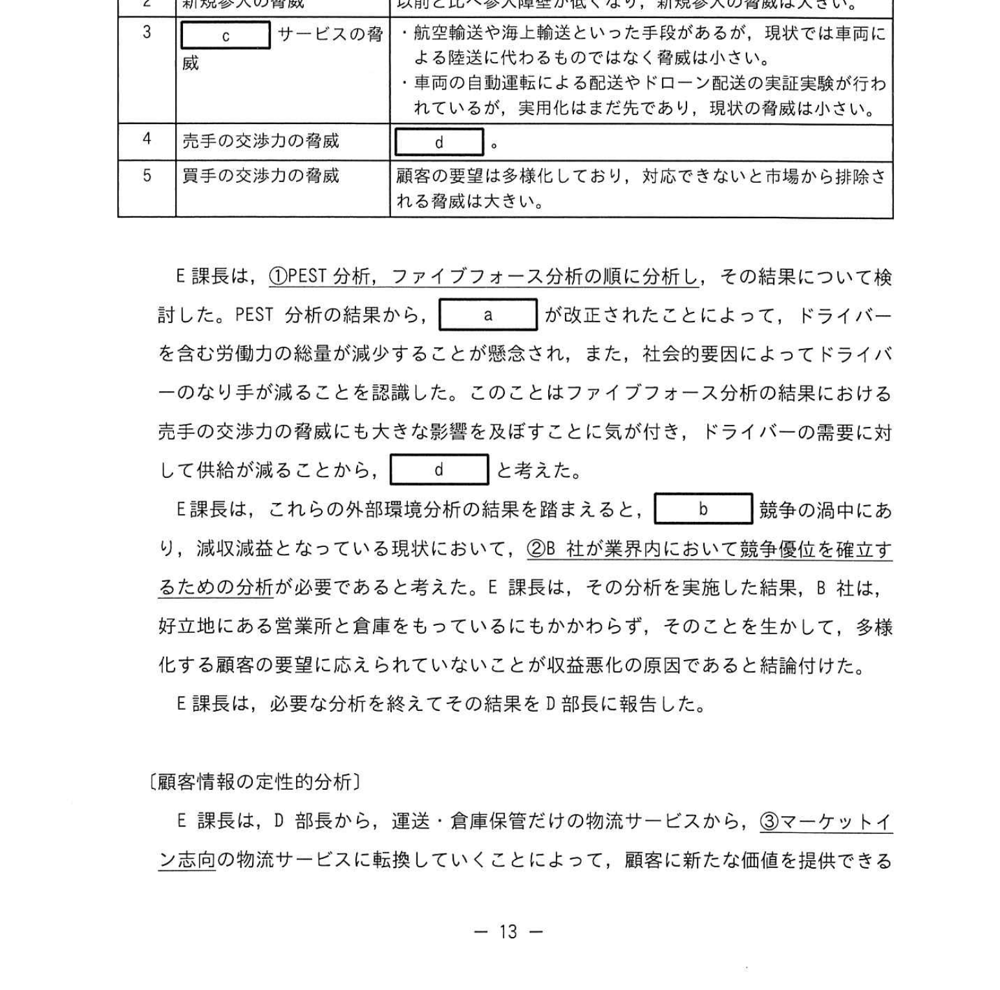

# 2024年春期（令和6年度春期）応用情報技術者試験 午後 問2（選択）
## 経営戦略：中規模物流事業者の事業計画（ファイブフォース分析・PEST分析）

---

## 問題文

**問2** 物流業の事業計画に関する次の記述を読んで、設問に答えよ。

B社は、運送業務及び倉庫保管業務を受託する中規模の物流事業者である。従業員数は約100名で、関東甲信越エリアを中心に事業を行っており、高速道路の幹線道路へのアクセスの良い立地に複数の営業所と倉庫を構えている。食品メーカーや小売業者との取引が多く、同業他社との競争が激しい。B社の営業部は、業務改善の取組みによって、昨年、業務効率の向上と受注企業の増加を図ることができた。そこで、E課長は、この状況の下行け、外部環境分析から実施するべきことをD部長に提案した。

---

### 〔B社の環境分析〕

D部長には、外部環境分析から実施するよう指摘され、E課長は、まずPEST分析を行い、PEST分析の結果として B社の事業に影響する要因の概要を表1のように整理した。

### 表1 B社のPEST分析の結果

> | 項番 | 要因 | 要因の概要 |
> |---|---|---|
> | 1 | 政治的要因 | ・`[　a　]` が改正によって経時労働の規制の強化 ・運送・倉庫保管業は、以前は時間外労働時間の規制外であった ・今後は時間外労働に関して年間〇〇時間の上限が課せられる ・今後は、外国人労働者をドライバーとして採用できるように規制が緩和される見通しとなった |
> | 2 | 経済的要因 | ・トラックによる運送の燃料コストに比べ、競合するものの運送に対する需要量の増大が懸念されること ・今後も物流コスト増加が継続する見通し |
> | 3 | 社会的要因 | ・高齢化で運送ができるドライバーが増える一方でカテゴリの影響で近年に問のドライバーの志向変化、担い手不足が深刻化しEC市場の拡大と起因した商品の追跡、ドロップ配送の需要がある |
> | 4 | 技術的要因 | ・自動運転に必要な技術の急速な発展 ・SNSを活用した多様な顧客獲得の方法の登場 |

次に、E課長は、ファイブフォース分析を進めることにした。ファイブフォース分析の結果、B社が受ける脅威の概要を表2のようにに整理した。

### 表2 B社のファイブフォース分析の結果

> | 項番 | 脅威 | 脅威の概要 |
> |---|---|---|
> | 1 | 業界内の競争 | 運送・倉庫保管だけの物流サービスはコモディティ化しており、差別化がなかなかできない；`[　b　]` 競争が激化している |
> | 2 | 新規参入の脅威 | 以前と比べ参入障壁が低く、新規参入の脅威は大きい |
> | 3 | `[　c　]` サービスの脅威 | 航空輸送や地上輸送といった手段があるが、現状で市場に占めるシェアはそれほど大きくない；自動運転技術や航空ドローンなどの実証実験が進められているが、実用化はまだ先である；現状の脅威は小さい |
> | 4 | 売手の交渉力の脅威 | `[　d　]` |
> | 5 | 買手の交渉力の脅威 | 顧客の要望は多様化しており、対応できないと市場から排除される脅威の大きさがある |

E課長は、①PEST分析、ファイブフォース分析の順に分析し、その結果について検討した。PEST分析の結果から、`[　a　]` が改正されたことによって、ドライバーを含む労働力の確保が難しくなることがわかり、社会的要因によってドライバーの`[　b　]` 競争の高まりに、`[　d　]` と考えた。

E課長は、外部環境分析の結果をまとめると、`[　b　]` 競争の激化により、②B社が業界内で競争優位を確立するための分析が必要であると考えた。E課長は、その分析を実施した結果、B社は「好立地にある営業所と倉庫を多く構えていること」をとなっていることを把握した。また、B社の営業部は顧客サービスについてプランを手厚くしていることも把握した。

---

### 〔顧客情報の定性的分析〕

E課長はD部長から、運送・倉庫保管などの物流サービスから、③**マーケットインの物流サービスに転換していくことで**、顧客に新たな価値を提供できる可能性はないかとアドバイスをされた。E課長は、これまで自社の顧客情報の分析は、受注提案、契約金額などの数値を基に分析を行うことをしてきており、それだけでは捉えられない顧客の要望を把握する分析が行われていなかったことが分かった。

E課長は、顧客の運送業務に関して様々な気付きを持てているのはないかと考えた。そこで、ドライバーがもつ顧客の業務に関する知見情報を、Bに対して月次や四半期でのミーティング、顧客に対して何らかの問題の相談、相対する顧客社員との会話など、様々な形式の情報が記録されていたが、しかしこれらは顧客情報として整理されていなかった。多様な情報が含まれており、分析することで顧客の要望を把握することができると考えた。

ドライバーの回答は自由記述形式のテキストデータであり、テキストマイニングによる定性的分析を行うこととなった。D部長は、テキストマイニングによる分析を行うに当たり、④**テキストデータを識別するよう**にE課長にアドバイスをした。

E課長は自由記述の顧客情報の分析の結果、「コア業務」「一括委託」といった単語が頻出しており、「コア業務」は「集中」との単語間の結び付きの強さがあり、複数の単語が同一文書中に共に出現していることから意味を示している可能性があった。E課長は、定性分析の分析結果をD部長に報告した。顧客への新たな価値提供にむけた検討の了承を得た。

---

### 〔顧客への新たな価値の提供〕

B社倉庫からの荷物の発送に際して、顧客がその荷物の検品やタグ付け、梱包等の複数の荷物を一つにまとめることを行う作業（流通加工業務）を自社で行うこととなっており、B社には適した事業者がいなかった。そこで、E課長は、流通加工業務の需要拡大に向けて施設の拡張を求めているという意見があった。B社の営業所と倉庫の立地が良いことと、流通加工工業務を一括受注することで3PLサービスの提供ができないかとも考えた。D部長はE課長に、R社との業務提携の可能性があるかを調査するよう指示した。

E課長が、顧客からのR社の紹介を受け、業務提携の協議を始めた。R社との協議でE課長は次のように問い合わせを受けた。
- R社は流通加工業務の需要拡大に伴い、社外や作業所を増やして工場を拡大することを目標としている。一方、別の作業所のほうが望ましいと感じている。
- 流通加工業務は、荷物の受入と発送のスムーズさが重要であり、B社の立地が良いことを評価している。
- 希望する場所に作業所を作るとしても、作業所の土地の取得費用や倉庫の建設費用というような初期費用の負担が大きいので、縮約できるかどうか検討してほしいと言っていた。

E課長は、B社の事業遂行に関わる詳細事項を説明し、⑤**E課長の事業化案を実現することで**、B社の顧客の物流に関わる作業に対してどのような要望を満たすことができるかを調べていたキストデータの分析の結果の字句を用いて説明した。D部長は、⑥E課長の事業化案に基づく事業計画をまとめるよう指示した。

---

## 設問

### 設問1 〔B社の環境分析〕について答えよ。

**(1)** 表1及び本文中の `[　a　]` に入れる適切な法律名、表2及び本文中の `[　b　]`、`[　c　]` に入れる適切な字句をそれぞれ答えよ。

**(2)** 表2及び本文中の `[　d　]` に入れる最も適切なものを解答群の中から選び、記号で答えよ。

**解答群：**
- ア ITの活用による省力化の脅威が大きい
- イ 運送料の値下げに対する需要が大きい
- ウ ドライバーの賃金上昇に伴う調達コスト増加の脅威が大きい
- エ 陸送に代わる新たな輸送方法の脅威が大きい

**(3)** 本文中の下線①について、PEST分析をファイブフォース分析より先に実施したのは、PEST分析がどのような視点での分析であるか。本文中の字句を用いて答えよ。

**(4)** 本文中の下線②の分析は何か。本文中の字句を用いて10字以内で答えよ。

### 設問2 〔顧客情報の定性的分析〕について答えよ。

**(1)** 本文中の下線③のマーケットイン志向に該当する行動はどれか。最も適切なものを解答群の中から選び、記号で答えよ。

**解答群：**
- ア 既存市場の物流サービスと差別化した物流サービスを提供する
- イ 競合他社よりも相対的に低価格となる物流サービスを提供する
- ウ 自社が市場で優位性をもつ技術を活用した物流サービスを提供する
- エ 市場調査を行い、顧客ニーズを満たする新たな物流サービスを提供する

**(2)** 本文中の下線④でどのようにテキストデータを識別するのか。35字以内で答えよ。

### 設問3 〔顧客への新たな価値の提供〕について答えよ。

**(1)** 本文中の下線⑤のB社のもつ経営資源は何か。本文中の字句を用いて15字以内で答えよ。

**(2)** E課長の事業化案を実現することで、B社の顧客の物流に関わる作業に対してどのような要望を満たすことができるか。選別したテキストデータの分析の結果の字句を用いて30字以内で答えよ。

---

## 解答と解説

### 設問1

**(1)**
- **a=労働基準法**（時間外労働規制強化を定めた法律）
- **b=価格**（価格競争）
- **c=代替**（代替サービスの脅威）

**(2) 正解：d=ウ（ドライバーの賃金上昇に伴う調達コスト増加の脅威が大きい）**

労働基準法改正でドライバーの時間外労働が制限され、賃金上昇が懸念。売手（ドライバー）の交渉力が高まるため「調達コスト増加の脅威」が大きい。

**(3) 正解：マクロ的視点**

PEST分析は政治・経済・社会・技術のマクロ環境を分析するもの。ファイブフォース分析（業界内競争）より先に行うことで、ミクロ分析の前提となるマクロ環境を把握する。

**(4) 正解：内部環境分析**

競争優位を確立するための分析は「内部環境分析」（自社の強み・弱みを把握するSWOT分析の内部分析）。B社の強みは「好立地な営業所と倉庫」。

---

### 設問2

**(1) 正解：エ（市場調査を行い、顧客ニーズを満たする新たな物流サービスを提供する）**

マーケットインとは「市場・顧客ニーズを起点にサービスを設計する」考え方。プロダクトアウト（自社技術・製品起点）の反対概念。

**(2) 正解：顧客の事業に関するテキストデータを分析の対象とする（29字）**

ドライバーが収集した顧客の業務に関する自由記述テキストデータを、顧客情報として識別・分類することで定性分析対象とする。

---

### 設問3

**(1) 正解：好立地にある営業所と倉庫（15字）**

B社の内部環境分析で把握した強みは「好立地にある営業所と倉庫を多く構えていること」。流通加工業務を一括受注するための経営資源となる。

**(2) 正解：一括委託することでコア業務に集中したいという要望（25字）**

テキスト分析で「コア業務」「集中」「一括委託」が頻出。3PLサービスで物流業務を一括委託することで、顧客がコア業務に集中できる要望に応えられる。

---

## 参考：主要キーワード

| 用語 | 説明 |
|------|------|
| PEST分析 | 政治（Political）・経済（Economic）・社会（Social）・技術（Technological）のマクロ環境分析 |
| ファイブフォース分析 | 業界の競争要因を5つの力（業界内競争・新規参入・代替品・売手交渉力・買手交渉力）で分析 |
| マーケットイン | 市場・顧客ニーズを起点にサービス・製品を設計するアプローチ |
| プロダクトアウト | 自社の技術・製品を起点に市場展開するアプローチ。マーケットインの対義語 |
| コモディティ化 | 製品・サービスの差別化が困難になり価格競争に陥る現象 |
| 3PL（サードパーティーロジスティクス） | 企業の物流業務を外部に一括委託するサービス形態 |
| テキストマイニング | 大量のテキストデータを分析して有用な知見を抽出する手法 |
| 内部環境分析 | 自社の強み（Strengths）・弱み（Weaknesses）を分析。SWOT分析の内部要因 |
| 外部環境分析 | 自社外部の機会（Opportunities）・脅威（Threats）を分析。PEST・ファイブフォース等を使用 |
| 流通加工 | 倉庫で行う検品・タグ付け・梱包などの付加作業。3PLの重要なサービス要素 |
