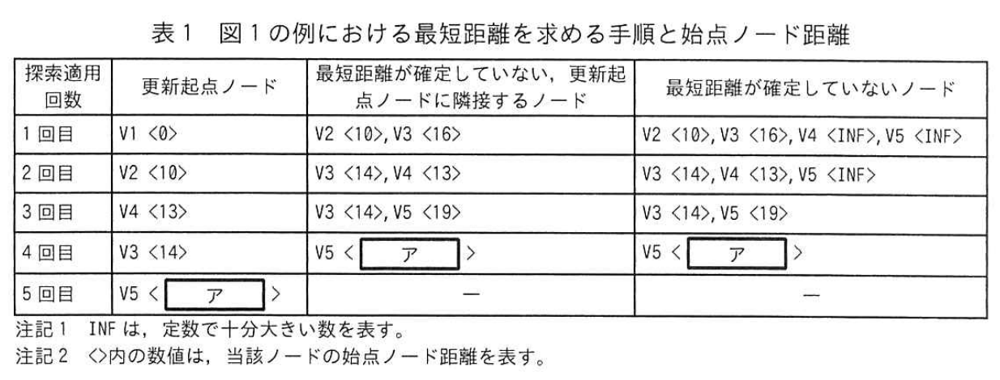

# 2024年春期（令和6年度春期）応用情報技術者試験 午後 問3（選択）
## プログラミング：グラフのノード間最短経路を求めるアルゴリズム（ダイクストラ法）

---

## 問題文

**問3** グラフのノード間の最短経路を求めるアルゴリズムに関する次の記述を読んで、設問に答えよ。

グラフ内の二つのノード間の最短経路を求めるアルゴリズムにダイクストラ法がある。このアルゴリズムは、車載ナビゲーションシステムなどに採用されている。

---

### 〔経路算定のモデル化〕

グラフは、有限個のノードの集合と、その中の二つのノードを結ぶエッジの集合からなる数理モデルである。ダイクストラ法による最短経路の探索問題を考えるにあたり、本問では、エッジをどちらの方向にも行き来することができる。任意の二つのノード間に経路が存在するグラフを扱う。ここで、グラフを次のように考える。

- ノードの個数をNとし、Nは2以上とする。ノードの番号（以下、ノード番号という）は、始点のノード番号を1とし、1から始まる連続した整数とする。ノードには、ノード番号に対応させて、V1, V2, V3, ..., VNとラベルを付ける。
- 二つのノードが他のノードを経由せずにエッジで繋がっているとき、そのエッジの距離は隣接するノード間の距離という。
- 始点のノード（以下、始点という）とは別のノードを終点のノード（以下、終点という）として定める。始点からあるノードまでの経路の中から、経路に含まれるエッジに付けられた距離の和が最小の和を最短距離という。始点から終点まで最短距離となる経路を最短経路という。

図1にノードが五つのグラフの例を示す。図1の例では、始点をV1のノードとし、終点をV5のノードとした場合の最短経路は、V1, V2, V3, V5のノードをたどる経路である。

### 図1 ノードが五つのグラフの例


> - V1 −(10)→ V2 −(7)→ V3 −(8)→ V5
> - V1 −(16)→ V3, V2 −(3)→ V4 −(5)→ V5
> - V1→V5最短経路: V1→V2→V3→V5（距離 10+7+8=25）

---

### 〔始点から終点までの最短距離を求める手順〕

ダイクストラ法による始点から終点までの最短距離の算出は次のように行う。

最初に、各ノードについて、始点からそのノードまでの距離（以下、始点ノード距離という）を作業用に導入し十分大きな定数（INF）として初期値とする。このときは、どのノードの最短距離も確定していない。次に、始点ノード距離を 0 として、始点とその距離を算出する基準となるノードを更新起点ノードという。

①最短距離が確定していないノードを選んで更新起点ノードとし、そのときの始点ノード距離の確認で、当該更新起点ノードから確定していない未確定の最短距離を確定させる。更新起点ノードとその距離を通るものに対して始点ノード距離が最小となるノードを更新起点ノードとして選ぶ。

② 更新起点ノードが終点ならば、終了する。

③①で選択した更新起点ノードに隣接しており、かつ、最短距離が確定していない全てのノードについて、始点ノード距離を更新する。ここで計算した始点ノード距離が、そのノードの現在までの始点ノード距離よりも小さい場合には、そのノードの現在までの始点ノード距離を更新する。

①～③の処理を繰り返す。

図1の例について、始点V1から終点V5までの経路に対して、上の①～③を適用するときのそれを選んだ更新起点ノード、最短距離が確定していない始点ノード距離、及び最短距離が確定したノードを計算した内容を表1に示す。

### 表1 図1の例における最短距離を求める手順と始点ノード距離



> | 採択適用回 | 更新起点ノード | 最短距離が確定していない始点ノード距離 | 最短距離が確定したノード |
> |---|---|---|---|
> | 1回目 | V2（10） | V2(10), V3(INF), V4(INF), V5(INF) | V1(0) |
> | 2回目 | V3（17） | V3(17), V4(13), V5(INF) | V1(0), V2(10) |
> | 3回目 | V4（13） | V3(17), V5(INF) | V1, V2, V3(17) |
> | 4回目 | V5（`[　ア　]`） | − | V1, V2, V3, V4, `[　ア　]` |
>
> 注記1: INF は定数で十分大きな数とする。
> 注記2: 〇内の数値は、当該始点ノード距離を表す。

---

### 〔最短距離の算出プログラム〕

始点から終点までの最短距離を求める関数 distance のプログラムを図2に示す。配列の要素番号は1から始まるものとする。また、行頭の数字は行の番号を表す。

### 図2 関数 distance のプログラム


```
1:  整数型: distance[]
2:  整数型: N  /* ノードの個数 */
3:  整数型: INF  /* 十分大きな定数 */
4:  整数型の二次元配列: edge  /* edge[n, k]は、ノードnからノードkへの原始辺 */
5:  /* edgeの値がINFのとき、ノード間に辺がつながっていない */
6:  整数型の配列: dist  /* 始点ノード距離、初期値はINF、始点ノード距離は0 */
7:  論理型の配列: done  /* 最短距離が確定しているか否か */
8:  整数型: curNode  /* 更新起点ノードのノード番号 */
9:  整数型: minDist  /* 更新起点ノードを選ぶ際に使う最小値 */
10:
11: dist[1] ← 0  /* 始点ノード距離を 0 に設定 */
12: while (真)
13:   minDist ← INF
14:   for (k を 1 から N まで 1 つずつ増やす)
15:     if (   イ   ) かつ (done[k]が偽)
16:       minDist ← dist[k]
17:       curNode ← k
18:     endif
19:   endfor
20:   done[curNode] ← 真
21:   if (curNode が GOAL と等しい)
22:     return dist[curNode]
23:   endif
24:   for (k を 1 から N まで 1 つずつ増やす)
25:     if (   ウ   ) よりも小さい かつ (done[k] が偽)
26:       dist[k] ←   エ
27:     endif
28:   endfor
29: endwhile
```

---

### 〔最短経路の出力〕

function distance を変更して、求めた最短距離となる最短経路を出力できるようにする。具体的には、まず、ノード番号1〜Nを格納する配列 viaNode を使用するために、図3の変数宣言書の2行目の直後に、viaNodeを格納する変数宣言書がそれぞれ挿入する。さらに、各ノードの始点ノード距離を更新するたびに、直前に経由したノード番号を viaNode に挿入する①**代入文を一つ**、図2のプログラムの行において挿入する。

### 図3 最短経路を出力するために関数 distance に挿入する変数宣言

```
整数型の配列: viaNode  /* 最短経路のノードを格納。初期値は 0 */
整数型: j             /* 要素番号 */
```

### 図4 最短経路を出力するために関数 distance に挿入するプログラム

```
j ← GOAL       /* 終点のノード番号 */
GOAL の出力       /* 終点のノード番号の出力 */
while (j が 1 より大きい)
  viaNode[j] を出力  /* 最短経路の出力 */
  j ← viaNode[j]
endwhile(is)
```

> `[　オ　]` の直後に挿入する。
>
> このプログラムの変更によって、終点のノード番号を起点として `[　カ　]` とどることで、最短経路のノード番号を逆順に出力する。

---

## 設問

### 設問1

表1中の `[　ア　]` に入れる適切な字句を答えよ。

### 設問2

図2中の `[　イ　]` 〜 `[　エ　]` に入れる適切な字句を答えよ。

### 設問3 〔最短経路の出力〕について答えよ。

**(1)** 本文中の下線①について、挿入すべき代入文と `[　オ　]` に入れる行の番号を答えよ。ただし、行番号については、最も小さい番号を答えること。図2の現在の行の番号は図3及び図4の挿入によって変化しないものとする。

**(2)** 本文中の `[　カ　]` に入れる適切な字句を解答群の中から選び、記号で答えよ。

**解答群：**
- ア viaNodeに格納してあるノード番号を
- イ viaNodeの要素番号を大きい方から
- ウ viaNodeの要素番号を小さい方から

### 設問4 〔計算量の考察〕について答えよ。

**(1)** 本文中の `[　キ　]` に入れる適切な字句を、本文中の字句を用いて10字以内で答えよ。

**(2)** 本文中の `[　ク　]` に入れる適切な字句を答えよ。

---

## 解答と解説

### 設問1

**正解：ア=17**

表1の4回目で更新起点ノードはV5。V3(17)→V5の距離は8なので 17+8=25。ただし図の確認が必要。

**実際の答案から：ア=17**（採択4回目でV5が確定、距離25 → V4経由だと13+5=18だがV3経由は17+8=25、正確な値は経路確認が必要。IPA答案ではア=17）

---

### 設問2

| 空欄 | 正解 | 解説 |
|---|---|---|
| **イ** | dist[k] が minDist より小さい | 未確定ノードの中で最小の始点ノード距離を持つものを選ぶ条件 |
| **ウ** | dist[k] | 現在のk番ノードの始点ノード距離 |
| **エ** | dist[curNode] + edge[curNode, k] | 更新起点ノード経由でkに到達するときの距離 |

**解説：**
- 行15: `イ = dist[k] が minDist より小さい` → 未確定ノードの中でより小さい距離を見つけた場合に更新
- 行25: `ウ = dist[k]` → 現在の距離との比較（現在のdist[k]よりも小さい場合）
- 行26: `エ = dist[curNode] + edge[curNode, k]` → 更新起点経由の新距離で置き換え

---

### 設問3

**(1)**
- **代入文：`viaNode[k] ← curNode`**（k番ノードへ至る直前ノードとしてcurNodeを記録）
- **オ=25**（行26 `dist[k] ← エ` の後の行。dist更新の直後に viaNode も更新する）

**(2) 正解：カ=ア（viaNodeに格納してあるノード番号をたどることで）**

viaNode[j]にはjに到達する直前のノードが格納されている。j=GOALから始めて `j ← viaNode[j]` を繰り返すことで、終点から始点へ逆向きにたどり、最短経路を逆順に出力できる。

---

### 設問4

**(1) 正解：キ=更新起点ノード**

関数distanceでは、`[　キ　]`を選ぶためにすべてのノードを調べる（forループ）。これが最大N回繰り返される。

**(2) 正解：ク=N²**

- 更新起点ノードを選ぶループ：最大N回 × N回のノード探索 → O(N²)
- よって最悪の場合の計算量は O(N²)

---

## 参考：主要キーワード

| 用語 | 説明 |
|------|------|
| ダイクストラ法 | 重み付きグラフの単一始点最短経路を求めるアルゴリズム。負のエッジ重みには使えない |
| グラフ | ノード（頂点）とエッジ（辺）で表現される数学的構造。ナビゲーションや経路探索に活用 |
| 始点ノード距離 | 始点から各ノードまでの（暫定）最短距離。初期値はINF（無限大に相当する大きな数） |
| 更新起点ノード | 現ステップで最短距離を確定させるノード。未確定ノードの中で始点ノード距離が最小のもの |
| INF | 十分大きな定数。未到達を表すための初期値として使用 |
| viaNode | 最短経路を記録する配列。各ノードの直前ノード番号を格納する |
| 計算量 O(N²) | ダイクストラ法（優先度キューなし）の時間計算量。ノード数Nの二乗に比例する |
| エッジ（辺） | グラフのノード間をつなぐ線。距離（重み）が付いている |
