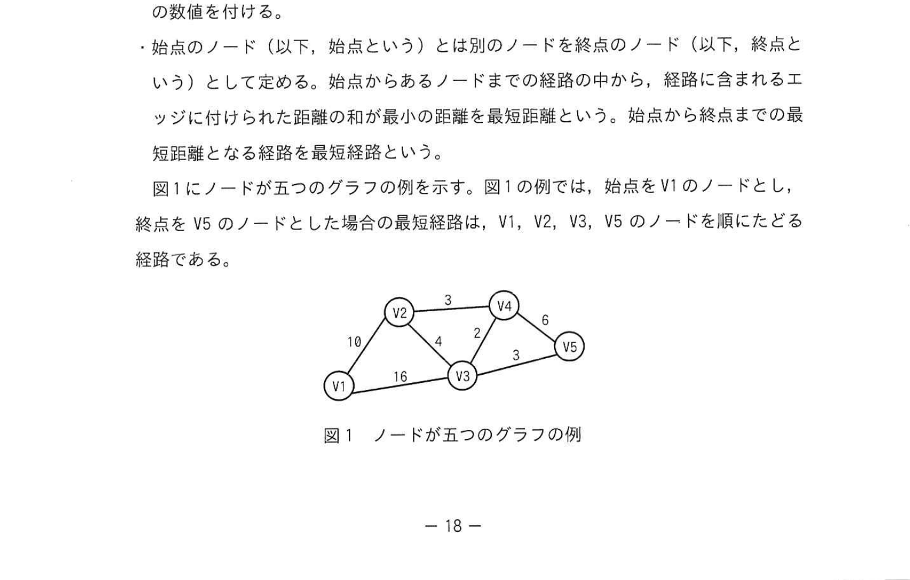
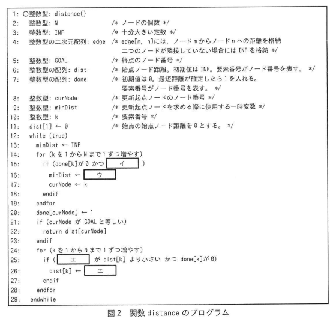

# 2024年春期（令和6年度春期）応用情報技術者試験 午後 問3（選択）
## プログラミング：グラフのノード間最短経路を求めるアルゴリズム（ダイクストラ法）

---

## 問題文

**問3** グラフのノード間の最短経路を求めるアルゴリズムに関する次の記述を読んで、設問に答えよ。

グラフ内の二つのノード間の最短経路を求めるアルゴリズムにダイクストラ法がある。このアルゴリズムは、車載ナビゲーションシステムなどに採用されている。

---

### 〔経路算定のモデル化〕

グラフは、有限個のノードの集合と、その中の二つのノードを結ぶエッジの集合とから成る数理モデルである。ダイクストラ法による最短経路の探索問題を考えるに当たり、本問では、エッジをどちらの方向にも行き来することができ、任意の二つのノード間に経路が存在するグラフを扱う。ここで、グラフを次のように定義する。

- ノードの個数をNとし、Nは2以上とする。ノードの番号（以下、ノード番号という）は、始点のノード番号を1とし、1から始まる連続した整数とする。ノードには、ノード番号に対応させて、V1, V2, V3, …, VNとラベルを付ける。
- 二つのノードが他のノードを経由せずにエッジでつながっているとき、それらのノードは隣接するという。隣接するノード間のエッジには、ノード間の距離として正の数値を付ける。
- 始点のノード（以下、始点という）とは別のノードを終点のノード（以下、終点という）として定める。始点からあるノードまでの経路の中から、経路に含まれるエッジに付けられた距離の和が最小の距離を最短距離という。始点から終点までの最短距離となる経路を最短経路という。

図1にノードが五つのグラフの例を示す。図1の例では、始点をV1のノードとし、終点をV5のノードとした場合の最短経路は、V1, V2, V3, V5のノードを順にたどる経路である。

### 図1 ノードが五つのグラフの例



> **エッジと距離（無向）：**
> - V1–V2: 10、V1–V3: 16
> - V2–V3: 4、V2–V4: 3
> - V3–V4: 2、V3–V5: 3
> - V4–V5: 6
>
> V1→V5の最短経路: V1→V2→V3→V5（距離 10+4+3 = 17）

---

### 〔始点から終点までの最短距離を求める手順〕

ダイクストラ法による始点から終点までの最短距離の算出は次のように行う。

最初に、各ノードについて、始点からそのノードまでの距離（以下、始点ノード距離という）を作業用に導入して十分に大きい定数としておく。ただし、始点の始点ノード距離は0とする。この時点では、どのノードの最短距離も確定していない。

次に、終点の最短距離が確定するまで、①〜③を繰り返す。ここで、始点との距離を算出する基準となるノードを更新起点ノードという。

① 最短距離が確定していないノードの中で、始点ノード距離が最小のノードを更新起点ノードとして選び、そのときの始点ノード距離の値で、当該更新起点ノードの最短距離を確定する。更新起点ノードを選ぶ際に、始点ノード距離が最小となるノードが複数ある場合は、その中の任意のノードを更新起点ノードとして選ぶ。

② 更新起点ノードが終点であれば、終了する。

③ ①で選択した更新起点ノードに隣接しており、かつ、最短距離が確定していない全てのノードについて、更新起点ノードを経由した場合の始点ノード距離を計算する。ここで計算した始点ノード距離が、そのノードの現在までの始点ノード距離よりも小さい場合には、そのノードの現在までの始点ノード距離を更新する。

---

### 〔図1の例における最短距離を求める手順と始点ノード距離〕

図1の例において、始点V1から終点V5までの経路に対して、上の①〜③を繰返し適用する。そのとき、更新起点ノードを選ぶたびに、更新起点ノードの始点ノード距離、更新起点ノードと隣接するノードの始点ノード距離、及び最短距離が確定していないノードの始点ノード距離を計算した内容を表1に示す。

### 表1 図1の例における最短距離を求める手順と始点ノード距離

| 探索適用回数 | 更新起点ノード | 最短距離が確定していない、更新起点ノードに隣接するノード | 最短距離が確定していないノード |
|---|---|---|---|
| 1回目 | V1〈0〉 | V2〈10〉, V3〈16〉 | V2〈10〉, V3〈16〉, V4〈INF〉, V5〈INF〉 |
| 2回目 | V2〈10〉 | V3〈14〉, V4〈13〉 | V3〈14〉, V4〈13〉, V5〈INF〉 |
| 3回目 | V4〈13〉 | V3〈14〉, V5〈19〉 | V3〈14〉, V5〈19〉 |
| 4回目 | V3〈14〉 | V5〈`[　ア　]`〉 | V5〈`[　ア　]`〉 |
| 5回目 | V5〈`[　ア　]`〉 | − | − |

注記1: INF は、定数で十分大きい数を表す。
注記2: 〈〉内の数値は、当該ノードの始点ノード距離を表す。

---

### 〔最短距離の算出プログラム〕

始点から終点までの最短距離を求める関数 distance のプログラムを図2に示す。配列の要素番号は1から始まるものとする。また、行頭の数字は行の番号を表す。

### 図2 関数 distance のプログラム



```
 1: ○整数型: distance()
 2:   整数型: N            /* ノードの個数 */
 3:   整数型: INF          /* 十分大きい定数 */
 4:   整数型の二次元配列: edge  /* edge[m, n]には、ノードmからノードnへの距離を格納
                              二つのノードが隣接していない場合にはINFを格納 */
 5:   整数型: GOAL         /* 終点のノード番号 */
 6:   整数型の配列: dist    /* 始点ノード距離。初期値はINF。要素番号がノード番号を表す。 */
 7:   整数型の配列: done    /* 初期値は0。最短距離が確定したら1を入れる。
                              要素番号がノード番号を表す。 */
 8:   整数型: curNode      /* 更新起点ノードのノード番号 */
 9:   整数型: minDist      /* 更新起点ノードを求める際に使用する一時変数 */
10:   整数型: k            /* 要素番号 */
11:   dist[1] ← 0          /* 始点の始点ノード距離を0とする。 */
12:   while (true)
13:     minDist ← INF
14:     for (k を 1 から N まで 1 ずつ増やす)
15:       if (done[k]が0 かつ [　イ　])
16:         minDist ← [　ウ　]
17:         curNode ← k
18:       endif
19:     endfor
20:     done[curNode] ← 1
21:     if (curNode が GOAL と等しい)
22:       return dist[curNode]
23:     endif
24:     for (k を 1 から N まで 1 ずつ増やす)
25:       if ([　エ　] が dist[k] より小さい かつ done[k]が0)
26:         dist[k] ← [　エ　]
27:       endif
28:     endfor
29:   endwhile
```

---

### 〔最短経路の出力〕

関数 distance を変更して、求めた最短距離となる最短経路を出力できるようにする。具体的には、まず、ノード番号1〜Nを格納する配列 viaNode を使用するために、図3の変数宣言を図2の行10の直後に、図4のプログラムを図2の行21の直後に、それぞれ挿入する。さらに、各ノードの始点ノード距離を更新するたびに、直前に経由したノード番号を viaNode に格納する①<u>代入文を一つ</u>、図2のプログラムの行 `[　オ　]` の直後に挿入する。

### 図3 最短経路を出力するために関数 distance に挿入する変数宣言

```
整数型の配列: viaNode  /* 最短経路のノード番号を格納する。初期値は0。 */
整数型: j             /* 要素番号 */
```

### 図4 最短経路を出力するために関数 distance に挿入するプログラム

```
j ← GOAL              /* 終点のノード番号 */
GOAL を出力            /* 終点のノード番号の出力 */
while (j が 1 より大きい)  /* 最短経路の出力 */
  viaNode[j]を出力
  j ← viaNode[j]
endwhile
```

このプログラムの変更によって、終点のノード番号を起点として `[　カ　]` たどることで、最短経路のノード番号を逆順に出力する。

---

### 〔計算量の考察〕

関数 distance では、次の `[　キ　]` を選ぶために始点ノード距離を計算する回数は最大でもN回である。また、`[　キ　]` を選ぶ回数は、一度選ばれると当該ノードの最短距離は確定するので、最大でもN回である。よって、最悪の場合の計算量は、O(`[　ク　]`)である。

---

## 設問

### 設問1

表1中の `[　ア　]` に入れる適切な字句を答えよ。

### 設問2

図2中の `[　イ　]` 〜 `[　エ　]` に入れる適切な字句を答えよ。

### 設問3

〔最短経路の出力〕について答えよ。

**(1)** 本文中の下線①と `[　オ　]` について、挿入すべき代入文と `[　オ　]` に入れる行の番号を答えよ。行の番号については、最も小さい番号を答えること。ただし、図2中の現在の行の番号は図3及び図4の挿入によって変化しないものとする。

**(2)** 本文中の `[　カ　]` に入れる適切な字句を解答群の中から選び、記号で答えよ。

**解答群：**
- ア viaNodeに格納してあるノード番号を
- イ viaNodeの要素番号を大きい方から
- ウ viaNodeの要素番号を小さい方から

### 設問4

〔計算量の考察〕について答えよ。

**(1)** 本文中の `[　キ　]` に入れる適切な字句を、本文中の字句を用いて10字以内で答えよ。

**(2)** 本文中の `[　ク　]` に入れる適切な字句を答えよ。

---

## 解答と解説

### 設問1

**正解：ア=17**

表1の推移をたどると、
- 1回目：V1〈0〉確定。隣接V2〈10〉、V3〈16〉に更新。
- 2回目：最小のV2〈10〉確定。隣接V3は10+4=14〈16より小〉に更新、V4は10+3=13。
- 3回目：最小のV4〈13〉確定。隣接V5は13+6=19。
- 4回目：最小のV3〈14〉確定。隣接V5は14+3=17〈19より小〉に更新 → **ア=17**。
- 5回目：V5〈17〉が終点で確定し終了。

**IPA公式：17**

---

### 設問2

| 空欄 | 正解 | 解説 |
|---|---|---|
| **イ** | dist[k] が minDist より小さい | 未確定（done[k]が0）ノードの中で始点ノード距離が最小のものを選ぶ条件 |
| **ウ** | dist[k] | 見つけた最小の始点ノード距離をminDistに保持する |
| **エ** | dist[curNode] + edge[curNode, k] | 更新起点ノード経由でノードkに到達するときの始点ノード距離 |

**解説：**
- 行15〜17：未確定ノードのうち `dist[k]` が現在のminDistより小さければ、minDistとcurNodeを更新（最小の未確定ノードを探す）。
- 行25〜26：更新起点ノード経由の距離 `dist[curNode] + edge[curNode, k]` が現在の `dist[k]` より小さく、かつkが未確定なら、`dist[k]` をその距離に更新する。

**IPA公式：イ=dist[k] が minDist より小さい、ウ=dist[k]、エ=dist[curNode]+edge[curNode, k]**

---

### 設問3

**(1) 正解：代入文＝`viaNode[k] ← curNode`、オ=26**

始点ノード距離を更新するのは行26（`dist[k] ← [エ]`）。この直後に、ノードkへ至る直前ノードとして更新起点ノードcurNodeを記録する代入文 `viaNode[k] ← curNode` を挿入する。よって挿入位置の行番号は**26**。

**IPA公式：代入文=viaNode[k] ← curNode、オ=26**

**(2) 正解：カ=ア（viaNodeに格納してあるノード番号を）**

viaNode[j]にはjに到達する直前のノード番号が格納されている。j=GOALから始めて `j ← viaNode[j]` を繰り返すことで、終点から始点へviaNodeに格納してあるノード番号をたどり、最短経路を逆順に出力できる。

**IPA公式：ア**

---

### 設問4

**(1) 正解：キ=更新起点ノード**

関数distanceでは、次の**更新起点ノード**を選ぶために全ノードの始点ノード距離を調べる（最大N回）。更新起点ノードを選ぶ回数も、一度選ばれると最短距離が確定するので最大N回。

**IPA公式：更新起点ノード**

**(2) 正解：ク=N²**

更新起点ノードを選ぶ処理（最大N回）× 各回で全ノードを走査（N回）＝ O(N²)。優先度付きキューを使わない素朴なダイクストラ法の計算量。

**IPA公式：N²**

---

## 参考：主要キーワード

| 用語 | 説明 |
|------|------|
| ダイクストラ法 | 重み付きグラフの単一始点最短経路を求めるアルゴリズム。負のエッジ重みには使えない |
| グラフ | ノード（頂点）とエッジ（辺）で表現される数理モデル。ナビゲーションや経路探索に活用 |
| 始点ノード距離 | 始点から各ノードまでの（暫定）最短距離。初期値はINF（十分大きい定数） |
| 更新起点ノード | 現ステップで最短距離を確定させるノード。未確定ノードの中で始点ノード距離が最小のもの |
| INF | 十分大きい定数。未到達を表すための初期値として使用 |
| viaNode | 最短経路を記録する配列。各ノードの直前ノード番号を格納する |
| 計算量 O(N²) | 優先度付きキューを使わないダイクストラ法の時間計算量。ノード数Nの二乗に比例 |
| エッジ（辺） | グラフのノード間をつなぐ線。距離（重み）が付いている |
