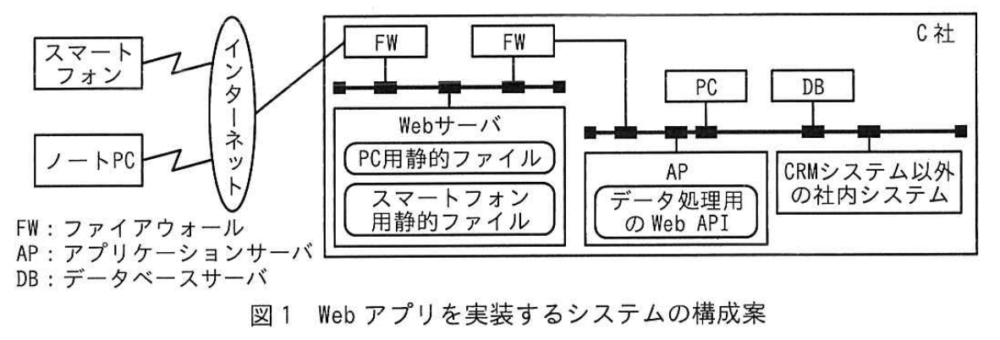

# 2024年春期（令和6年度春期）応用情報技術者試験 午後 問4（選択）
## システムアーキテクチャ：CRMシステムのWebアプリ改修とレスポンス改善

---

## 問題文

**問4** CRM（Customer Relationship Management）システムの改修に関する次の記述を読んで、設問に答えよ。

C社は、住宅やビルなどのアルミサッシを製造、販売する中堅企業である。取引先の設計・施工会社のニーズにきめ細かく対応するために、自社で開発したCRMシステム（以下、CRMシステムという）を使用している。CRMシステムは、データベースとWebアプリケーションプログラム（以下、Webアプリという）から成り、C社のLAN上にあるPCから利用される。このたび、営業担当者が外出先からスマートフォンやノートPCを用いてCRMシステムを利用できるようにするために、データベースは変更せずにWebアプリを改修することになった。

---

### 〔Webアプリの改修方針〕

Webアプリの改修方針を次に示す。

- 必要以上の開発コストを掛けない。
- 営業担当者が外出先で効率的にCRMシステムを利用できるように、スマートフォンに最適化した画面を追加する。
- 将来的に、CRMシステム以外の社内システムとも連携できるように拡張性をもたせる。

---

### 〔Webアプリの実装方式の検討〕

これらの改修方針を受けて、図1のWebアプリを実装するシステムの構成案を検討した。

### 図1 Webアプリを実装するシステムの構成案



> **構成：**
> - スマートフォン / ノートPC → インターネット → FW → FW → C社LAN
> - Webサーバ（PC用静的ファイル、スマートフォン用静的ファイル）
> - PC、AP（データ処理用のWeb API）、DB、CRMシステム以外の社内システム
> - AP は DB 及び CRMシステム以外の社内システムと接続
>
> FW: ファイアウォール、AP: アプリケーションサーバ、DB: データベースサーバ

検討したWebアプリの実装方式を次に示す。

- ユーザーインタフェースとデータ処理を分ける。ユーザーインタフェースは、WebサーバにHTML, Cascading Style Sheets（CSS）、画像、スクリプトなどを静的なファイルとして配置する。データ処理は、APがDBから取得したデータをJSON形式のデータで返すWeb APIとして実装する。
- ユーザーインタフェースとなる静的ファイルは、PCとスマートフォンそれぞれのWebブラウザ用に個別に作成し、データ処理用のWeb APIは共用する。
- ユーザーインタフェースの表示速度を向上させるために、①<u>静的ファイルを最適化する</u>。

---

### 〔実現可能性の評価〕

〔Webアプリの実装方式の検討〕で示した方式の実現可能性を評価するために、プロトタイプを用いて多くのデータを扱う機能について検証した。その結果、スマートフォンの特定の画面において次の問題が発生した。

- 扱うデータ量が増えるに連れて、レスポンスが著しく低下する。
- ②<u>スマートフォンのCPU負荷が大きく</u>、頻繁に使用するとバッテリの消耗が激しい。

そこで、これらの問題の原因を調べるために、Webアプリの処理を分析した。レスポンスの悪かった日誌一覧の表示画面を図2に、Web APIからの応答データを図3に示す。

### 図2 日誌一覧の表示画面


> **【日誌一覧】** ユーザー名：情報太郎／取引先名：〇△×設計事務所
>
> | 日付 | 担当 | 営業プロセス |
> |---|---|---|
> | 2023-10-10 | 情報太郎 | プレゼンテーション（日誌本文：当社の新商品◇◇のプレゼンを実施。…）［編集］ |
> | 2023-10-06 | 情報花子 | 製品詳細説明（日誌本文：商品展示場で興味をもっていただいた製品群について…） |
> | 2023-10-04 | 情報太郎 | 製品概要紹介（日誌本文：商品展示場にお招きして、当社製品群をご紹介。…）［編集］ |
> | 2023-10-02 | 情報花子 | リレーション構築（日誌本文：当社及び主力製品のご説明を実施。…） |
>
> 注：本人（ログインユーザー）が作成した日誌にのみ［編集］ボタンを表示。

### 図3 Web APIからの応答データ


```json
{
  "customer": "〇△×設計事務所",
  "count": 16,
  "diaries": [                          ← α
    {"date": "2023-08-21",
     "salesperson": "情報花子",
     "salesprocess": "問合せ",
     "diary": "（省略）"},
        （中略）
    {"date": "2023-10-04",
     "salesperson": "情報太郎",
     "salesprocess": "製品概要紹介",
     "diary": "（省略）"},
        （後略）
  ]                                     ← β
}
```

スマートフォンのWebブラウザから図2の画面をリクエストしてから描画されるまでの一連の処理について、処理ごとに所要時間を測定した結果を表1に示す。

### 表1 処理ごとに所要時間を測定した結果

| No. | 処理概要 | 所要時間（ミリ秒） |
|---|---|---|
| 1 | Webブラウザが画面に必要となる静的なファイルを全て受信する。 | 300 |
| 2 | WebブラウザがWeb APIにリクエストして、図3の応答データを全て受信する。 | 800 |
| 3 | Webブラウザ内で日誌のデータを日付の降順にソートして、画面に表示する最大件数である4件目までを抽出する。 | 1,200 |
| 4 | 日誌本文が42文字を超える場合、先頭から41文字に文字"…"を結合した42文字の文字列にする。 | 300 |
| 5 | 日誌一覧の表示を実行したユーザーが作成した日誌か否かを判断して、本人が作成した日誌には"編集"ボタンを表示する。 | 200 |
| 6 | データをWebブラウザに描画する。 | 500 |

表1から、図3の応答データのスマートフォンへの転送処理と、Webブラウザ内でその応答データを加工する処理に多くの時間を要していることが判明した。

---

### 〔Webアプリの見直し〕

Webブラウザが画面をリクエストしてから描画されるまでの所要時間の目標値を3秒以内に設定して、それを達成するために、次の三つの方式を検討した。

① スマートフォンのユーザーインタフェースをアプリケーションプログラム（以下、スマホアプリという）として開発して、そのスマホアプリ内でWeb APIからの応答データを加工・描画する方式

② リクエストのあった応答データのうち、Webブラウザに描画するデータだけを返すWeb APIを開発して、スマートフォンのWebブラウザからそのWeb APIを利用する方式

③ ②で開発したWeb APIを①で開発したスマホアプリから利用する方式

各方式について、応答データを加工・描画するソフトウェア又はサーバと、その実現可能性を評価するために、設けた評価項目について整理した結果を表2に示す。各評価項目の評価点に対する重み付けは均一とし、また、将来的な拡張性については各実装方法を設計するタイミングで検討することにした。

なお、〔実現可能性の評価〕においてプロトタイプを用いて検証した方式を方式Ⓟとする。

### 表2 整理した結果

| 方式 | データ描画 | データ加工 | レスポンス | 開発コスト | CPU負荷 | 評価点合計 |
|---|---|---|---|---|---|---|
| Ⓟ | Webブラウザ | Webブラウザ | × | ◎ | × | 3点 |
| ① | スマホアプリ | スマホアプリ | ○ | △ | △ | 4点 |
| ② | Webブラウザ | AP | ○ | ○ | ○ | 6点 |
| ③ | スマホアプリ | AP | ◎ | × | ○ | 5点 |

凡例　◎：とても優れている、3点／○：優れている、2点／△：あまり優れていない、1点／×：優れていない、0点

---

### 〔レスポンス時間の試算〕

表2の結果から、方式②について更に検討を進めることになり、そのレスポンスが実用上問題ないか、表1を基に所要時間を試算した。

表1中のNo.2の所要時間について考える。方式②のWeb APIからの応答データのサイズは、図3のデータのサイズの4分の1になり、サーバ側でのデータ転送には時間を要しないものと仮定すると、No.2の所要時間は `[　a　]` ミリ秒となる。

次に、No.3〜No.5の処理時間について考える。No.3の処理はDBで、No.4とNo.5の処理はAPで行われる。処理時間は各機器のCPU処理能力だけに依存すると仮定する。各機器のCPU処理能力は、スマートフォンが10,000MIPS相当、DBが40,000MIPS相当、APが20,000MIPS相当の場合、No.3〜No.5の処理時間の合計は `[　b　]` ミリ秒となる。

以上の試算の結果、方式②で十分なレスポンスが期待できることから、方式②を採用することにした。

---

### 〔システム構成の検討〕

方式②で開発したWeb APIの配置について検討した。図1のAP上に配置する案も検討したが、③<u>将来的な拡張性</u>を考慮した結果、図1のAPとは別に、スマートフォンやノートPCから呼び出されるWeb APIのためのAPを、新たに追加する構成にした。

このシステム構成を採用した結果、問題を解消し、さらに将来的な拡張性をもたせることができた。

---

## 設問

### 設問1

本文中の下線①に該当するものを解答群の中から**全て**選び、記号で答えよ。

**解答群：**
- ア HTML, CSS, スクリプトなどのコードに、パイプライン処理を有効にする設定を行う。
- イ HTML, CSS, スクリプトなどのコードに含まれる、余分な改行やコメントを削除する。
- ウ 画像を、BMPやTIFFなどの画像フォーマットにする。
- エ 画像を、PNGやSVGなどの画像フォーマットにする。
- オ 全てのファイルをバイトコードに変換して圧縮する。

### 設問2

〔実現可能性の評価〕について答えよ。

**(1)** 本文中の下線②の要因として、最も適切なものを解答群の中から選び、記号で答えよ。

**解答群：**
- ア JSON形式の応答データを送受信する処理
- イ WebブラウザにHTML, CSS, 画像ファイルをレンダリングする処理
- ウ スマートフォンのメモリ上で日誌のデータを加工する処理
- エ 日誌一覧の各担当がログインユーザーか否かを判別する処理

**(2)** 図3中のαとβの箇所にある"["及び"]"で囲まれたデータはどのようなデータを表現するものか。データ形式に着目し、"日誌"という単語を用いて15字以内で答えよ。

### 設問3

表2中の方式②のレスポンスが、方式Ⓟに比べて優れていると評価した理由を二つ挙げ、それぞれ30字以内で答えよ。

### 設問4

本文中の `[　a　]`、`[　b　]` に入れる適切な数値を答えよ。

### 設問5

本文中の下線③の拡張性とは何か。40字以内で答えよ。

---

## 解答と解説

### 設問1

**正解：イ、エ**

「静的ファイルの最適化」は、ファイルサイズを削減し表示速度を上げる施策。
- **イ：正しい** - 余分な改行やコメントの削除（ミニファイ）でファイルサイズを削減。
- **エ：正しい** - PNGやSVGなどの圧縮・ベクター形式にすることで画像サイズを削減。
- **ア（パイプライン処理）**：コードの最適化とは無関係。
- **ウ（BMP/TIFF）**：非圧縮でサイズが大きくなり逆効果。
- **オ（バイトコード変換）**：静的ファイル（HTML/CSS/画像）には該当しない。

**IPA公式：イ、エ**

---

### 設問2

**(1) 正解：ウ（スマートフォンのメモリ上で日誌のデータを加工する処理）**

Web APIが全日誌データ（16件）を返し、スマートフォン側（Webブラウザ）でソート・抽出・文字列加工・編集ボタン判定を行う（表1のNo.3〜No.5）ため、スマートフォンのCPU負荷が大きくなる。

**IPA公式：ウ**

**(2) 正解：日誌の繰返しデータ（9字）**

図3中のαの"["とβの"]"は、JSONの配列を表す記号。この配列は日誌（diaries）が繰り返し並ぶデータを表現している。

**IPA公式：日誌の繰返しデータ**

---

### 設問3

**正解（2つ、各30字以内）：**

1. **応答データの加工処理をサーバ側で行うから（20字）**
2. **応答データの転送量が削減されるから（17字）**

方式②はデータ加工をサーバ（AP）で行い、Webブラウザに描画するデータだけを返す。これにより、スマートフォンでの加工処理（No.3〜No.5）が不要になり、かつ受信データ量（No.2）も削減されるため、方式Ⓟ（Webブラウザで加工）よりレスポンスが優れる。

**IPA公式：①応答データの加工処理をサーバ側で行うから／②応答データの転送量が削減されるから**

---

### 設問4

**正解：a=200、b=550**

**a の計算：** 方式②の応答データは図3の1/4。No.2は800ミリ秒だったので、800 × 1/4 = **200ミリ秒**。

**b の計算：** 原計測はスマートフォン（10,000MIPS）での値。処理時間はCPU処理能力に反比例。
- No.3（DB、40,000MIPS）：1,200 × (10,000/40,000) = 300ミリ秒
- No.4（AP、20,000MIPS）：300 × (10,000/20,000) = 150ミリ秒
- No.5（AP、20,000MIPS）：200 × (10,000/20,000) = 100ミリ秒
- 合計：300 + 150 + 100 = **550ミリ秒**

**IPA公式：a=200、b=550**

---

### 設問5

**正解：Web APIを介してCRMシステム以外の社内システムとも連携する拡張性（34字）**

改修方針「将来的にCRMシステム以外の社内システムとも連携できるようにする」に対応。Web API用のAPを別に追加することで、CRMシステム以外の社内システムからもWeb APIを呼び出して連携できる拡張性をもつ。

**IPA公式：Web APIを介してCRMシステム以外の社内システムとも連携する拡張性**

---

## 参考：主要キーワード

| 用語 | 説明 |
|------|------|
| CRM（顧客関係管理） | 顧客情報・商談・日誌などを一元管理するシステム |
| Web API | HTTP/HTTPSを通じてデータを提供するインタフェース。JSON形式が多い |
| 静的ファイル | HTML/CSS/JavaScript/画像など、サーバで動的処理なしに配信できるファイル |
| ミニファイ（Minify） | コード中の空白・改行・コメントを削除してファイルサイズを圧縮する最適化 |
| JSON配列 | "["と"]"で囲む順序付きデータの並び。複数レコードの表現に使う |
| レスポンス時間 | リクエストから応答完了までの時間。UX改善の重要指標 |
| MIPS（Million Instructions Per Second） | CPUが1秒間に処理できる命令数の単位。数値が大きいほど高速 |
| JSON（JavaScript Object Notation） | 軽量なデータ交換フォーマット。Web APIのレスポンスによく使われる |
| スマホアプリ | スマートフォン用のネイティブアプリケーション |
| AP（アプリケーションサーバ） | ビジネスロジック（データ加工・処理）を担うサーバ |
