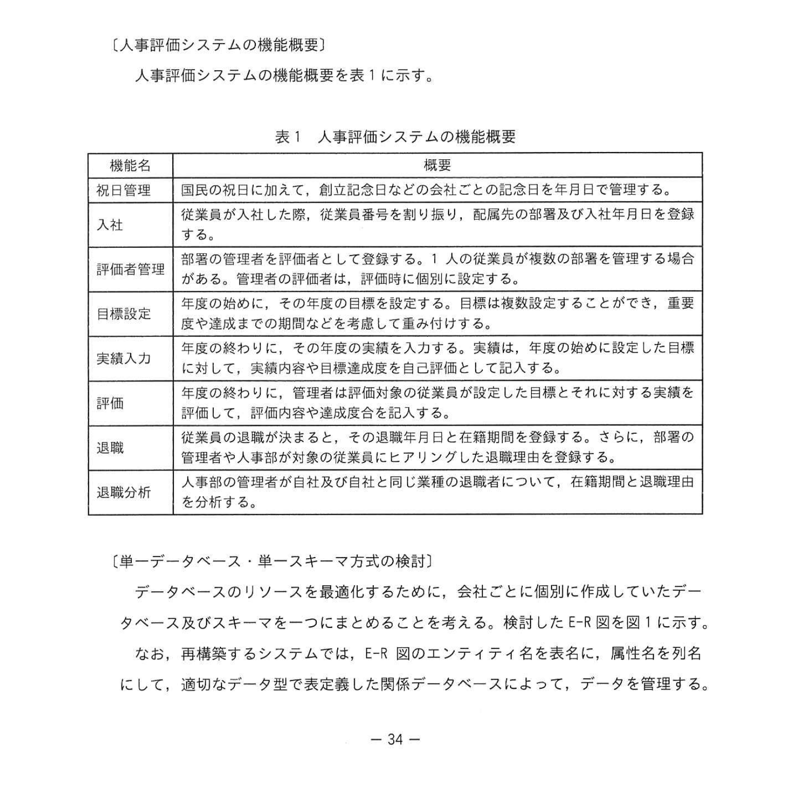
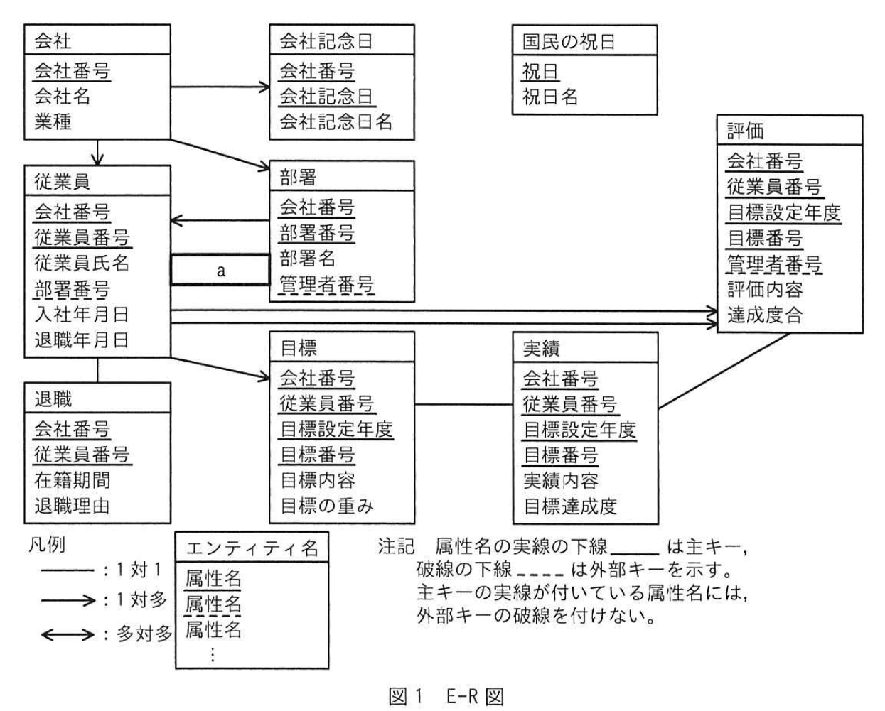
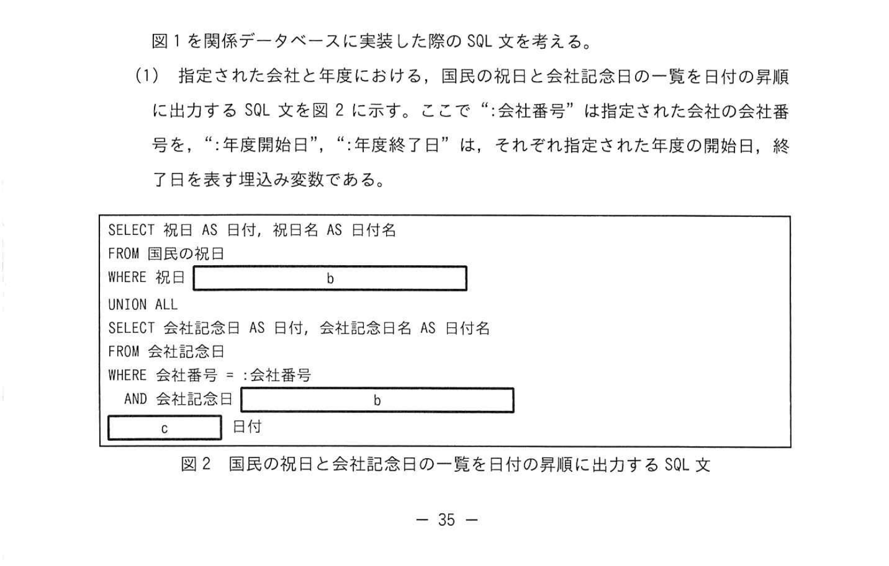
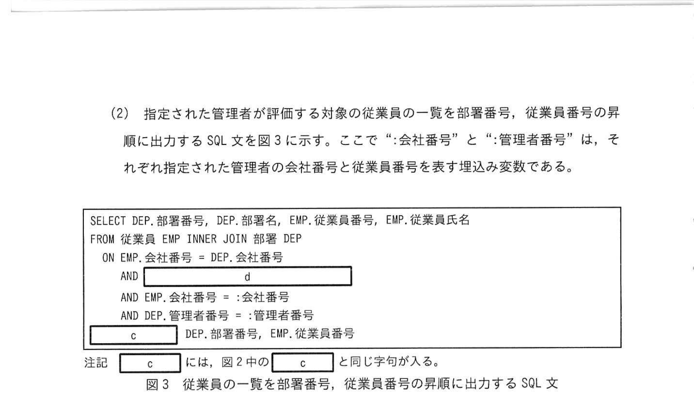
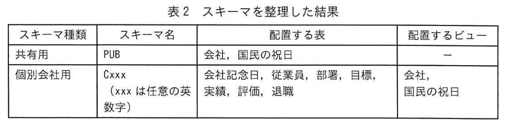

# 2024年春期（令和6年度春期）応用情報技術者試験 午後 問6（選択）
## データベース：SaaS型人事評価システムのマルチテナント化（複数スキーマ設計）

---

## 問題文

**問6** 人事評価システムの設計と実装に関する次の記述を読んで、設問に答えよ。

K社は、人事評価システムを中小企業に提供する SaaS 事業者である。現在は、契約している会社ごとに個別サーバを作成して、その中にデータベースを個別に作成している。現在のシステムのOSやフレームワークのサポート期限が迫ってきたのを機に、機能は変更せずにサーバリソース最適化を目的として、システムを再構築することにした。

---

### 〔人事評価システムの機能概要〕

人事評価システムの機能概要を表1に示す。

### 表1 人事評価システムの機能概要



> | 機能名 | 概要 |
> |---|---|
> | 祝日管理 | 国民の祝日に加え、創立記念日などの会社ごとの記念日を年月日で管理する |
> | 従業員管理 | 部署の管理者を評価者として登録する。1人の従業員が複数の部署を管理する場合もある |
> | 目標設定 | 年度の始めに、その年度の目標を設定する。目標は複数設定することができて、重要度の違いをその間係なく全て考慮して重みけする |
> | 実績入力 | 年度の終わりに、その年度の実績を入力する。実績は、年度の始めに設定した目標ごとに、実績内容の自己評価及び达成度を自己評価として記入する |
> | 評価 | 管理者が、従業員の目標を把握し、全設した目標とその実績を自己評価し評価する。評価内容は評価者が達成度を合計に入力する |
> | 退職 | 退職月と退職理由を登録する。退職した月を日付と同じに登録して、その月で評価を登録する |
> | 退職分析 | 退職した月の入退出を同月行に対象及び入社年月日をグルーピングして退職した従業員を分析する。評価内容は評価者が達成度を合計に入力する |

---

### 〔単一データベース・単一スキーマ方式の検討〕

データベースのリソースを最適化するために、会社ごとに個別に作成したデータベース及びスキーマをキーをもつことのまとめることにした考えた。検討したE-R図を図1に示す。

なお、再構築するシステムでは、E-R図のエンティティ名を表意式に、属性名を列名にして、適切なデータ型で表現した関係データベースによって、データを管理する。

### 図1 E-Rモデル図



> **エンティティ：**
> - 会社（会社番号, 業種, 会社名）
> - 会社記念日（会社番号, 会社記念日, 会社記念日名）
> - 国民の祝日（祝日, 祝日名）
> - 従業員（会社番号, 従業員番号, 従業員氏名, 部署番号, 入社年月日, 退職年月日）
> - 部署（会社番号, 部署番号, 部署名, `[　a　]` 管理者番号）
> - 目標（会社番号, 従業員番号, 目標設定年度, 目標番号, 目標内容, 重要度）
> - 実績（会社番号, 従業員番号, 目標設定年度, 目標番号, 実績内容, 達成成否）
> - 評価（会社番号, 従業員番号, 目標設定年度, 目標番号, 達成度評価）
> - 退職（会社番号, 従業員番号, 退職年月日, 退職理由）
>
> 凡例: → は1対多の関係、─ は1対1の関係

図1を関係データベースに実装した以下のSQL文を考える。

**(1)** 指定された会社と年度における、国民の祝日と会社記念日の一覧を日付の昇順で出力するSQL文を図2に示す。ここで「会社番号」は指定された会社の会社番号を、「年度開始日」「年度終了日」は、それぞれ指定された年度の開始日、終了日を表す埋め込み変数である。

### 図2 国民の祝日と会社記念日の一覧を日付の昇順に出力するSQL文



```sql
SELECT 祝日 AS 日付, 祝日名 AS 日付名
FROM 国民の祝日
WHERE 祝日  b
UNION ALL
SELECT 会社記念日 AS 日付, 会社記念日名 AS 日付名
FROM 会社記念日
WHERE 会社番号 = :会社番号
AND 会社記念日  b
c  日付
```

**(2)** 指定された管理者が評価対象の従業員の一覧を部署番号、従業員番号の昇順で出力するSQL文を図3に示す。ここで「会社番号」と「管理者番号」は、それぞれ指定された管理者の会社番号と従業員番号を表す埋め込み変数である。

### 図3 従業員の一覧を部署番号の昇順に出力するSQL文



```sql
SELECT DEP.部署番号, DEP.部署名, EMP.従業員番号, EMP.従業員氏名
FROM 従業員 EMP INNER JOIN 部署 DEP
ON  d
AND EMP.会社番号 = DEP.会社番号
AND EMP.管理者番号 = :管理者番号
```

---

### 〔単一データベース・単一スキーマ方式のレビュー〕

検討した単一データベース・単一スキーマ方式のレビューを受けたところ、次の指摘とアドバイスを受けた。

- **指摘**：この検討は、サーバリソース最適化を実現することができるが、SQL インジェクションの脆弱性が見つかった場合、多くの情報が漏えいしてしまうおそれがある。

- **アドバイス**：データベースは一つのまま、システム全体で共有するデータだけを格納する共有用スキーマに、①**システム利用者の会社ごとのスキーマに分ける方式**にするとよい。共有用のスキーマに作成した表は、会社ごとのスキーマに対象の表と同じ名前のビューを作成するようにすると、現在のシステムの SQL 文への修正を少なくすることができる。

---

### 〔単一データベース・個別スキーマ方式の検討〕

〔単一データベース・単一スキーマ方式のレビュー〕のアドバイスを受け、複数のスキーマを作成して各スキーマに表とビューを配置する。検討したスキーマを整理した結果を表2に示す。

### 表2・図4 スキーマを整理した結果と国民の祝日ビューSQL



> | スキーマ種類 | スキーマ名 | 配置する表 | 配置するビュー |
> |---|---|---|---|
> | 共有用 | PUB | 会社, 国民の祝日 | − |
> | 個別会社用 | Cxxx（xxxは任意の英数字） | 会社記念日, 従業員, 部署, 目標, 評価, 退職 | 会社, 国民の祝日 |

次に、ビューを作成する SQL 文について考える。スキーマ C001 に国民の祝日ビューを作成する SQL 文を図4に示す。

```sql
CREATE VIEW  e  (祝日, 祝日名)
AS SELECT 祝日, 祝日名
FROM  f
```

---

### 〔単一データベース・個別スキーマ方式のレビュー〕

検討した単一データベース・個別スキーマ方式のレビューを受けたところ、次の指摘を受けた。
- システム利用者ごとに、利用するスキーマを指定するために、`[　g　]` 表に `[　h　]` 列を追加する必要がある。
- 表2の表とビューの配置のままでは②**利用できない機能**があるので、③**配置を一箇所見直す**必要がある。

レビューでの指摘に全て対応することで、システムを再構築することができた。

---

## 設問

### 設問1 〔単一データベース・単一スキーマ方式の検討〕について答えよ。

**(1)** 図1中の `[　a　]` に入れる適切なエンティティ間関連を答え、E-R図を完成させよ。なお、エンティティ間の関連の表記は、図1の凡例に従うこと。

**(2)** 図2中の `[　b　]`、図2及び図3中の `[　c　]` に入れる適切な字句を答えよ。

**(3)** 図3中の `[　d　]` に入れる適切な字句を答えよ。

### 設問2

本文中の下線①の方式にする利点は何か。20字以内で答えよ。

### 設問3

図4中の `[　e　]`、`[　f　]` に入れる適切な字句を答えよ。

### 設問4 〔単一データベース・個別スキーマ方式のレビュー〕について答えよ。

**(1)** 本文中の `[　g　]`、`[　h　]` に入れる適切な字句を答えよ。

**(2)** 本文中の下線②の機能を、表1の機能名から答えよ。

**(3)** 本文中の下線③の見直した内容を、20字以内で答えよ。

---

## 解答と解説

### 設問1

**(1) 正解：a=→（部署→部署、1対多の自己参照関係）**

部署テーブルには「管理者番号」属性があり、これは自社の従業員（管理者）を参照する外部キー。部署エンティティが部署に管理者として複数いることを示す関連。

**(2)**
- **b=BETWEEN :年度開始日 AND :年度終了日**（祝日・会社記念日が指定年度の範囲内にある条件）
- **c=ORDER BY**（日付の昇順で出力するための句）

**(3) 正解：d=EMP.部署番号 = DEP.部署番号**

INNER JOINのON句で従業員テーブルと部署テーブルを部署番号で結合する条件。会社番号の一致条件はその後に続く。

---

### 設問2

**正解：漏えいする情報を会社単位に制限できる（19字）**

単一スキーマでは全会社のデータが同一スキーマにあり、SQLインジェクションで全データが漏えいするリスクがある。個別スキーマ方式では、不正アクセスが特定会社のスキーマに留まり、他社データへの被害を防げる。

---

### 設問3

- **e=C001.国民の祝日**（スキーマC001内に作成するビュー名）
- **f=PUB.国民の祝日**（共有スキーマPUBの国民の祝日表を参照）

```sql
CREATE VIEW C001.国民の祝日 (祝日, 祝日名)
AS SELECT 祝日, 祝日名
FROM PUB.国民の祝日
```

---

### 設問4

**(1)**
- **g=会社**（システム利用者を識別する表）
- **h=スキーマ名**（各会社が利用するスキーマを指定するための列）

**(2) 正解：退職分析**

退職分析機能では退職表を扱うが、現在の表2では退職表は個別スキーマに配置されている。退職分析は全会社の退職データを横断的に分析する機能と考えられるが、個別スキーマ配置では他スキーマのデータにアクセスできない。

**(3) 正解：退職表を共有用スキーマ（PUB）に配置する（22字）**

退職分析機能を実現するためには、複数会社の退職データを横断して分析する必要がある。そのため退職表を共有用スキーマ（PUB）に移動し、個別スキーマ側にはビューを配置する。

---

## 参考：主要キーワード

| 用語 | 説明 |
|------|------|
| SaaS（Software as a Service） | ソフトウェアをクラウドで提供するサービス形態。複数テナントが共有インフラを使用 |
| マルチテナント | 複数の顧客（テナント）が共通のインフラ・ソフトウェアを利用する方式 |
| スキーマ | データベース内のオブジェクト（表・ビュー等）を論理的にグループ化する名前空間 |
| 共有スキーマ | 全テナント共通のデータを格納するスキーマ（国民の祝日・会社マスタ等） |
| 個別スキーマ | テナント（会社）ごとのデータを格納するスキーマ |
| ビュー | テーブルから特定の列・行を抽出した仮想的な表。実データは持たない |
| SQLインジェクション | 悪意あるSQL文をアプリに入力してDBを不正操作する攻撃手法 |
| UNION ALL | 二つのSELECT結果を重複を含めて結合する演算子 |
| INNER JOIN | 両テーブルで結合条件を満たす行だけを返す結合（内部結合） |
| 自己参照関係 | あるテーブルが自分自身の行を外部キーで参照する構造（例:部署の管理者） |
