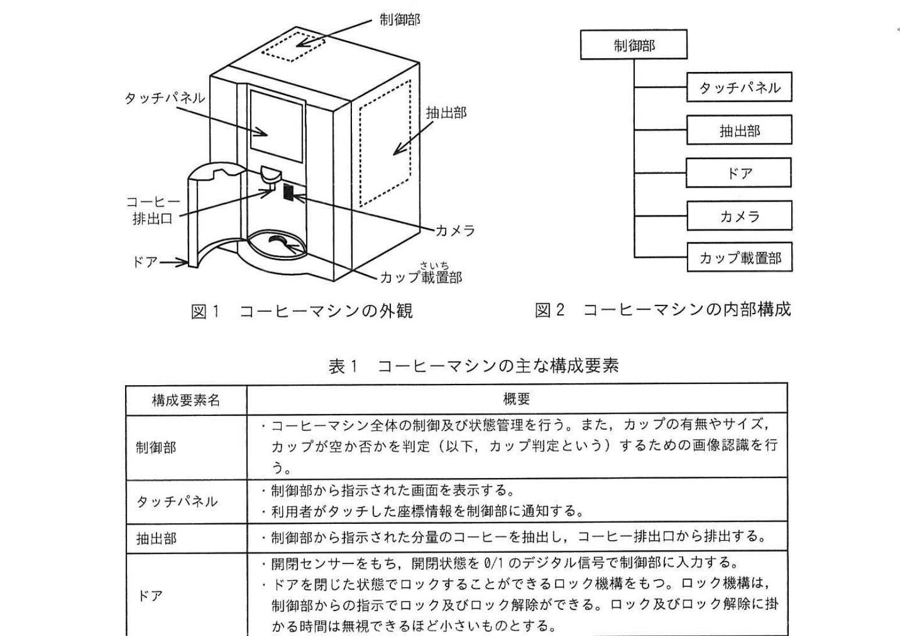
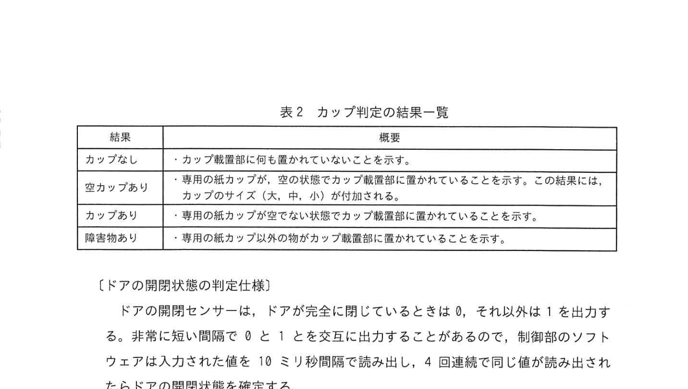
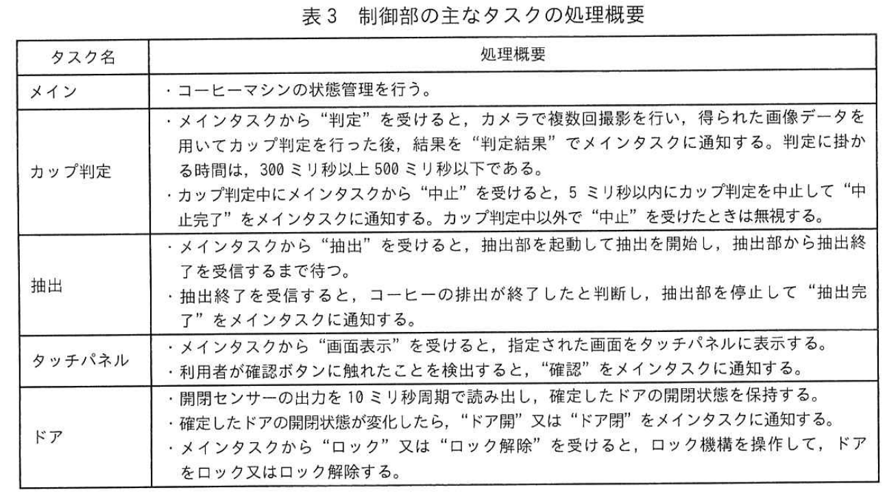
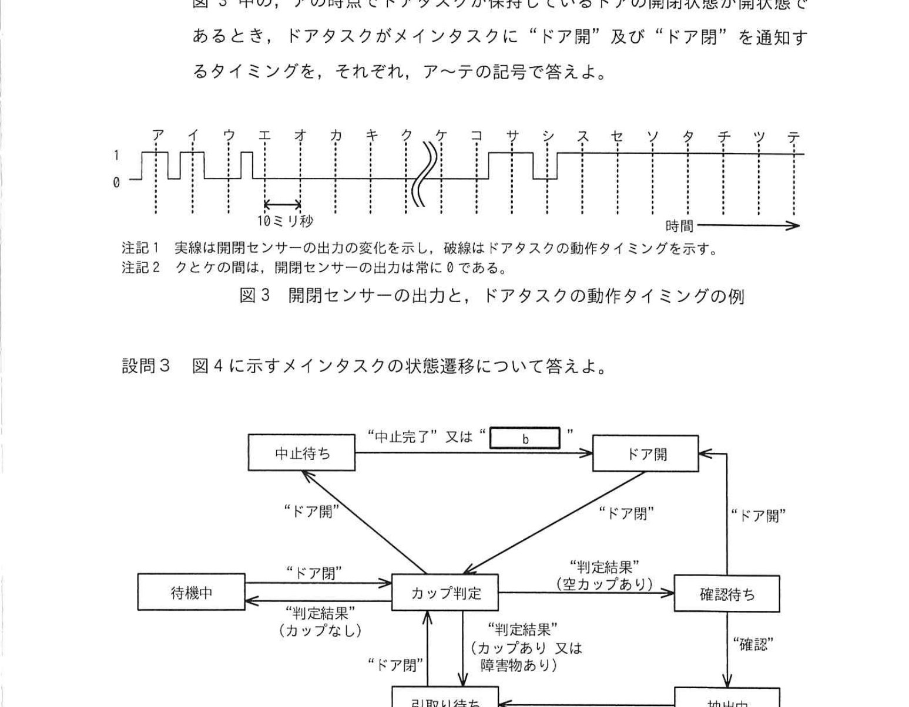
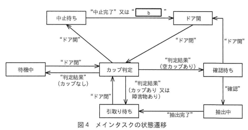

# 2024年春期（令和6年度春期）応用情報技術者試験 午後 問7（選択）
## 組込みシステム：業務用ホットコーヒーマシンの制御（リアルタイムOS・状態遷移）

---

## 問題文

**問7** 業務用ホットコーヒーマシンに関する次の記述を読んで、設問に答えよ。

G社は、業務用ホットコーヒーマシン（以下、コーヒーマシンという）を開発している。コーヒーマシンの外観を図1に、コーヒーマシンの内部構成を図2に、コーヒーマシンの主な構成要素を表1に、それぞれ示す。

### 図1・図2 コーヒーマシンの外観と内部構成

> **図1 外観の主な構成：**
> - 制御部（本体上部）
> - タッチパネル（正面）
> - 抽出部（正面右）
> - コーヒー排出口
> - ドア（正面下部）
> - カメラ
> - カップ載置部
>
> **図2 内部構成：**
> - 制御部 → タッチパネル / 抽出部 / ドア / カメラ / カップ載置部

### 表1 コーヒーマシンの主な構成要素

> | 構成要素名 | 概要 |
> |---|---|
> | 制御部 | ・コーヒーマシン全体の制御及び状態管理を行う。また、カップの有無やサイズ、カップが空か否かを判定（以下、カップ判定という）するための画像認識を行う。 |
> | タッチパネル | ・制御部から指示された画面を表示する。 ・利用者がタッチした座標情報を制御部に通知する。 |
> | 抽出部 | ・制御部から指示された分量のコーヒーを抽出し、コーヒー排出口から排出する。 |
> | ドア | ・開閉センサーをもち、開閉状態を0/1のデジタル信号で制御部に入力する。 ・ドアを閉じた状態でロックすることができるロック機構をもつ。ロック機構は、制御部からの指示でロック及びロック解除ができる。ロック及びロック解除に掛かる時間は無視できるほど小さいものとする。 |
> | カップ載置部 | ・コーヒー排出口から排出されたコーヒーを受けるカップを置く場所である。 |
> | カメラ | ・カップ載置部を撮影するカメラで、制御部からの指示で撮影を行い、制御部と共有するメモリに画像データを書き出す。 |

---

### 〔カップ判定の仕様〕

カップ判定は、利用者がドアを閉じた時に、カメラでカップ載置部を複数回撮影して行う。カップ判定の結果一覧を表2に示す。

### 表2 カップ判定の結果一覧

> | 結果 | 概要 |
> |---|---|
> | カップなし | ・カップ載置部に何も置かれていないことを示す。 |
> | 空カップあり | ・専用の紙カップが、空の状態でカップ載置部に置かれていることを示す。この結果には、カップのサイズ（大、中、小）が付加される。 |
> | カップあり | ・専用の紙カップが空でない状態でカップ載置部に置かれていることを示す。 |
> | 障害物あり | ・専用の紙カップ以外の物がカップ載置部に置かれていることを示す。 |

---

### 〔ドアの開閉状態の判定仕様〕

ドアの開閉センサーは、ドアが完全に閉じているときは0、それ以外は1を出力する。非常に短い間隔で0と1とを交互に出力することがあるので、制御部のソフトウェアは入力された値を10ミリ秒間隔で読み出し、4回連続で同じ値が読み出されたらドアの開閉状態を確定する。

---

### 〔コーヒーマシンの動作概要〕

コーヒーマシンの動作概要を次に示す。
1. 電源が入ると、初期化処理を行う。初期化処理が完了したら待機中となり、カップをカップ載置部に置くように促す画面をタッチパネルに表示する。
2. 利用者がドアを開けて、購入したカップをカップ載置部に置く。
3. 利用者がドアを閉じると、カップ判定を行う。
4. カップ判定の結果が"空カップあり"となるので、カップのサイズを表す文字と、確認ボタンで構成される画面をタッチパネルに表示する。
5. 利用者が確認ボタンにタッチすると、`[　a　]` し、カップのサイズに応じた分量のコーヒーを抽出してコーヒー排出口からカップに注ぎ込む。タッチパネルには、抽出中であることを示す画面を表示する。
6. コーヒーの排出が終わると、ドアをロック解除し、タッチパネルにカップの引取りを促す画面を表示する。
7. 利用者がドアを開け、カップを引き取る。
8. 利用者がドアを閉じると、カップ判定を行う。
9. カップ判定の結果が"カップなし"となるので、待機中に戻る。

ここで、カップ判定中に利用者がドアを開けた場合は、カップ判定を中止し、利用者がドアを閉じるのを待つ。また、確認ボタンがタッチされる前に、利用者がドアを開けた場合は、カップ判定の結果を破棄して、利用者がドアを閉じるのを待つ。カップ判定の結果が"カップあり"又は"障害物あり"の場合、カップ判定の結果に応じた適切な画面をタッチパネルに表示する。

---

### 〔制御部のソフトウェア構成〕

制御部のソフトウェアは、リアルタイムOSを用いて実装する。制御部の主なタスクの処理概要を表3に示す。

### 表3 制御部の主なタスクの処理概要

> | タスク名 | 処理概要 |
> |---|---|
> | メイン | ・コーヒーマシンの状態管理を行う。 |
> | カップ判定 | ・メインタスクから"判定"を受けると、カメラで複数回撮影を行い、得られた画像データを用いてカップ判定を行った後、結果を"判定結果"でメインタスクに通知する。判定に掛かる時間は、300ミリ秒以上500ミリ秒以下である。 ・カップ判定中にメインタスクから"中止"を受けると、5ミリ秒以内にカップ判定を中止して"中止完了"をメインタスクに通知する。カップ判定中以外で"中止"を受けたときは無視する。 |
> | 抽出 | ・メインタスクから"抽出"を受けると、抽出部を起動して抽出を開始し、抽出部から抽出終了を受信するまで待つ。 ・抽出終了を受信すると、コーヒーの排出が終了したと判断し、抽出部を停止して"抽出完了"をメインタスクに通知する。 |
> | タッチパネル | ・メインタスクから"画面表示"を受けると、指定された画面をタッチパネルに表示する。 ・利用者が確認ボタンに触れたことを検出すると、"確認"をメインタスクに通知する。 |
> | ドア | ・開閉センサーの出力を10ミリ秒周期で読み出し、確定したドアの開閉状態を保持する。 ・確定したドアの開閉状態が変化したら、"ドア開"又は"ドア閉"をメインタスクに通知する。 ・メインタスクから"ロック"又は"ロック解除"を受けると、ロック機構を操作して、ドアをロック又はロック解除する。 |

---

### 図3 開閉センサーの出力と、ドアタスクの動作タイミングの例

> 横軸に時間、ア〜テの各時点（10ミリ秒間隔）で破線がドアタスクの動作タイミングを示す。
> - 注記1: 実線は開閉センサーの出力の変化を示し、破線はドアタスクの動作タイミングを示す。
> - 注記2: クとケの間は、開閉センサーの出力は常に0である。

---

### 図4 メインタスクの状態遷移

> **状態と主な遷移：**
> - 待機中 →("ドア閉")→ カップ判定
> - カップ判定 →("判定結果"（カップなし））→ 待機中
> - カップ判定 →("判定結果"（空カップあり））→ 確認待ち
> - カップ判定 →("判定結果"（カップあり 又は 障害物あり））→ 引取り待ち
> - カップ判定 →("ドア開")→ 中止待ち
> - 中止待ち →("中止完了" 又は `[　b　]`）→ ドア開
> - ドア開 →("ドア閉")→ カップ判定
> - 確認待ち →("確認")→ 抽出中
> - 確認待ち →("ドア開")→ ドア開
> - 抽出中 →("抽出完了")→ 引取り待ち
> - 引取り待ち →("ドア閉")→ カップ判定

---

## 設問

### 設問1 コーヒーマシンについて答えよ。

**(1)** 本文中の `[　a　]` に入れる、適切なコーヒーマシンの動作を答えよ。

**(2)** 開閉センサーの出力を読み出す周期を、周波数32kHzのカウントダウンタイマー（以下、タイマーという）を用いて計っている。このタイマーは、あらかじめ設定された初期値からカウントダウンを行い、カウント値が0になったら、次のカウントダウンまでの間に初期値をリロードして動作を継続する。タイマーに設定する初期値は幾つか、整数で求めよ。ここで、1k=10³とする。

### 設問2 制御部のタスクについて答えよ。

**(1)** カップ判定タスクは、メインタスク及びドアタスクよりも優先度を低くしている。その理由を30字以内で答えよ。

**(2)** メインタスクが抽出タスクに"抽出"を通知する際のパラメータとして、必要な情報を答えよ。

**(3)** 開閉センサーの出力と、ドアタスクの動作タイミングの例を図3に示す。図3中の、アの時点でドアタスクが保持しているドアの開閉状態が開状態であるとき、ドアタスクがメインタスクに"ドア開"及び"ドア閉"を通知するタイミングを、それぞれ、ア〜テの記号で答えよ。

### 設問3 図4に示すメインタスクの状態遷移について答えよ。

**(1)** メインタスクがドアタスクに通知を行うのは、何のメッセージを受けたときか。図4中のメッセージ名で全て答えよ。

**(2)** 図4中の `[　b　]` に入れる適切なメッセージ名を、表3中の字句で答えよ。

---

## 解答と解説

### 設問1

**(1) 正解：a=ドアをロック**

確認ボタンを押した後、コーヒー抽出中にドアが開かないようにするため、まず「ドアをロック」する。その後コーヒーを抽出し始める。

**(2) 正解：320**

- 読み出し周期: 10ミリ秒 = 10×10⁻³秒
- タイマー周波数: 32kHz = 32×10³Hz
- 初期値 = 周波数 × 周期 = 32,000 × 0.010 = **320**

---

### 設問2

**(1) 正解：カップ判定中にドアが開けられたことを速やかに検出するため（27字）**

カップ判定中（カメラ撮影中）にドアが開かれた場合は、即座にカップ判定を中止する必要がある。ドアタスクの優先度を高くしておくことで、ドア状態の変化を速やかに検知でき、カップ判定タスクの中止処理を確実に行える。

**(2) 正解：カップのサイズ（大・中・小）**

抽出タスクがコーヒーを適切な分量で抽出するためには、カップのサイズ（大・中・小）に対応した分量を決める情報が必要。

**(3) 正解：ドア開=タ、ドア閉=カ**

ドアタスクは10ミリ秒間隔で開閉センサーの出力を読み出し、4回連続で同じ値が読み出された時点でドアの開閉状態を確定し、状態が変化したときに"ドア開"／"ドア閉"を通知する。

---

### 設問3

**(1) 正解："確認"、"抽出完了"**

- **"確認"**を受けたとき → ドアタスクに"ロック"を通知（抽出中にドアが開かないようにする）
- **"抽出完了"**を受けたとき → ドアタスクに"ロック解除"を通知（カップを引き取れるようにする）

**(2) 正解：b=判定結果**

中止待ち状態は、カップ判定中にドアが開いて遷移した状態。カップ判定が既に完了していた場合は"中止完了"ではなく"判定結果"が届くので、"中止完了"又は"判定結果"を受けてドア開状態に遷移する。

---

## 参考：主要キーワード

| 用語 | 説明 |
|------|------|
| リアルタイムOS（RTOS） | タスクの優先度に基づいてリアルタイムに処理するOS。組込みシステムで広く使用 |
| タスク | RTOSにおける処理単位。優先度が設定され、高優先度タスクが先に実行される |
| タスク間通信 | メッセージパッシングやキューを使ってタスク間でデータを受け渡す仕組み |
| カウントダウンタイマー | 設定値からカウントダウンし、0になると初期値をリロードして継続するタイマー |
| チャタリング | スイッチやセンサーの接点が切り替わるとき、短時間に0と1が繰り返す現象 |
| 状態遷移 | システムの状態が特定のイベントをトリガーとして別の状態に変化すること |
| 優先度制御 | RTOSで優先度の高いタスクが低いタスクを割込んで実行する仕組み（プリエンプション） |
| ロック/ロック解除 | 物理的なドア施錠機構への制御コマンド |
