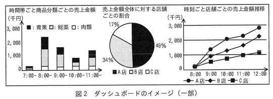

# 2024年春期（令和6年度春期）応用情報技術者試験 午後 問8（選択）
## 情報システム開発：ダッシュボードの設計（Observerパターン）

---

## 問題文

**問8** ダッシュボードの設計に関する次の記述を読んで、設問に答えよ。

Y社は、食品などを販売する店舗を経営する企業である。複数ある店舗では、商品の販売状況や在庫状況に合わせて、割引率を設定したり、店舗間で在庫の移動を行ったりしている。販売に関する情報は販売管理システムで管理しているが、状況をリアルタイムで監視するには不向きであった。そこで、販売状況をリアルタイムで監視できるシステム（以下、ダッシュボードという）を開発することにした。

Y社では、商品ごとに商品分類を設定し、売上金額や販売数の集計に利用している。Y社が扱う情報のデータモデル（抜粋）を図1に、ダッシュボードのイメージ（一部）を図2に示す。

### 図1 データモデル（抜粋）

> **テーブル構成（抜粋）：**
> - 店舗マスタ（店舗コード, 店舗名）
> - 在庫（店舗コード, 商品コード, 在庫数）
> - 販売実績（店舗コード, 販売コード, 販売日時, 売上金額合計）
> - 販売明細（店舗コード, 販売コード, 商品コード, 単価, 数量）
> - 商品分類マスタ（商品分類コード, 商品分類名）
> - 商品マスタ（商品コード, 商品分類コード, 商品名, 単価）
>
> 凡例: ── 1対1、→ 1対多、←→ 多対多

### 図2 ダッシュボードのイメージ（一部）

> - 時間帯ごと商品分類ごとの売上金額（積み上げ棒グラフ：青果／総菜／肉類）
> - 売上金額全体に対する店舗ごとの割合（円グラフ：A店49%／B店34%／C店17%）
> - 時刻ごと店舗ごとの売上金額推移（折れ線グラフ：A店／B店／C店）

販売状況や在庫状況はデータベースで管理する。データベースに新たな販売実績が追加されたり、在庫数が更新されたりすると、その内容がダッシュボードに随時反映され、最新の情報が表示される。

Y社は、ダッシュボードの開発をZ社に依頼し、Z社はその設計に取り掛かった。

---

### 〔ダッシュボードのクラスの設計〕

Z社は、ダッシュボードのクラスの設計を行った。設計したクラス図を図3に、表示できるグラフの種類を表1に、主なクラスの説明を表2に示す。Controller クラスは、システム全体の挙動を制御するクラスである。View クラスは、画面にグラフを表示する機能をもつクラスである。グラフには複数の種類があるので、その種類ごとに、View クラスを `[　a　]` したクラスを作成する。Subject クラスは、データベースが更新されたことを View クラスのオブジェクトに通知するクラスである。図1のデータモデル中のテーブルのうち、ダッシュボードで監視したい情報に関するテーブルのそれぞれについて、Subject クラスを `[　a　]` したクラスを作成する。以下、View クラス、Subject クラスを `[　a　]` したクラスのオブジェクトを、それぞれ View オブジェクト、Subject オブジェクトという。

### 図3 クラス図

> **主なクラス：**
>
> **Controller《Singleton》**
> - -instance（下線：静的）
> - -views[]
> - -subjects[]
> - +getInstance()
> - +dbUpdated(テーブル名[])
>
> **Subject**
> - -views[]
> - +addObserver(View v)
> - +notifyObservers()
>
> **View（抽象）**
> - -集計項目[]
> - +notify()
> - +set集計項目(集計項目[] d)
> - +画面表示更新()（抽象）
>
> **集計項目**
> - -軸の識別子
> - -テーブル名
> - -項目名
>
> **集計処理 / DAO**
>
> **継承（`[　c　]`）関係：**
> - 販売実績Subject、在庫Subject、販売明細Subject（Subjectを継承）
> - 棒グラフView、折れ線グラフView、円グラフView（Viewを継承。各クラスは +画面表示更新() を実装）
>
> **主な関連：**
> - Controller ◆—1 Subject（コンポジション、0..*）
> - Controller ◆—1 View（コンポジション、0..*）
> - Subject ◇—1 …—`[　b　]` View（集約）
> - View ◇—1 …—0..* 集計項目（集約）
> - 棒グラフView・折れ線グラフView・円グラフView --→ 集計処理（依存）、集計処理・DAO 間依存
>
> 凡例: 実線=関連、◆=コンポジション、◇=集約、△=継承、--→=依存、1=多重度1、0..*=多重度0以上。斜字体は抽象、下線は静的を意味する。
>
> 注記: 集計項目クラスの属性"軸の識別子"は、グラフの"縦軸""横軸"などを一意に示す値である。

### 表1 表示できるグラフの種類

> | 種類 | グラフの構成要素 | 説明 |
> |---|---|---|
> | 棒グラフ | 横軸の項目、集計対象の項目、分類 | 横軸の項目について、任意の値の範囲で区切り、集計対象の項目の値を縦棒で表現する。縦棒の値は、分類ごとに色分けし、それらを積み上げて表示する。 |
> | 円グラフ | 集計対象の項目、分類 | 集計対象の項目について、分類ごとに集計して、その割合を扇形の面積で表現する。扇形は分類ごとに色分けして表示する。 |
> | 折れ線グラフ | 横軸の項目、集計対象の項目、分類 | 横軸の項目について、任意の値の範囲で区切り、集計対象の項目の値の推移を折れ線で表現する。折れ線は分類ごとに分けて表示する。 |

### 表2 主なクラスの説明

> | クラス | 説明 |
> |---|---|
> | Controller | プログラムの流れを制御するクラス。データベースが更新されたときに、更新されたテーブル名の配列を引数にして、dbUpdatedメソッドを呼び出す。 |
> | DAO | データベースにアクセスするためのクラス。 |
> | Subject | データの更新をViewオブジェクトに通知するクラス。通知先は、addObserverメソッドで登録する。notifyObserversメソッドは、登録された全ての通知先のnotifyメソッドを呼び出す。 |
> | View | ダッシュボードに一つのグラフを表示するクラス。グラフの軸や集計対象の項目の情報を、集計項目オブジェクトの配列で保持している。notifyメソッドは、画面表示更新メソッドを呼び出す。画面表示更新メソッドは、対象に関する集計を行い、画面の表示を更新する。 |
> | 集計処理 | グラフを表示する際に必要になる、各種の集計の処理を実装したクラス。 |

---

### 〔グラフの新規表示〕

例えば、"時間帯ごと商品分類ごとの売上金額"のグラフを新たに画面上に表示する場合を考える。グラフの種類は棒グラフなので、棒グラフ View クラスのオブジェクトを作成する。次に、①**関係する Subject オブジェクト**の addObserver メソッドを呼び出す。その後、画面の初期表示のために、画面表示更新メソッドを呼び出す。

---

### 〔グラフの表示内容更新〕

店舗で商品が販売されると、販売管理システムが、データベースにレコードを追加する。そのとき、ダッシュボードの Controller クラスに実装されている dbUpdated メソッドが呼び出されるように、システム間の連携が行われている。

Controller クラスは、dbUpdated メソッドが呼び出されると、更新されたテーブルに対応する Subject オブジェクトの notifyObservers メソッドを呼び出す。notifyObservers メソッドは、そのオブジェクトが属性としてもつ配列 views に格納されている全ての View オブジェクトの notify メソッドを呼び出す。notify メソッドは、画面表示更新メソッドを呼び出す。View クラスの画面表示更新メソッドは `[　d　]` メソッドなので、例えば"時間帯ごと商品分類ごとの売上金額"の場合は `[　e　]` クラスに実装されたメソッドを呼び出す。

---

### 〔データのフィルタリング〕

Y社からの追加の要求で、集計結果をフィルタリングする機能を追加することになった。例えば、"時間帯ごと商品分類ごとの売上金額"のグラフ上で、特定の商品分類の表示箇所をマウスでクリックしたときに、表示されている全てのグラフについて、指定した商品分類で絞り込んだ結果を表示したい。そこで、絞込条件を取り扱うクラスとして絞込条件クラスを導入し、次の改修を加えることで機能を実現することにした。

- 絞込条件クラスは、属性として"テーブル名"、"項目名"、"絞込条件の値"をもつ。例えば、商品分類で絞り込む場合は、テーブル名に"商品マスタ"、項目名に"商品分類コード"、絞込条件の値に"商品分類コードの値"が入る。
- Controller クラスの属性に絞込条件クラスのオブジェクトを追加し、その属性に条件を設定するための setFilter メソッドを追加する。
- View オブジェクトが画面の表示を更新する際に、絞込条件のオブジェクトが引き渡されるようにするために、Subject クラスの notifyObservers メソッドと、View クラスの notify メソッドのそれぞれについて、呼出しの②**仕様を変更する**。
- 集計処理クラスの処理で絞込条件を考慮して集計し、画面を更新する。

画面の操作が行われたら、View オブジェクトが絞込条件オブジェクトを生成し、Controller オブジェクトの setFilter メソッドを呼び出す。その後、全ての View オブジェクトの画面表示更新メソッドを呼び出すことで、機能を実現する。

---

### 〔過負荷の回避〕

設計レビューを実施したところ、次の点が指摘された。
- 販売管理システムが、データベースに販売実績のレコードを連続で追加すると、ダッシュボードが過負荷になるおそれがある。
- 一つの View オブジェクトは `[　f　]` ので、1回の販売実績の登録で、表示の更新が複数回発生してしまう。

そこで、View クラスの属性に"更新フラグ"を追加し、notify メソッドでは画面表示更新メソッドを呼び出すのではなく、"更新フラグ"を立てるようにした。また、"更新フラグ"を立てる処理とは別に、定期的に画面表示更新メソッドを呼び出す仕組みを用意し、"更新フラグ"が立っている場合だけ画面の更新処理を実行してから"更新フラグ"を降ろすようにした。

---

## 設問

### 設問1

本文中の `[　a　]` に入れる適切な字句を答えよ。

### 設問2

図3中の `[　b　]`、`[　c　]` に入れる適切なクラス間の関係又は多重度を答え、クラス図を完成させよ。なお、表記は図3の凡例に倣うこと。

### 設問3

本文中の下線①について、関係する Subject オブジェクトのクラス名を図3中から選び**全て**答えよ。

### 設問4

本文中の `[　d　]`、`[　e　]` に入れる適切な字句を答えよ。

### 設問5

本文中の下線②について、仕様変更の内容を30字以内で答えよ。

### 設問6

本文中の `[　f　]` に入れる適切な字句を、30字以内で答えよ。

---

## 解答と解説

### 設問1

**正解：a=継承**

View クラスや Subject クラスをそれぞれ「継承」したサブクラスを作成する（棒グラフView、円グラフView、販売実績Subject 等）。GoFデザインパターンのObserverパターンの典型的な実装。

---

### 設問2

- **b=0..\***（SubjectクラスからViewクラスへの多重度。1つのSubjectに0個以上のViewが集約される）
- **c=△（継承／汎化）**（各サブクラスからスーパークラスへの継承関係を示す）

---

### 設問3

**正解：販売実績Subject、販売明細Subject**

"時間帯ごと商品分類ごとの売上金額"は、販売実績テーブル（売上金額・販売日時）と販売明細テーブル（商品・数量）を参照する。よって、この棒グラフの View オブジェクトを登録する Subject は**販売実績Subject**と**販売明細Subject**。

---

### 設問4

- **d=抽象**（Viewクラスの画面表示更新メソッドは抽象メソッドであり、実体はサブクラスに実装される）
- **e=棒グラフView**（"時間帯ごと商品分類ごとの売上金額"は棒グラフなので、棒グラフViewクラスに実装された画面表示更新メソッドが呼び出される）

**IPA公式：設問1 a=継承／設問2 b=0..*、c=△（継承）／設問3 販売実績Subject、販売明細Subject／設問4 d=抽象、e=棒グラフView**

---

### 設問5

**正解：引数に絞込条件クラスのオブジェクトを追加する。（22字）**

notifyObserversメソッドとnotifyメソッドの呼出しに、絞込条件クラスのオブジェクトを引数として渡せるよう、両メソッドの引数の仕様を変更する。

**IPA公式：引数に絞込条件クラスのオブジェクトを追加する。**

---

### 設問6

**正解：f=複数のSubjectオブジェクトに登録される（19字）**

1つの View オブジェクトが複数の Subject（販売実績Subject、販売明細Subject 等）に登録されるため、各Subjectから個別にnotifyが呼ばれ、1回の販売実績登録でも複数回 View の更新が発生する。

**IPA公式：複数のSubjectオブジェクトに登録される**

---

## 参考：主要キーワード

| 用語 | 説明 |
|------|------|
| Observerパターン | GoFデザインパターンの一つ。Subject（被観察者）の状態変化をObserver（View）に自動通知する設計パターン |
| Subject（被観察者） | データの変化を監視対象とし、変化があると登録済みのObserver（View）に通知するクラス |
| Observer（観察者） | Subjectからの通知を受けて自身の状態（画面表示等）を更新するクラス（本問のView） |
| notifyObservers | 登録された全Observer（View）に通知するSubjectのメソッド |
| addObserver | ObserverをSubjectに登録するメソッド |
| 継承 | 親クラス（スーパークラス）の特性を子クラス（サブクラス）が引き継ぐオブジェクト指向の機能 |
| 抽象クラス／抽象メソッド | インスタンス化できないクラス。抽象メソッドはサブクラスで実装される |
| Singletonパターン | クラスのインスタンスが1つだけ生成されることを保証するデザインパターン |
| DAO（Data Access Object） | データベースへのアクセスを担当する専用クラス |
| 多重度 | UMLクラス図で、クラス間の関係で何個のオブジェクトが対応するかを示す表記（0..*等） |
