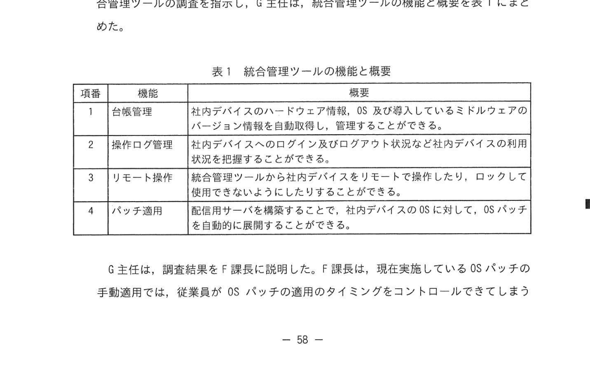

# 2024年春期（令和6年度春期）応用情報技術者試験 午後 問10（選択）
## サービスマネジメント：テレワーク環境下のサービスマネジメント（OSパッチ適用・サービスデスク）

---

## 問題文

**問10** テレワーク環境下のサービスマネジメントに関する次の記述を読んで、設問に答えよ。

E社は、東京に本社があり、全国に3か所の営業所をもつ、従業員約200名の保険代理店である。E社には、保険商品の販売や顧客サポートを行う営業部、入出金処理や伝票処理を行う経理部、情報システムの開発や運用を行う情報システム部などの部署がある。営業部の従業員（以下、営業員という）は、営業先に出向いて業務を行うことが多く、その際の顧客サポートの質の向上が課題となっている。

E社の従業員には、ノートPCが一人1台貸与され、一部の営業員には、ノートPCとは別にタブレット端末が貸与されている。ノートPCやタブレット端末（以下、これらを社内デバイスという）では、本社内に設置しているサーバのアプリケーションソフトウェア（以下、業務アプリという）と、電子メール送受信やスケジュール管理を行うことができるグループウェア（以下、業務アプリとグループウェアを合わせて社内IT環境という）の利用が可能である。社内デバイスは、社外から社内IT環境へのネットワーク接続は行えない。

E社の情報システム部には、開発課と運用課がある。開発課は、各部署が利用する社内IT環境の企画・開発を行う。運用課は、管理者のF課長、運用業務の取りまとめを行うG主任及び数名の運用担当者で構成され、サーバなどのIT機器の管理だけでなく、次のITサービスを提供している。

- 社内IT環境の運用
- 従業員からの問合せやインシデントの対応を受け付けるサービスデスク

---

### 〔社内IT環境とサービスマネジメントの概要〕

現在の社内IT環境とサービスマネジメントの概要を次に示す。
- 営業員は、社内IT環境から営業活動に必要なデータを、社内でタブレット端末にダウンロードし、営業先ではタブレット端末をスタンドアロンで使用している。
- 社内デバイスのOSを対象に、セキュリティ修正プログラムを含むOSバージョンのアップデート（以下、OSパッチという）を実施している。
- OSパッチを適用するには、社内デバイスのシステム設定で自動適用と手動適用のいずれか一方を設定する必要がある。現在は手動適用に設定している。
- OSパッチを適用すると、社内デバイスで業務アプリを正常に利用できなくなるおそれがある。そこで、OSパッチの展開管理に責任をもつ運用課は、OSパッチが公開されると、まず、開発課にOSパッチを適用した社内デバイスでテストを行い、業務アプリを正常に利用できることを確認するように依頼する。業務アプリを正常に利用できることを確認後、運用課から、従業員に社内デバイスを操作してOSパッチを手動適用するように依頼する。
- 従業員からの問合せやインシデントに対応するために、従業員が使っている社内デバイスの操作が必要な場合がある。サービスデスクは、従業員が社内デバイスを利用している場所が本社のときは対面でサポートを行い、営業所のときは電話でサポートを行っている。ただし、サービスデスクでは、電話でのサポートは時間が掛かるという問題を抱えている。
- サービスデスクだけでインシデントをタイムリーに解決できない場合、開発課への `[　a　]` を行うことがある。

---

### 〔テレワーク環境の構築の計画〕

営業部の課題を解決するため、全ての営業員にタブレット端末を貸与し、社外からインターネットを介して社内IT環境に接続可能なテレワーク環境を、開発課が構築し、運用課が運用することになった。なお、テレワーク環境は、当初はタブレット端末だけの利用とするが、社会情勢の変化を受けて在宅勤務などで、ノートPCにも今後利用を拡大する予定である。

テレワーク環境では、サービスデスクは、社外でタブレット端末を使う営業員からの問合せやインシデントに、営業所の場合と同様に、電話によるサポートで対応する。

---

### 〔テレワーク環境の運用の準備〕

F課長は、テレワーク環境の運用の準備に着手した。

テレワーク環境の利用開始直後は、営業員から問合せが多発することやインシデントの発生が想定された。F課長は、テレワーク環境の利用開始から安定稼働になるまでの間は、開発課による初期サポートが必要と判断し、開発課に依頼して初期サポート窓口を開発課に設けることを計画した。ただし、開発課による初期サポートの実施中は、問合せ先及びインシデントの連絡先を営業員自身が判断し、テレワーク環境については初期サポート窓口に、その他についてはサービスデスクに対応を依頼することとなる。F課長は、利用開始後のテレワーク環境に関する問合せとインシデントの対応が `[　b　]` ことを、テレワーク環境の安定稼働の条件と考えた。また、初期サポート窓口の設置は、テレワーク環境の利用開始後から4週間を目安とし、テレワーク環境に関する問合せとインシデントの対応が `[　b　]` ことを初期サポートの終了基準とし、終了基準を満たすまで、初期サポート窓口を継続する。

サービスデスクは本来、機能的にSPOC（Single Point Of Contact）とするのが望ましい。そこで、F課長は、①**SPOCを実現する**時期の判断のために、テレワーク環境の問合せ対応に関して、初期サポートが終了するまでに開発課から `[　c　]` ことも初期サポートの終了基準として設けるべきであると考えた。F課長は、これらの計画について営業部と開発課に説明して了承を得た。

次に、F課長は、タブレット端末をもつ営業員が増え、また社外での利用機会が拡大すること、及び今後ノートPCを利用した在宅勤務が予定されていることから、社内デバイスの利用状況の管理を効率的に行う必要があると考えた。そこで、現状の人手による管理に代えて、社内デバイスの利用状況を統合的に管理することができるツール（以下、統合管理ツールという）を導入することにした。F課長は、G主任に統合管理ツールの調査を指示し、G主任は、統合管理ツールの機能と概要を表1にまとめた。

### 表1 統合管理ツールの機能と概要

> | 項番 | 機能 | 概要 |
> |---|---|---|
> | 1 | 台帳管理 | 社内デバイスのハードウェア情報、OS及び導入しているミドルウェアのバージョン情報を自動取得し、管理することができる。 |
> | 2 | 操作ログ管理 | 社内デバイスへのログイン及びログアウト状況など社内デバイスの利用状況を把握することができる。 |
> | 3 | リモート操作 | 統合管理ツールから社内デバイスをリモートで操作したり、ロックして使用できないようにしたりすることができる。 |
> | 4 | パッチ適用 | 配信用サーバを構築することで、社内デバイスのOSに対して、OSパッチを自動的に展開することができる。 |

G主任は、調査結果をF課長に説明した。F課長は、現在実施しているOSパッチの手動適用では、従業員がOSパッチの適用のタイミングをコントロールできてしまうことから、OSパッチの適用に不確実さがあることを問題視していた。F課長は、パッチ適用機能を使うことで、展開管理としてOSパッチを確実に適用できると考えた。F課長は、パッチ適用機能の実現には、テスト済みのOSパッチを配信用サーバに登録する手順の追加が必要となることをG主任に指摘し、検討するように指示した。そこで、F課長は、テレワーク環境の利用開始時点では、統合管理ツールのパッチ適用以外の機能を使用し、②**現在、サービスデスクで行っているサポートの問題を解決する**ことにした。

---

### 〔パッチ適用機能の使用〕

テレワーク環境の構築が完了し、営業員によるテレワーク環境の利用が開始された。初期サポート窓口での対応は、終了基準を満たして、計画どおり4週間で終了した。

テレワーク環境はおおむね好評で、営業員のタブレット端末の利用頻度が上がり、タブレット端末による営業活動への効果が向上していた。一方で、以前から、営業部では、運用課からの指示がないにもかかわらずOSパッチを手動適用したり、指示したにもかかわらず手動適用を忘れたりして、社内デバイスで業務アプリを正常に利用できないというインシデントが発生しており、現在も営業活動に影響が出ていた。

この状況を受けて、F課長は、"今後のインシデント発生を防止するという問題管理の視点から有効であるだけでなく、展開管理の視点からも有効である"と考えて、早期に③**パッチ適用機能の使用を開始する**ことにし、G主任にその後の検討状況の報告を求めた。G主任は、展開管理の手順の検討結果を報告し、F課長は了承した。また、G主任は、パッチ適用機能を実現するためには、現在、手動適用の運用をしている社内デバイスの設定を変更する準備作業が必要となることを報告した。報告を受けたF課長は、準備が整い次第、パッチ適用機能を使用することを決定した。

---

## 設問

### 設問1

本文中の `[　a　]` に入れる適切な字句を解答群の中から選び、記号で答えよ。

**解答群：**
- ア アセスメント
- イ エスカレーション
- ウ ガバナンス
- エ コミットメント

### 設問2 〔テレワーク環境の運用の準備〕について答えよ。

**(1)** 本文中の `[　b　]` に入れる内容を、15字以内で答えよ。

**(2)** 本文中の下線①とすることのメリットは何か。営業員にとってのメリットを25字以内で答えよ。

**(3)** 本文中の `[　c　]` に入れる内容を、25字以内で答えよ。

**(4)** 本文中の下線②の問題と解決方法は何か。問題を25字以内で答えよ。解決方法は表1中の機能に対応する項番の数字を答えよ。

### 設問3

本文中の下線③について、運用課が下線③の対策を採る理由を、展開管理の視点から30字以内で答えよ。

---

## 解答と解説

### 設問1

**正解：a=イ（エスカレーション）**

サービスデスクだけで解決できないインシデントは、開発課への「エスカレーション（上位・専門部門への引き継ぎ）」を行う。

---

### 設問2

**(1) 正解：b=サービスデスクだけで対応できる（15字）**

初期サポート窓口を経ず、テレワーク環境に関する問合せとインシデントの対応をサービスデスクだけで対応できる状態になることが、安定稼働の条件であり、初期サポートの終了基準となる。

**(2) 正解：営業員が問合せ先を判断する必要がなくなる（20字）**

SPOCは問合せ窓口を一本化する概念。実現すれば、営業員は問合せ先（初期サポート窓口かサービスデスクか）を自分で判断する必要がなくなる。

**(3) 正解：c=テレワーク環境の問合せ対応を引き継ぐ（17字）**

SPOC（サービスデスクへの一本化）を実現するため、初期サポートが終了するまでに、開発課からサービスデスクへテレワーク環境の問合せ対応を引き継ぐことも終了基準に設ける。

**(4)**
- **問題：電話でのサポートは時間が掛かること（17字）**
- **解決方法：3（リモート操作）**

サービスデスクの電話サポートは時間が掛かるという問題がある。統合管理ツールの「リモート操作（項番3）」を使えば、社内デバイスをリモートで操作して直接サポートでき、問題を解決できる。

---

### 設問3

**正解：OSパッチを確実に適用でき、展開管理を徹底できるから（25字）**

パッチ適用機能を使えば、配信用サーバからテスト済みのOSパッチを自動展開でき、従業員が適用タイミングをコントロールできてしまう不確実さを排除できる。これにより展開管理としてOSパッチを確実に適用できる。

---

## 参考：主要キーワード

| 用語 | 説明 |
|------|------|
| SPOC（Single Point Of Contact） | 利用者の問合せを一か所に集約する単一窓口の考え方 |
| エスカレーション | 担当者では解決できない問題を上位・専門部門に引き継ぐプロセス |
| 展開管理（リリース・展開管理） | ソフトウェア・パッチ等の変更を計画・テスト・配備する管理プロセス |
| 問題管理 | インシデントの根本原因を特定し、再発防止策を実施するプロセス |
| OSパッチ | OSのセキュリティ修正を含むバージョンアップデート。確実な適用が重要 |
| サービスデスク | 利用者からの問合せ・インシデントを一元的に受け付ける機能 |
| 統合管理ツール | 台帳管理・操作ログ管理・リモート操作・パッチ適用を統合管理するソフトウェア |
| テレワーク | 社外でICTを活用して業務を行う働き方 |
| リモート操作 | ネットワーク経由で遠隔から別の端末を操作する機能 |
| 初期サポート窓口 | 新サービス導入直後の混乱期に一時的に設置するサポート窓口 |
