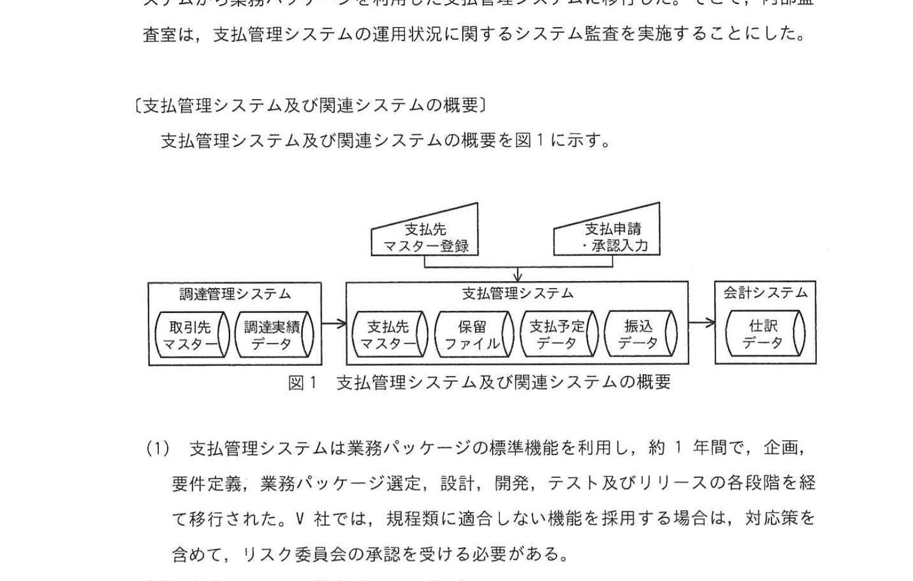
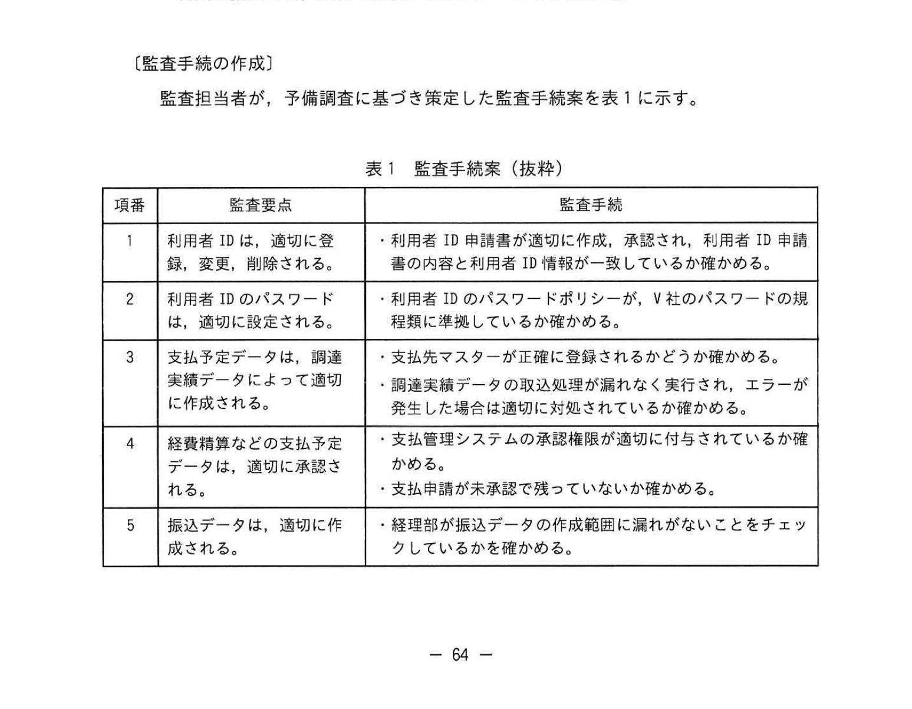

# 2024年春期（令和6年度春期）応用情報技術者試験 午後 問11（選択）
## システム監査：支払管理システムの監査

---

## 問題文

**問11** 支払管理システムの監査に関する次の記述を読んで、設問に答えよ。

V社は大手の製造会社であり、2年前に12年間利用していた自社開発の債務管理システムから業務パッケージを利用した支払管理システムに移行した。そこで、内部監査室は、支払管理システムの運用状況に関するシステム監査を実施することにした。

---

### 〔支払管理システム及び関連システムの概要〕

支払管理システム及び関連システムの概要を図1に示す。

### 図1 支払管理システム及び関連システムの概要

> **システム構成：**
> - 調達管理システム（取引先マスター／調達実績データ）
> - 支払管理システム（支払先マスター／保留ファイル／支払予定データ／振込データ）
>   - 「支払先マスター登録」「支払申請・承認入力」の入力を受ける
> - 会計システム（仕訳データ）
> - 調達管理システム →（調達実績データ）→ 支払管理システム →（支払予定データ）→ 会計システム

**(1)** 支払管理システムは業務パッケージの標準機能を利用し、約1年間で、企画、要件定義、業務パッケージ選定、設計、開発、テスト及びリリースの各段階を経て移行された。V社では、規程類に適合しない機能を採用する場合は、対応策を含めて、リスク委員会の承認を受ける必要がある。

**(2)** 会計システムは業務パッケージである。

**(3)** 調達管理システムは、10年前に構築した自社開発システムであり、各工場製造部の原料及び外注加工に関する見積依頼・発注・入荷・検収を管理している。検収入力で作成される調達実績データは、半月ごとに支払管理システムへ取り込まれる。

**(4)** 4年前に実施された債務管理システムのシステム監査では、規程類に適合した機能が導入され、運用されていると結論付けられ、指摘事項はなかった。

**(5)** 昨年実施された調達管理システムの監査では、取引先別の調達実績データの合計額が支払管理システムの支払予定データの合計額と一致していないことが発見された。これについて、調達管理システムには問題はなく、支払管理システムの運用状況の詳細な調査が必要と結論付けられ、経理部で調査中とのことである。

---

### 〔支払管理システムの運用の概要〕

監査担当者が予備調査で把握した内容は、次のとおりである。

**(1)** 支払管理システムでは、業務パッケージの標準機能である利用者ID情報管理機能及びパスワード管理機能を利用している。承認された利用者ID申請書が情報システム部サポート担当に提出され、利用者ID情報が登録、変更、削除される。利用者ID情報には、利用者ID、利用者名、部署名、各メニューの利用権限などが含まれ、登録・変更・削除履歴は利用者ID更新ログに記録される。業務パッケージのパスワードポリシーの一部には、規程類に適合するようにパスワードポリシーを適用できない箇所があった。

**(2)** 支払管理システムに関連するプロセスは、次のとおりである。

① 経費精算などは、支払管理システムに支払申請入力を行い、承認者が承認入力を行うことで支払予定データが生成される。支払予定データは修正できないので、支払額を減額したい場合は、減額の支払申請を入力する。

② 支払規程によると、支払金額が一定額を超過する場合には、事業本部長の承認及び担当役員の承認が必要になる。支払管理システムには、一つの申請に対し複数の承認者を設定する機能がないので、承認入力後に承認者から必要な上位者に経理部宛のCCを含む電子メールで承認を受ける手続としている。

③ 支払申請入力では、請求書・領収書などの証ひょう類を承認者に回付せず、申請者が入力後に経理部に送付する。経理部は、支払予定データについて一定額超過の承認メールを含む証ひょう類に不備がないかチェックする。経理部は、証ひょう類に不備のある支払予定データについて、未承認の状態に変更することができ、その場合は、申請者に電子メールで通知される。また、各工場管理部は調達管理システムの調達実績データについて、取引先からの請求書とチェックしている。

④ 調達実績データから支払予定データを生成するには支払先マスターに調達連携用の支払先（以下、調達用支払先という）を登録しておく必要がある。調達用支払先は、調達管理システムに関する支払業務以外では利用しない。

⑤ 支払管理システムでは、半月ごとの調達実績データの取込処理によって、支払予定データが生成される。取込処理の実行時にエラーがあった場合は、情報システム部でエラー対応を行う。一方、エラーではないが支払先マスターに調達用支払先が未登録などの場合は、保留ファイルに格納される。経理部は保留ファイルに対し、支払先マスター登録などの対応後に保留ファイルの更新処理を実行する一連の作業を行う。

⑥ 原料・外注加工費は半月ごとに支払が行われるので、調達管理システムでの検収入力が遅れ、次回の取込処理となってしまうと支払遅延となる。そこで、支払遅延とならないように工場製造部の申請に基づき、工場管理部は、当該取引先に対応した調達用支払先を利用して追加の支払申請入力を行う。また、次回の取込処理までに重複防止のための減額の支払申請入力が必要となる。

⑦ 経理部は、作業が完了した支払予定データに対して振込データ作成画面で対象範囲を指定して、銀行に送信する振込データを作成する。

---

### 〔監査手続の作成〕

監査担当者が、予備調査に基づき策定した監査手続案を表1に示す。

### 表1 監査手続案（抜粋）

> | 項番 | 監査要点 | 監査手続 |
> |---|---|---|
> | 1 | 利用者IDは、適切に登録、変更、削除される。 | ・利用者ID申請書が適切に作成、承認され、利用者ID申請書の内容と利用者ID情報が一致しているか確かめる。 |
> | 2 | 利用者IDのパスワードは、適切に設定される。 | ・利用者IDのパスワードポリシーが、V社のパスワードの規程類に準拠しているか確かめる。 |
> | 3 | 支払予定データは、調達実績データによって適切に作成される。 | ・支払先マスターが正確に登録されるかどうか確かめる。 ・調達実績データの取込処理が漏れなく実行され、エラーが発生した場合は適切に対処されているか確かめる。 |
> | 4 | 経費精算などの支払予定データは、適切に承認される。 | ・支払管理システムの承認権限が適切に付与されているか確かめる。 ・支払申請が未承認で残っていないか確かめる。 |
> | 5 | 振込データは、適切に作成される。 | ・経理部が振込データの作成範囲に漏れがないことをチェックしているかを確かめる。 |

内部監査室長は、表1をレビューし、次のとおり監査担当者に指示した。

**(1)** 表1項番2の監査手続は、予備調査の結果を踏まえると不備が発見される可能性が高い。これに対応する追加手続として、`[　a　]` 段階で `[　b　]` が行われていたかどうかについての監査手続を含めるべきである。

**(2)** 表1項番3の監査手続だけでは、監査要点を十分に評価できない。`[　c　]` に対する作業について評価する監査手続を追加すること。

**(3)** 表1項番4の監査手続だけでは、監査要点を十分に評価できない。支払金額が `[　d　]` の支払予定データについては、監査手続を追加すること。

**(4)** 表1項番5について、支払予定データに対して経理部の `[　e　]` が振込データ作成前に完了していることを確かめる監査手続を追加すること。

**(5)** 昨年度のシステム監査での発見事項については、表1の項番 `[　f　]` で確かめている。その他、差異が発生する可能性のある次の二つの事象に関する監査要点及び監査手続を追加すること。

① 調達管理システムと異なる支払申請入力において、間違って `[　g　]` を利用してしまった。

② 支払遅延防止として追加の支払申請入力した後に、`[　h　]` を行わなかった。

---

## 設問

### 設問1

〔監査手続の作成〕の `[　a　]` 〜 `[　d　]` に入れる適切な字句をそれぞれ10字以内で答えよ。

### 設問2

〔監査手続の作成〕の `[　e　]` について、どのような作業を確かめるべきか、適切な字句を20字以内で答えよ。

### 設問3

〔監査手続の作成〕の `[　f　]` に入れる最も適切な監査要点を表1の中から選び、表1の項番で答えよ。

### 設問4

〔監査手続の作成〕の `[　g　]`、`[　h　]` に入れる適切な字句をそれぞれ10字以内で答えよ。

---

## 解答と解説

### 設問1

| 空欄 | 正解 | 解説 |
|---|---|---|
| **a** | 業務パッケージ選定 | 規程類に適合しないパスワードポリシーをもつ業務パッケージを採用したので、業務パッケージ選定段階での確認が問われる |
| **b** | リスク委員会の承認 | V社では規程類に適合しない機能を採用する場合、対応策を含めてリスク委員会の承認を受ける必要がある |
| **c** | 保留ファイル | 項番3では取込処理は確認するが、エラーではなく保留ファイルに格納されたデータへの対応作業（更新処理）が評価対象から漏れている |
| **d** | 一定額を超過する | 支払規程で一定額超過は事業本部長・担当役員の承認（CC付き承認メール）が必要であり、承認権限確認だけでは不十分 |

---

### 設問2

**正解：e=証ひょう類に不備がないかのチェック（16字）**

振込データを作成する前に、経理部が請求書・領収書などの証ひょう類に不備がないかのチェックを完了していることを確かめる作業を追加する。

---

### 設問3

**正解：f=3**

昨年度の発見事項は「調達実績データの合計額と支払予定データの合計額が一致しない」ことであり、これは項番3の監査要点「支払予定データは、調達実績データによって適切に作成される」に該当する。

---

### 設問4

| 空欄 | 正解 | 解説 |
|---|---|---|
| **g** | 調達用支払先 | 調達管理システムと異なる（通常の）支払申請入力で、調達管理専用の調達用支払先を誤って利用してしまう事象 |
| **h** | 減額の支払申請入力 | 支払遅延防止のため追加の支払申請入力を行った後、次回取込処理までに重複防止のための減額の支払申請入力を行わないと二重支払となる |

---

## 参考：主要キーワード

| 用語 | 説明 |
|------|------|
| システム監査 | 情報システムの信頼性・安全性・効率性を独立した立場で評価・検証する活動 |
| 監査要点 | 監査で確認すべき重要な管理ポイント。「何が正しく行われているべきか」を示す |
| 監査手続 | 監査要点を検証するための具体的な作業手順 |
| 保留ファイル | 取込処理でエラーではないが（調達用支払先未登録など）処理を保留したデータを一時保管するファイル |
| 支払予定データ | 承認された支払申請から生成される、支払金額・支払先・日付の情報。修正不可 |
| 業務パッケージ | 汎用的な業務要件に対応した既製のソフトウェア製品 |
| 調達用支払先 | 調達管理システムとの連携専用の支払先。他の支払業務では使用しない |
| 証ひょう類 | 取引の証拠となる書類（請求書・領収書・承認メール等） |
| パスワードポリシー | パスワードの複雑さ・有効期限・変更頻度などのルール |
| リスク委員会 | 規程類に適合しない機能採用などのリスクを審議・承認する組織 |
