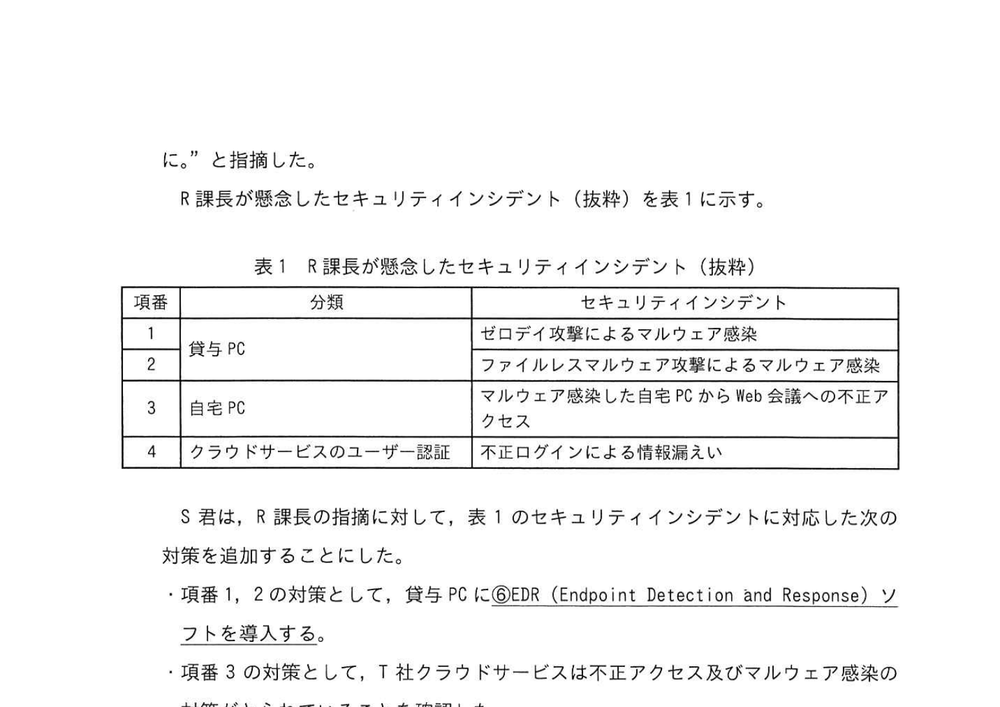

# 2024年春期（令和6年度春期）応用情報技術者試験 午後 問1（必須）
## 情報セキュリティ：リモート環境のセキュリティ対策（ゼロトラスト）

---

## 問題文

**問1** リモート環境のセキュリティ対策に関する次の記述を読んで、設問に答えよ。

Q社は、首都圏で複数の学習塾を経営する会社であり、各学習塾で対面授業を行っている。生徒及び生徒の保護者からはリモートでも受講が可能なハイブリッド型授業の導入要望があり、Q社の従業員からはテレワーク勤務の導入要望がある。

---

### 〔Q社の現状のネットワーク構成〕

Q社のネットワーク構成（抜粋）を図1に示す。

### 図1 Q社のネットワーク構成（抜粋）

> - 学習塾1/2 ← ルータ ← FW ← L2SW ← PC群
> - 本社: ルータ ← FW ← L2SW → プロキシサーバ / メールサーバ / ファイルサーバ
> - FW: ファイアウォール、L2SW: レイヤー2スイッチ

---

### 〔Q社の現状のセキュリティ対策〕

Q社のセキュリティ対策は次のとおりである。
- パケットフィルタリングポリシーに従った通信だけをFWで許可し、その他の通信を遮断している。
- 業務に必要なサイトのURL情報を基に、URLフィルタリングを行うソフトウェアをプロキシサーバに導入して、業務上不要なサイトへの接続を禁止している。
- PC及びサーバ機器には、外部媒体の使用ができない設定にした上で、マルウェア対策ソフトを導入して、マルウェア感染対策を行っている。
- PC、ネットワーク機器及びサーバ機器は、脆弱性に対応する修正プログラム（以下、セキュリティパッチという）を定期的に確認後、適用する方法で、脆弱性対策を行っている。

---

### 〔Q社の現状のセキュリティ対策に関する課題〕

Q社の現状のセキュリティ対策には、次のような課題がある。
- ネットワーク機器及びサーバ機器のEOL（End Of Life）時期が近づいており、機器の更新が必要である。
- セキュリティパッチが提供されているかの調査及び適用していよいかの判断に時間が掛かることがある。
- ルータとFWを利用した①<u>境界型防御</u>によるセキュリティ対策では、防御しきれない攻撃がある。
- セキュリティインシデントの発生を、迅速に検知する仕組みがない。

Q社は、ハイブリッド型授業とテレワークが行えるリモート環境を実現し、Q社の問題に関する課題を解決する新たな環境を、クラウドサービスを利用して構築することになった。情報システム部のR課長が担当することになった。

---

### 〔リモート環境の構築方針〕

R課長は、境界型防御の環境に代えて、いかなる通信も信頼しないという `[　a　]` の考え方に基づくリモート環境を構築することにした。

R課長は、リモート環境について次の構築方針を定めた。
- クラウドサービスへ移行に伴い、ネットワーク機器及びサーバ機器は廃棄し、今後のQ社としての EOLへの対応は不要とする。
- ②課題となっている作業を不要にするために、クラウドサービスは SaaS型を利用する。
- セキュリティインシデントの発生を迅速に検知するための仕組みを導入する。
- 従業員はモバイルルータとセキュリティ対策を実施したノートPC（以下、貸与PCという）を貸与する。今後は、本社、学習塾及びテレワークで全ての業務において、貸与PCとモバイルルータを使ってクラウドサービスを利用する。
- 貸与PCから業務上不要なサイトへの接続禁止とする。
- 生徒は、自宅などのPC（以下、自宅PCという）からクラウドサービスを利用してリモートで授業を受講できる。

---

### 〔リモート環境構築案の検討〕

R課長はリモート環境構築方針をS君に説明し、構築する環境の検討を指示した。

S君はリモート環境構築案を検討した。
- リモート環境の構築には、T社クラウドサービスを利用する。
- 貸与PCからWebサイトを閲覧する際は、③**プロキシを経由する**。
- 貸与PCからインターネットを経由して接続するWeb会議、オンラインストレージ及び電子メール（以下、T-メールという）を利用することで、Q社の業務及びリモートでの授業を行う。
- 貸与PCからT社クラウドサービスへのログインは、ログインを管理するクラウドサービスである IaaS（Identity as a Service）を利用する。従業員はIDとパスワードを用いてシングルサインオンで接続してクラウドサービスを利用する。
- ④**SIEM**（Security Information and Event Management）の導入と、アラート発生時に対応する体制構築を行う。
- 貸与PCには、セキュリティ対策ソフトを導入し、外部媒体が使用できない設定を行う。
- 生徒は、⑤**仮想失敗の情報漏えいリスクを低減するための対策**を採る。

S君はリモート環境構築案（抜粋）を図2に示す。

### 図2 リモート環境構築案（抜粋）

> **T社クラウドサービス：**
> - Web会議 / オンラインストレージ / メール / プロキシ / IaaS / SIEM
> - 従業員PC（貸与PC）/ 生徒（自宅PC）→ インターネット → 各クラウドサービス

---

### 〔構築案への指摘と追加対策の検討〕

S君が検討したリモート環境構築案についてR課長に説明した。すると、セキュリティ対策の不足に起因するセキュリティインシデントの発生を懸念したR課長は、「`[　a　]` では、クラウドサービスにアクセスする通信を信頼せずセキュリティ対策を行う必要があるので、エンドポイントである貸与PCと自宅PCに対する攻撃への対策及びクラウドサービスのユーザー認証を強化する対策が必要である。追加の対策を検討するように」と指摘した。

R課長が懸念したセキュリティインシデント（抜粋）を表1に示す。

### 表1 R課長が懸念したセキュリティインシデント（抜粋）

> | 項番 | 分類 | セキュリティインシデント |
> |---|---|---|
> | 1 | 貸与PC | ゼロデイ攻撃によるマルウェア感染 |
> | 2 | 貸与PC | ファイルレスマルウェア攻撃によるマルウェア感染 |
> | 3 | 自宅PC | マルウェア感染した自宅PCからWeb会議への不正アクセス |
> | 4 | クラウドサービスのユーザー認証 | 不正ログインによる情報漏えい |

S君は、R課長の指摘に対して、表1のセキュリティインシデントに対応した次の対策を追加することにした。
- 項番1、2の対策として、貸与PCに**EDR**（Endpoint Detection and Response）ソフトを導入する。
- 項番3の対策として、T社クラウドサービスは不正アクセス及びマルウェア感染の通信からの接続をブロックする機能をもつため、自宅PCには必要な対策をしない。
- 項番4の対策として、従業員の知識情報であるIDとパスワードによる認証に加えて、所持情報である従業員のスマートフォンにインストールしたアプリケーションソフトウェアに送信されるワンタイムパスワードを組み合わせて認証を行う `[　b　]` を採用する。

S君は、これらの対策を追加したリモート構築案をR課長に報告し、構築案が承認された。

---

## 設問

### 設問1

本文中の下線①について、防御できる攻撃を解答群の中から選び、記号で答えよ。

**解答群：**
- ア システム管理者による内部犯行
- イ パケットフィルタリングポリシーで許可していない通信による、内部ネットワークへの侵入
- ウ 標的型メール攻撃での、添付ファイル開封による未知のマルウェア感染
- エ ルータの脆弱性を利用した、インターネット接続の切断

### 設問2

**(1)** 本文中の `[　a　]` に入れる適切な字句を答えよ。

**(2)** 本文中の下線②について、課題となっている作業の内容を、本文中の字句を用いて35字以内で答えよ。

### 設問3

**(1)** 本文中の下線③について、プロキシを経由することで実現できるセキュリティ対策を二つ答えよ。

**(2)** 本文中の下線④について、SIEMを導入する目的を30字以内で答えよ。

**(3)** 本文中の下線⑤について、生徒の自宅PCで実施すべき対策を解答群の中から選び、記号で答えよ。

### 設問4

**(1)** 本文中の下線について、EDRを導入することで対処可能なセキュリティインシデントを解答群の中から選び、記号で答えよ。

**(2)** 本文中の `[　b　]` に入れる適切な字句を答えよ。

---

## 解答と解説

### 設問1

**正解：イ（パケットフィルタリングポリシーで許可していない通信による内部ネットワークへの侵入）**

境界型防御（FW + パケットフィルタリング）が**防御できる**攻撃は「許可していない通信の侵入」。内部犯行、標的型メール、ゼロデイ等は防御できない。

---

### 設問2

**(1) 正解：a=ゼロトラスト**

「いかなる通信も信頼しない」という考え方は**ゼロトラスト（Zero Trust）**セキュリティモデル。境界型防御の対義語。

**(2) 正解：セキュリティパッチ提供の調査及び適用の判断（22字）**

本文の課題「セキュリティパッチが提供されているかの調査及び適用していいかの判断に時間が掛かる」→ SaaS化でベンダーがパッチ適用するため、この作業が不要になる。

---

### 設問3

**(1) 正解：**
- URLフィルタリング（業務上不要なサイトへのアクセス遮断）
- 業務上不要なサイトへの接続禁止

**(2) 正解：セキュリティインシデントの発生を迅速に検知するため（26字）**

SIEMは各種ログを収集・相関分析してセキュリティインシデントを早期発見するシステム。

**(3) 正解：ア、ウ**

自宅PCの情報漏えいリスク低減対策（選択肢から読み取る）。

---

### 設問4

**(1) 正解：ア（ゼロデイ攻撃等）**

EDR（Endpoint Detection and Response）はエンドポイントの挙動を監視し、マルウェアの動作を検知・対応する。既知のウイルスだけでなく、ファイルレスマルウェア等も検知可能。

**(2) 正解：b=多要素認証（または「2要素認証」）**

IDとパスワード（知識情報）+ スマートフォンのワンタイムパスワード（所持情報）= **多要素認証（MFA: Multi-Factor Authentication）**。

---

## 参考：主要キーワード

| 用語 | 説明 |
|------|------|
| ゼロトラスト | 「いかなる通信も信頼しない」を原則とするセキュリティモデル。境界型防御の限界を補う |
| 境界型防御 | FW等でネットワーク境界を守るモデル。内部は信頼する前提。内部脅威に弱い |
| SaaS（Software as a Service） | クラウドで提供するソフトウェア。ベンダーがパッチ適用・インフラ管理を担う |
| EDR（エンドポイント検知・対応） | PCやサーバの挙動を監視してマルウェアを検知・対応するセキュリティツール |
| SIEM（セキュリティ情報・イベント管理） | ログを一元収集・分析し、インシデントをリアルタイムに検知するシステム |
| IaaS（Identity as a Service） | クラウドでID管理・認証を提供するサービス。シングルサインオン等を実現 |
| 多要素認証（MFA） | 知識情報・所持情報・生体情報の複数要素を組み合わせた認証 |
| URLフィルタリング | アクセス先URLをリストと照合して不要・危険サイトへのアクセスを遮断 |
| ゼロデイ攻撃 | セキュリティパッチが未公開・未適用の脆弱性を狙った攻撃 |
| ファイルレスマルウェア | ファイルを作成せずメモリ上で動作するマルウェア。従来のウイルス対策を回避 |
| EOL（End of Life） | 製品のサポート終了。セキュリティパッチ提供が停止されリスクが高まる |
