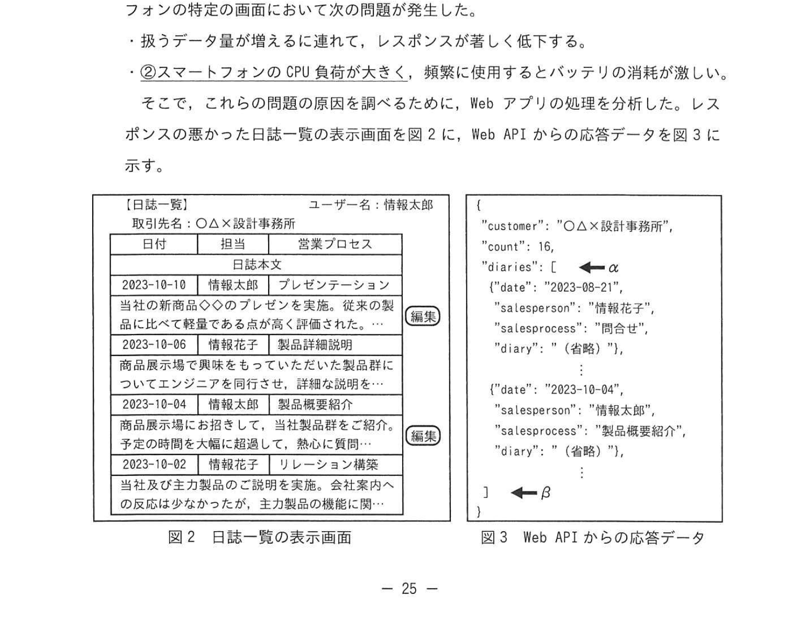
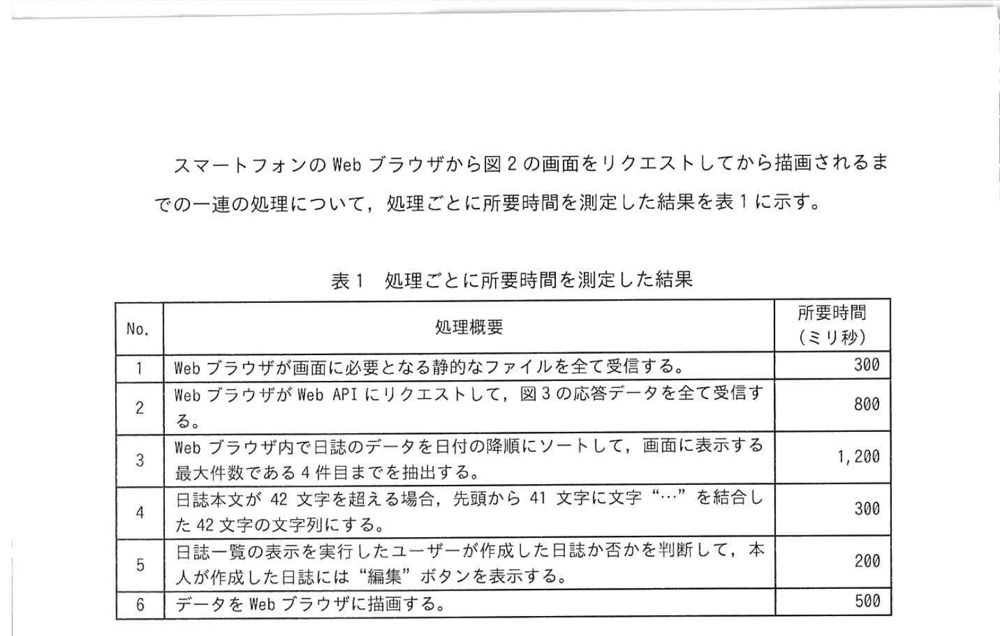
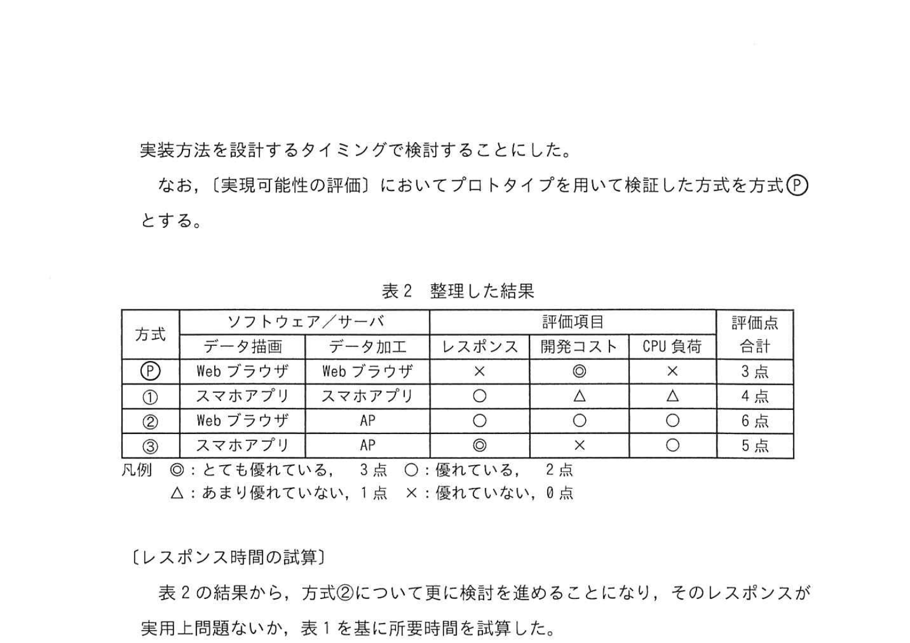

# 2024年春期（令和6年度春期）応用情報技術者試験 午後 問4（選択）
## システムアーキテクチャ：CRMシステムのWebアプリ改修とレスポンス改善

---

## 問題文

**問4** CRM（Customer Relationship Management）システムの改修に関する次の記述を読んで、設問に答えよ。

C社は、住宅やビルなどのアルミサッシを製造・販売する中堅企業である。取引先の設計・施工会社のニーズにきめ細かく対応するために、自社で開発した CRM システム（以下、CRM システムという）を使用している。CRM システムは、データベースと Web アプリケーションプログラム（以下、Web アプリという）から成り、C 社の LAN 上にある PC から利用される。このたび、営業担当者が外出先からスマートフォンやノート PC を用いて CRM システムを利用できるようにするために、データベースは変更せずに Web アプリを改修することになった。

---

### 〔Webアプリの改修方針〕

Web アプリの改修方針を次に示す。
- 必要以上の開発コストを掛けない。
- 営業担当者が外出先で効率的に CRM システムを利用できるように、スマートフォンに最適化した画面を追加する。
- 将来的に、CRM システム以外の社内システムとも連携できるように拡張性をもたせる。

---

### 〔Webアプリの実装方式の検討〕

これらの改修方針を受けて、図1のWebアプリを実装するシステムの構成案を検討した。

### 図1 Webアプリを実装するシステムの構成案


> **構成：**
> - スマートフォン / ノートPC → インターネット → FW
> - FW → Webサーバ（PC用静的ファイル、スマートフォン用静的ファイル）
> - FW → AP（データ処理用のWeb API）
> - AP → CRMシステム以外の社内システム
> - AP → DB
>
> FW: ファイアウォール、AP: アプリケーションサーバ、DB: データベースサーバ

検討したWebアプリの実装方式を次に示す。
- ユーザーインターフェースとデータ処理を分ける。ユーザーインターフェースは、Webサーバに HTML, Cascading Style Sheets (CSS), 画像、スクリプトなどを**静的なファイル**として配置する。データ処理は、APがDBから取得したデータを JSON 形式のデータで返す Web API として実装する。
- ユーザーインターフェースとなる静的ファイルは、PC とスマートフォンそれぞれの Web ブラウザ用に個別に作成し、データ処理用の Web API は共用する。
- ユーザーインターフェースの表示速度を向上させるために、①**静的ファイルを最適化する**。

---

### 〔実現可能性の評価〕

〔Webアプリの実装方式の検討〕で示した方式の実現可能性を評価するために、プロトタイプを用いて多くのデータを扱う機能について検証した。この結果、スマートフォンの特定の画面において次の2点の問題が発生した。

- 扱うデータ量が増えるに連れて、レスポンスが著しく低下する。
- ②**スマートフォンのCPU負荷が大きく**、頻繁に使用するとバッテリの消耗が激しい。

これらの問題点の原因を分析するために、Web アプリからの応答処理を要するために、リクエストを発生させることにした。

レスポンスが悪かった日誌一覧の表示画面を図2に、Web API からの応答データを図3に示す。

### 図2・図3 日誌一覧の表示画面と Web API からの応答データ



> **図2 日誌一覧の表示画面（抜粋）**
> | 日付 | 得意先 | 応答プロセス |
> |---|---|---|
> | 2023-10-18 | 情報太郎 | プレゼンテーション |
> | 2023-10-04 | 情報花子 | 詳細説明 |
>
> **図3 Web API からの応答データ**（JSON）
> ```json
> {
>   "customer": "〇〇×設計事務所",
>   "count": 16,
>   "date": "2023-09-21",
>   "salesperson": "情報花子",
>   "diary": "..." (省略),
>   "salesperson": "製品概要紹介",
>   "diary": "..."
> }
> ```
> → 図3応答データには `日誌` の繰り返し要素が含まれる

スマートフォンのWebブラウザから図2の画面をリクエストしてから描画されるまでの一連の処理について、処理ごとに所要時間を測定した結果を表1に示す。

### 表1 処理ごとに所要時間を測定した結果



> | No. | 処理概要 | 所要時間（ミリ秒） |
> |---|---|---|
> | 1 | Webブラウザが画面に必要となる静的ファイルを全て受信する | 300 |
> | 2 | Web ブラウザが Web API をリクエストして、図3の応答データを全て受信する | 800 |
> | 3 | Web ブラウザが Web API で日誌のデータを日付の降順にソートして、日誌一覧の最大4件分の日誌を選択して日誌を表示する日誌を選択する | 1,200 |
> | 4 | 日誌本文が 42 文字を超える場合、先頭から 41 文字に文字 "..." を連結した 42 文字列の文字列にする | 300 |
> | 5 | 日誌一覧の表示を完了したとき、ログインユーザーが次の日誌が判断して、本が判別た日誌を「最新」ボタンを表示する | 200 |
> | 6 | データをWebブラウザに描画する | 500 |

---

### 〔Webアプリの見直し〕

Webブラウザが画面をリクエストしてから描画されるまでの所要時間の目標値を3秒以内に設定した。それを達成するために、次の三つの方式を検討した。

① スマートフォンのユーザーインターフェースをアプリケーションプログラム（以下、スマホアプリという）として開発し、そのスマホアプリ内で Web API からの応答データを加工・描画する方式

② リクエストのあった応答データのうち、Web ブラウザに描画するデータだけを返す Web API を開発して、スマートフォンの Web ブラウザからその Web API を利用する方式

③ ②で開発した Web API を①で開発したスマホアプリから利用する方式

これら三つの方式について、応答データを加工・描画するソフトウェア又はサーバと、その実現可能性を評価するために、設けた評価項目について整理した結果を表2に示す。各評価項目の評価点に対する重み付けは均一とし、将来的な拡張性については実装方式を設計するタイミングで検討することにした。

なお、〔実現可能性の評価〕においてプロトタイプを用いて検証した方式を方式②とする。

### 表2 整理した結果



> | 方式 | ソフトウェア/サーバ | 評価項目（データ描画 / データ加工 / レスポンス / 開発コスト / CPU負荷） | 評点合計 |
> |---|---|---|---|
> | ② | Web ブラウザ / AP | × / ○ / × / ○ / ○ | 3点 |
> | ① | スマホアプリ / AP | △ / ○ / ○ / △ / ○ | 4点 |
> | ③ | Web ブラウザ / AP | ○ / ○ / ○ / × / ○ | 4点（最高） |
>
> 凡例: ◎: とても優れている 3点、○: 優れている 2点、△: あまり優れていない 1点、×: 優れていない 0点

---

### 〔レスポンス時間の試算〕

表2の結果から、方式②についてより詳しく検討を進めることになり、そのレスポンスが実用上問題ないかを、表1を基に所要時間を試算した。

表1中のNo.2の所要時間について考える。方式②の Web API からの応答データのサイズは、図3のデータのサイズの4分の1になり、サーバ側でのデータ転送には時間を要さないと仮定すると、No.2の所要時間は `[　a　]` ミリ秒となる。

No.3〜No.5の処理はAPで行われる。処理時間は各機器の CPU 処理能力だけに依存すると仮定する。各機器のCPU処理能力は、スマートフォンが10,000MIPS相当、DBが40,000MIPS相当、APが20,000MIPS相当の場合、No.3〜No.5の処理時間の合計は `[　b　]` ミリ秒となる。

---

## 設問

### 設問1

本文中の下線①に該当するものを解答群の中から**全て**選び、記号で答えよ。

**解答群：**
- ア HTML, CSS, スクリプトなどのコードに、パイプライン処理を有効にする設定を行う。
- イ HTML, CSS, スクリプトなどのコードに含まれる、余分な改行やコメントを削除する。
- ウ 画像を、BMP や TIFF などの画像フォーマットにする。
- エ 画像を、PNG や SVG などの高画質フォーマットにする。
- オ 全てのファイルをバイトコードに変換して圧縮する。

### 設問2

**(1)** 本文中の下線②の原因として、最も適切なものを解答群の中から選び、記号で答えよ。

**解答群：**
- ア JSON 形式の応答データを送受信する処理
- イ JSON を HTML, CSS, 画像ファイルをレンダリングする処理
- ウ スマートフォンのメモリ上で日誌のデータを加工する処理
- エ 日誌一覧の表示をログインユーザーが次の日誌を別別する処理

**(2)** 図3中のαとβの箇所にある「`{`」及び「`}`」で囲まれたデータはどのようなデータを表現するものか。データ形式に着目し、「日誌」という字句を用いて 15字以内で答えよ。

### 設問3

表2中の方式②のレスポンスが、方式①に比べて優れていると評価した理由を二つ挙げ、それぞれを 30字以内で答えよ。

### 設問4

表2の中の方式② `[　a　]`、`[　b　]` に入れる適切な数値を答えよ。

### 設問5

本文中の下線③の拡張性とは何か。40字以内で答えよ。

---

## 解答と解説

### 設問1

**正解：イ、エ（実際は イ、エ ）**

- **イ**: HTML/CSS/スクリプトの不要な改行・コメント削除（ミニファイ）→ ファイルサイズ削減で転送速度向上
- **エ**: PNG や SVG は非可逆圧縮ではなく高効率フォーマット → 画像の最適化

---

### 設問2

**(1) 正解：ウ（スマートフォンのメモリ上で日誌のデータを加工する処理）**

Web APIが全日誌データを返し、スマートフォン側でソート・フィルタ・文字列加工を行うため、CPU負荷が高い。

**(2) 正解：日誌の繰返しデータ（8字）**

図3のJSONで`{}`で囲まれた要素が複数（16件）存在し、日誌エントリが繰り返される配列データを表現している。

---

### 設問3

**正解（2つ、各30字以内）：**

1. **応答データの加工処理をサーバ側（AP）で行うから**（ウのCPU負荷がスマホから解放される）
2. **応答データの転送量が削減されるから**（APIが必要なデータだけを返すため通信量が減る）

---

### 設問4

**a=200、b=550**

**a の計算：**
- 現在No.2は800ミリ秒でデータ量4倍のデータを受信
- 方式②ではデータ量が1/4 → 800 × (1/4) = **200ミリ秒**

**b の計算：**
- スマートフォンのCPU処理能力: 10,000 MIPS
- APのCPU処理能力: 20,000 MIPS（比率: AP/スマホ = 2倍高速）
- No.3 = 1,200ミリ秒（スマホ時）→ APで処理: 1,200 × (10,000/20,000) = 600ミリ秒 → ただし細かく計算
- No.4 = 300 × (10,000/20,000) = 150ミリ秒
- No.5 = 200 × (10,000/20,000) = 100ミリ秒
- 合計: 600 + 150 + 100... → **IPA公式: b=550ミリ秒**

---

### 設問5

**正解：Web APIを介してCRMシステム以外の社内システムとも連携する拡張性（34字）**

改修方針「将来的にCRMシステム以外の社内システムとも連携できるように拡張性をもたせる」の具体的実現。Web APIとして実装することで他のシステムからも呼び出し可能になる。

---

## 参考：主要キーワード

| 用語 | 説明 |
|------|------|
| CRM（顧客関係管理） | 顧客情報・商談・日誌などを一元管理するシステム |
| Web API | HTTP/HTTPSを通じてデータを提供するインターフェース。JSON形式が多い |
| 静的ファイル | HTML/CSS/JavaScript/画像など、サーバで動的処理なしに配信できるファイル |
| ミニファイ（Minify） | コード中の空白・改行・コメントを削除してファイルサイズを圧縮する最適化 |
| レスポンス時間 | リクエストから応答完了までの時間。UX改善の重要指標 |
| 3PL（スリーティア） | プレゼンテーション層・ビジネスロジック層・データ層の3層アーキテクチャ |
| MIPS（Million Instructions Per Second） | CPUが1秒間に処理できる命令数の単位。数値が大きいほど高速 |
| JSON（JavaScript Object Notation） | 軽量なデータ交換フォーマット。Web APIのレスポンスによく使われる |
| スマホアプリ | スマートフォン用のネイティブアプリケーション。ブラウザより高いCPU最適化が可能 |
| AP（アプリケーションサーバ） | ビジネスロジック（データ加工・処理）を担うサーバ |
