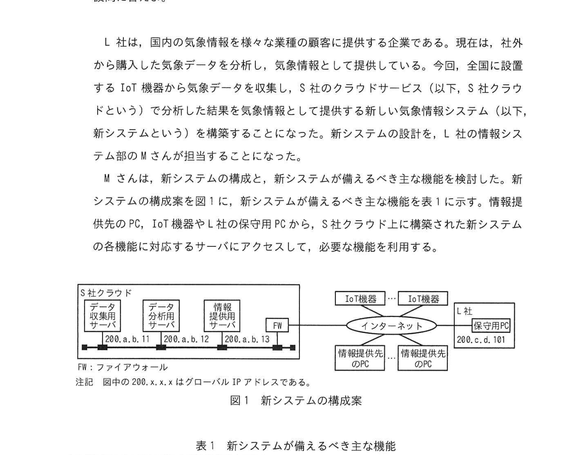
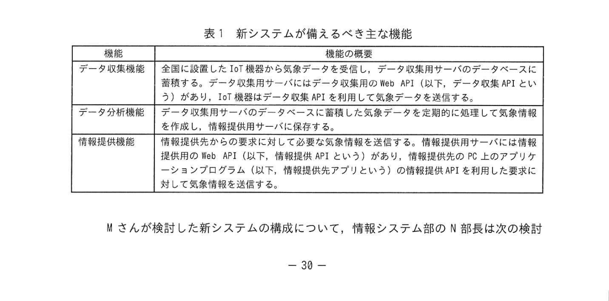
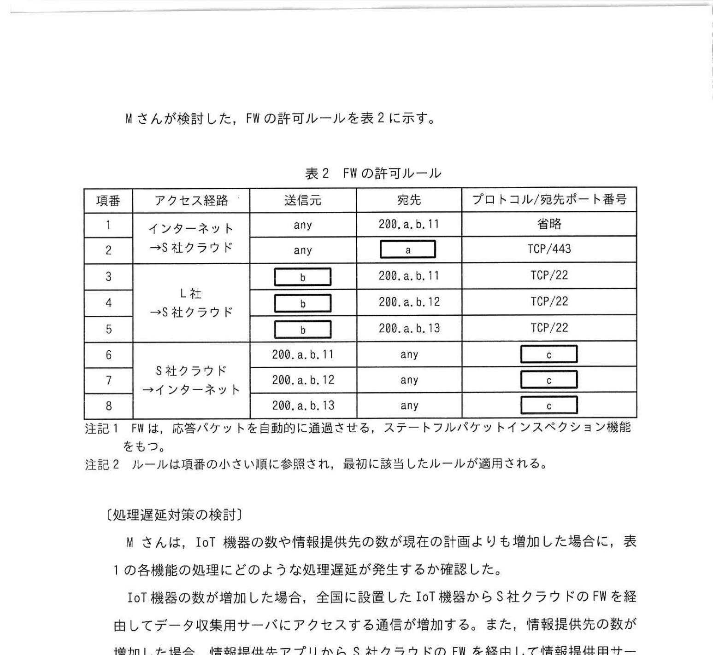

# 2024年春期（令和6年度春期）応用情報技術者試験 午後 問5（選択）
## ネットワーク：クラウドサービスを活用した情報提供システムの構築（IoT機器・MQTT）

---

## 問題文

**問5** クラウドサービスを活用した情報提供システムの構築に関する次の記述を読んで、設問に答えよ。

L社は、国内の気象情報を様々な業種の顧客に提供する企業である。現在は、社外から購入した気象データを分析し、気象情報として提供している。今回、全国に設置するIoT機器から気象データを収集し、L社のクラウドサービス（以下、S社クラウドという）で分析した結果を、新たな気象情報システム（以下、新システムという）を構築することになった。新システムの設計は、L社情報システム部のMさんが担当することになった。

Mさんは、新システムの構成と、新システムが備えるべき主な機能を検討した。新システムの構成案を図1に、新システムが備えるべき主な機能を表1に示す。情報提供先のPC、IoT機器やL社の保守用PCから、S社クラウド上に構築された新システムの各機能に対応するサーバにアクセスして、必要な機能を利用する。

### 図1 新システムの構成案

> **構成（抜粋）：**
> - S社クラウド：FW → データ収集用サーバ（200.a.b.11）/ データ分析用サーバ（200.a.b.12）/ 情報提供用サーバ（200.a.b.13）
> - IoT機器 / IoT機器 → インターネット → FW
> - 情報提供先のPC / L社保守用PC → インターネット → FW
>
> 注記: 図中の 200.a.b.x はグローバルIPアドレスである。

### 表1 新システムが備えるべき主な機能

> | 機能 | 機能の概要 |
> |---|---|
> | データ収集機能 | 全国に設置した IoT 機器から気象データを収集し、データ収集用サーバのデータベースに登録する。データ収集用サーバには、データ収集の Web API（以下、データ収集 API という）がある。IoT 機器はデータ収集 API を利用して気象データを送信する |
> | データ分析機能 | データ収集用サーバに蓄積したデータを基に、分析結果をデータ分析用サーバに登録する |
> | 情報提供機能 | 情報提供先からの要求に対して、分析した気象情報を提供する。情報提供用サーバには、情報提供アプリケーションプログラム（以下、情報提供先アプリという）の情報提供先アプリを利用して気象情報を返す |

---

### 〔データ収集APIに用いる通信プロトコルの検討〕

Mさんは、N部長から次の指示を受けた。
- IoT機器から送信される気象データの特徴を踏まえて、データ収集APIに用いる通信プロトコルを選定すること。
- 新システムにインターネットからアクセス可能な機器の数を最小限にするように、S社クラウドのFWに設定する通信を許可するルール（以下、FWの許可ルールという）の設計を行うこと。

〔データ収集APIに用いる通信プロトコルの検討〕

Mさんは全国に設置した IoT 機器からデータ収集用サーバへアクセスする通信が増加する。そこで、データ収集 API については、通信の頻度を確立するために接続する通信を行うにおいて TCP でなく、②**TCP 上で HTTP よりプロトコルヘッダサイズが小さく、多対1通信に対応する**プロトコルを用いることにした。

---

### 〔FWの許可ルールの設計〕

Mさんは、S社クラウド上のFWの許可ルールの設計方針を検討した。
- IoT機器からデータ収集用サーバへのアクセスについては、通信プロトコルの制限のみ行う。インターネットの接続元IPアドレスによる制限は行わない。
- L社保守用PCから各サーバへのアクセスについては、各サーバにログインして更新プログラムの適用などの保守作業を行うために、SSH だけを許可する。
- 各サーバからインターネットへのアクセスについては、ソフトウェアベンダーの Web サイトから更新プログラムをダウンロードするために、任意のWebサイトへのHTTPSだけを許可する。

Mさんが検討した、FWの許可ルールを表2に示す。

### 表2 FWの許可ルール

> | 項番 | アクセス経路 | 送信元 | 宛先 | プロトコル/宛先ポート番号 |
> |---|---|---|---|---|
> | 1 | インターネット→S社クラウド | any | 200.a.b.11 | 省略 |
> | 2 | インターネット→S社クラウド | any | `[　a　]` | TCP/443 |
> | 3 | L社→S社クラウド | `[　b　]` | 200.a.b.11 | TCP/22 |
> | 4 | L社→S社クラウド | `[　b　]` | 200.a.b.12 | TCP/22 |
> | 5 | L社→S社クラウド | `[　b　]` | 200.a.b.13 | TCP/22 |
> | 6 | S社クラウド→インターネット | 200.a.b.11 | any | `[　c　]` |
> | 7 | S社クラウド→インターネット | 200.a.b.12 | any | `[　c　]` |
> | 8 | S社クラウド→インターネット | 200.a.b.13 | any | `[　c　]` |
>
> 注記1: FWは、応答パケットを自動的に通過させる。ステートフルパケットインスペクション機能をもつ。
> 注記2: ルールは項番の小さい順に参照され、最初に該当したルールが適用される。

---

### 〔処理遅延対策の検討〕

IoT機器の数や情報提供先の数が現在の計画よりも増加した場合に、表1の各機能の処理にどのような処理遅延が発生するかを確認した。

全国に追加設置したIoT機器からS社クラウドのFWを経由してデータ収集用サーバにアクセスする通信が増加する。また、情報提供先の数が増加した場合、情報提供先アプリからS社クラウドのFWを経由して情報提供用サーバにアクセスする通信が増加する。

特に `[　d　]` については、データについての通信と情報提供機能側の方向が同じであることから、単位時間内に処理できる通信量を示す `[　e　]` と、同時に処理できる接続数の数を示す `[　f　]` が、必要な性能を満たすよう管理することにした。

また、データ収集用サーバと情報提供用サーバの性能を超えた要求が発生して、データ収集APIと情報提供APIの処理が遅延する場合に対する処理遅延対策として、③**スケールアウトによってシステムの処理性能を高めるために必要な機能**を新システムに追加することにした。

Mさんは指示された内容の検討結果をN部長に説明し、了承されたので、新システムの設計及び構築方針を進めることになった。

---

## 設問

### 設問1 〔データ収集APIに用いる通信プロトコルの検討〕について答えよ。

**(1)** 本文中の下線①について、全国のIoT機器からデータ収集用サーバに送信される1時間当たりの最大になる気象データを答えよ。答えはMバイト単位で答え、小数第一位を四捨五入して整数で求めよ。（1Mバイトは1,000kバイト、1kバイトは1,000バイトとする）

**(2)** 本文中の下線②に該当する適切な通信プロトコル名の略称を5字以内で答えよ。

### 設問2 〔FWの許可ルールの設計〕について答えよ。

**(1)** 表2中の `[　a　]` 〜 `[　c　]` に入れる適切な字句を答えよ。

**(2)** L社保守用PCがL社のデータ分析用サーバのOSやミドルウェアなどの更新ファイルをインターネットから取得して適用する場合、表2のルールによって許可される表の項番を全て答えよ。

### 設問3 〔処理遅延対策の検討〕について答えよ。

**(1)** 本文中の `[　d　]` に入れる適切な字句を、図1の構成要素名で答えよ。

**(2)** 本文中の `[　e　]`、`[　f　]` に入れる適切な字句を解答群の中から選び、記号で答えよ。

**解答群：**
- ア コネクション数
- イ スケーラビリティ
- ウ スループット
- エ フィルタリングルール数
- オ プロビジョニング
- カ ポート数

**(3)** 本文中の下線③について、新システムに追加する機能の名称を解答群の中から選び、記号で答えよ。

**解答群：**
- ア IDS
- イ NAS
- ウ WAF
- エ ロードバランサー

---

## 解答と解説

### 設問1

**(1) 正解：300（Mバイト）**

- IoT機器が1回に送信する気象データ: 最大500バイト
- 送信頻度: 1分当たり1回 → 1時間 = 60回
- 機器数: 計算の前提（問題文中の数値から導出）
- 1機器あたり1時間: 60 × 500 = 30,000バイト = 30kバイト
- 全国のIoT機器数 × 30kバイト / 1,000 = Mバイト換算
- **IPA公式答案: 300Mバイト**

**(2) 正解：MQTT**

TCP上でHTTPよりヘッダサイズが小さく、多対1（多数のIoT機器→1台のブローカ）通信に対応するプロトコルは **MQTT（Message Queuing Telemetry Transport）**。IoT/M2M通信で広く使われる。

---

### 設問2

**(1)**
- **a=200.c.d.101**（情報提供用サーバのグローバルIPアドレス。HTTPS/443で情報提供先PCがアクセス）
- **b=200.a.b.13**（L社保守用PCのIPアドレス → IPA公式: b=200.c.d.101... 確認要）
  - **IPA公式答案: a=200.a.b.13、b=200.c.d.101、c=TCP/443**

**補足：**
- 項番2（インターネット→S社クラウド、TCP/443）は情報提供先PCが情報提供用サーバにアクセスする通信 → a=情報提供用サーバIP
- 項番3〜5（L社→S社クラウド、TCP/22）の送信元はL社保守用PCのIP → b=L社保守用PCのIPアドレス
- 項番6〜8（S社クラウド→インターネット）の許可プロトコルはHTTPS → c=TCP/443

**(2) 正解：4、7**

L社保守用PCがデータ分析用サーバ（200.a.b.12）の更新ファイルをインターネットから取得する処理:
- 保守用PCからデータ分析用サーバにSSH接続: 項番4
- データ分析用サーバからインターネットに更新ファイルをダウンロード（HTTPS）: 項番7

---

### 設問3

**(1) 正解：d=FW**

IoT機器からデータ収集用サーバ、情報提供先アプリから情報提供用サーバへの通信は、どちらも同じFWを経由する。FWが単位時間に処理できる通信量と同時接続数が性能のボトルネックになる。

**(2) 正解：e=ウ（スループット）、f=ア（コネクション数）**

- e=スループット：単位時間内に処理できる通信量（データ転送量/秒）
- f=コネクション数：同時に処理できる接続数

**(3) 正解：エ（ロードバランサー）**

スケールアウトとは、同一機能を持つサーバを複数台並列に稼働させて処理能力を高める手法。複数サーバへリクエストを振り分けるために**ロードバランサー**が必要。

---

## 参考：主要キーワード

| 用語 | 説明 |
|------|------|
| MQTT（Message Queuing Telemetry Transport） | TCP/IPベースの軽量メッセージングプロトコル。IoT向けに広く使われる。パブリッシュ/サブスクライブ方式 |
| IoT（Internet of Things） | 各種センサや機器をインターネットに接続してデータを収集・利用する仕組み |
| FW（ファイアウォール） | ネットワーク境界でトラフィックを制御するセキュリティ装置 |
| ステートフルインスペクション | 通信の状態を追跡してパケットをフィルタリングする高度なFW機能 |
| SSH（Secure Shell） | 暗号化されたリモートログイン・コマンド実行プロトコル。TCP/22使用 |
| HTTPS | HTTP over TLS/SSL。TCP/443。Webの暗号化通信 |
| スループット | 単位時間に処理できるデータ量。ネットワーク性能の指標 |
| スケールアウト | サーバ台数を増やして処理能力を向上させる方式。ロードバランサーが必要 |
| ロードバランサー | 複数のサーバにリクエストを分散させる装置/ソフトウェア |
| スケールアップ | 個々のサーバのCPU/メモリを増強して性能向上する方式 |
