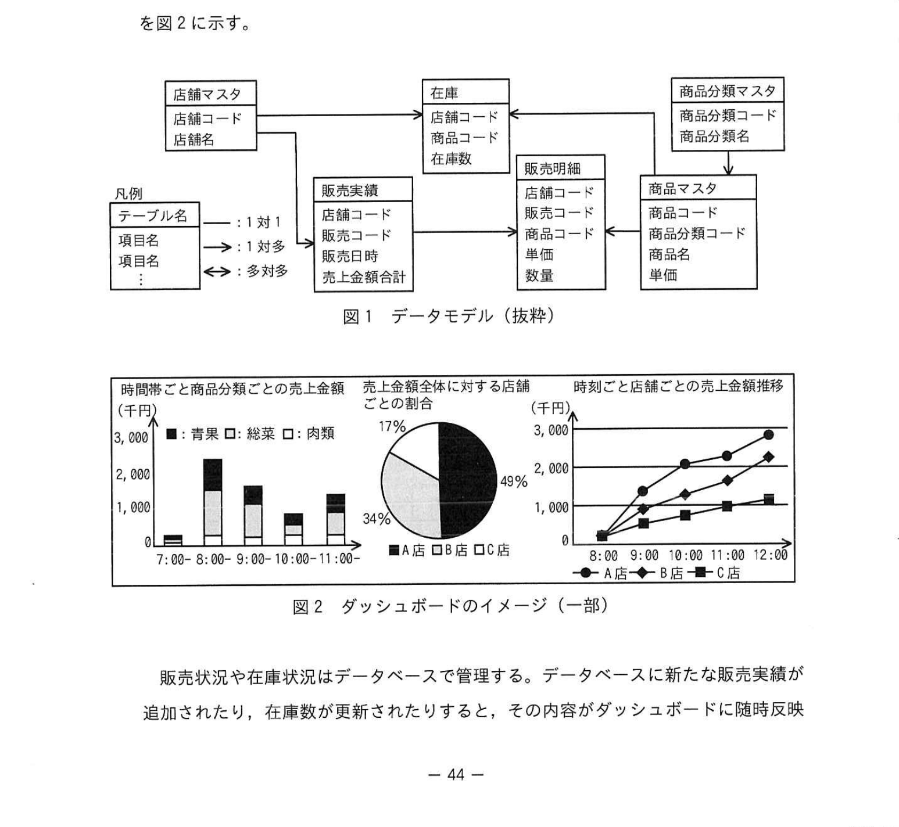
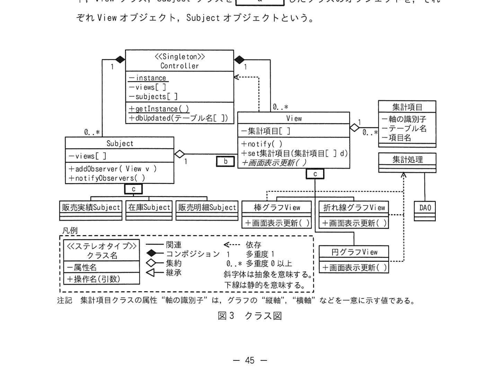
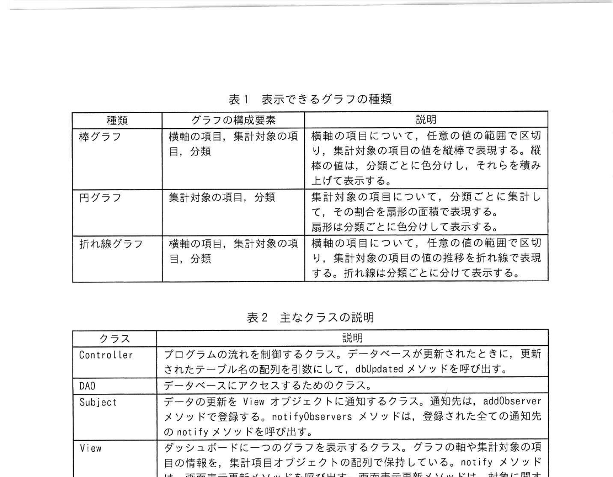

# 2024年春期（令和6年度春期）応用情報技術者試験 午後 問8（選択）
## 情報システム開発：販売情報リアルタイム可視化ダッシュボードの設計（Observerパターン）

---

## 問題文

**問8** ダッシュボードの設計に関する次の記述を読んで、設問に答えよ。

Y社は、商品などを販売する店舗を経営する企業である。複数ある店舗では、商品の販売状況や在庫状況に合わせて、割引率を設定したり、店鋪間で在庫の移動を行ったりしている。販売に関する情報は販売管理システムで管理しているが、状況をリアルタイムで監視することが不可欠であった。そこで、販売状況をリアルタイムで監視できるシステム（以下、ダッシュボードという）を開発することにした。

Y社では、商品ごとに商品分類を設定し、売上金額や販売数の集計に利用している。Y社が扱う情報のデータモデル（抜粋）を図1に、ダッシュボードのイメージ（一部）を図2に示す。

### 図1 データモデル（抜粋）

> **テーブル構成（抜粋）：**
> - 店舗マスタ（店舗コード, 店舗名）
> - 在庫（店舗コード, 商品コード, 在庫数）
> - 販売明細（店舗コード, 商品コード, 販売数量）
> - 商品分類マスタ（商品分類コード, 商品分類名）
> - 商品マスタ（商品コード, 商品名, 商品分類コード）

Y社は設計にZ社を参照し、Z社はその設計に取り掛かった。

---

### 〔ダッシュボードのクラスの設計〕

Z社は、ダッシュボードのクラス設計を行った。設計したクラス図を図3に、表示できるグラフの種類を表1に、主なクラスの説明を表2に示す。Controller クラスは、システム全体の挙動を制御するクラスである。View クラスは画面にグラフを表示する機能をもつクラスである。グラフには複数の種類があるので、その種類ごとに View クラスを `[　a　]` したクラスを作成する。Subject クラスは、データベースが変更されたことを View クラスのオブジェクトに通知するクラスである。図1のデータモデルのテーブルのうち、ダッシュボードで監視したいテーブルのそれぞれについて、Subject クラスを `[　a　]` したクラスを作成する。以下、View クラス・Subject クラスを `[　a　]` したクラスのオブジェクトを、それぞれView オブジェクト、Subject オブジェクトという。

### 図3 クラス図

> **クラス構成：**
>
> **Controller（Singleton）**
> - -instance
> - -view[]
> - -subjects[]
> - +getInstance(名[]): Controller
> - +dbUpdated(テーブル名)
>
> **Subject**
> - -views[]
> - +addObserver(v: View)
> - +notifyObservers()
>
> **View（抽象）**
> - +notify()
> - +画面表示更新()
>
> **←継承関係（汎化）:**
> - 販売実績Subject、販売明細Subject（Subjectを継承）
> - 棒グラフView、折れ線グラフView、円グラフView（Viewを継承）
>
> **集計項目 / 集計処理（関連クラス）**
> - 集計項目: 集計目的（集計項目[集計項目], d）
> - 集計処理: 各グラフに対応した集計を行う
>
> 凡例: 《ステレオタイプ》、実線（関連）、点線（依存）

### 表1 表示できるグラフの種類

> | 種類 | グラフの構成要素 | 説明 |
> |---|---|---|
> | 棒グラフ | 横軸の項目、集計対象の項目、目 | 横軸の項目について、任意の集計の範囲で区切り、集計対象の項目をその範囲ごとに積み上げて表示する |
> | 円グラフ | 集計対象の項目、分類 | 集計対象の項目について、分類ごとに集計して、その割合を形態の変換に割合として表示する |
> | 折れ線グラフ | 横軸の項目、集計対象の項目、分類 | 集計対象の項目を、任意の集計の範囲で区切り、分類ごとに区切った集計を折れ線グラフで表現する |

### 表2 主なクラスの説明

> | クラス | 説明 |
> |---|---|
> | Controller | プログラムの流れを制御するクラス。データベースが更新されたとき、更新されたテーブルの名列を引数にして、dbUpdatedメソッドを呼び出す |
> | DAO | データベースにアクセスするクラス。addObserverメソッドでViewオブジェクトを登録し、notifyObserversメソッドでViewオブジェクトに変更の通知を行う |
> | Subject | データの変更をViewオブジェクトに通知するためのクラス。addObserverメソッドでViewオブジェクトを登録し、notifyObserversメソッドで登録された全てのViewオブジェクトのnotifyメソッドを呼び出す |
> | View | ダッシュボードに一つのグラフを表示するクラス。グラフの軸や集計対象の項目のコンフィギュレーションを保持する。notifyメソッドは、DAOクラスを使用して画面表示更新メソッドを呼び出し、画面の表示更新を行う |
> | 集計処理 | グラフを表示するのに必要な、各種の集計計算を実装するクラス |

---

### 〔グラフの新規表示〕

例えば、「時間帯ごと商品分類ごとの売上金額」を棒グラフで新たに画面上に表示する場合を考える。棒グラフ View クラスのオブジェクトを作成する。次に、①**提供する Subject オブジェクト**の addObserver メソッドを呼ぶために、画面の初期表示のために、画面表示更新メソッドを呼び出す。

---

### 〔グラフの表示内容の更新〕

店舗へ商品が販売される度に、販売管理システムが、データベースにレコードを追加する。そのとき、ダッシュボードの Controller クラスに連絡が行われている。Controller クラスは、dbUpdated メソッドが呼び出されると、更新されたテーブルに対応する Subject オブジェクトの notifyObservers メソッドを呼び出す。notifyObservers メソッドは、画面内に格納されている全ての View オブジェクトの notify メソッドを呼び出す。notify メソッドは、画面表示更新メソッドを呼び出す手段として `[　d　]` メソッドなどで、例えば「時間帯ごと商品分類ごとの売上金額」の場合は `[　e　]` クラスに実装されたメソッドを呼び出す。

---

### 〔データのフィルタリング〕

Y社から追加の要求で、集計結果をフィルタリングする機能を追加することになった。例えば、「時間帯ごと商品分類ごとの売上金額」のグラフ上で、特定の商品分類の棒を表示箇所用でマウスでクリックしたとき、表示されていた全ての商品分類の中から、指定した商品分類で絞り込んだ結果を表示したい。そこで、絞込条件を取り扱うクラスを追加し、次の改修を加えることとした。

- 絞込条件クラスは、属性として絞り込む項目名、絞込条件の値などをもつ。
- Controller クラスの属性に絞込条件のオブジェクトを追加し、その属性に条件を設定するために setFilter メソッドを追加する。
- View オブジェクトが絞込条件の表示を更新を参照するために、Subject クラスの notifyObservers メソッドと View クラスのそれぞれについて、呼び出し側の②**仕様変更**を行う。
- 集計処理クラスの処理環境で絞込条件を考慮した集計して、画面を更新する。

---

### 〔過負荷の回避〕

設計レビューを実施したところ、次の点が指摘された。
- 販売管理システムが、データベースに販売実績のレコードを連続して追加すると、ダッシュボードが過負荷になるおそれがある。
- 一つのViewオブジェクトは `[　f　]`、1回の販売実績登録で、表示の更新が複数回発生してしまう。
- View クラスの属性に「更新フラグ」を追加する機能を導入し、notify メソッドでは画面表示更新メソッドを呼び出すのではなく、「更新フラグ」を立てるようにした。また、「更新フラグ」を立てた後に別の画面に更新メソッドを呼び出す仕組みを用意し、「更新フラグ」が立っている場合だけ画面の更新処理を実行してから「更新フラグ」を降ろすようにした。

---

## 設問

### 設問1

本文中の `[　a　]` に入れる適切な字句を答えよ。

### 設問2

図3中の `[　b　]`、`[　c　]` に入れる適切なクラス間の関係又は多重度を答えよ。なお、表記は図3の凡例に従うこと。

### 設問3

本文中の下線①に関係するSubjectオブジェクトのクラス名を図3中から全て選び答えよ。

### 設問4

本文中の `[　d　]`、`[　e　]` に入れる適切な字句を答えよ。

### 設問5

本文中の下線②について、仕様変更の内容を30字以内で答えよ。

### 設問6

本文中の `[　f　]` に入れる適切な字句を、30字以内で答えよ。

---

## 解答と解説

### 設問1

**正解：a=継承**

View クラスや Subject クラスをそれぞれ「継承」したサブクラスを作成する（棒グラフView、円グラフView等）。これはGoFデザインパターンのObserverパターンの典型的な実装。

---

### 設問2

- **b=0..\***（SubjectクラスからViewクラスへの多重度。1つのSubjectに0個以上のViewが登録される）
- **c=↑（汎化の矢印）**（View→抽象クラスViewへの継承関係を示す）

---

### 設問3

**正解：販売実績Subject、販売明細Subject**

「時間帯ごと商品分類ごとの売上金額」は販売実績テーブルと販売明細テーブルを参照する棒グラフ。このグラフの View オブジェクトを登録する Subject は**販売実績Subject**と**販売明細Subject**。

---

### 設問4

- **d=抽象**（Viewクラスはabstractメソッドとしてのnotifyメソッドをもつ抽象クラス）
- **e=棒グラフView**（「時間帯ごと商品分類ごとの売上金額」を表示する棒グラフViewクラス）

---

### 設問5

**正解：引数に絞込条件クラスのオブジェクトを追加する（22字）**

notifyObserversメソッド（SubjectクラスからViewクラスへの通知）と画面表示更新メソッド（ViewクラスのnotifyからDAOへ）に、絞込条件オブジェクトを引数として渡せるよう変更する。

---

### 設問6

**正解：f=複数のSubjectオブジェクトに登録される（19字）**

1つの View オブジェクトが複数の Subject（販売実績Subject、販売明細Subject 等）に登録されているため、各Subjectから個別にnotifyが呼ばれ、同一の販売レコード追加で複数回 View の更新が発生する。

---

## 参考：主要キーワード

| 用語 | 説明 |
|------|------|
| Observerパターン | GoFデザインパターンの一つ。Subject（被観察者）の状態変化をObserver（View）に自動通知する設計パターン |
| Subject（被観察者） | データの変化を監視対象として、変化があると登録済みのObserverに通知するクラス |
| Observer（観察者） | Subjectからの通知を受けて自身の状態（画面表示等）を更新するクラス |
| notifyObservers | 登録された全Observer（View）に変更を通知するSubjectのメソッド |
| addObserver | ObserverをSubjectに登録するメソッド |
| 継承 | 親クラス（スーパークラス）の特性を子クラス（サブクラス）が引き継ぐオブジェクト指向の機能 |
| 抽象クラス | インスタンス化できないクラス。サブクラスがオーバーライドすべきメソッドを定義する |
| Singletonパターン | クラスのインスタンスが1つだけ生成されることを保証するデザインパターン |
| DAO（Data Access Object） | データベースへのアクセスを担当する専用クラス。SQLをカプセル化する |
| 多重度 | UMLクラス図で、クラス間の関係において何個のオブジェクトが対応するかを示す表記（0..*等） |
