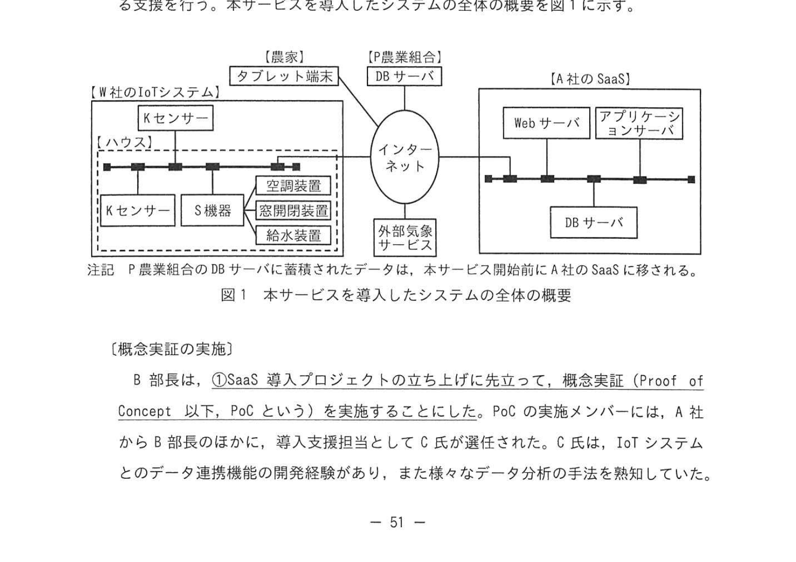

# 2024年春期（令和6年度春期）応用情報技術者試験 午後 問9（選択）
## プロジェクトマネジメント：SaaS活用IoT農業DXプロジェクト（PoC・スコープクリープ対策）

---

## 問題文

**問9** IoT活用プロジェクトのマネジメントに関する次の記述を読んで、設問に答えよ。

P農業組合が管轄する地域では、いちご栽培が盛んであり、いちごは繁殖率が高く、栽培技術の向上と天候不順への対応が必要である。P農業組合員のいちご栽培農家は、温度調節や給水などの栽培管理を長年の経験と勘に頼っていたため、一部の農家を除いた生産性向上に資するような状態であった。そこで、数年前に生産性向上を目指して#社のIoTシステムを導入した。IoTシステムの主な機能は、次のとおりである。

- 栽培ハウス（以下、ハウスという）内の環境計測用センサー（以下、Kセンサーという）、温度調節や給水などを行う装置、装置に無線接続する動作指示を行う制御機器（以下、S機器という）を設置する。
- Kセンサーは、温度、湿度などの環境データを取得してS機器に送信する。
- S機器は、受信した環境データと、S機器の動作指示を制御するパラメータ（以下、制御パラメータという）を基に、装置の温度調節や給水などの動作指示を行う。
- 農家は、その日の天候及びP農業組合内に設置されたDBサーバ上のDB（以下、DBという）に格納された過去の環境データを参考にして、タブレット端末を使って制御パラメータを変更できる。

---

### 〔SaaSを活用したIoTの効果向上〕

IoTシステムの導入によって、ハウス内の温度や湿度などをコントロールできるようになった。しかし、大半の農家では、過去の環境データを分析して制御パラメータを適切に設定する経験がなかったため、期待したほどの効果は上がっていなかった。そこで、P農業組合のQ組合長はA社に支援を依頼した。A社は、ICTを活用した農業分野での生産性向上に資するサービスをSaaSとして提供する企業である。A社のB部長は、導入したIoTシステムの効果を向上させるために、A社のSaaSを活用して制御パラメータを自動的に変更するサービス（以下、本サービスという）の導入を提案しようと考えた。

A社のSaaSは、実装済みのAIのデータ分析系を最適化するための分析パラメータ（以下、分析パラメータという）を参照し、過去と現在の環境データ、及び外部気象サービスが提供する予報データを統合して分析する。本サービスでは、この分析結果から最適な制御パラメータを算出してS機器に送信し、制御機器の各装置を変更する。

### 図1 本サービスを導入したシステムの全体の概要

> **システム構成（抜粋）：**
> - 農家ハウス: Kセンサー / S機器 / 空調設備 / 給排水設備
> - P農業組合: タブレット端末 / DBサーバ
> - A社のSaaS: Webサーバ / アプリサーバ / DBサーバ
> - インターネット経由で接続
>
> 注記: P農業組合のDBサーバに蓄積したデータは、本サービス開始前にA社のSaaSに移される。

---

### 〔概念実証の実施〕

B部長は、①**SaaS導入プロジェクトの立ち上げに先立って、概念実証（Proof of Concept：以下、PoCという）を実施する**こととした。PoCの実施メンバーには、A社からB部長のほかに、導入支援担当としてC氏が評価された。C氏は、IoTシステムとのデータ連携機能の開発経験があり、また様々なデータ分析の手法を熟知していた。

P農業組合からはR氏が選任された。また、P農業組合は、いちご栽培の熟練者であるR氏が選任された。また、P農業組合は、A社及びP農業組合自身のいちご製品との独立性を問うことから、A社及び製品のセキュリティ上の秘密事項について情報を公開すること、及び3社間で `[　a　]` を締結した。

PoCでA社のSaaSに導入された農家で実際に栽培している環境の一部（以下、PoC環境という）を設けて評価することにした。B部長が要求した農家で実際に栽培している環境を参考としたことで、A社とのSaaSの連携とデータ連携機能の開発及び分析パラメータの種別の選定と値の設定はC氏がリーダーになった。C氏は分析パラメータの種別の選定の妥当性の検証には、農家が実際に行っている制御パラメータの変更内容を示すデータが必要になることを指摘した。

PoCは計画通りに実施された。C氏のA社のSaaSとA社Sとのデータ連携は確認された。一方でR氏から、K センサーの種類を増やして、形状、色づきなど多様なデータ収集も行いたいという要望があった。C氏は、K センサーの種類の増加は、K センサーを増やすとデータ連携機能の開発規模が増えることを指摘した。

B部長は、PoCによって検証されたサービスの実現性の検証結果に加え、導入コスト、導入スケジュールなどを提議書にまとめた。A社内での承認を受けた後、B部長はQ組合長にPoC結果を報告してP農業組合の承認を経て、**準委任契約**を締結してSaaS導入プロジェクトが立ち上げられた。

---

### 〔SaaS導入プロジェクトの計画〕

SaaS導入プロジェクトには、PoCの実施メンバーに引き続き参加してもらい、A社からの業務委託で#社も参加することになった。現在のIoTシステムに追加するKセンサーの種類の選定はB部長が行うことになり、P農業組合の農家側での種類の選定と値の設定はC氏がリーダーとし、P農業組合の背景から農家やお客様の経験がある2名が利用者からあるいはご栽培農家の視点で参加することになった。Q組合長は、この2名を②**R氏とC氏と協議しながら分析パラメータの値を設定**するように指示した。

B部長は、プロジェクトメンバーとともにプロジェクト計画の作成に着手し、プロジェクトのスコープを検討した。SaaS導入プロジェクトには、二つの作業スコープがある。一つは、Kセンサーの種類の追加という#社側の作業スコープである。もう一つは、K センサーの種類の追加に対応したデータ連携機能の開発及び分析パラメータの種別の選定と値の設定というA社側の作業スコープである。この二つの作業スコープは密接に関連しており、#社側の作業スコープはA社側の作業スコープに影響する。

B部長は、まずPoCの実施結果を基に、PoC環境の規模から実際に栽培している環境に拡張することを始当スコープとし、開発したサービスを全プロジェクトメンバー全員で検証し、追加の開発項目を決めてアプローチを変更する開発アプローチを用いることにした。

B部長はこの開発アプローチを下の③**スコープクリープが発生するリスクに対処**するために採用した。そこで、スコープクリープが発生するリスクへの対応として、`[　b　]` 及び `[　c　]` のベースラインを次のスコープ管理のプロセスを設定した。

1. 追加候補の開発項目を、スコープとして追加する価値があるかどうかをプロジェクトメンバー全員で確認し、追加の可否を判断する。
2. 追加候補の開発項目を追加したスコープをベースラインに切り戻しは追加する。
3. スコープ内の他の開発項目の優先順位を下げる場合は、優先順位を下げた開発項目をスコープから外し、追加候補の開発項目をスコープに含める。
4. 他の開発項目の優先順位を下げられない場合は、スコープが拡大してしまうので `[　b　]` 及び `[　c　]` のベースラインの変更をプロジェクトオーナーに報告し、変更可否を判断してもらう。

B部長は、本サービスはIoT機器、Kセンサー、装置、S機器、及びA社のSaaSで実現するものであるため、テスト項目数がとても多く、効率よくテストを実施するために必要と考えた。PoCの実施環境と実施状況、及びPoC実施結果を踏まえ、次のとおり着目する点をテストのために確認することにした。

（i）利用状況を想定して、IoT機器の接続やデータ連携に着目したテスト
（ii）同一ハウス内で動作する複数の装置の複数設置の組合せの動作に着目したテスト
（iii）利用場所、気候条件に着目したテスト
（iv）システムやデータの確実性、完全性、可用性に着目したテスト

本サービスをP農業組合へ導入したことをもってプロジェクトが完了するが、農家はいちごの収穫を続ける間に本サービスの導入効果を評価する。④**B部長は、プロジェクトの完了時点では、プロジェクトの目的の実現に対する真の評価はできないと考えた**。そこでB部長は、A社とP農業組合とで、これについて合意することにした。

---

## 設問

### 設問1 〔概念実証の実施〕について答えよ。

**(1)** 本文中の下線①について、B部長がSaaS導入プロジェクトの立ち上げに先立ってPoCを実施する理由は何か。25字以内で答えよ。

**(2)** 本文中の `[　a　]` に入れる適切な字句を答えよ。

### 設問2 〔SaaS導入プロジェクトの計画〕について答えよ。

**(1)** 本文中の下線②について、Q組合長は、農家が何をできるようになる支援を求めて、この指示を行ったのか。25字以内で答えよ。

**(2)** 本文中の下線③に示したスコープクリープを発生させる要因は何か。35字以内で答えよ。

**(3)** 本文中の `[　b　]`、`[　c　]` に入れる適切な字句を、それぞれ答えよ。

**(4)** 本文中の（ⅰ）〜（ⅳ）のテストで着目する点に1対1で対応する検証内容として、（ⅰ）のテストで着目する点に対応する検証内容として適切なものを、解答群の中から選び、記号で答えよ。

**解答群：**
- ア 屋内外、温度寒冷など様々な環境下での動作の検証
- イ 最大台数のIoT機器及び装置をつなげた状態での動作の検証
- ウ 同一ハウス内の無線を使った同一タイミングでの複数設置の動作の検証
- エ 無関係の外部者がシステムにアクセスできないことの検証

**(5)** 本文中の下線④について、B部長が真の評価はできないと考えた理由は何か。38字以内で答えよ。

---

## 解答と解説

### 設問1

**(1) 正解：本サービスの実現に不確かな要素が多いから（22字）**

SaaSとIoTシステムの連携、分析パラメータの精度など、実現可能性が未確認の要素が多い。PoCで技術的・業務的な実現可能性を先に確認することで、本プロジェクトのリスクを低減する。

**(2) 正解：a=守秘契約（NDA：Non-Disclosure Agreement）**

P農業組合の独立性への配慮と、A社の技術情報・製品情報の保護のため、3社間で守秘契約（NDA）を締結した。

---

### 設問2

**(1) 正解：農家がガイド機能を活用できるようになる支援（22字）**

Q組合長がR氏とC氏に分析パラメータ値設定を指示したのは、農家が本サービスのAIガイド機能を自ら活用できるようになる支援のため。

**(2) 正解（2つの要因）：**
- **Kセンサーの種類を増やすとデータ連携機能の開発規模が増えること**
- **W社（#社）側の作業スコープの変更はA社側の作業スコープに影響すること**

**(3)**
- **b=コスト**
- **c=スケジュール**（順不同）

スコープクリープが発生するとコストとスケジュールのベースラインが変化するため、この2つを管理する。

**(4) 正解：イ（最大台数のIoT機器及び装置をつなげた状態での動作の検証）**

（ⅰ）は「IoT機器の接続やデータ連携に着目したテスト」。最大台数の機器を接続した状態での動作検証がこれに対応する。

**(5) 正解：いちごを収穫するまで導入効果を評価できないから（25字）**

本サービスの真の評価指標は収穫量・品質の向上であり、いちごが収穫されるまで（栽培サイクルが完了するまで）は効果を測定できない。プロジェクト完了時点では栽培の結果が出ていないため。

---

## 参考：主要キーワード

| 用語 | 説明 |
|------|------|
| PoC（Proof of Concept：概念実証） | 新技術・新サービスの実現可能性を小規模に検証するプロセス |
| スコープクリープ | プロジェクト実行中に承認なしでスコープが徐々に拡大していく現象 |
| スコープ管理 | プロジェクトに含める作業範囲を定義・管理・コントロールするプロセス |
| ベースライン | 変更管理の基準となるスコープ・スケジュール・コストの承認済み計画 |
| 守秘契約（NDA） | 開示する秘密情報を第三者に漏らさないことを約束する契約 |
| 準委任契約 | 作業の遂行を委託する契約（成果物の完成責任なし、仕事への委任） |
| SaaS（Software as a Service） | ソフトウェアをクラウドで提供するサービス形態 |
| 制御パラメータ | 農業IoTで温度調節・給水装置の動作を指示する設定値 |
| 分析パラメータ | AIがデータを分析する際の設定値や重み付けなどの係数 |
| 農業DX | デジタル技術を活用して農業の生産性・品質を向上させる取り組み |
