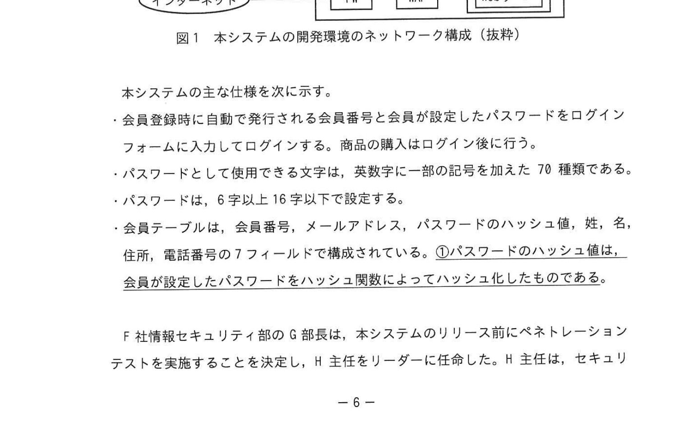
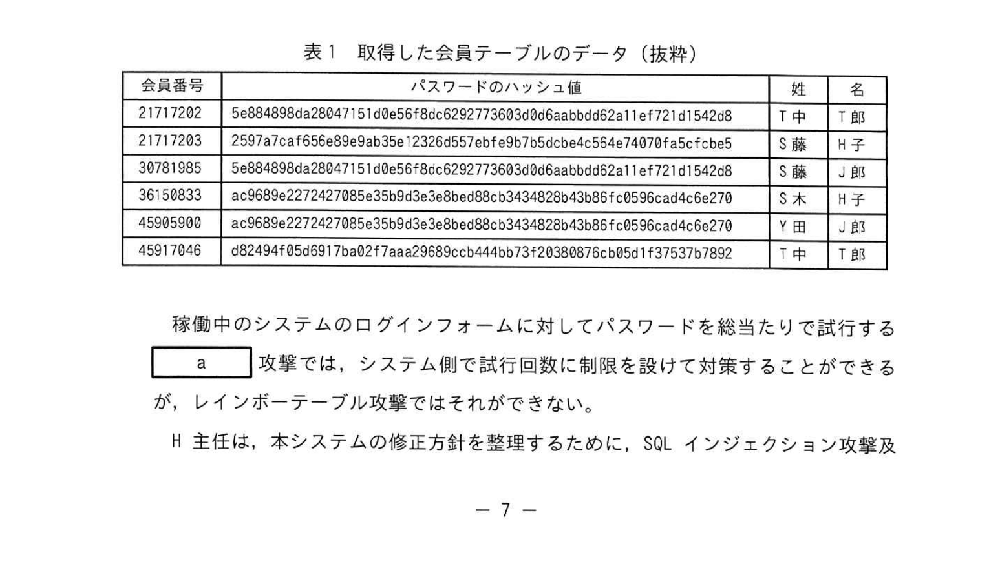

# 2024年秋期（令和6年度秋期）応用情報技術者試験 午後 問1（必須）
## 情報セキュリティ：Webサイトのセキュリティ

---

## 問題文

**問1** Webサイトのセキュリティに関する次の記述を読んで、設問に答えよ。

F社は、日用雑貨を製造・販売する中堅企業である。このたび、販路拡大を目的として自社製品を販売するWeb サイト（以下、本システムという）を新規に開発した。本システムはD社クラウドサービス上に構築しており、WebサーバとデータベースサーバはD社クラウドサービスが提供するファイアウォール（以下、FWという）及びWebアプリケーションファイアウォール（以下、WAFという）を経由してインターネットからアクセスされる予定である。

本システムの開発環境のネットワーク構成（抜粋）を図1に示す。なお、本システムはリリース前であり、F社開発環境の特定のIPアドレスからだけアクセスできるよう「FW」で制限している。

### 図1 本システムの開発環境のネットワーク構成（抜粋）

> **構成：**
> - F社開発環境（PC）→ インターネット → FW → WAF → Webサーバ / DBサーバ
> - Dクラウドサービス内に FW・WAF・Webサーバ・DBサーバが配置

本システムの主な仕様を次に示す。
- 会員登録時に自動で発行される会員番号と会員が設定したパスワードをログインフォームに入力してログインする。商品の購入はログイン後に行う。
- パスワードとして使用できる文字は、英数字に一般的な記号を加えた70種類である。
- パスワードは、6字以上16字以下で設定できる。
- 会員テーブルは、会員番号、メールアドレス、パスワードのハッシュ値、姓、名、住所、電話番号の7フィールドで構成されている。①<u>パスワードのハッシュ値は、会員が設定したパスワードをハッシュ関数によってハッシュ化したものである。</u>

F社情報セキュリティ部のG部長は、本システムのリリース前にペネトレーションテストを実施することを決定した。H主任をリーダーに任命した。H主任は、セキュリティベンダーであるU社に本システムのペネトレーションテストの実施を依頼した。

---

### 〔ペネトレーションテストの実施〕

ペネトレーションテストは、U社内のPCからインターネット、FW及びWAFを経由して本システムにアクセスする経路で実施した。

ペネトレーションテスト期間中、WAFに対してFW及びWAFに次の変更を行った。

- **FWに対する変更：** 通信を許可するアクセス元IPアドレスとして、ペネトレーションテストに用いるU社のIPアドレスを追加する。
- **WAFに対する変更：** 攻撃を検知した際にも、通信の遮断は行わず、検知したことだけを記録する。

---

### 〔ペネトレーションテストの結果〕

ペネトレーションテストの結果、次の手順（以下、本シナリオという）で会員のパスワードが推測され、不正にアクセスされてしまうことが確認された。

1. **②SQLインジェクション攻撃**によって会員テーブルのデータを取得する。これを取得し本シナリオに使用できる会員テーブルのデータ（抜粋）を表1に示す。
2. **レインボーテーブル攻撃**で、表1で取得した会員テーブル中のパスワードのハッシュ値から元のパスワードを推測する。
3. 推測されたパスワードを利用して、正当なアクセスに見せかけて本システムにログインする。

### 表1 取得した会員テーブルのデータ（抜粋）

> | 会員番号 | パスワードのハッシュ値 | 姓 | 名 |
> |---|---|---|---|
> | 21717202 | 5e8848@ca28841510e0fca6297730e3b0ebaa0dd52a11e721c142a8 | 1 | 美 |
> | 21717203 | 252fa7a39ddfe8bab35e72350d57efe97b53bce5644278FaF5c6be | 1 | 2 |
> | 38781985 | 5e8848@ca28841510e0fca6297730e3b0ebaa0dd52a11e721c142a8 | 5 | 子 |
> | 36150833 | 4ec980bcc272742785a26580e33e0bc8343480c85e10851c0e1e5c470 | 水 | 子 |
> | 45085000 | ac9808e2272427885a25603e3b8c8b0b8e0e5c650 | 利 | 田 |
> | 45317046 | aB27ae2ec9b90c8e33e0bc834354 | 小 | 下 |

---

### 〔SQLインジェクション攻撃への対策の検討〕

本システムのソースコードを調査したところ、一部の処理で外部からの入力値をそのままSQL文に埋め込んでいる箇所があった。そこで、対策として、`[　b　]` を利用する方式を採用することにした。この方式では、外部からの入力値が埋め込まれる箇所に**専用の記号で置き換えた後にDB管理システム側で外部からの入力値を割り当てる**。

---

### 〔レインボーテーブル攻撃への対策の検討〕

本システムでは、会員のパスワードをハッシュ化して保存しているが、パスワードをハッシュ化するだけでは不十分で、レインボーテーブル攻撃に対して脆弱であった。そこで、パスワードをハッシュ化する際に、次の三つの処理を組み合わせて実施することにした。

1. **ソルトを用いた処理**
   - パスワードをハッシュ化する際に、ソルトを付加した上でハッシュ化する。
   - ソルトとして、会員ごとに異なるランダムな文字列を用意し、会員テーブルに格納する。

2. **③ペッパーを用いた処理**
   - パスワードをハッシュ化する際に、ペッパーを付加した上でハッシュ化する。
   - ペッパーとして、全ての会員に共通のランダムな文字列を用意し、Webサーバ内の外部からアクセスできない安全な領域に格納する。

3. **ストレッチング**
   - ハッシュ関数を複数回適用する。

さらに、ハッシュ化処理の変更に加えて、会員が設定可能なパスワード長を10字以上64字以下に変更した。本システムにおいて、パスワード長が10字の場合、6字の場合と比べてパスワードとして使用可能な文字列のパターン数が `[　c　]` 倍になるのでレインボーテーブル攻撃がより困難になる。

H主任は、これらの改善策をまとめてG部長長に報告し、承認された。

---

## 設問

### 設問1

本文中の下線①について、会員のパスワードをハッシュ関数でハッシュ化して保存することで、情報漏洩の観点においてメリットがある。それは、ハッシュ値のどのような性質によるものか、**25字以内**で答えよ。

### 設問2

本文中の下線②について、会員テーブルが盗まれた場合、情報セキュリティの3要素のどれが直接的に侵害されるといえるか。漢字3字で答えよ。

### 設問3

本文中の `[　a　]`、`[　b　]` に入れる適切な字句を解答群の中から選び、記号で答えよ。

**解答群**

| 記号 | 字句 |
|---|---|
| ア | エスケープ |
| イ | 許可リスト |
| ウ | サニタイズ |
| エ | ブラックリスト |
| オ | プリペアドステートメント |
| 力 | プレースホルダ |

### 設問4

本文中の下線②について、ペネトレーションテスト期間中のWAFへの変更に基づいた本シナリオとしてのSQLインジェクション攻撃はなぜ成功したか。WAFの役割を踏まえて答えよ（**漢字3字**）。

### 設問5

本シナリオによって、表1に示す会員テーブルのデータが窃取され、会員番号「21717202」に対するパスワードが推測されて不正アクセスを受けた場合。推測されたパスワードを利用して不正アクセスを受けるおそれが最も強い他の会員を次の解答群の中から選び、記号で答えよ。

**解答群**

| 記号 | 会員番号 |
|---|---|
| ア | 21717203 |
| イ | 38781985 |
| ウ | 36150833 |
| エ | 45905000 |
| オ | 45317046 |

### 設問6

〔レインボーテーブル攻撃への対策の検討〕について答えよ。

**(1)** 会員テーブルの窃取だけではレインボーテーブル攻撃が困難になる理由を、**35字以内**で答えよ。

**(2)** 本文中の `[　c　]` に入れる適切な数を、x^y のような指数を用いた表記で答えよ。

---

## 解答と解説

### 設問1

**正解：ハッシュ値からパスワードの割出しは難しい。（24字）**

**理由：** ハッシュ関数は一方向性関数であり、ハッシュ値から元のパスワード（入力値）を逆算・復元することが計算上極めて困難という性質がある。そのため、DBが盗まれてもハッシュ値から直接パスワードを知られにくい。

---

### 設問2

**正解：機密性**

**理由：** 情報セキュリティの3要素（CIA）:
- **機密性（Confidentiality）**: 許可された者のみが情報にアクセスできる
- 完全性（Integrity）: 情報が正確で改ざんされていない
- 可用性（Availability）: 必要な時にアクセスできる

会員テーブル（個人情報・パスワードハッシュ）が盗まれた場合、**機密性**が侵害される。

---

### 設問3

**正解：a=オ（プリペアドステートメント）、b=力（プレースホルダ）**

- **b=プレースホルダ（力）：** 「外部からの入力値が埋め込まれる箇所に専用の記号で置き換えた後にDB管理システム側で割り当てる」という説明は**プレースホルダ**の仕組みそのもの。
- **a=プリペアドステートメント（オ）：** SQLをあらかじめコンパイルしておき、後からパラメータを渡す仕組み。プレースホルダと組み合わせてSQLインジェクションを防ぐ。

---

### 設問4

**正解：ウ（多要素防御）**

**理由：** ペネトレーションテスト期間中、WAFは「攻撃を検知しても通信の遮断を行わない」設定に変更されていた。本来WAFはSQLインジェクションなどの攻撃パターンを検知して**遮断**する役割を持つが、記録のみで遮断しない設定により攻撃が通過できた。また、FWは特定のIPアドレスのみ許可するが、SQLインジェクション自体を防ぐ機能はない。本来はWAFが防壁となるべきが機能しておらず、本システム側の対策（入力値検証）だけに依存していたため成功した。

---

### 設問5

**正解：イ（38781985）**

**理由：** 表1を見ると、会員番号「21717202」と「38781985」は同じパスワードハッシュ値（`5e8848@ca28841510e0fca6297730e3b0ebaa0dd52a11e721c142a8`）を持つ。同じハッシュ値 = 同じパスワードを使用しているため、一方のパスワードが割れれば他方でも不正アクセスできる。

---

### 設問6

**(1) 正解：会員テーブルの窃取だけではペッパーを窃取することができないから（35字）**

**理由：** ペッパーはWebサーバ内の安全な領域に格納されており、会員テーブル（DB）には保存されていない。そのため、たとえ会員テーブルが盗まれても、ペッパーが取得できなければ正しいハッシュ値を事前計算できず、レインボーテーブル攻撃が成立しない。

**(2) 正解：c=70^10 ÷ 70^6 = 70^4**

**計算：**
- 6字のパスワードのパターン数 = 70^6
- 10字のパスワードのパターン数 = 70^10

倍率 = 70^10 ÷ 70^6 = **70^4**

---

## 参考：主要キーワード

| 用語 | 説明 |
|------|------|
| SQLインジェクション | Webフォームなどから不正なSQL文を挿入してDBを操作する攻撃手法 |
| プレースホルダ | SQL文の入力箇所を「?」等の記号で置き換え、後からパラメータを渡す手法 |
| プリペアドステートメント | SQLを事前にコンパイルしてパラメータを後から渡す。SQLインジェクション対策 |
| WAF（Web Application Firewall） | HTTPリクエストの内容を検査してXSSやSQLi等の攻撃を遮断するFW |
| ハッシュ関数 | 入力データから固定長のハッシュ値を生成する一方向関数。不可逆 |
| レインボーテーブル攻撃 | よく使われるパスワードのハッシュ値一覧（レインボーテーブル）でハッシュを逆引きする攻撃 |
| ソルト | パスワードハッシュ化時に付加する会員ごと異なるランダム値。レインボーテーブル対策 |
| ペッパー | 全会員共通のランダム値。DBとは別の安全な場所に保管。窃取困難にする |
| ストレッチング | ハッシュ関数を多数回適用することでブルートフォースの計算量を増やす |
| 機密性（Confidentiality） | 情報セキュリティ3要素（CIA）の1つ。許可者のみがアクセスできる |
| ペネトレーションテスト | 攻撃者の視点で実際にシステムを攻撃し、脆弱性を発見するセキュリティ試験 |
