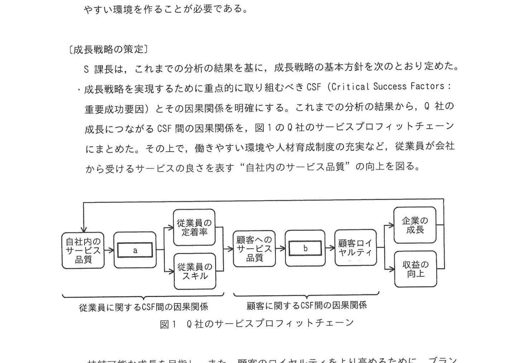

# 2024年秋期（令和6年度秋期）応用情報技術者試験 午後 問2（選択）
## 経営戦略：コーヒーチェーン店の成長戦略

---

## 問題文

**問2** コーヒーチェーン店の成長戦略に関する次の記述を読んで、設問に答えよ。

Q社は、コーヒーチェーン店を運営している。喫茶店業態に進出して以来、落ち着いた空間を提供することで急速に店舗を増やし、現在は全国に店舗を展開している。しかし、ここ3年は、経営環境の変化によって成長が鈍化しており、不採算店も増えている。Q社の経営企画、マーケティング及び人事を統括するR常務は、この状況に危機感を抱き、利益を伴う成長戦略を策定するために、経営企画部のS課長をリーダーとする戦略策定チームを編成した。なお、S課長は、店舗業務の標準化を推進する店舗統括本部の課長も兼務している。

Q社は、"おいしいコーヒーでゆっくりくつろげる喫茶店"というブランドを掲げ、交通至便な立地に店舗を構え、店内には仕切りがついたテーブル席を設けるなど、設備投資に注力してきた。Q社の利益は2回以上来店したことのあるリピート客を含む延べ来店客数に比例しており、成長率は新規来店客数に比例している。しかし、ここ3年は、延べ来店客数に占めるリピート客数の割合であるリピート率も新規来店客数も低下していた。

---

### 〔Q社を取り巻く環境〕

Q社では、従前から、顧客満足度調査と従業員満足度調査を行っている。そこで、S課長は、戦略の立案に当たり、顧客の視点及び従業員の視点で分析を行った。

まず顧客の視点で経営環境を分析した。

- 近年、持続可能な開発目標（SDGs）で定められた目標の一つである"持続可能な消費と生産のパターンを確保する"への理解が進むに従い、環境や倫理を重視する製品やサービスを購入するという意識がZ世代の消費者の間で高まっている。Q社はこのような高い社会意識をもった消費者を取り込めていない。
- 競合コーヒーチェーン店（以下、競合店という）が新規出店した近隣のQ社の店舗では、来店者が急激に減少している。競合店は、商品知識が豊富で親しみやすい接客に定評があり、顧客満足度が高い。競合店は、コーヒーの淹れ方をマニュアル化して全従業員を定期的に教育したり、社外の講師を呼んで接客スキルやセルフリーダーシップのスキルを高める研修を実施したりするなど、従業員育成への投資を重視している。
- Q社は、有機農法で栽培するなど、環境に配慮した生産者から直接調達した高品質なコーヒー豆を使っていて、味や香りが良いコーヒーに定評があった。ただし、最近の顧客満足度調査では、"店によってコーヒーの味にばらつきがある"、"味や香りが以前よりも落ちている"、といった顧客からの声が寄せられている。

S課長は、定評があるコーヒーの安定した提供や、ゆっくりくつろげる喫茶店としての接客といった、顧客へのサービス品質を向上させる必要があると分析した。

---

次に、S課長は、従業員の視点で経営環境を分析した。

- 各店舗は店長をリーダーとする一つのチームとして運営されている。店長が部下にコーヒーの淹れ方や接客スキルなどを指導している。しかし、顧客が満足する品質のサービスを提供できるように部下を育成することまではできていない。全て店長の責任で部下の育成を行った上で、顧客が満足する品質のサービスを提供することには限界がある。
- 従業員は、コーヒーを淹れるスキルを高めたいと思ったり、接客の仕方を改善しようとしたりしているが、店長に相談したくても、なかなか対応してもらえていない。その結果、不満をもって辞めてしまう従業員が増え、従業員の定着率が低下してきている。
- 店舗統括本部の管理者、同僚の店長、店舗内の部下によって店長の360度評価を実施した結果、全般的に、店長の自己評価は高いが、部下からの評価はそれほど高くなく、両者の評価には大きなギャップがあった。

S課長は、これらの経営環境分析の結果、顧客へのサービス品質の低下には、従業員のスキルの不足と従業員の定着率の低下とが関連するのではないかと考えた。さらに、S課長は、従業員のスキル及び定着率について分析し、次のことが分かった。

- 顧客へのサービス品質が高いチームは、従業員満足度が高く、それによってチームメンバーがやる気をもって自律的にスキルの向上を図っており、また、チームメンバーの定着率が高いという共通の特性がある。
- この特性を満たすためには、店長が、部下に対して共感することで、質問・相談しやすい環境を作ることが必要である。

---

### 〔成長戦略の策定〕

S課長は、これまでの分析結果を基に、成長戦略の基本方針を次のとおり定めた。

- 成長戦略を実現するために重点的に取り組むべき CSF（Critical Success Factors：重要成功要因）とその因果関係を明確にする。これまでの分析の結果から、Q社の成長につながるCSF間の因果関係を、図1のQ社のサービスプロフィットチェーンにまとめた。その上で、働きやすい環境や人材育成制度の充実など、従業員が会社から受けるサービスの良さを表す"自社内のサービス品質"の向上を図る。

### 図1 Q社のサービスプロフィットチェーン

> **因果関係（左→右）：**
> - 自社内のサービス品質 → `[a]` → 従業員の定着率／従業員のスキル → 顧客へのサービス品質 → `[b]` → 顧客ロイヤルティ → 企業の成長／収益の向上
> - 左側＝従業員に関するCSF間の因果関係、右側＝顧客に関するCSF間の因果関係

- 持続可能な成長を目指し、また、顧客のロイヤルティをより高めるために、ブランドを再構築する。新たに、"①<u>私たちは、高い社会意識をもって、厳選された生豆と熟練の技術で淹れる香り深いコーヒーを提供します。</u>"とブランドを定める。
- "ブランドの再構築"によって、自社の強みを生かし、弱みを補完して、競合店との差別化を図る。また、"初めて来店してから、店に来店しなくなるまでの `[　c　]` "を表す LTV を向上させることで、採算性を改善する。

S課長は、このサービスプロフィットチェーンに基づいて、従業員の定着率の改善とスキルの向上のためには、`[　a　]` を高める必要があり、さらにそのためには自社内のサービス品質の改善が必要であることをR常務に報告した。また、S課長は、ゴールである"利益を伴う成長"の実現を目指す成長戦略の進捗を測る KPI として、Z世代の来店客数と、`[　d　]` を設定することにした。

---

### 〔Q社内のサービス品質の改善〕

S課長は、自社内のサービス品質を改善するため、店長への研修を実施することにした。研修の内容は、店長の360度評価の結果を基に、店長に対して `[　e　]` に気付かせ、行動改善につなげるものとし、部下との対話の場面を想定した次の具体的な演習を行う。

- 店長は部下に対して"教える"、"アドバイスする"ことはせず、"問いかけて聴く"という対話を重視する。
- 店長は部下に対する `[　f　]` を示すことで、部下から様々な考え方や行動の選択肢を引き出し、自律的な行動を促す。

S課長は、ブランドの再構築の活動として、再教育を全従業員に対して行うことにした。この再教育に当たって、S課長は、②<u>店舗統括本部として重点的に取り組むべき施策</u>があると考えた。また、ブランドの再構築への投資に加えて、人的資本を強化する新たな投資計画を策定した。

R常務は、この報告を受け、"君の策定した戦略は、よく考えられていて、納得できた。そのアプローチは本当に良いと思う。"とS課長に `[　f　]` を示した上で、すぐに経営会議に付議し、成長戦略を推進することを約束した。

---

## 設問

### 設問1

〔成長戦略の策定〕について答えよ。

**(1)** 図1及び本文中の `[　a　]`、図1中の `[　b　]` に入れる適切な字句を、本文中の字句を用いて、それぞれ8字以内で答えよ。

**(2)** 本文中の下線①について、S課長が新たにブランドを定めた背景となる要因は何か、機会と強みの観点からそれぞれ20字以内で答えよ。

**(3)** 本文中の `[　c　]` に入れる適切な字句を15字以内で答えよ。

**(4)** 本文中の `[　d　]` に入れる適切な字句を8字以内で答えよ。

### 設問2

〔Q社内のサービス品質の改善〕について答えよ。

**(1)** 本文中の `[　e　]` に入れる適切な字句を20字以内で答えよ。

**(2)** 本文中の `[　f　]` に入れる適切な字句を3字以内で答えよ。

**(3)** 本文中の下線②について、店舗統括本部が、再構築したブランドを考慮して重点的に取り組むべき施策を、本文中の字句を用いて25字以内で答えよ。

---

## 解答と解説

### 設問1

**(1) 正解：a=従業員満足度、b=顧客満足度**

**理由：** 図1のサービスプロフィットチェーンの流れは：
- 自社内サービス品質 → **従業員定着率・スキル** → 顧客へのサービス品質 → **顧客ロイヤルティ** → 企業の成長

フレームワーク上、従業員に関するCSFの「a」は「従業員満足度」（スキルや定着率を高める前段階）、顧客に関するCSFの「b」は「顧客満足度」（ロイヤルティの前段階）が入る。

**(2) 正解：**
- **機会**：環境や倫理に対する社会意識の高まり（16字）
- **強み**：環境に配慮した高品質なコーヒー豆の使用（19字）

IPA公式：
- 機会: 環境や倫理に対する社会意識の高まり
- 強み: 環境に配慮した高品質なコーヒー豆の使用

**理由：** 機会は本文〔Q社を取り巻く環境〕の「環境や倫理を重視する…意識がZ世代の消費者の間で高まっている」から。強みは「環境に配慮した生産者から直接調達した高品質なコーヒー豆を使っていて、味や香りが良いコーヒーに定評があった」から。

**(3) 正解：c=顧客がQ社にもたらす利益（12字）（又は 顧客生涯価値）**

**IPA公式：顧客がQ社にもたらす利益 ／ 顧客生涯価値**

**理由：** LTV（Life Time Value）は「初めて来店してから、店に来店しなくなるまでの間に顧客がQ社にもたらす利益（＝顧客生涯価値）」を表す。本文中「初めて来店してから、店に来店しなくなるまでの `c` を表すLTV」に入る。

**(4) 正解：d=リピート率**

**理由：** 「成長指標は新規来店客以外（リピーター）の来店客数にあった」という文脈から、KPIとして設定すべきは**リピート率**（リピーター数・割合）。

---

### 設問2

**(1) 正解：e=自己評価と部下からの評価とのギャップ（20字）**

**理由：** 360度評価の結果、「店長の自己評価は高いが部下からの評価はそれほど高くなく、両者の評価に大きなギャップがある」ことが分かった。研修では店長にこの**自己評価と部下の評価のギャップ**を気付かせることで自己啓発につなげる。

**(2) 正解：f=共感**

**IPA公式：共感**

**理由：** 「部下に対して共感することで質問・相談しやすい環境を作ることが必要」という分析から、店長が部下に示すべきは**共感**。空欄fはR常務がS課長に示す姿勢としても同じ「共感」が入る。

**(3) 正解：香り深いコーヒーの淹れ方のマニュアル化（23字）**

**理由：** ブランド「香り深いコーヒーを提供します」を実現するための施策として、店舗統括本部（業務標準化推進）が取り組むべきは、**コーヒーの淹れ方のマニュアル化**（標準化によって品質ばらつきを排除し、ブランドの約束を守る）。

---

## 参考：主要キーワード

| 用語 | 説明 |
|------|------|
| サービスプロフィットチェーン | 従業員満足→顧客満足→企業収益の因果関係を示すフレームワーク |
| CSF（重要成功要因） | 戦略目標達成に不可欠な要因。ここでの成長に必要な重点項目 |
| LTV（顧客生涯価値） | 顧客が関係を持つ期間を通じて企業にもたらす価値の合計 |
| SDGs | 国連の持続可能な開発目標。環境・社会配慮への意識高揚に関係 |
| 360度評価 | 上司・部下・同僚など多角的な評価。自己評価との差異を把握 |
| リピート率 | 来店客のうち再来店する割合。顧客ロイヤルティの指標 |
| ブランド再構築 | 既存ブランドの見直し・刷新。競合との差別化や新客層獲得を目的とする |
| 従業員定着率 | 離職しない従業員の割合。サービス品質に直結 |
| スキルの標準化（マニュアル化） | 業務の型を定めて全店に普及。品質ばらつきを排除する |
