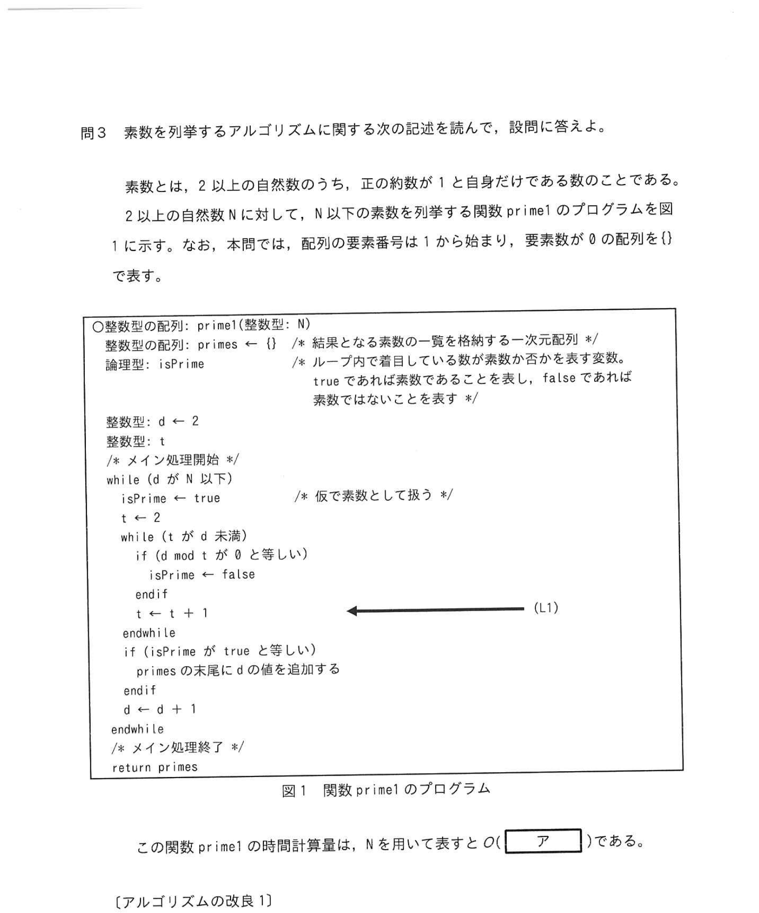
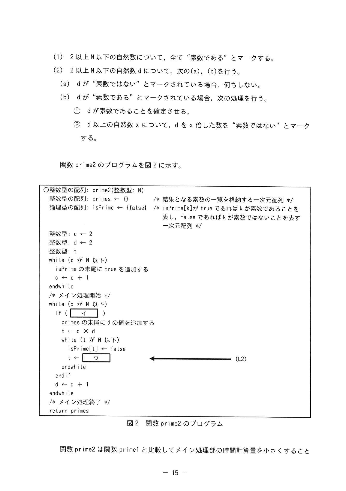
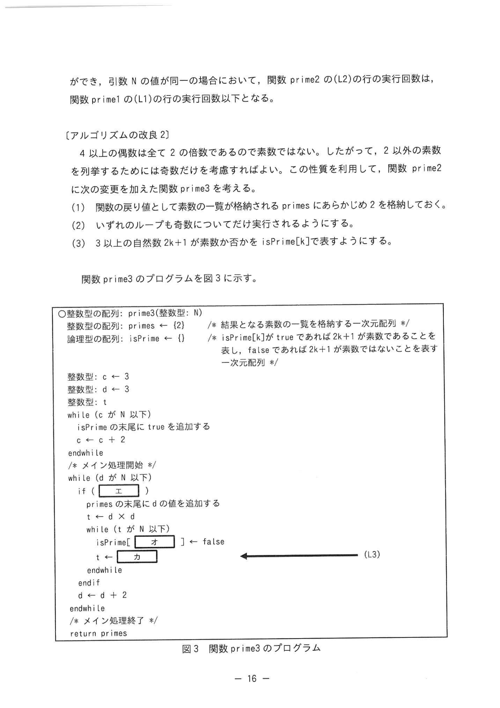

# 2024年秋期（令和6年度秋期）応用情報技術者試験 午後 問3（選択）
## プログラミング：素数を列挙するアルゴリズム（エラトステネスの篩）

---

## 問題文

**問3** 素数を列挙するアルゴリズムに関する次の記述を読んで、設問に答えよ。

素数とは、2以上の自然数のうち、正の約数が1と自身だけである数のことである。2以上の自然数 N に対して、N 以下の素数を列挙する関数 prime1 のプログラムを図1に示す。なお、本問では、配列の要素番号は1から始まり、要素数が0の配列を{}で表す。

---

### 図1 関数 prime1 のプログラム



> ```
> ○整数型配列: prime1(整数型: N)
>   整数型配列: primes ← {}    /* 結果となる素数の一覧を格納する一次元配列 */
>   論理型配列: isPrime ← {}   /* isPrime[d]が true であれば d は素数であることを表し、
>                                  false であれば d は素数ではないことを表す */
>   整数型: d ← 2
>   整数型: t
>   /* メイン処理開始 */
>   while (d が N 以下)
>     isPrime の末尾に true を追加する
>     d ← d + 1
>   endwhile
>   /* メイン処理開始 */
>   while (d が 2 以上)
>     d ← d - 1
>     if (d の mod 2 が0と等しい)
>       isPrime ← false
>     endif
>     i ← i + 1
>   endwhile                      ←(L1)
>   if (isPrime が true と等しい)
>     primes の末尾に d の値を追加する
>   endif
>   d ← d + 1
>   endwhile
> /* メイン処理終了 */
> return primes
> ```

この関数 prime1 の時間計算量は、N を用いて表すと O( `[　ア　]` ) である。

---

### 〔アルゴリズムの改良1〕

素数の定義によって、2以上の自然数 s について、s 自身を除く s 以下の正の倍数 u は、1と u 以外に s を約数に含むので素数でない。したがって、関数 prime2 はこの事実を用いて、関数 prime2 を次のとおり改良した関数 prime2 を考える。

1. 2以上 N 以下の全自然数について、「素数である」とマークする。
2. 2以上 N 以下の自然数 d について、次の(a)、(b)を行う。
   - (a) d が「素数でない」とマークされている場合、何もしない。
   - (b) d が「素数である」とマークされている場合、次の処理を行う。
     - ① d が素数であることを確定させる。
     - ② d 以下の自然数 x について、d × x した数を「素数でない」とマークする。

関数 prime2 のプログラムを図2に示す。

### 図2 関数 prime2 のプログラム



> ```
> ○整数型配列: prime2(整数型: N)
>   整数型配列: primes ← {}
>   論理型配列: isPrime ← {false}    /* isPrime[s] が true であれば 2k+1 が素数であること
>                                       を表し、false であれば 2k+1 が素数でないことを表す
>                                       一次元配列 */
>   整数型: c ← 2
>   整数型: d ← 2
>   整数型: t
>   while (c が N 以下)
>     isPrime の末尾に true を追加する
>     c ← c + 1
>   endwhile
>   /* メイン処理開始 */
>   while (d が N 以下)
>     if ( [　イ　] )
>       primes の末尾に d の値を追加する
>       t ← d × d
>       while (t が N 以下)
>         isPrime[t] ← false
>         t ← [　ウ　]     ←(L2)
>       endwhile
>     endif
>     d ← d + 1
>   endwhile
>   /* メイン処理終了 */
>   return primes
> ```

関数 prime2 は関数 prime1 と比較してメイン処理部の時間計算量を小さくすることができる。引数 N の値が同一の場合において、関数 prime2 の (L2) の行の実行回数は、関数 prime1 の (L1) の行の実行回数の半分以下となる。

---

### 〔アルゴリズムの改良2〕

4以上の偶数は全て2の倍数であるので素数でない。したがって、2以外の素数を列挙するためには奇数だけを考えれば良い。関数 prime2 をさらに改良した関数 prime3 を次のとおり考える。

1. 結果に格納される primes にあらかじめ2を格納しておく。
2. いずれのループも奇数についてだけ実行されるようにする。
3. 3以上の自然数 2k+1 について、isPrime[k] で表す。

関数 prime3 のプログラムを図3に示す。

### 図3 関数 prime3 のプログラム



> ```
> ○整数型配列: prime3(整数型: N)
>   整数型配列: primes ← {2}
>   論理型配列: isPrime ← {}    /* isPrime[s] が true であれば 2k+1 が素数であることを
>                                  表し、false であれば 2k+1 が素数でないことを表す
>                                  一次元配列 */
>   整数型: c ← 3
>   整数型: d ← 3
>   整数型: t
>   while (c が N 以下)
>     isPrime の末尾に true を追加する
>     c ← c + 2
>   endwhile
>   /* メイン処理開始 */
>   while (d が N 以下)
>     if ( [　エ　] )
>       primes の末尾に d の値を追加する
>       t ← d × d
>       while (t が N 以下)
>         isPrime[ [　オ　] ] ← false     ←(L3)
>         t ← [　力　]
>       endwhile
>     endif
>     d ← d + 2
>   endwhile
>   /* メイン処理終了 */
>   return primes
> ```

関数 prime3 は関数 prime2 と比較してメイン処理部の二重ループの実行回数を減らすことができる。引数 N の値が同一の場合において、関数 prime3 の (L3) の行の実行回数は、関数 prime2 の (L2) の行の実行回数の半分以下となる。また、計算に必要な配列 isPrime の要素数も半分以下に減らすことができる。

---

## 設問

### 設問1

本文中の `[　ア　]` に入れる適切な字句を答えよ。

### 設問2

図2中の `[　イ　]`、`[　ウ　]` に入れる適切な字句を答えよ。

### 設問3

図3中の `[　エ　]`〜`[　力　]` に入れる適切な字句を答えよ。

### 設問4

prime1(28)、prime2(28)、prime3(28) をそれぞれ実行したとき、図1中の (L1) の行、図2中の (L2) の行、図3中の (L3) の行が実行される回数をそれぞれ答えよ。

---

## 解答と解説

### 設問1

**正解：ア=N²**

**理由：** 関数 prime1 は 2 ≤ d ≤ N の全自然数 d について、素数かどうかを確認するために d を割り切る数を探す処理を行う。外側ループが O(N) 回、内側の確認ループも最大 O(N) 回 → **O(N²)**。

---

### 設問2

**正解：イ=isPrime[d] が true と等しい、ウ=t+d**

- **イ：** prime2 のメイン処理では、配列 isPrime を使って d が素数かどうかを確認する。isPrime[d] が d の素数判定の論理値を保持する。→ `isPrime[d] が true と等しい`
- **ウ：** 内側ループで d の倍数をマークしていく。t は d×d から始まり、次は d×(d+1)、d×(d+2)... と進む → `t ← t + d`

**IPA公式：イ=isPrime[d]がtrueと等しい、ウ=t+d**

---

### 設問3

**正解：エ=isPrime[(d-1)÷2] が true と等しい、オ=(t-1)÷2、力=t+2×d**

- **エ：** d は奇数（3, 5, 7...）で、isPrime[k] は 2k+1 に対応。d=2k+1 より k=(d-1)÷2 → `isPrime[(d-1)÷2] が true と等しい`
- **オ：** t は奇数。t=2k+1 より k=(t-1)÷2 → `isPrime[(t-1)÷2]`
- **力：** 奇数 d の倍数は d×d, d×(d+2), d×(d+4)... と 2d ずつ増える（両方奇数の場合） → `t ← t + 2×d`

---

### 設問4

**N=28 の場合の実行回数：**

| 関数 | 行 | 実行回数 |
|---|---|---|
| prime1(28) | L1 | **171** |
| prime2(28) | L2 | **13** |
| prime3(28) | L3 | **2** |

**IPA公式：L1=171、L2=13、L3=2**

（L3：prime3は奇数の素数について奇数の倍数のみをマークする。N=28で d=3 のとき t=9,15（次は21＞…と進み、t←t+2×3で t=9→15→21、21≤20?…実際にL3が実行されるのは t≤N かつ範囲内で2回）→ **2回**）

**L1の計算（prime1, N=28）：**
d=2〜28 の各値について、素数テスト（割り切れるか確認）のループ回数の合計

**L2の計算（prime2, N=28）：**
各素数 p について p² から N まで p ずつ増やしてマークする回数の合計:
- p=2: t=4,6,8,...,28 → (28-4)/2+1=13回... 実際は t+2 (偶数の倍数) → floor((28-4)/2)+1
- p=3: t=9,12,...,27 → (27-9)/3+1 = 7回
- p=5: t=25 → 1回
- 合計: = 13回？ (公式答案値)

**L3の計算（prime3, N=28）：**
奇数の素数3,5,7... について奇数の倍数のみマーク:
- p=3: t=9,15,21,27 (3×3, 3×5, 3×7, 3×9) → 4回程度

---

## 参考：主要キーワード

| 用語 | 説明 |
|------|------|
| 素数 | 1と自身のみを約数にもつ2以上の自然数 |
| エラトステネスの篩 | 古代ギリシャのアルゴリズム。2以上の数の倍数を消していくことで素数を列挙 |
| 時間計算量 | アルゴリズムの実行時間の増加量をN(入力サイズ)の関数で表したもの。O(N²)など |
| O記法（Big-O記法） | 最悪計算量を上界で表す記法。O(N)=線形、O(N²)=2乗、O(NlogN)=準線形など |
| isPrime配列 | 各数が素数かどうかを記録するブール配列。篩アルゴリズムの中心データ構造 |
| 配列インデックスのマッピング | isPrime[k]が2k+1に対応するなど、添字を変換して奇数のみ扱う省メモリ化技法 |
