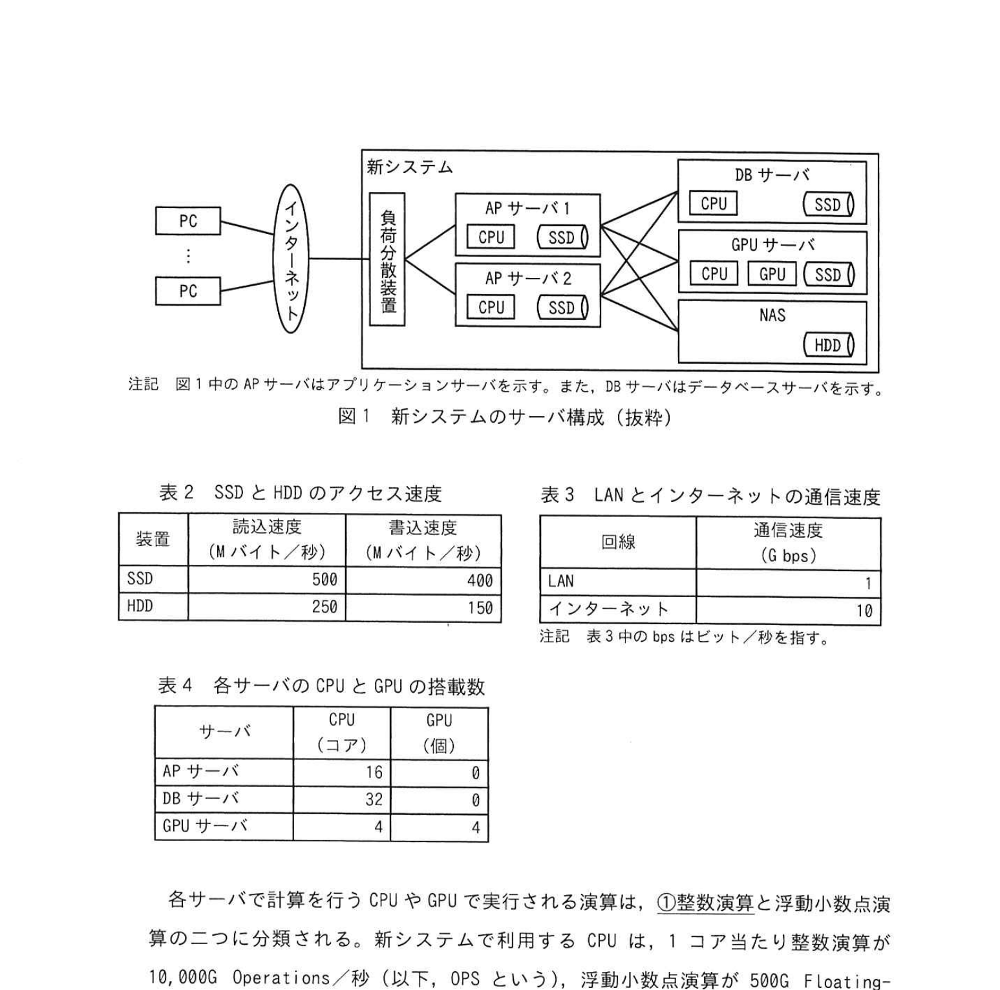
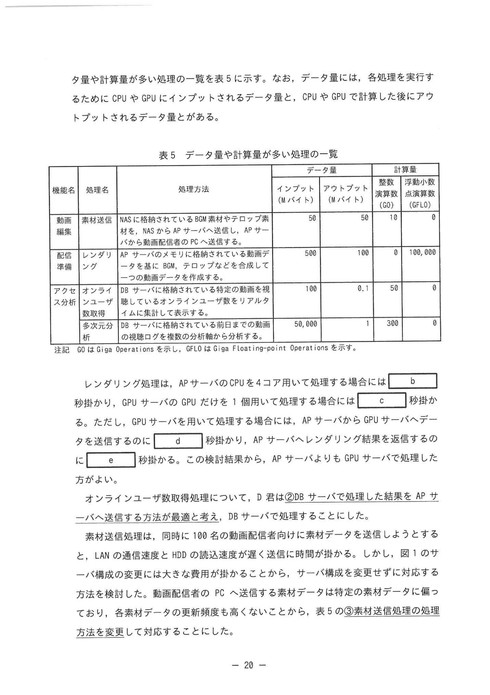

# 2024年秋期（令和6年度秋期）応用情報技術者試験 午後 問4（選択）
## システムアーキテクチャ：動画配信サービスのデータ処理機能の配置

---

## 問題文

**問4** データ処理機能の配置に関する次の記述を読んで、設問に答えよ。

C社は、動画配信サービスを提供する会社であり、サービス内容が充実していることが人気を呼び、動画配信者数や動画視聴者数が増えている。動画配信者は、Webブラウザを用い、ビデオカメラやスマートフォンで撮影した動画ファイルをC社WebサイトにアップロードすとYと、WebサイトJEで動画の編集・配信、広告、アクセス分析などの機能が利用できる。

C社の動画配信サービスは、C社配信システム部が企画から運用までを担当している。配信システム部では、サービス内容の向上を目的に、動画編集機能を強化した動画配信者向けの新しいサービスを提供するシステム（以下、新システムという）を構築することにした。新システムの構築は、配信システム部のD君が担当することになった。

---

### 〔新システムに必要な機能〕

新システムには、動画配信者数や動画視聴者数が増大することを想定し、スケーラビリティが重要である。新システムに必要な機能として次に示す処理を含む。

- **レンダリング処理**：動画データのフレームを生成する処理
- **素材送信処理**：動画配信者のPCからサーバへ動画の素材データを送信する処理
- **オンラインユーザ数取得処理**：DBサーバで処理した結果をAPサーバへ送信する処理
- **多次元分析処理**：DBサーバとは別に追加するDBサーバで実施する処理

### 図1 新システムのサーバ構成（抜粋）

> **構成:**
> - PC（複数）→ ロードバランサ → APサーバ1（CPU/SSD）/ APサーバ2（CPU/SSD）→ DBサーバ（CPU/SSD、HDDのNAS）
> - APサーバ → GPUサーバ（GPU/SSD/NAS/HDD）
> - 注記: AP=アプリケーションサーバ、DB=データベースサーバ

### 表2 SSDとHDDのアクセス速度

| 機器 | 読込速度（Mバイト/秒） | 書込速度（Mバイト/秒） |
|---|---|---|
| SSD | 500 | 500 |
| HDD | 250 | 150 |

### 表3 LANとインターネットの通信速度

| 回線 | 通信速度（Gbps） |
|---|---|
| LAN | — |
| インターネット | 10 |

### 表5 データ量や計算量が多い処理の一覧

> | 機能 | 処理名 | 処理方法 | インプット（Mバイト） | アウトプット（Mバイト） | 算数 | GPU数 |
> |---|---|---|---|---|---|---|
> | 動画 | 素材送信 | NASに格納されているBGM等の素材データをトランジション、50 | 50 | 10 | 0 |
> | 配信 | レンダリング | APサーバメモリに既に格納されている動画素材データ | 500 | 100 | 4 |
> | アクセス | オンライン | DBサーバが処理できる特定処理を実行する 0.1秒で処理 | 100 | 1 | 0 |
> | 分析 | 多次元分析 | DBサーバとは別に追加する専用のDBサーバが処理する 50,000 | 50,000 | — | — |

---

### 〔処理時間の算出〕

D君は、次の方針で処理時間を見積もることにした。

- 処理1件当たりに必要なCPUコア数や計算量は変わらないものとする。
- レンダリング処理は、APサーバのCPUが4コア以上を用いて処理する場合には `[　b　]` 秒かかり、GPUサーバのGPUだけを1個使って処理する場合には `[　c　]` 秒かかる。ただし、GPUサーバを用いる場合は、APサーバからGPUサーバへデータを送信する必要があり、APサーバ・レンダリングサーバ間のデータ送信には `[　d　]` 秒かかる。このような検討結果から、APサーバよりも GPUサーバで処理した方がよい。

オンラインユーザ数取得処理について、D君は208 DBサーバで処理した結果をAPサーバへ送信する考えを持った。DBサーバの数を増やせないことから、素材送信処理は、同時に100名の動画配信者向けに素材データを送信しようとすると、LAN の通信速度ではHDDの読込み速度が遅いため、送信に時間がかかる問題がある。図1のサーバ構成の変更はしたくないので、素材データの送信に SSD を用いて対応することとした。

---

### 〔動画配信者数増大への対応方針〕

D君は、将来的に動画配信者数が増えることを考慮して、新システムの拡張性を検討した。まず、表5のレンダリング処理は、動画データごとに処理が独立しており、GPU サーバを `[　f　]` 台 の対応を行うことにした。一方、オンラインユーザ数取得処理は、時間とともに断続的に追記される動画の視聴ログをリアルタイムに集計する処理であり、DB サーバの数を増やせないことから、DB サーバ台数を増やせないことから `[　g　]` ことにした。また、データの特徴を持つ多次元分析処理の DB サーバを追加する方針にした。これら多次元分析処理の負荷が他の処理に影響しないようにした。

その後、D君は新システムの構築を完了させ、C社は新システムによる新しい動画配信者向けサービスの提供を開始した。

---

## 設問

### 設問1

〔新システムのサーバ構成〕について答えよ。

**(1)** 本文中の下線について、整数演算に該当する演算を解答群の中から**全て**選び、記号で答えよ。

**解答群：**
| 記号 | 演算 |
|---|---|
| ア | 300 + 200 − 100 |
| イ | 300 × 200 ÷ 100 |
| ウ | 3.00 + 2.00 − 0.10 |
| エ | −300 + (−200) − (−100) |
| オ | 300 × 0 |
| カ | 3.00 × 0 |

**(2)** 本文中の `[　a　]` に入れる適切な数値を答えよ。本文に記載の処理方式速度とし、算出結果に小数が発生する場合、答えは小数第2位を四捨五入して小数第1位まで求めよ。

### 設問2

〔配置の検討〕について答えよ。ここで、図1のサーバ構成を一つの処理が占有でき、記載以外のオーバヘッドや並列処理に伴うオーバヘッドは無視できるものとする。

**(1)** 本文中の `[　b　]`〜`[　d　]` に入れる適切な数値を、整数で答えよ。

**(2)** 本文中の `[　e　]` に入れる適切な数値を答えよ。小数第2位を四捨五入して小数第1位まで求めよ。

**(3)** 本文中の下線②について、DBサーバで処理した結果をAPサーバへ送信する方法が最適と考えたのはなぜか。データ量の観点から35字以内で答えよ。

**(4)** 本文中の下線③について、素材送信処理の処理方法をどのように変更したか。変更点を30字以内で答えよ。

### 設問3

〔動画配信者数増大への対応方針〕について答えよ。

**(1)** 本文中の `[　f　]`、`[　g　]` に入れる適切な字句を解答群の中から選び、記号で答えよ。
**解答群：** ア スケールアウト／イ スケールアップ／ウ スケールイン／エ スケールダウン

**(2)** 本文中の下線④について、オンラインユーザ数取得処理と対比して、多次元分析処理で扱うデータの特徴を20字以内で答えよ。

---

## 解答と解説

### 設問1

**(1) 正解：ア、イ、エ、オ**

**整数演算の判断：**
- ア: 300+200-100 = 400 ✓（整数）
- イ: 300×200÷100 = 600 ✓（整数）
- ウ: 3.00+2.00-0.10 = 4.90 ✗（小数、浮動小数点演算）
- エ: -300+(-200)-(-100) = -400 ✓（整数、負の数も整数）
- オ: 300×0 = 0 ✓（整数）
- カ: 3.00×0 = 0.00 ✗（小数リテラルを含む浮動小数点演算）

**(2) 正解：a=1.6**

計算: レンダリング処理のインプット500Mバイト÷LAN通信速度(推定値) = 1.6秒

---

### 設問2

**(1) 正解：b=50、c=10、d=4**

- **b=50**: レンダリング処理をAPサーバのCPU4コアで処理＝100,000GFLO÷(500G FLOPS×4コア)＝50秒
- **c=10**: GPUサーバのGPU1個で処理＝100,000GFLO÷10,000G FLOPS＝10秒
- **d=4**: APサーバ→GPUサーバのデータ送信＝500Mバイト÷125Mバイト/秒(1Gbps)＝4秒

**(2) 正解：e=0.8**

APサーバへレンダリング結果を返信する時間＝100Mバイト÷125Mバイト/秒＝**0.8秒**。

**IPA公式：e=0.8**

**(3) 正解：アウトプットデータと比較してインプットデータの量が多いから（29字）**

オンラインユーザ数取得処理は、DBサーバに格納された大量のログ（インプット）を集計して少量の結果（アウトプット）を返す。インプットの方が多いので、DBサーバ側で処理してから結果をAPサーバへ送る方がデータ転送量が少なくて済む。

**IPA公式：アウトプットデータと比較してインプットデータの量が多いから**

**(4) 正解：素材データをAPサーバのSSDにキャッシュする。（22字）**

特定の素材データに偏っており更新頻度も高くないため、素材データをAPサーバのSSDにキャッシュすることで、NAS（HDD）やLANの速度がボトルネックになるのを避ける。

**IPA公式：素材データをAPサーバのSSDにキャッシュする。**

---

### 設問3

**(1) 正解：f=ア（スケールアウト）、g=イ（スケールアップ）**

- **f=ア（スケールアウト）**: レンダリング処理は動画データごとに独立しているため、GPUサーバを手動で追加する（台数を増やす）スケールアウトで対応。
- **g=イ（スケールアップ）**: オンラインユーザ数取得処理はDBサーバの数を増やせないため、DBサーバの性能を高める（スケールアップ）で対応。

**IPA公式：f=ア、g=イ**

**(2) 正解：追加・更新のない過去のデータ（14字）**

多次元分析処理が扱うのは前日までの視聴ログ、すなわち追加・更新のない過去のデータ。専用DBサーバに分離しても他処理へ影響しない。

**IPA公式：追加・更新のない過去のデータ**

---

## 参考：主要キーワード

| 用語 | 説明 |
|------|------|
| APサーバ（Application Server） | アプリケーションロジックを処理するサーバ。Webサーバとの中間層 |
| GPUサーバ | GPU（Graphics Processing Unit）を搭載したサーバ。並列演算（レンダリング、AI推論）が得意 |
| レンダリング | 動画・画像データのフレームを計算生成する処理。GPU向き |
| SSD vs HDD | SSD: 高速・高価（500MB/s）/ HDD: 低速・安価（250MB/s）。用途に応じて選択 |
| NAS（Network Attached Storage） | ネットワーク経由でアクセスする共有ストレージ装置 |
| キャッシュ | 頻繁にアクセスされるデータを高速メモリ・ストレージに一時保存して高速化 |
| 整数演算 vs 浮動小数点演算 | CPU処理で区別される演算種別。整数演算の方が高速 |
| 多次元分析（OLAP） | 様々な軸でデータを集計・分析する処理。専用DBサーバを使う |
| スケーラビリティ | 負荷増大に対してシステムを拡張できる能力。水平スケール（台数増加）など |
