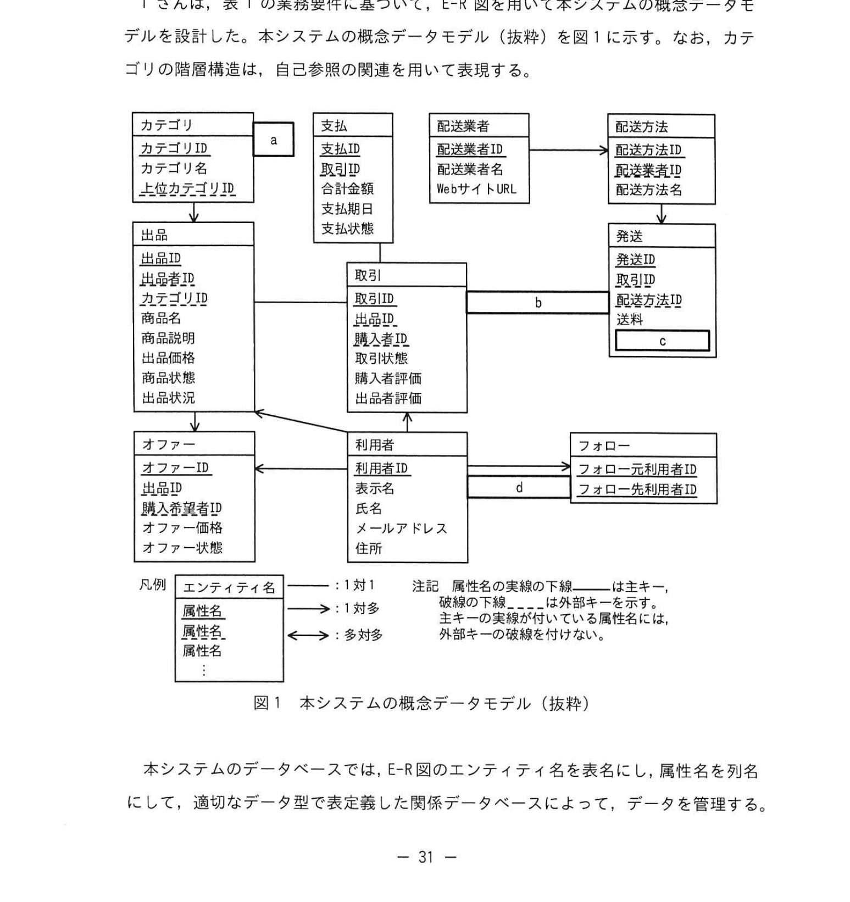
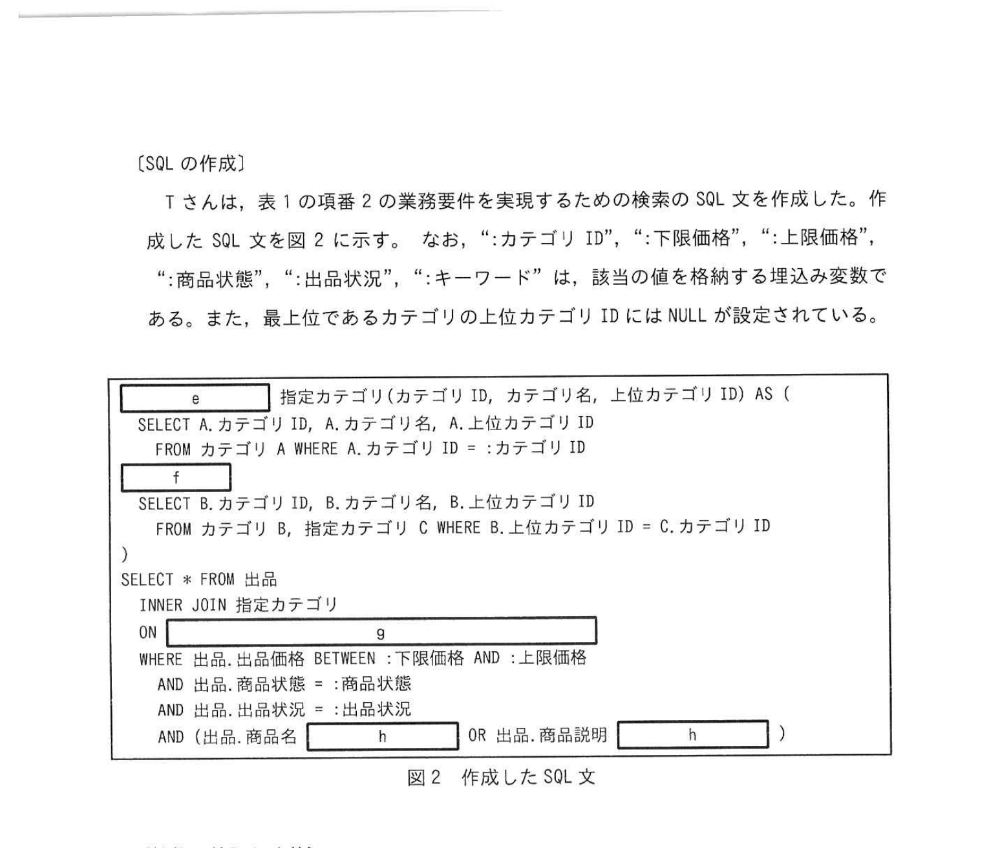

# 2024年秋期（令和6年度秋期）応用情報技術者試験 午後 問6（選択）
## データベース：トレーディングカードの個人間売買サイト

---

## 問題文

**問6** トレーディングカードの個人間売買サイトの構築に関する次の記述を読んで、設問に答えよ。

S社は、トレーディングカード販売業のチェーンを営む中堅企業である。トレーディングカードを個人から買い取り、販売する事業を営んでいる。トレーディングカードの個人間の売買が盛んな市場を受けて、個人間の売買を安心かつ手軽に行える取引プラットフォームをサービスとして提供して、安定的な手数料収入を得る新規事業を立ち上げることにした。S社の情報システム部が新規事業を支える取引プラットフォームとして提供するシステム（以下、本システムという）の企画と開発を担当することにし、T さんがデータベースの設計及び開発を担当することになった。

---

### 〔新規事業の業務要件の確認〕

T さんは、まず新規事業において実現する業務要件を確認した。新規事業の業務要件（抜粋）を表1に示す。

**表1 新規事業の業務要件（抜粋）**

| 項番 | 業務要件 |
|---|---|
| 1 | 本システムの利用者は個人である。利用者は販売したいトレーディングカードを出品できる。 |
| 2 | 利用者は全ての出品に対して、カテゴリ、価格帯（下限価格と上限価格）、商品状態、キーワードでの商品検索ができる。カテゴリを指定して検索した場合は、指定カテゴリ及びそのカテゴリ以下の全サブカテゴリの出品を検索結果として表示する。 |
| 3 | 利用者は出品された商品の購入申込みができる。購入申込みを行うと、出品者はその出品についての取引を行う利用者を決定でき、以降の取引はプラットフォーム内のメッセージ機能を用いて行う。 |
| 4 | 一つの出品に対して複数の利用者が購入申込みができる。S社はこれを取引分を管理するため、S社が各取引に対して発番する追跡番号を付与する。 |
| 5 | 取引は、出品者と購入者間の取引金額の合計を計算し、S社は手数料を差し引いた金額を出品者に支払う。一つの取引に対する計算分を管理するため、S社が各取引に対して発番する追跡番号を付与する。 |
| 6 | 購入者が商品を受領後に商品評価を行い、出品者と購入者の双方が相手に対する利用者評価を行う。 |
| 7 | 出品者が出荷したことを記録し、配送業者のWebサイトURLも記録する。 |
| 8 | 利用者はお気に入りの利用者をフォローできる。フォロー元の利用者がフォロー先の利用者が新たな商品を出品した場合、フォロー元の利用者に通知される。 |

---

### 〔概念データモデルの設計〕

T さんは、表1の業務要件に基づいて、E-R図を用いて本システムの概念データモデルを設計した。本システムの概念データモデル（抜粋）を図1に示す。なお、カテゴリの階層構造は、自己参照の関連を使って表現する。

### 図1 本システムの概念データモデル（抜粋）



> **エンティティ一覧（抜粋）：**
> - **カテゴリ**（カテゴリID, カテゴリ名, 上位カテゴリID）← `[　a　]` （自己参照）
> - **出品**（出品ID, 商品名, 商品説明, 出品価格, 商品状態, 出品状態, カテゴリID）
> - **オファー**（オファーID, 出品ID, 購入者ID, オファー状態IP）
> - **利用者**（利用者ID, 表示名, 氏名, メールアドレス, 住所）
> - **フォロー**（フォロー元利用者ID, フォロー先利用者ID）
> - **取引**（`[　b　]`, オファーID, 取引状態, 出荷日時, 配送業者WebサイトURL, ...）
>
> 凡例: `|` = 1対1, `<` = 1対多

---

### 〔SQLの作成〕

T さんは、表1の項番2の業務要件を実現するための検索のSQL文を作成した。作成したSQL文を図2に示す。なお、「:カテゴリID」、「:下限価格」、「:上限価格」、「:商品状態」、「:キーワード」は、該当の値を格納する埋め込み変数である。また、最上位であるカテゴリの上位カテゴリIDにはNULLが設定されている。

### 図2 作成したSQL文



```sql
    指定カテゴリ(カテゴリID, カテゴリ名, 上位カテゴリID) AS (
    SELECT A.カテゴリID, A.カテゴリ名, A.上位カテゴリID
      FROM カテゴリ A WHERE A.カテゴリID = :カテゴリID
     [　e　]
    SELECT B.カテゴリID, B.カテゴリ名, B.上位カテゴリID
      FROM カテゴリ B, 指定カテゴリ C WHERE B.上位カテゴリID = C.カテゴリID
)
SELECT * FROM 出品
  INNER JOIN 指定カテゴリ
  ON [　g　]
WHERE 出品.出品価格 BETWEEN :下限価格 AND :上限価格
  AND 出品.商品状態 = :商品状態
  AND 出品.商品説明 LIKE [　h　]
```

（先頭に `[　f　]` 句と `WITH` キーワードが続く）

---

### 〔性能の検証と改善〕

T さんはテストデータを用いて図2のSQL文の実行性能を検証したところ、実行を開始してから検索結果が得られるまでの処理時間が長く、実用的でないことが判明した。

本システムでは出品される商品の数が膨大であり、利用者が図2のSQL文を頻繁に実行することが予想される。T さんはキーワード検索が問題点とみており、商品名及び商品説明の列に対しては全文検索エンジンを用いることにした。その他の列に対しては適切なインデックスを設ける。

インデックスの方式は、B-treeインデックスを採用することにした。T さんは、各表の表定義を確認し、性能上の観点でインデックスを設定する列を検討した。出品表の表定義を表2に、カテゴリ表の表定義を表3に示す。

表2及び表3のデータ型の種は、データ型、長さ、精度、位取りを示す。PK欄は主キー、UK欄はUNIQUE制約、非NULL欄は非NULL制約の指定をするかどうかを示す。主キーに対しては、UNIQUE制約は指定しない。カーディナリティ欄は多/高は高、少/低は低、高と低の間は中を記入する。データ分布欄は一様分布に従う場合は高、従わない場合は低を記入する。

---

## 設問

### 設問1

図1中の `[　a　]`〜`[　d　]` に入れる適切なエンティティ間の関連及び属性名を答えよ。エンティティ間の関連及び属性名の表示は、図1の例に倣うこと。

### 設問2

図2中の `[　e　]`〜`[　h　]` に入れる適切な字句又は式を答えよ。

### 設問3

〔性能の検証と改善〕について答えよ。

**(1)** 本文中の下線について、B-treeインデックスの特性を踏まえて、特定の値を指定したときに行数をより絞れるという条件に当てはまるものを、解答群の中から三つ選び、記号で答えよ。

**解答群：**
- ア インデックスを設定した全合に対する条件式をAND演算子で組み合わせた検索は高速化できるが、NOT演算子を用いた条件式による検索は高速化できない
- イ データが一様分布に従うカラムへのインデックスのほうが、そうでないカラムより効果が高い
- ウ 指定した値での完全一致検索は高速化できる
- エ 前方一致検索は高速化できる
- オ 後方一致検索は高速化できない
- カ 範囲検索（BETWEEN）は高速化できる

**(2)** 出品表にインデックスを設定する列と、カテゴリ表にインデックスを設定する列をそれぞれ答えよ。

---

## 解答と解説

### 設問1

**正解：**
- **a=↓（自己参照の矢印）**：カテゴリが自分自身を参照する（上位カテゴリID → カテゴリID の自己参照関連）
- **b=追跡番号**：取引エンティティのキーとなる、S社が発番する追跡番号
- **c=→（1対多の関連）**：オファーと取引の関連（1つのオファーに対して1つの取引）
- **d=→（1対多の関連）**：出品と商品評価の関連

---

### 設問2

**正解：**
- **e=UNION ALL**：再帰CTEの非再帰部と再帰部を結合する句（重複も含めて全行）
- **f=WITH RECURSIVE**：再帰的共通テーブル式（CTE）を定義するキーワード
- **g=出品.カテゴリID = 指定カテゴリ.カテゴリID**：出品と指定カテゴリのJOIN条件
- **h=LIKE '%' || :キーワード || '%'**：キーワードを含む商品説明を検索する部分一致パターン

**再帰CTEの構造：**
```sql
WITH RECURSIVE 指定カテゴリ(カテゴリID, ...) AS (
  -- アンカー部（非再帰部）：指定カテゴリ自身
  SELECT ... FROM カテゴリ WHERE カテゴリID = :カテゴリID
  UNION ALL
  -- 再帰部：上位カテゴリIDで自己結合してサブカテゴリを再帰的に取得
  SELECT ... FROM カテゴリ, 指定カテゴリ WHERE 上位カテゴリID = カテゴリID
)
```

---

### 設問3

**(1) 正解：ウ、エ、カ（または ア、ウ、カ）**

IPA公式答案: ア、ウ、カ

- **ア：正しい** - B-treeはAND条件を組み合わせた検索には有効だが、NOT演算子（≠）ではインデックスを効果的に使えない
- **ウ：正しい** - B-treeは完全一致（= 演算子）検索を高速化できる
- **カ：正しい** - B-treeは範囲検索（BETWEEN、<、>）も高速化できる（ツリー構造を辿るため）
- **イ：誤り** - 一様分布より偏りがある（カーディナリティが高い）列の方がインデックス効果が高い
- **エ：正しい** - 前方一致（LIKE 'abc%'）はB-treeで高速化できる
- **オ：正しい** - 後方一致（LIKE '%abc'）はB-treeでは高速化できない（先頭から比較するため）

**(2) 正解：**
- **出品表**：カテゴリID、出品価格（または商品状態）
- **カテゴリ表**：上位カテゴリID

**理由：**
- `出品.カテゴリID`：JOIN条件に使用される外部キー → B-treeインデックスが効果的
- `出品価格`：BETWEEN句の範囲検索 → B-treeインデックスが効果的、カーディナリティ高
- `カテゴリ.上位カテゴリID`：再帰CTEのWHERE条件 `WHERE B.上位カテゴリID = C.カテゴリID` に使用 → B-treeインデックスが効果的

---

## 参考：主要キーワード

| 用語 | 説明 |
|------|------|
| 自己参照（再帰関連） | 同一エンティティの別インスタンスへの参照。カテゴリの階層構造などに使用 |
| WITH RECURSIVE（再帰CTE） | 自己参照するSQL文。階層構造のデータを再帰的に取得できる |
| UNION ALL | 集合演算子。重複行も含めてすべての行を結合（UNION は重複除去） |
| アンカー部/再帰部 | 再帰CTEの構成要素。アンカー部が初期行、再帰部が繰り返し参照する |
| B-treeインデックス | バランスド木構造のインデックス。完全一致・前方一致・範囲検索に有効 |
| カーディナリティ | 列の値のユニーク度。高カーディナリティほどインデックスの絞り込み効果が大きい |
| LIKE演算子 | 文字列のパターンマッチング。`%` は任意文字列、`_` は任意1文字 |
| 追跡番号 | S社が取引ごとに発番する管理番号。取引エンティティの主キー |
| 全文検索エンジン | 大量テキストの高速検索に特化したエンジン。B-treeより部分一致検索が高速 |
| 共通テーブル式（CTE） | WITH句で定義される一時的な名前付き結果セット。クエリを読みやすくする |
