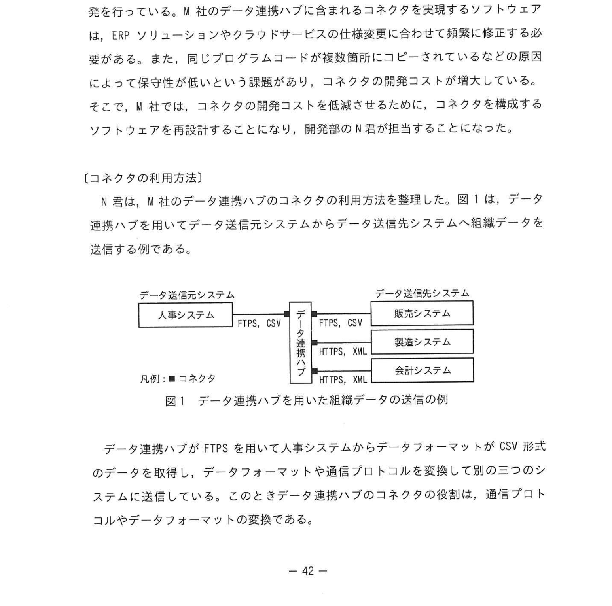
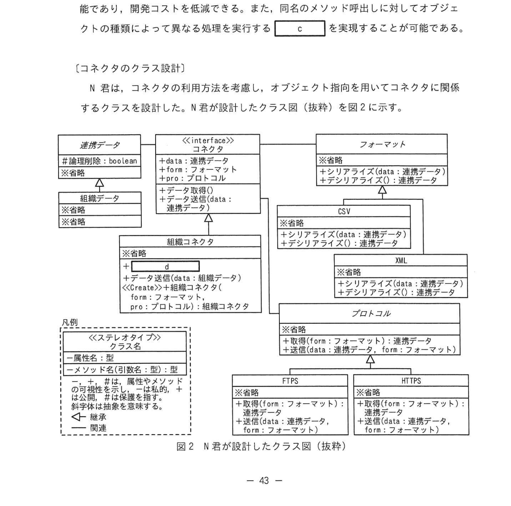

# 2024年秋期（令和6年度秋期）応用情報技術者試験 午後 問8（選択）
## 情報システム開発：オブジェクト指向設計によるコネクタの再設計

---

## 問題文

**問8** オブジェクト指向設計に関する次の記述を読んで、設問に答えよ。

M社は、企業内の複数の情報システムを接続するデータ連携ハブを製造する会社である。M社のデータ連携ハブは、企業の基幹システムを構成するERP（Enterprise Resource Planning）ソリューションやクラウドサービスとデータ連携するための部品であるコネクタの種類が多いことが人気を呼び、売上を増大させている。

M社には既に100名が在籍しており、開発部がソフトウェアの開発を行っている。M社のデータ連携ハブに含まれるコネクタを実現するソフトウェアは、ERPソリューションやクラウドサービスの仕様変更に合わせて随時に修正する必要がある。また、同じプログラムコードが複数箇所にコピーされているなどの原因によって保守性が低いという課題があり、コネクタを実現するソフトウェアを再設計することにし、開発部のN君が担当することになった。

---

### 〔コネクタの利用方法〕

N君は、M社のデータ連携ハブのコネクタの利用方法を整理した。図1は、データ連携ハブを用いてデータ送信元システムからデータ送信先システムへ組織データを送信する例である。

### 図1 データ連携ハブを用いた組織データの送信例

> **構成：**
> - データ送信元システム（人事システム）→ FTPS/CSV → データ連携ハブ
> - データ連携ハブ → FTPS/CSV、HTTPS/XML、HTTPS/XML → データ送信先システム（販売/製造/会計システム）
> 凡例: ■ = コネクタ

データ連携ハブがFTPSを用いて人事システムからデータフォーマットがCSV形式のデータを取得し、データフォーマットや通信プロトコルを変換して別の三つのシステムに送信している。このときデータ連携ハブのコネクタの役割は、通信プロトコルやデータフォーマットの変換である。

---

### 〔オブジェクト指向に関する調査〕

N君は、コネクタを再設計するために、オブジェクト指向について調査した。オブジェクト指向では、ソフトウェアを部品化し、部品の組合せによって目的のソフトウェアを作る。この方式では、データとそのデータに対する処理を一つのオブジェクトにまとめる `[　a　]` という設計方針のもと、外部公開するメソッドを定義する。また、あるオブジェクトの特性を他のオブジェクトに引き継ぐ `[　b　]` が可能であり、関発コストを低減できる。また、同名のメソッド呼出しに対して各オブジェクトの種類によって異なる処理を実行する `[　c　]` を実現することが可能である。

---

### 〔コネクタのクラス設計〕

N君は、コネクタの利用方法を考慮し、オブジェクト指向を用いてコネクタに関係するクラスを設計した。クラス図（抜粋）を図2に示す。

### 図2 N君が設計したクラス図（抜粋）

> **クラス構成（抜粋）：**
>
> **<<interface>> コネクタ**
> - 論理属性: boolean
> - +data: 連携データ, form: フォーマット
> - +データ取得()
>
> **組織コネクタ** （コネクタを実装）
> - +data: 連携データ, form: フォーマット
> - +データ取得()
> - <<Create>> 組織コネクタ(cla: 組織コネクタ)
> - pro: プロトコル/組織コネクタ
>
> **CSV**（フォーマットコネクタ）
> - +シリアライズ(data: 連携データ)
> - +デシリアライズ(data: 連携データ)
>
> **XML**（フォーマットコネクタ）
> - +シリアライズ(data: 連携データ)
> - +デシリアライズ(data: 連携データ)
>
> **プロトコル**（インターフェース）
> - +取得(form: フォーマット): 連携データ
> - +送信(data: 連携データ, form: フォーマット)
>
> **FTPS, HTTPS**（プロトコルを実装）
> - +取得(form: フォーマット): 連携データ
> - +送信(data: 連携データ, form: フォーマット)

まず、送受信するデータのデータ項目を定義する連携データクラスとそれを親クラスとする組織データクラスを設計した。連携データクラスの論理削除属性は、組織データクラスのメソッドからアクセス `[　e　]`。

フォーマットクラス、CSVクラス、XMLクラスは、送受信するデータをCSV形式やXML形式に変換（シリアライズ）したり、連携データクラスのインスタンスを生成（デシリアライズ）したりするクラスである。また、XMLクラスのシリアライズのように、親クラスと同じ名前・引数・戻り値のメソッドを提供することを `[　f　]` という。

プロトコルクラス、FTPSクラス、HTTPSクラスは、データ送受信のためのクラスである。コネクタクラスは、受信するデータのデータ項目に応じた処理行うクラスである。

図2で設計されたクラスを用いて、図1に記載のデータ連携ハブから製造システムへデータを送信する組織コネクタクラスのインスタンスを作成する場合、`[　g　]` クラス及び `[　h　]` クラスから生成したインスタンスを引数に、組織コネクタクラスのインスタンスを作成する。`[　h　]` クラスの送信メソッドの中ではフォーマットクラスのシリアライズメソッドが呼び出されるが、実際には `[　g　]` クラスのシリアライズメソッドが呼び出される。

---

### 〔コネクタの修正〕

N君は、今後予想されるコネクタの修正時に、図2で設計したクラスに対して少ない修正で対応できる柔軟性を検証した。

- 図1に記載の人事システムの研修受講記録データを新たに他システムへ送信する必要がある場合には、①新しいクラスを二つ作成すればよい。また、CSVファイルやXMLファイルの中の講座名などの文字列の文字コード変換する共通機能が必要となった場合には、②図2の**あるひとつの**クラスに文字コード変換のメソッドを追加すればよい。

その後、N君は、コネクタの再設計に関する必要な作業を完了した。

---

## 設問

### 設問1

本文中の `[　a　]`〜`[　c　]` に入れる適切な字句を答えよ。

### 設問2

本文中の `[　d　]` に入れる適切な字句を答えよ。

**(1)** 本文中の `[　e　]` に入れる最も適切な字句を解答群から選び、記号で答えよ。

**解答群：**
- ア できる
- イ できない

**(2)** 本文中の `[　f　]` に入れる適切な字句を答えよ。

**(3)** 本文中の `[　g　]`、`[　h　]` に入れる適切なクラス名を答えよ。

### 設問3

**(1)** 本文中の下線①について、作成すべき二つのクラスを答えよ。

**(2)** 本文中の下線②について、文字コード変換のメソッドを追加するクラスを答えよ。

---

## 解答と解説

### 設問1

**正解：a=カプセル化、b=継承、c=多態性（ポリモーフィズム）**

- **a=カプセル化**：データと処理を一つのオブジェクトにまとめ、外部に必要なメソッドのみ公開する原則
- **b=継承**：親クラスの特性（属性・メソッド）を子クラスが引き継ぐ仕組み。再利用性を高める
- **c=多態性（ポリモーフィズム）**：同名メソッド呼出しで、オブジェクトの種類によって異なる処理が実行される特性

---

### 設問2

**(1) 正解：d=データ取得()**

コネクタインターフェースに定義されるメソッドは `データ取得()`。これを組織コネクタクラスが実装する。

**(2) 正解：e=ア（できる）**

連携データクラスの論理削除属性は、継承した組織データクラスからアクセス**できる**（継承により親クラスの属性を参照可能）。

**(3) 正解：f=ア（オーバーライド）**

親クラスと同名・同引数・同戻り値のメソッドを子クラスで再定義することを**オーバーライド**という。XMLクラスがフォーマットクラスのシリアライズをオーバーライドしている。

**(4) 正解：g=XML、h=HTTPS**

製造システムへはHTTPS/XMLで送信（図1より）。
- `g=XML`：フォーマットクラス（XMLに変換）
- `h=HTTPS`：プロトコルクラス（HTTPS通信）

組織コネクタのコンストラクタに `XML` と `HTTPS` のインスタンスを渡してインスタンス化する。

---

### 設問3

**(1) 正解：連携データクラス（研修受講記録データ対応）、コネクタクラス（研修受講記録コネクタ）**

研修受講記録データを送信するには:
- 研修受講記録に対応する**連携データのサブクラス**（研修受講記録データクラス）
- それを処理する**コネクタのサブクラス**（研修受講記録コネクタクラス）
の2クラスを作成すればよい。

IPA公式答案: 
- 連携データ・コネクタ（の新しいサブクラス2つ）

**(2) 正解：フォーマットクラス**

CSVとXMLの両方に共通して使える文字コード変換機能は、CSVクラスとXMLクラスの**親クラス**であるフォーマットクラスに追加すれば、両サブクラスで共通利用できる。これがオブジェクト指向の継承を活かした設計。

---

## 参考：主要キーワード

| 用語 | 説明 |
|------|------|
| カプセル化 | データとメソッドをクラスにまとめ、内部実装を隠蔽する原則 |
| 継承（インヘリタンス） | 親クラスの属性・メソッドを子クラスが引き継ぐ仕組み。コードの再利用性を向上 |
| 多態性（ポリモーフィズム） | 同一インターフェースで異なる処理を実行できる特性。オーバーライドで実現 |
| オーバーライド | 親クラスのメソッドを子クラスで同名・同シグネチャで再定義すること |
| インターフェース | メソッドの定義（宣言）のみ持ち、実装を持たない抽象的な型定義 |
| シリアライズ | オブジェクトをCSVやXMLなどのデータ形式に変換すること |
| デシリアライズ | データ形式（CSV/XML等）からオブジェクトを生成すること |
| データ連携ハブ | 複数のシステムを接続・仲介するミドルウェア。プロトコル・フォーマット変換を担う |
| コネクタ | データ連携ハブの部品。特定プロトコルやフォーマットに対応する変換モジュール |
| FTPS | FTPにSSL/TLS暗号化を追加したファイル転送プロトコル |
| HTTPS | HTTPにSSL/TLS暗号化を追加したWebプロトコル。TCP/443使用 |
