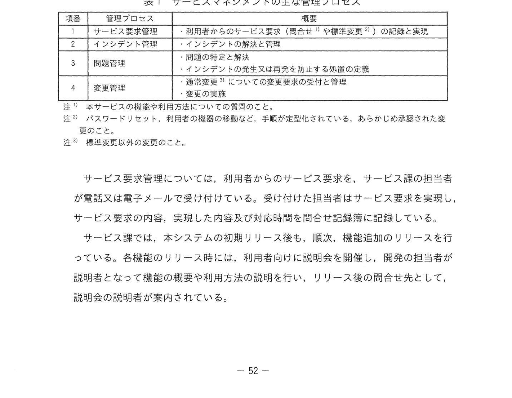
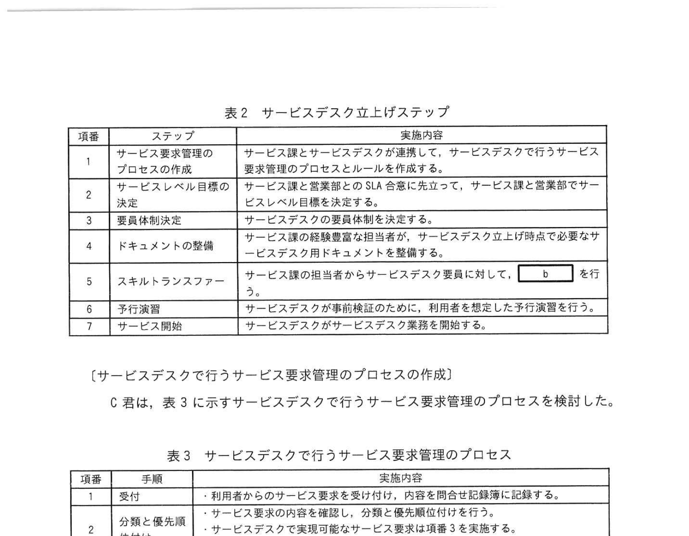
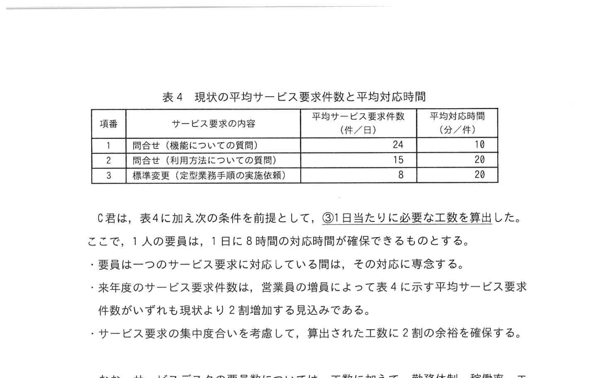

# 2024年秋期（令和6年度秋期）応用情報技術者試験 午後 問10（選択）
## サービスマネジメント：サービスデスクの立上げ

---

## 問題文

**問10** サービスデスクの立上げに関する次の記述を読んで、設問に答えよ。

B社は、中堅の電子機器販売会社で、全国に営業拠点がある。B社の営業部は、営業拠点に営業員を配置し、商品を販売している。販売数量に増加に増幅しているので、今後、営業員の増員を予定している。B社のシステム部は、営業支援システム（以下、本システムという）の設計、開発及び運用を行っており、本システムを営業支援サービス（以下、本サービスという）として、営業員に提供している。また、サービス課は、サービスマネジメント活動を行っており、それぞれの活動に管理プロセスを定めている。サービス課には現在B名の担当者がいる。サービス課のB名が課長の下でサービスデスク業務を担当している。サービスマネジメントの主な管理プロセスを表1に示す。

### 表1 サービスマネジメントの主な管理プロセス

> | 項番 | 管理プロセス | 概要 |
> |---|---|---|
> | 1 | サービス要求管理 | 利用者からのサービス要求（問合せ・手順確認等）の記録と実現 |
> | 2 | インシデント管理 | インシデントの解決と管理 |
> | 3 | 問題管理 | 問題の特定・解決 / インシデントを再発を防止するための対策の策定 |
> | 4 | 変更管理 | 通常変更・標準変更についての変更承認と管理 |
>
> 注記1: 本サービスの機能の利用方法に関するものを問合せという。
> 注記2: パスワードリセット、利用者の機能の切替など、手順が定型化されている、あらかじめ承認された変更を標準変更という。

サービス要求管理については、利用者からのサービス要求を、サービス課の担当者が電話又は電子メールで受け付けている。受け付けた担当者はサービス要求を実現し、サービス要求の内容、実現した内容及び応対時間を問合せ記録簿に記録している。

サービス課では、本システムの初期リリース後も、順次、機能追加のリリースを行っている。各機能のリリース時には、担当者が利用者向けに説明会を開催し、開発の担当者が説明者となって機能の概要や利用方法の説明を行い、リリース後の問合せ先として、説明会の説明者が案内されている。

---

### 〔サービスデスクの立上げの検討〕

D課長は、サービスデスクについて、「サービス課の業務量の増加に対応するために、業務を極力サービスデスクに移管する」とともに「一次解決率をできるだけ高く保ち、顧客満足度を向上させる」という方針を掲げた。

C君は、D課長の方針を受け、サービス要求のうち、問合せについては、サービスデスク業務が「問合せ対応ノウハウ集を用いることで、一次解決率を向上させたい」と考えた。なお、サービス要求のうち、標準変更については、サービス課が現在利用している定型業務手続書を参照して、サービスデスク業務がサービス要求を実現できることを確認した。これらを踏まえて、C君は表2に示すサービスデスク立上げステップを定めた。

### 表2 サービスデスク立上げステップ

> | 項番 | ステップ | 実施内容 |
> |---|---|---|
> | 1 | サービス要求管理プロセスの作成 | サービス課とサービスデスクが連携して、サービスデスクが行うサービス要求管理のプロセスとルールを作成する |
> | 2 | サービスレベル目標の決定 | サービス課と営業部との合意に基づいて、サービス課と営業部でサービスレベル仕様を決定する |
> | 3 | 要員体制決定 | サービスデスクに必要な要員と人数を決定する |
> | 4 | ドキュメントの準備 | サービスデスクが独自確信を有効活用できるように、サービスデスク立ち上げ時点で必要なサービスデスク用ドキュメントを整備する |
> | 5 | スキルトランスファー | サービス課の担当者からサービスデスク要員に対して、`[　b　]` を行う |
> | 6 | 予行演習 | サービスデスクが業務を始める前に、利用者を想定した予行演習を行う |
> | 7 | サービス開始 | サービスデスクのサービス実施を開始する |

---

### 〔サービスデスクで行うサービス要求管理のプロセスの作成〕

C君は、表3に示すサービスデスクで行うサービス要求管理のプロセスを検討した。

**表3 サービスデスクで行うサービス要求管理のプロセス（抜粋）：**

| 項番 | 手順 | 実施内容 |
|---|---|---|
| 1 | 受付 | 利用者からのサービス要求を受け付けて、内容を問合せ記録簿に記録する |
| 2 | 分類と優先度付け | サービス要求の内容を確認し、分類と優先度付けを行う。サービスデスクで実現可能なサービス要求は手順3を実施する |
| 3 | サービス要求の実施 | 問合せについては、問合せマニュアル `[　a　]` を参照して回答する。標準変更については、定型業務手続書を参照して実施する |
| 4 | エスカレーション | C君の判断でエスカレーションする。サービス課の担当者が対応し、サービス課の担当の担当者から対応結果を受けたら応対応を確認する |
| 5 | サービス要求の確認 | 実現できている場合は問合せ記録簿を更新する。実現できていない場合は手順2から再度実施する |
| 6 | 終了 | 必要に応じて対応ノウハウ集の追記追加を行い、問合せ記録簿を更新し、終了する |

---

C君は、表3をD課長にレビューしてもらい、質問と指示を受けた。そのときのD課長とC君の会話は次のとおりである。

D課長：項番3で標準変更については、現状の定型業務手続書を使うことになっているが、定型業務手続書は、よく整備されており、対応可能です。

C君：定型業務手続書は、よく整備されており、対応可能です。

D課長：①サービス課の担当者が行っている業務に定型化できるものがないかを調査してください。

C君：調査して報告します。

その後、C君は指示された調査を実施し、D課長に報告して了承された。

---

### 〔サービスレベル目標の決定〕

サービス課と営業部とのSLA合意に先立って、サービス課内部で会議を開催した。会議の中で、SLAには、サービスデスクの稼働時間、コミュニケーション手段、サービス要求の実現に要する平均時間のほか、決定的な要因として、②現状のサービス要求管理における課題の解消状況分かるKPIを設定して管理を行い、顧客満足度を上げていく、という説明があった。

---

### 〔要員体制決定〕

C君は、来年度のサービスデスクの要員体制を決定するために、サービスデスク要員の工数を算出することにした。そこで、問合せ記録簿からサービス要求管理に要した対応時間を調査した。現状の平均サービス要求件数と平均対応時間を表4に示す。

### 表4 現状の平均サービス要求件数と平均対応時間

> | 項番 | サービス要求の内容 | 平均サービス要求件数（件/日） | 平均対応応時間（分/件） |
> |---|---|---|---|
> | 1 | 問合せ（機能についての質問） | 24 | 10 |
> | 2 | 問合せ（利用方法についての質問） | 15 | 20 |
> | 3 | 標準変更（定型業務手続きの実施依頼） | 8 | 20 |

C君は、表4に加え次の条件を前提として、①1日当たりに必要な工数を算出した。

- 1日の業務時間は8時間が利用可能である。
- 要員は一つのサービス要求に対応している間は、その対応に専念する。
- 来年度のサービス要求件数は、営業員の増加によって表4の件数よりも現状より**2割増加**する見込みである。
- サービス要求の集中度を考慮し、算出した工数に**2割の余裕**を確保する。

なお、サービスデスクの要員体制については、工数に加えて、勤務体制、稼働率、エスカレーションの割合、採用する要員の技能なども考慮して決定することにした。

---

## 設問

### 設問1

**(1)** 本文中の `[　a　]` に入れる適切な字句を15字以内で答えよ。

**(2)** 本文中の `[　b　]` に入れる適切な字句を15字以内で答えよ。

### 設問2

**(1)** 表3中の `[　c　]` に入れる適切な字句を15字以内で答えよ。

**(2)** 本文中の下線①について、この調査を指示した目的をD課長の方針を踏まえて35字以内で、目的達成に有効な調査内容を表1中の字句を用いて35字以内で答えよ。

### 設問3

本文中の下線②のKPIの内容を10字以内で答えよ。

### 設問4

本文中の下線③について、1日当たりに必要な工数は何人日か。小数第1位を切り上げて整数で答えよ。

---

## 解答と解説

### 設問1

**(1) 正解：a=最初の連絡で回答**

サービスデスク要員が問合せ対応ノウハウ集を活用して、利用者からの問合せに対して**最初の連絡で回答**できるようにすることで、一次解決率を向上させる。

**IPA公式：a=最初の連絡で回答**

**(2) 正解：b=サービスデスク用ドキュメントの説明**

スキルトランスファー（表2 項番5）でサービス課の担当者からサービスデスク要員に行うのは、**サービスデスク用ドキュメントの説明**（ノウハウ集の使い方・標準手続書の説明など）。

---

### 設問2

**(1) 正解：c=問合せ対応ノウハウ集**

表3項番3で、問合せについては操作マニュアルと**問合せ対応ノウハウ集**を参照して回答する。

**IPA公式：c=問合せ対応ノウハウ集**

**(2) 正解：**
- **目的：現在のサービス課の業務を極力サービスデスクに移管するため（28字）**
- **調査内容：通常変更の中に標準変更にできるものがないかを調査する（28字）**

D課長の方針「業務を極力サービスデスクに移管する」を踏まえ、通常変更の中で定型化（標準変更化）できるものを探すことが目的。

**IPA公式：目的=現在のサービス課の業務を極力サービスデスクに移管するため／調査内容=通常変更の中に標準変更にできるものがないかを調査する。**

---

### 設問3

**正解：一次解決率**

下線②のKPI。D課長の方針「一次解決率をできるだけ高く保ち、顧客満足度を向上させる」から、設定すべきKPIは**一次解決率**。

**IPA公式：一次解決率**

---

### 設問4

**正解：3（人日）**

**計算：**

**1日あたり件数（2割増し）：**
- 問合せ（機能）: 24 × 1.2 = 28.8件
- 問合せ（利用方法）: 15 × 1.2 = 18件
- 標準変更: 8 × 1.2 = 9.6件

**1日あたりの総対応時間：**
- 問合せ（機能）: 28.8 × 10分 = 288分
- 問合せ（利用方法）: 18 × 20分 = 360分
- 標準変更: 9.6 × 20分 = 192分
- 合計: 288 + 360 + 192 = **840分**

**2割の余裕を確保：**
840 × 1.2 = **1,008分**

**1日8時間 = 480分/人**

**必要人数：**
1,008 ÷ 480 = 2.1 → 切り上げ = **3人**

---

## 参考：主要キーワード

| 用語 | 説明 |
|------|------|
| サービスデスク | 利用者からの問合せや要求を一元受付する窓口機能。ITILで定義 |
| サービス要求管理 | 利用者からの問合せ・標準変更依頼を管理するプロセス |
| インシデント管理 | サービスの中断・低下（インシデント）を迅速に解決するプロセス |
| 標準変更 | 手順が定型化・承認済みで毎回の承認不要な変更（パスワードリセット等） |
| 一次解決率（FCR） | エスカレーションなしに最初の接触で解決した割合。サービスデスクの主要KPI |
| SLA（サービスレベル合意） | サービス提供者と利用者の間で合意されたサービスレベルの契約 |
| エスカレーション | サービスデスクで解決できない場合に上位の専門担当者に引き継ぐこと |
| スキルトランスファー | 知識・技能を別の担当者・チームへ移転・教育すること |
| 問合せ対応ノウハウ集 | よくある問合せと回答をまとめたドキュメント。一次解決率向上のために使用 |
| KPI（重要業績評価指標） | 目標達成度を定量的に測る指標。一次解決率・対応時間など |
