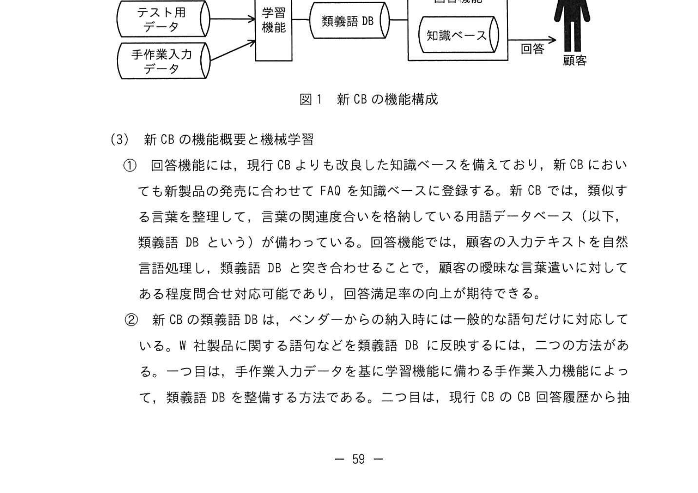

# 2024年秋期（令和6年度秋期）応用情報技術者試験 午後 問11（選択）
## システム監査：チャットボット導入における開発計画の監査

---

## 問題文

**問11** チャットボット導入における開発計画の監査に関する次の記述を読んで、設問に答えよ。

W社は、中堅の家電メーカーである。顧客サービス部では、製品の特徴や使用方法に関する顧客からの問合せなどに回答するコールセンターを運用しており、Web上で顧客からの問合せに対し、定型文で自動的に回答するチャットボット（以下、現行CBという）で作業効率を向上させてきた。

問合せ内容をより的確に解釈するなど、回答の品質向上のために、顧客サービス部長がシステムオーナーとなり、現行CBのベンダーが提供する、ディープラーニングを利用していない機械学習方式のチャットボット（以下、新CBという）を導入するプロジェクトを立ち上げることになった。

企画プロセスの完了を受けて、W社監査部のシステム監査チームは、新CBの開発計画の適切性について監査を実施することになった。そのために実施した予備調査の結果、次のことを把握した。

---

### 〔予備調査の結果〕

**(1) 現行CBの概要と課題**

① W社では、季節性のある製品を多く取りそろえているので、顧客から寄せられる問合せ数は、季節性のある製品では季節によって偏りがある。

② 現行CBでは、顧客が入力した曖昧な言葉に対応できず、FAQに回答が存在するにもかかわらず、問合せを解釈できずに回答が表示されないことや、誤った回答を表示することがある。顧客が現行CBの回答では不十分と感じた場合には、顧客からの要望で、コールセンターのオペレーターが代わって問合せ対応を実施している。

③ 導入効果をモニタリングするために、顧客の入力テキスト、現行CBが表示した回答、現行CBの回答に対して"役立った"かどうかの結果などを、CB回答履歴として保存している。これらの情報を分析し、顧客から"役立った"という評価を得た割合（以下、回答満足率という）を効果測定の指標の一つにしている。

④ 新製品については、発売に合わせて新規にFAQを知識ベースに登録している。今回のプロジェクト期間中にも、発売が予定されている新製品が複数ある。

⑤ 現行CBを導入した際には、受入テストを顧客サービス部員が参加せずに開発担当者だけが実施したことから、新製品に関する問合せに対して適切に回答できないなど、本番移行後に混乱を招く問題点があった。

---

**(2) プロジェクトの概要**

これまで、企画プロセスにおいて新CB導入の目的の明確化、システム化計画の立案、及びPoC（Proof of Concept：概念実証）を実施しており、PoCの結果は品質向上の効果を見込めるものであった。現在、開発計画書案を顧客サービス部とシステム部が共同で作成したところである。関係する役員、及び財務部、顧客サービス部、システム部の各部長で構成するプロジェクト運営委員会で開発計画書案を承認する予定である。

今後の開発プロセスにおいて要件定義、追加の機械学習を含む設計、実装、テスト、受入テスト、及び本番移行を予定している。新CBの機能構成を図1に示す。

### 図1 新CBの機能構成

> **構成（矢印はデータの流れ）：**
> - 学習用データ／テスト用データ／手作業入力データ → 学習機能 → 類義語DB → 回答機能（知識ベースを内包）
> - 問合せ → 回答機能 → 回答 → 顧客

---

**(3) 新CBの機能概要と機械学習**

① 回答機能には、現行CBよりも改良した知識ベースを備えており、新CBにおいても新製品の発売に合わせてFAQを知識ベースに登録する。新CBでは、類似する言葉を整理して、言葉の関連度合いを格納している用語データベース（以下、類義語DBという）が備わっている。回答機能では、顧客の入力テキストを自然言語処理し、類義語DBと突き合わせることで、顧客の曖昧な言葉遣いに対してある程度問合せ対応可能であり、回答満足率の向上が期待できる。

② 新CBの類義語DBは、ベンダーからの納入時には一般的な語句だけに対応している。W社製品に関する語句などを類義語DBに反映するには、二つの方法がある。一つ目は、手作業入力データを基に学習機能に備わる手作業入力機能によって、類義語DBを整備する方法である。二つ目は、現行CBのCB回答履歴から抽出した文章を自然言語処理によって品詞別に分解し、AIモデルによって機械学習することで類義語DBを整備する方法である。PoCでは、機械学習によって類義語DBを整備する際のサーバ処理に想定以上の時間を要していた。

③ PoCにおける機械学習による類義語DBの整備では、現行CBのCB回答履歴から6か月分を学習用データ及びテスト用データとして、ランダムに抽出した。また、回答満足率を指標にして、効果の目標レベルを定め、新CBの有効性を判断している。

④ 新CBでは、設計において、追加の機械学習によって類義語DBの精度を高め、回答満足率を上げる想定である。設計後においても、本番運用向けの類義語DBの学習では、再学習を実施する。

---

### 〔監査手続案の作成〕

予備調査の結果を踏まえて、システム監査チームが作成した監査手続案（抜粋）を表1に示す。

### 表1 監査手続案（抜粋）

| 項番 | 想定されるリスク | 監査手続 |
|---|---|---|
| 1 | 追加の機械学習後のテスト結果では効果があったにもかかわらず、本番運用において効果が認められない。 | 開発計画書案を閲覧し、追加の機械学習における `[　a　]` 用データとテスト用データを別に準備していることを確認し、評価する計画になっているかどうか確かめる。 |
| 2 | 類義語DBの整備が不十分であったことによって、新製品に関する質問に対して、新CBが適切な回答をしない。 | 開発計画書案を閲覧し、発売前の新製品に関して適切に回答するために、`[　b　]` 機能による類義語DBの整備を実施する計画を策定しているかどうか確かめる。 |
| 3 | 受入テスト結果では当初予定の導入効果がなかったにもかかわらず、再学習などの対応を実施せず、本番運用に移行する。 | 開発計画書案を閲覧し、本番移行の可否判断で使用する適切な評価項目とその項目に設定した具体的な効果の `[　c　]` が定められているかどうか確かめる。 |
| 4 | テストにおいて不具合を発見した際に原因箇所の特定に時間を要したり、同じ不具合が本番運用で発生したりする。 | 開発計画書案を閲覧し、次を実施する計画になっているかどうか確かめる。 ・テストの手順が策定され、手順にのっとりテストを実施する。 ・テスト結果と不具合の対応状況を文書化して保管するとともに、プロジェクト関係者による `[　d　]` を適切に実施する。 |

---

### 〔監査部長の指示〕

監査部長は、監査手続案をレビューして、次のとおりシステム監査チームに指示した。

**(1)** 表1項番1について、設計における追加の機械学習では、類義語DBの整備がスケジュールどおり完了しないおそれがある。機械学習を実行するサーバに対する非機能要件の一つである `[　e　]` が、PoCを実施した際の実績データから導いた要件になっているか確かめること。

**(2)** 表1項番2について、新製品だけでなく、現行の `[　f　]` に関する問合せへの回答について、学習用データが不十分で、適切に回答できないおそれがある。設計における追加の機械学習では、製品を網羅する観点から学習用データを準備する計画になっているか確かめること。

**(3)** 表1項番3について、新CBの有効性を確保するために、`[　g　]` に先立って、プロジェクト運営委員会が、当初予定の導入効果が得られる見込みを評価する計画になっているか確かめること。

**(4)** 追加する監査手続として、現行CB導入時における問題点を踏まえて、今後の開発プロセスにおいて顧客サービス部による `[　h　]` が適切に実施される計画になっているか確かめること。

---

## 設問

### 設問1

表1の監査手続案について答えよ。

**(1)** 表1中の `[　a　]`、`[　b　]` に入れる適切な字句を、それぞれ5字以内で答えよ。

**(2)** 表1中の `[　c　]` に入れる適切な字句を、本文中の字句を用いて5字以内で答えよ。

**(3)** 表1中の `[　d　]` に入れる適切な字句を、5字以内で答えよ。

### 設問2

〔監査部長の指示〕について答えよ。

**(1)** 本文中の `[　e　]` に入れる最も適切な字句を解答群の中から選び、記号で答えよ。

**解答群：** ア 外部インタフェース要件／イ 性能要件／ウ セキュリティ要件／エ 保守性要件

**(2)** 本文中の `[　f　]`〜`[　h　]` に入れる適切な字句を、それぞれ10字以内で答えよ。

---

## 解答と解説

### 設問1

**(1) 正解：a=学習、b=手作業入力**

- **a=学習**：機械学習では学習用データとテスト用データを別に準備することが重要。学習用データでモデルを学習し、テスト用データで効果を評価する。
- **b=手作業入力**：発売前の新製品はCB回答履歴が存在せず機械学習では整備できない。学習機能に備わる**手作業入力機能**（手作業入力データを基に類義語DBを整備）による整備計画を確認する。

**IPA公式：a=学習、b=手作業入力**

**(2) 正解：c=目標レベル**

本番移行の可否判断に使う具体的な効果の**目標レベル**（本文③「効果の目標レベルを定め」に対応）が定められているかを確認する。

**IPA公式：目標レベル**

**(3) 正解：d=レビュー**

テスト結果と不具合の対応状況を文書化して保管するとともに、プロジェクト関係者による**レビュー**を適切に実施することで、対応漏れや同一不具合の再発を防ぐ。

**IPA公式：レビュー**

---

### 設問2

**(1) 正解：イ（性能要件）**

PoCで「機械学習によって類義語DBを整備する際のサーバ処理に想定以上の時間を要していた」ことから、機械学習を実行するサーバに対する非機能要件は処理時間に関わる**性能要件**。PoCの実績データから導いた要件になっているかを確認する。

**IPA公式：イ**

**(2) 正解：f=季節性のある製品、g=本番移行、h=受入テスト**

- **f=季節性のある製品**：現行CBの課題①で「季節性のある製品では季節によって偏りがある」とあり、新製品だけでなく季節性のある製品の問合せに対する学習用データ不足のおそれがある。
- **g=本番移行**：新CBの有効性を確保するため、本番移行に先立って導入効果の見込みを評価する。
- **h=受入テスト**：現行CB導入時の問題点（受入テストを顧客サービス部員が参加せず開発担当者だけで実施）を踏まえ、顧客サービス部による受入テストが適切に実施される計画かを確認する。

**IPA公式：f=季節性のある製品、g=本番移行、h=受入テスト**

---

## 参考：主要キーワード

| 用語 | 説明 |
|------|------|
| チャットボット（CB） | テキストや音声で自動的に会話するプログラム。FAQ対応に活用 |
| 機械学習（ML） | データからパターンを学習して予測・判断するAI技術 |
| ディープラーニング | 深層ニューラルネットワークを使った機械学習の一種。新CBは非採用 |
| PoC（概念実証） | 新技術・アイデアの実現可能性を小規模に検証するプロセス |
| 類義語DB | 類似する言葉を整理し言葉の関連度合いを格納する用語データベース |
| 学習用データ / テスト用データ | 機械学習では学習用データでモデルを学習し、テスト用データで精度評価する。両者は別に準備するのが原則 |
| 回答満足率 | 顧客から"役立った"と評価された割合。CBの効果測定のKPI |
| 非機能要件（性能要件） | 処理時間・応答時間など、機能以外の品質要件 |
| 受入テスト | システム導入前に利用部門が行う最終確認テスト（UAT） |
| 本番移行 | テスト環境から実際の運用環境へシステムを切り替えること |
| システム監査 | 情報システムのリスク管理やコントロールの適切性を第三者が評価・確認すること |
| 自然言語処理（NLP） | テキストを解析・理解・生成するAI技術。チャットボットの中核技術 |
