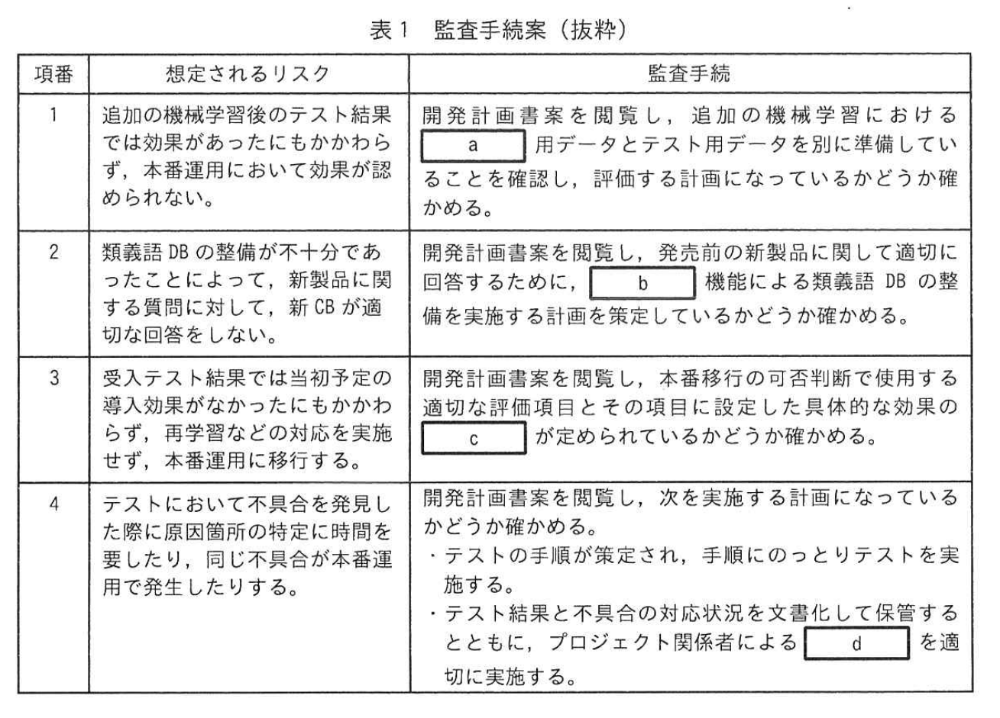

# 2024年秋期（令和6年度秋期）応用情報技術者試験 午後 問11（選択）
## システム監査：チャットボット導入における開発計画の監査

---

## 問題文

**問11** チャットボット導入における開発計画の監査に関する次の記述を読んで、設問に答えよ。

W社は、中堅の家電メーカーである。顧客サービス部では、製品の特徴や使用方法に関する顧客からの問合せなどに回答するコールセンターを運用しており、Webから顧客への問合せに対し、定型文で自動的に回答するチャットボット（以下、現行CBという）で作業効率を向上させてきた。

問合せ内容をより詳しく解析するなど、回答の品質向上のために、顧客サービス部長がシステムオーナーとなり、現行CBのベンダーが提供するディープラーニングを利用していない機械学習方式のチャットボット（以下、新CBという）を導入するプロジェクトを立ち上げることになった。

企画プロセスの完了を受けて、W社監査部のシステム監査チームは、新CBの開発計画の適切性について監査を実施することになった。そのために実施した予備調査の結果、次のことを把握した。

---

### 〔予備調査の結果〕

**(1) 現行CBの概要と課題**

① W社では、製品を多く取りそろえているので、顧客から寄せられる問合せ数は、季節性のある製品に関する問合せはもちろん、新製品の発売によっても増加する傾向がある。

② 現行CBは、曖昧性のある言葉に対応できず、問合せが解決されないことや、誤った回答を表示することがある。顧客から現行CBの回答では解決しないと言われると、コールセンターのオペレーターが代わって問合せ対応を実施している。

③ 導入効果をモニタリングするために、顧客の入力コンテキスト、現行CBが表示した回答、顧客の評価（「役立った」かどうかの評価）を保存している。これらの情報を分析することで、顧客から「役立った」という評価を得られた（以下、回答適正率という）の測定の目標の一つとして、回答適正率を向上させる目標を設定して管理している。

④ 新製品に合わせてFAQを発行した後に新製品に関する問合せへの回答が追加されるが、回答を追加する際に、現行CBの回答の質が十分かどうかを確認する作業が行われていなかった。

⑤ 現行CBを導入した際には、受入テストを顧客サービス部門が参加せずに開発担当者だけが実施したことから、新製品に関する問合せに対して適切に回答できないなど、本番移行後に混乱を招く問題点があった。

---

**(2) プロジェクトの概要**

これまで、企画プロセスにおいて新CB導入の目的明確化、システム化計画の立案、及びPoC（Proof of Concept：概念実証）を実施しており、PoCの結果は品質向上の見込みが確認されたところである。現在、開発計画書をシステム部とシステム部が共同作成したところである。関係する役割として、B担当役、及び担当部署、顧客サービス部、及びシステム部の各部門の部門長でプロジェクト計画審査委員会で開発計画書を承認する予定である。

今回のプロジェクトにおいて要件定義、追加の機械学習を含む設計、実装、テスト、受入テスト、及び本番移行を予定している。新CBの機能構成を図1に示す。

### 図1 新CBの機能構成

> **構成：**
> - 学習データ → 機械学習 → 予測モデル
> - 問合せ → 予測モデル → 回答
> - 回答確認 → 回答データベース（DB）
>
> 入力した文章を自然言語処理によって品詞別に分解し、AIモデルによって機械学習することで予測モデルを生成する。

---

**(PoC（概念実証）)**

① PoC における機械学習のための予測語DB の整備には、現行CB の C3 の回答履歴から6か月分を学習データ及びテスト用データとして使用した。また、回答適正率を指標として、効果の目標レベルを設定し、新CBの有効性を判断した。

② 新CBでは、設計において、追加の機械学習によって予測語DBの精度を高め、回答適正率を上げることが目的である。設計においても、本番移行向けの不本意向けの予測語DBの学習では、再学習を実施する。

③ PoC において機械学習のための予測語DBの整備では、現行CBのC3の回答履歴から6か月分を学習データ及びテスト用データとして使用した。また、回答適正率を指標として効果の目標レベルを設定し、新CBの有効性を判断した。

④ 新CBでは、設計において、追加の機械学習によって予測語DBの精度を高め、回答適正率を上げることが目的である。

---

### 〔監査手続案の作成〕

予備調査の結果を踏まえて、システム監査チームが作成した監査手続案（抜粋）を表1に示す。

### 表1 監査手続案（抜粋）

> | 項番 | 想定されるリスク | 監査手続 |
> |---|---|---|
> | 1 | 追加の機械学習のテスト結果果によっては効果が上がらないことがあり、その場合、学習データのテスト検証結果が不十分になる | 開発計画書を閲覧し、追加の機械学習において `[　a　]` データテスト用データーを区別して記載していることを確認し、 `[　a　]` しているかどうかを確かめる |
> | 2 | 予測語DBの整備がうまくいかないことによって、新製品に関する問合せに対して適切に回答できないおそれがある | 開発計画書を閲覧し、`[　b　]` 機能による予測語DBの整備計画を確認する |
> | 3 | 受入テストの適切な実施者が特定不定により、本番移行後に現行CBと同様の問題が生じるおそれがある | 開発計画書を閲覧し、受入テストの適切な実施者の特定について `[　c　]` が定まっているかどうかを確かめる |
> | 4 | テスト結果を実装へ反映させるための管理が徹底されない場合、テスト結果に対する対応漏れが生じるおそれがある | 開発計画書を閲覧し次を実施する第二次のなっているかどうかを確かめる。・テスト結果が不合格の対応状況を見える化して保管するとともに、プロジェクト管理者による `[　d　]` を選択する |

---

### 〔監査部長の指示〕

監査部長は、監査手続案をレビューして、次のとおりシステム監査チームに指示した。

1. 表1項番1について、設計における追加の機械学習については、予測語DBの整備がスケジュールどおりに進まないおそれがある機能要件の一つである `[　e　]` が、PoCを実施した際の実測データから導出された要件として確かめられるかどうかを確かめること。

2. 表1項番2について、新製品がでてきてはいても、現行の `[　f　]` に関する問合せへの回答に対して、学習用データが不十分で、適切な回答の追加ができないおそれがある。開発計画書に学習データを補充する際の業務を補充する計画になっているかどうかを確かめること。

3. 表1項番3について、新CBの有効性を確保するために、`[　g　]` に先立って、プロジェクト運営委員会が、初期予定の導入数が得られる見込みを評価する計画になっているかどうかを確かめること。

4. 追加するシステム監査手続として、現行CB導入時の問題点を踏まえると、今後の問題への対処として適切な `[　h　]` の実施者について確かめること。

---

## 設問

### 設問1

**(1)** 表1中の `[　a　]`〜`[　d　]` に入れる適切な字句を答えよ。

**(2)** 本文中の `[　c　]` に入れる目標レベルを答えよ。

**(3)** 本文中の `[　d　]` に入れる適切な字句を答えよ。

### 設問2

**(1)** 本文中の `[　e　]` に入れる適切な字句を答えよ。

**(2)** 本文中の `[　f　]`〜`[　h　]` に入れる適切な字句を答えよ。

---

## 解答と解説

### 設問1

| 空欄 | 正解 | 根拠 |
|---|---|---|
| **a** | 学習 | 機械学習では学習データとテスト用データを分けることが重要。訓練（学習）データで学習し、テストデータで評価 |
| **b** | 手作業入力 | 新製品に関する問合せへの回答追加は、自動学習だけでは不十分。手作業での入力・確認が必要 |
| **c** | 目標レベル | 受入テストの合否判定基準として、回答適正率の目標レベルが定まっているかを確認する |
| **d** | レビュー | テスト結果の不合格対応を見える化し、プロジェクト管理者によるレビューで対応漏れを防ぐ |

---

### 設問2

| 空欄 | 正解 | 根拠 |
|---|---|---|
| **e** | イ | 設計における追加機械学習の機能要件で、PoCの実測データから導出されるもの（選択肢から） |
| **f** | 季節性のある製品 | 「季節性のある製品に関する問合せはもちろん」という本文の記述と対応。季節性製品の問合せ急増に備えた学習データ補充が必要 |
| **g** | 本番移行 | 導入数の見込み評価は本番移行前に実施すべき |
| **h** | 受入テスト | 現行CB導入時の問題（開発担当者だけが受入テストを実施したため、本番移行後に混乱）を踏まえ、顧客サービス部が参加した**受入テスト**の実施者を確認する |

---

## 参考：主要キーワード

| 用語 | 説明 |
|------|------|
| チャットボット | テキストや音声で自動的に会話するプログラム。FAQ対応に活用 |
| 機械学習（ML） | データからパターンを学習して予測・判断するAI技術 |
| ディープラーニング | 深層ニューラルネットワークを使った機械学習の一種。自然言語処理に有効 |
| PoC（概念実証） | 新技術・アイデアの実現可能性を小規模に検証するプロセス |
| 予測語DB | チャットボットが問合せへの回答候補を検索するためのデータベース |
| 学習データ / テスト用データ | 機械学習では学習（訓練）データでモデルを訓練し、テストデータで精度評価する。両者は分けることが原則 |
| 回答適正率 | チャットボットの回答の質を示すKPI。「役立った」と評価された割合 |
| 受入テスト | システム導入前に利用部門が行う最終確認テスト。ITILではUAT（User Acceptance Test） |
| 本番移行 | テスト環境から実際の運用環境へシステムを切り替えること |
| システム監査 | 情報システムのリスク管理やコントロールの適切性を第三者が評価・確認すること |
| 自然言語処理（NLP） | テキストを解析・理解・生成するAI技術。チャットボットの中核技術 |
