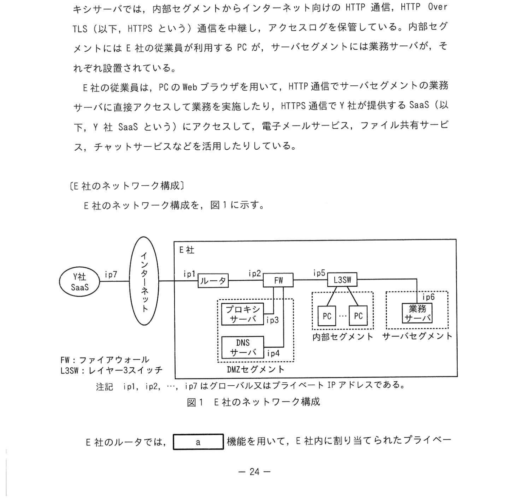
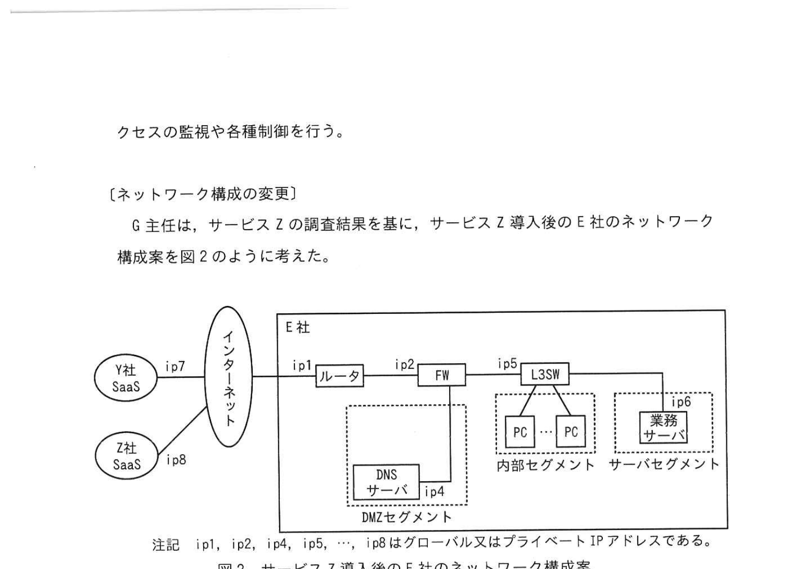
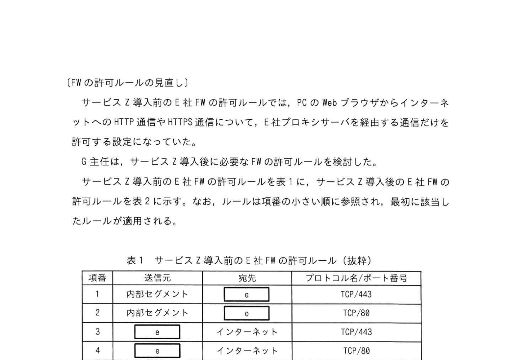
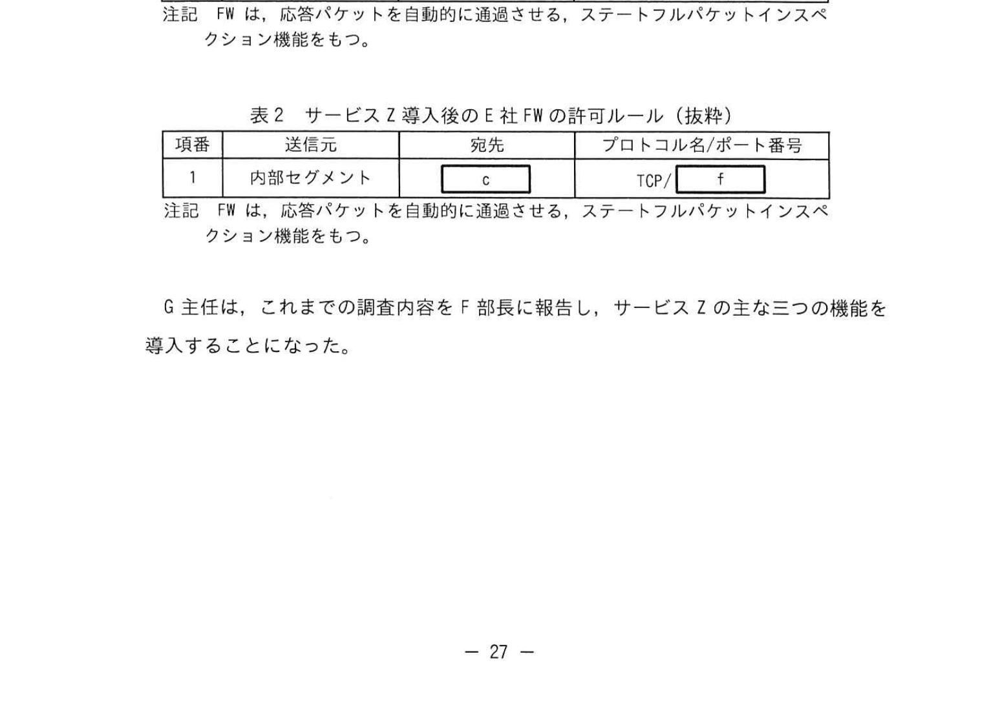

# 2024年秋期（令和6年度秋期）応用情報技術者試験 午後 問5（選択）
## ネットワーク：セキュアWebゲートウェイサービスの導入

---

## 問題文

**問5** セキュアWebゲートウェイサービスの導入に関する次の記述を読んで、設問に答えよ。

E社は、インターネットを利用した人材紹介業を営む会社である。E社のネットワークは、DMZセグメント、内部セグメント及びサーバセグメントから構成されている。DMZセグメントには、コンテンツフィルタリング機能やWebサイトのアクセス制御機能をもつプロキシサーバ及びDNSサーバが設置されている。プロキシサーバでは、内部セグメントからインターネット向けのHTTP通信、HTTP Over TLS（以下、HTTPSという）通信を中継し、アクセスログを保管している。内部セグメントにはE社の従業員が利用するPCが、サーバセグメントには業務サーバが、それぞれ設置されている。

E社の従業員は、PCのWebブラウザを用いて、HTTPS通信でサーバセグメントの業務サーバに直接アクセスして業務を実施したり、HTTPS通信でY社が提供するSaaS（以下、Y社SaaSという）にアクセスして、電子メールサービス、ファイル共有サービス、チャットサービスなどを活用したりしている。

---

### 〔E社のネットワーク構成〕

E社のネットワーク構成を、図1に示す。

### 図1 E社のネットワーク構成

> **構成：**
> - Y社SaaS (ip7) → インターネット ← ルータ (ip1,ip2) ← FW ← プロキシサーバ (ip3) / DNSサーバ (ip4)
> - FW ← L3SW → PC群（内部セグメント）/ 業務サーバ（サーバセグメント, ip5, ip6）
> - 注記：ip1, ip2, ..., ip7はグローバルまたはプライベートIPアドレス

E社のルータでは、`[　a　]` 機能を用いて、E社内に割り当てられたプライベートIPアドレスをグローバルIPアドレスに変換している。

---

### 〔サービスZの調査〕

G主任は、サービスZ（セキュアWebゲートウェイサービス）の調査結果を基に、サービスZ導入後のE社のネットワーク構成案を図2のように考えた。

サービスZとは、PCからインターネット上のWebサイトへのアクセスを安全に行うためのサービスであり、主な機能は次の三つである。

1. **アクセス先の `[　b　]`** やIPアドレスから悪意のあるWebサイトであるかどうかを評価し、安全でないと判断される場合はアクセスを遮断する機能
2. **機密情報や顧客情報をE社外に送出しないように**、TLSで暗号化された通信内容をサービスZ内で復号して通信内容を検査することを確認する機能
3. **②インターネット上のWebサイトから受け取ったプログラムをサービスZ内の保護された領域で動作させ、E社システムが不正に操作されるおそれがないことを確認する機能**

---

サービスZを利用するためには、E社全てのPCに専用のクライアントソフトウェア（以下、ソフトCという）を導入し、PCのWebブラウザからインターネット上のWebサイトへのアクセスを、ソフトCを介して行う必要がある。ソフトCからサービスZには、HTTPS通信を用いて接続する。サービスZは、PCからインターネットへの全てのWebアクセスについて、どのPCからアクセスされたものかを識別し、アクセスの監視や各種制御を行う。

---

### 〔ネットワーク構成の変更〕

G主任は、サービスZ調査結果を基に、サービスZ導入後のE社のネットワーク構成案を図2のように考えた。

### 図2 サービスZ導入後のネットワーク構成

> **変更後構成：**
> - Y社SaaS (ip7) / Z社SaaS (ip8) → インターネット ← ルータ ← FW
> - FW ← L3SW → PC群（内部セグメント）/ 業務サーバ（サーバセグメント）
> - DNSサーバのみDMZに残す（プロキシサーバ廃止）

G主任は、サービスZ導入に当たって必要な作業を検討し、次の四点に整理した。

1. 現行のE社のネットワーク構成からプロキシサーバを廃止し、社内のPCからインターネット上のWebサイトへのアクセスについて、現行IPアドレスが `[　c　]` のものだけを許可するよう、FWの許可ルールを変更する。
2. PCにソフトCを導入する。各PCでローカルプロキシとして動作させる。各PCのプロキシ設定を変更して、このソフトCをプロキシとして利用する。ソフトCからHTTPS通信によってインターネット上のWebサイトへアクセスできるようにするために、`[　c　]` を発先IPアドレスとするようソフトCの通信設定を行う。
3. PCのプロキシ設定で、`[　d　]` については、これまでどおり直接HTTP通信ができるように設定する。
4. Y社SaaSの送信元IPアドレスでのアクセス制限の設定を変更する。

---

### 〔FWの許可ルールの見直し〕

サービスZ導入前のE社FWの許可ルールでは、PCのWebブラウザからインターネットへのHTTP通信やHTTPS通信について、E社プロキシサーバを経由する通信だけを許可していた。G主任は、サービスZ導入後に必要なE社FWの許可ルールを検討した。

### 表1 サービスZ導入前のE社FWの許可ルール（抜粋）

> | 項番 | 送信元 | 宛先 | プロトコル名/ポート番号 |
> |---|---|---|---|
> | 1 | 内部セグメント | e | TCP/80 |
> | 2 | 内部セグメント | e | TCP/443 |
> | 3 | e | インターネット | TCP/80 |
> | 4 | e | インターネット | TCP/443 |

### 表2 サービスZ導入後のE社FWの許可ルール（抜粋）

> | 項番 | 送信元 | 宛先 | プロトコル名/ポート番号 |
> |---|---|---|---|
> | 1 | 内部セグメント | c | TCP/ f |

注記: FWは、応答パケットを自動的に通過させる、ステートフルパケットインスペクション機能をもつ。

G主任は、これまでの調査内容をF部長に報告し、サービスZの主な三つの機能を導入することになった。

---

## 設問

### 設問1

**(1)** 本文中の下線について、整数演算に該当する演算を解答群から全て選び、記号で答えよ。

**(2)** 本文中の `[　a　]` に入れる適切な字句を答えよ。

### 設問2

**(1)** 本文中の `[　b　]` に入れる適切な字句を答えよ。

**(2)** 本文中の下線②について、この機能の名称を答えよ。

### 設問3

**(1)** 本文中の `[　c　]`〜`[　e　]` に入れる適切な字句を答えよ。表1、表2の字句を用いて答えること。

**(2)** 表2中の `[　f　]` に入れる適切な値を答えよ。

---

## 解答と解説

### 設問1

**(1) 正解：a=NAPT（ネットワークアドレスポート変換）**

**理由：** 社内のプライベートIPアドレスをグローバルIPアドレスに変換する機能は**NAPT（Network Address Port Translation）**。NATはIPアドレスのみを変換するのに対し、NAPTはIPアドレス+ポート番号を変換して多数のホストが1つのグローバルIPアドレスを共有できる。

**(2) 正解：a=NAPT**（設問1(1)と同じ）

---

### 設問2

**(1) 正解：b=URL**

**理由：** アクセス先の**URL**（またはドメイン名）から悪意のあるWebサイトかどうかを判別するのがセキュアWebゲートウェイの主要機能。URLフィルタリングとも呼ばれる。

**(2) 正解：ウ（サンドボックス）**

**理由：** インターネットから受け取ったプログラムを保護された隔離領域（サンドボックス）で動作させ、本物の環境に影響を与えずに安全性を検証する機能を**サンドボックス**と呼ぶ。

---

### 設問3

**(1) 正解：c=ip1（サービスZのIPアドレス）、d=業務サーバ、e=プロキシサーバ（ip3）**

- **c（ip1）：** ソフトCからの通信先はサービスZのIPアドレス（外部）。FWではこのIPへの通信を許可。
- **d（業務サーバ）：** サーバセグメントの業務サーバはプロキシを経由せず直接HTTP通信するよう設定。
- **e（プロキシサーバ ip3）：** 現行FWルールで内部セグメントからの通信先はプロキシサーバ（e=ip3）。

**(2) 正解：f=443**

**理由：** ソフトCからサービスZへの通信は「HTTPS通信を用いて接続する」と記述されている。HTTPSは**TCP/443**ポートを使用する。

---

## 参考：主要キーワード

| 用語 | 説明 |
|------|------|
| セキュアWebゲートウェイ（SWG） | Webアクセスを中継・検査してセキュリティを確保するクラウドサービス |
| NAPT（ネットワークアドレスポート変換） | プライベートIPをグローバルIPに変換する機能。多数のホストが1つのグローバルIPを共有 |
| URLフィルタリング | URLやドメインをブラックリスト等と照合して悪意あるサイトへのアクセスを遮断 |
| TLSインスペクション | HTTPS通信を復号して内容を検査する機能。内部からの情報漏洩検知などに使用 |
| サンドボックス | 隔離された仮想環境。不審なプログラムを安全に実行して動作を検査する |
| SaaS（Software as a Service） | クラウドで提供するソフトウェアサービス（Y社メール/ファイル共有など） |
| ステートフルパケットインスペクション | 通信の状態（セッション）を追跡してパケットを検査するFW機能 |
| プロキシサーバ | クライアントに代わってインターネットへアクセスする中継サーバ |
| ローカルプロキシ | PC内で動作するプロキシ。ブラウザの通信を横取りして外部サービスに転送 |
| TCP/443 | HTTPS（HTTP over TLS）が使用するポート番号 |
