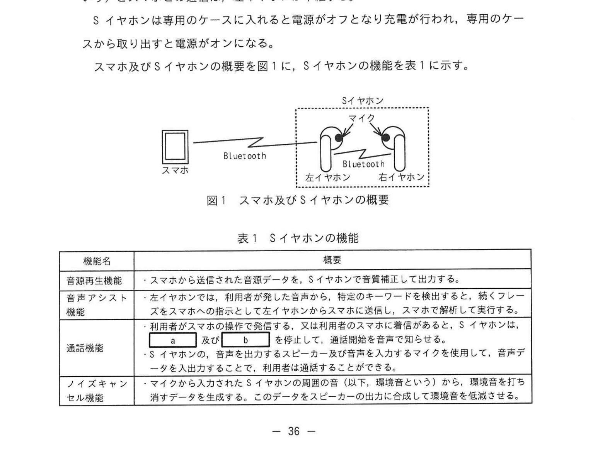
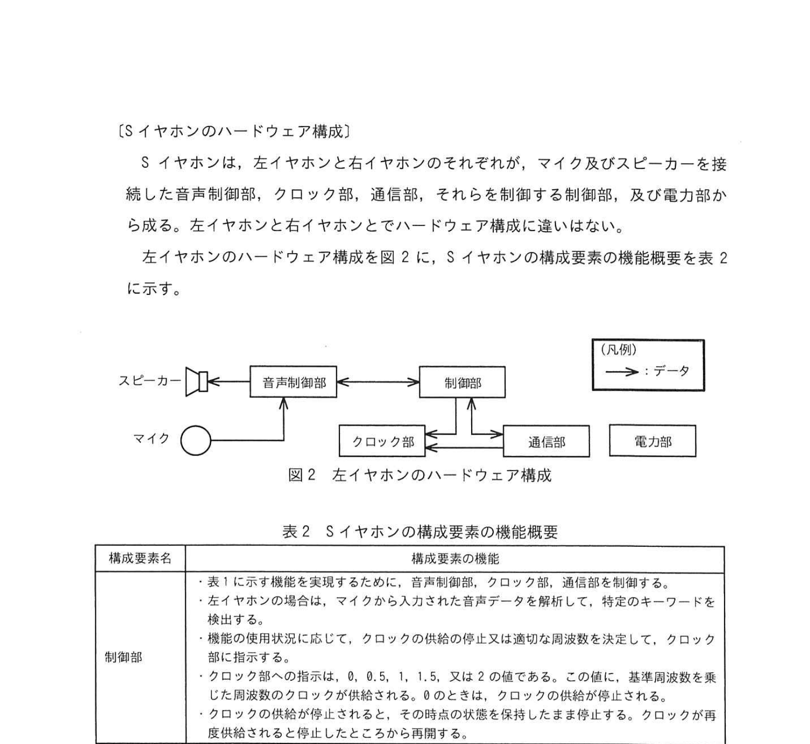
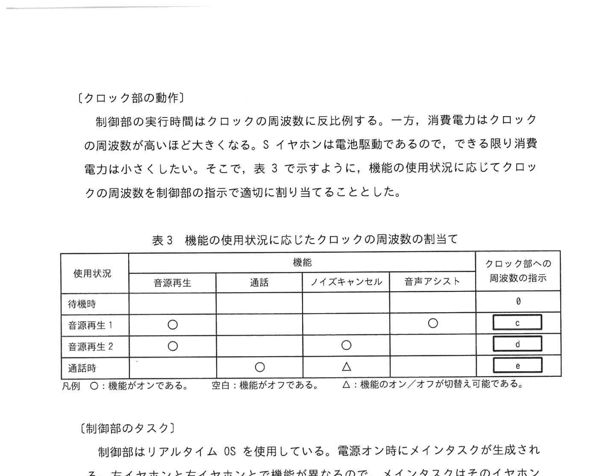
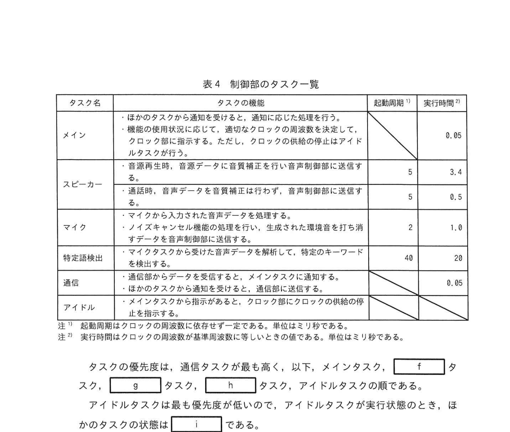

# 2024年秋期（令和6年度秋期）応用情報技術者試験 午後 問7（選択）
## 組込みシステム開発：スマートイヤホン

---

## 問題文

**問7** スマートイヤホンに関する次の記述を読んで、設問に答えよ。

G社は、専用のアプリケーションプログラム（以下、アプリという）をインストールしたスマートフォン（以下、スマホという）とBluetoothで接続して、音楽などの音源再生機能、電話の通話機能、ノイズキャンセル機能、音声アシスト機能をもつスマートイヤホン（以下、Sイヤホンという）を製品化している。

利用者はアプリを用いて、Sイヤホンの音源再生機能と通話機能の開始/停止の指示、及びノイズキャンセル機能と音声アシスト機能のオン/オフの設定を行うことができる。Sイヤホンを使用している状態にするには、音源再生及び音声アシスト機能は使用できない。

Sイヤホンは左右が独立しており、左耳に装着するイヤホン（以下、左イヤホンという）はスマホとペアリングする。右耳に装着するイヤホン（以下、右イヤホンという）は左イヤホンが親となる。

Sイヤホンは専用のケースに入れると電源がオフとなり充電が行われ、専用のケースから取り出すと電源がオンになる。

---

### 〔Sイヤホンの機能〕

スマホ及びSイヤホンの概要を図1に、Sイヤホンの機能を表1に示す。

### 図1 スマホ及びSイヤホンの概要

> - スマホ ←Bluetooth→ 左イヤホン ←Bluetooth→ 右イヤホン
> - 左イヤホンがスマホ・右イヤホンと通信する「親」の役割

**表1 Sイヤホンの機能**

| 機能名 | 概要 |
|---|---|
| 音源再生機能 | スマホから送られた音楽データをSイヤホンで音質調整した後に出力する |
| 音声アシスト機能 | 利用者の発言から特定キーワードを検出し、続くフレーズをスマホに送信して、通話機能を利用する |
| 通話機能 | スマホからの指示を受けると、通話接続開始の音声を出力する。イヤホンの発声をマイクで収音してスマホに送信する |
| ノイズキャンセル機能 | マイクから入力されたSイヤホンの周囲環境音を信号処理して逆位相の波を出力することで周囲の環境音を消音する |

---

### 〔Sイヤホンのハードウェア構成〕

Sイヤホンは、左イヤホンと右イヤホンのそれぞれが、マイク及びスピーカーを接続した音声制御部、クロック部、通信部、それらを制御する制御部、及び電力部から成る。左イヤホンと右イヤホンとでハードウェア構成に違いはない。

### 図2 左イヤホンのハードウェア構成

> **構成要素：**
> - スピーカー → 音声制御部 → 制御部 → 通信部
> - マイク → 音声制御部
> - 制御部 ← クロック部
> - 制御部 ← 電力部

**表2 Sイヤホンの構成要素の機能概要（抜粋）：**

| 構成要素名 | 機能の概要 |
|---|---|
| `[　a　]` | 処理状態をデジタルデータに変換する機能、音声アシスト機能など |
| `[　b　]` | スマホや左右イヤホンとの無線通信 |
| 特定語検出 | マイクから入力された音声データから特定語（キーワード）を検索する |
| スピーカー | デジタル信号をアナログ音声に変換して音を出す |
| マイク | 周囲の音を収音してデジタルデータに変換する |

---

### 〔クロック部の動作〕

制御部の実行時間はクロックの周波数に反比例する。一方、消費電力はクロックの周波数が高いほど大きくなる。Sイヤホンは電池駆動なので、できる限り消費電力を小さくしたい。そこで、表3で示すように、機能の使用状況に応じてクロックの周波数を制御部の指示で適切に割り当てることにした。

### 表3 機能の使用状況に応じたクロックの周波数の割当

> | 使用状況 | 音源再生 | 通話 | ノイズキャンセル | 音声アシスト | クロックへの周波数の割当 |
> |---|---|---|---|---|---|
> | 待機状態 | 　 | 　 | 　 | 　 | `[　c　]` |
> | 音源再生！ | ○ | 　 | 　 | 　 | `[　c　]` |
> | 音源再生！ | ○ | 　 | △ | 　 | `[　d　]` |
> | 通話状態 | 　 | ○ | 　 | 　 | `[　e　]` |
>
> 凡例 ○：機能がオンである、空白：機能がオフである、△：機能のオン/オフが切替え可能である。

---

### 〔制御部のタスク〕

制御部はリアルタイムOSを使用している。電源オン時にメインタスクが生成される。左イヤホンと右イヤホンとでは機能が異なるので、メインタスクはそのイヤホンで必要となるタスクだけを生成する。メインタスクを含め、それぞれのタスクは重複しない固有の優先度が割り当てられる。リアルタイムOSのタスクの状態は、実行状態、実行可能状態、及び待ち状態のいずれかである。

制御部のタスク一覧を表4に示す。クロックの周波数が基準周波数に等しいとき、タスクの実行に要する実行時間とは表4に示す実行時間とする。スピーカータスク、マイクタスク及び特定語検出タスクは起動周期内に処理が完了しなければならない。起動周期内に処理が完了しない場合、音飛びやノイズなどの不具合が発生する。

### 表4 制御部のタスク一覧

> | タスク名 | タスクの機能 | 起動周期（ミリ秒） | 実行時間（ミリ秒） |
> |---|---|---|---|
> | メイン | ほかのタスクから通知を受けて、通知に応じた処理を行う | — | 0.05 |
> | スピーカー | 音源データ又は音声データを音声調整した後に音声出力する | 5 | 3.4 |
> | マイク | 音声データを音声制御部から受け取り、音声制御部に送付する | 2 | 1 |
> | 特定語検出 | マイクから入力された音声データを解析して特定語を検索する | 40 | 20 |
> | アイドル | メインタスクが必要と判断したとき、クロックの周波数を低く設定する | — | 0.05 |

タスクの優先度は、通信タスクが最も高く、以下メインタスク、`[　f　]` タスク、`[　g　]` タスク、`[　h　]` タスク、アイドルタスクの順である。

アイドルタスクは最も優先度が低いので、アイドルタスクが実行状態のとき、ほかのタスクの状態は `[　i　]` である。

---

## 設問

### 設問1

Sイヤホンの機能について答えよ。

**(1)** 表1中の `[　a　]`、`[　b　]` に入れる適切な機能名を表1中の機能名で答えよ。

**(2)** 表2中の下線①の特定のイベントとして適切なものを解答群から選び、記号で答えよ。

**解答群：**
- ア 一定時間経過
- イ スマホからのデータを受信
- ウ 制御部からの指示を受信
- エ 電力部が電力を供給
- オ マイクから入力された音声データから特定のキーワードを検出

### 設問2

表3中の `[　c　]`〜`[　e　]` に入れる適切な字句を答えよ。

### 設問3

表4を参照して、次の問に答えよ。

**(1)** 待ち状態について、スピーカータスク、マイクタスク、特定語検出タスクそれぞれが処理を完了できるかどうかを、「できる」または「できない」で答えよ。また、できない場合には、その理由を述べよ。

**(2)** クロックの再開に伴って生じる問題点を答えよ。

---

## 解答と解説

### 設問1

**(1) 正解：a=音源再生機能、b=音声アシスト機能**

- **a（音源再生機能）**：スマホからの音楽データを音質調整・出力する機能 → 音声制御部で処理
- **b（音声アシスト機能）**：特定語検出後に続くフレーズを処理 → スマホ連携（通信機能）

**(2) 正解：オ（マイクから入力された音声データから特定のキーワードを検出）**

音声アシスト機能のトリガーは「特定語（キーワード）を検出」したとき。キーワードの検出は特定語検出タスクが担い、それが検出されると音声アシスト機能が起動する。

---

### 設問2

**正解：待ち状態（設問3(1)の答えに対応）**

表3の解釈:
- **c**（待機・音源再生のみ）：低い周波数
- **d**（音源再生+ノイズキャンセル）：中程度の周波数
- **e**（通話状態）：高い周波数

実際の答案: c, d, e の値は本文の表3から読み取る（低/中/高周波数に対応した具体値）

---

### 設問3

**(1) 正解：**

| タスク | 完了可否 | 起動周期 | 実行時間 |
|---|---|---|---|
| スピーカー | できる | 5ms | 3.4ms |
| マイク | できる | 2ms | 1ms |
| 特定語検出 | できる | 40ms | 20ms |

ただし、クロックが基準周波数のときの話。基準周波数より低い場合は実行時間が長くなるため問題が生じる。

**(2) 正解：クロックの再開に掛かる5ミリ秒以下の周期で動くタスクがあるから**

**理由：** アイドルタスクはクロックの周波数を低下させるが、クロックの周波数を元（基準周波数）に戻す「再開」処理に一定時間かかる。その再開時間中、マイクタスク（周期2ms）やスピーカータスク（周期5ms）が起動周期内に処理を完了できなくなり、音飛びやノイズなどの不具合が発生する。

---

## 参考：主要キーワード

| 用語 | 説明 |
|------|------|
| リアルタイムOS（RTOS） | 処理の即時応答性を保証するOS。組込みシステムに使用。タスクの優先度管理が重要 |
| タスクの優先度 | RTOSでの実行順序を決める値。優先度が高いタスクが実行可能状態になると割り込む |
| プリエンプション | 高優先度タスクが低優先度タスクの実行を中断させる機能 |
| 実行状態・実行可能状態・待ち状態 | RTOSのタスク状態。実行状態:CPU占有中、実行可能状態:待機中、待ち状態:イベント待ち |
| クロック周波数 | CPUの処理速度に影響。高いほど高速・高消費電力。節電のため動的に切替える |
| 起動周期 | タスクが定期的に起動される間隔。リアルタイム制約（デッドライン）とも呼ぶ |
| 特定語検出（ホットワード検出） | 「OK Google」など特定キーワードを検知する技術 |
| ノイズキャンセル | 逆位相の音波を合成して環境音を打ち消すANC（Active Noise Cancellation）技術 |
| Bluetooth | 短距離無線通信規格。スマホ-イヤホン間通信に使用。2.4GHz帯を使用 |
