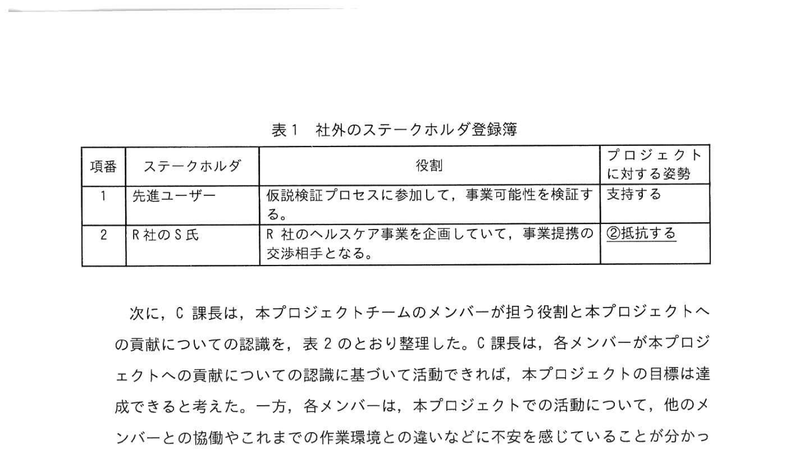
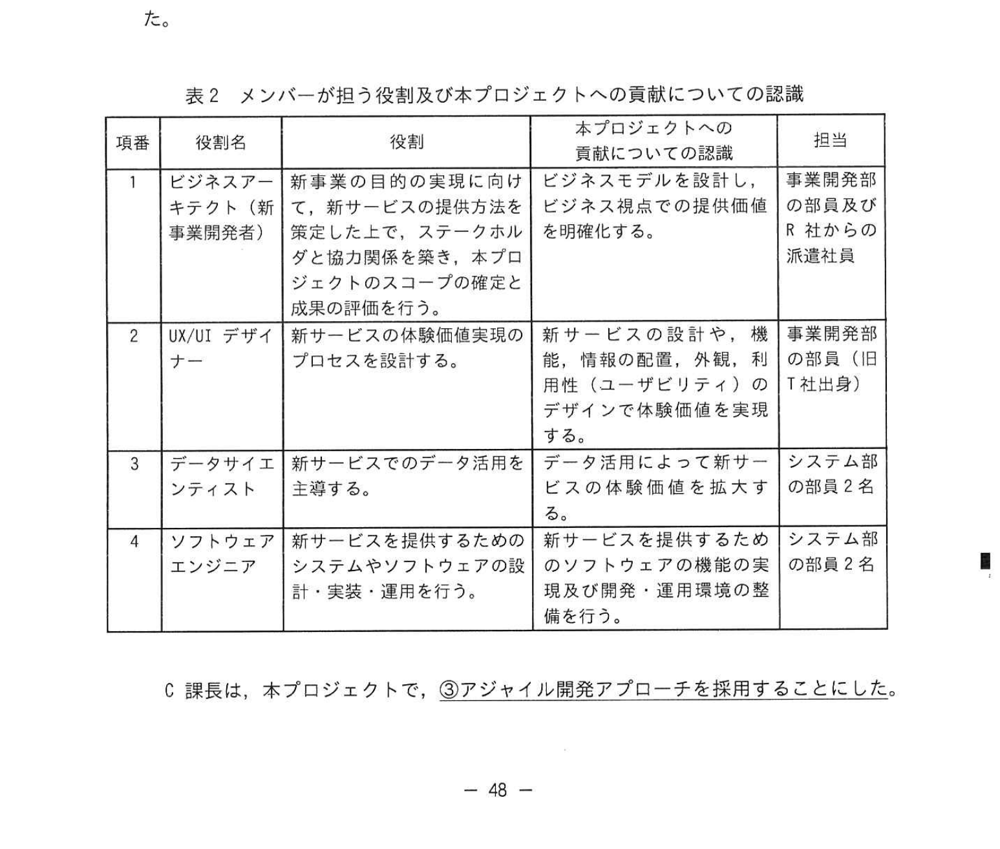
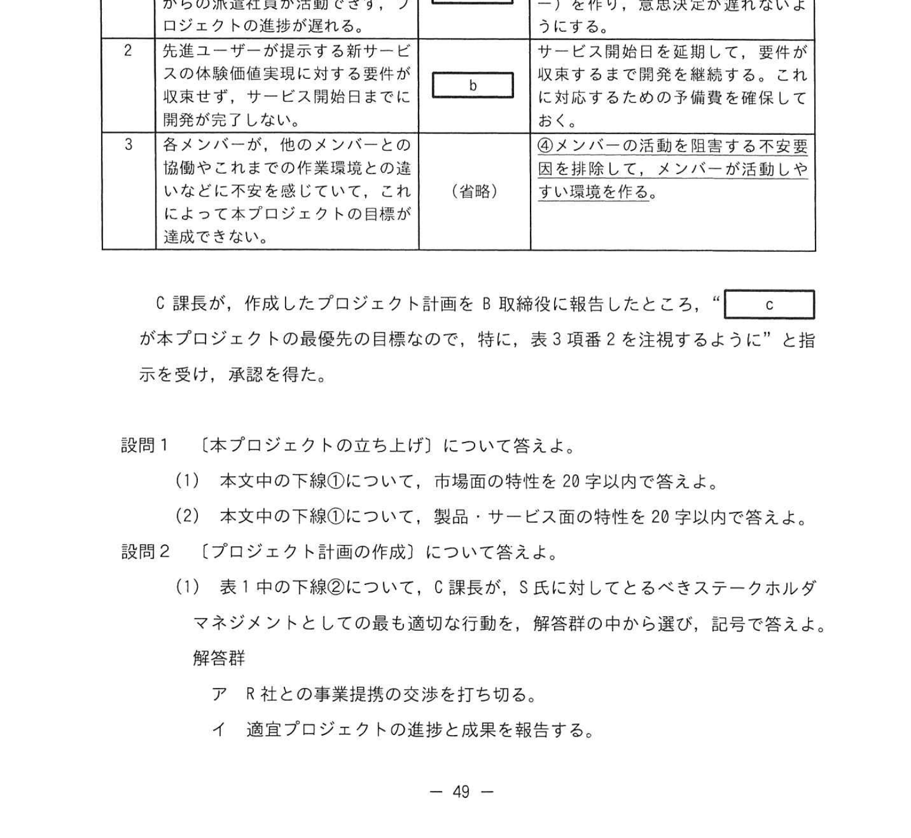

# 2024年秋期（令和6年度秋期）応用情報技術者試験 午後 問9（選択）
## プロジェクトマネジメント：電気機器メーカーの新たなプロジェクト

---

## 問題文

**問9** 電気機器メーカーの新たなプロジェクトに関する次の記述を読んで、設問に答えよ。

A社は、大手の電気機器メーカーである。主力製品は、製造現場で用いられるIoTセンサなどの機器である。製造業向けの産業機械市場に機器を提供する事業で成長してきたが、近年、成長の速度が鈍化している。そこで、研究開発していた生体センサーを核にして消費者向けのヘルスケア市場に新たなサービスを提供する新規事業に進出することにした。

新事業を推進するヘルスケア事業開発部（以下、事業開発部という）を設立し、新たなサービスの事業可能性を検証するためのプロジェクト（以下、本プロジェクトという）を立ち上げることになった。昨年から始まったA社の中期事業計画では、製品開発やM&Aなどを通じて、5年後には事業開発部の売上高が全社比の20%程度まで拡大し、主力事業の一つとなる計画がある。

---

### 〔ヘルスケア事業の概要と本プロジェクトの位置付け〕

**(1)** ヘルスケア事業の概要は次のとおりである。
- 今後、成長が見込まれる消費者向けのヘルスケア市場に進出し、高齢化に伴う未病対策といった健康増進に関わるサービスを提供することを目的とする。
- 消費者向けに機器に新たなサービスを提供するために、小規模ながらもUX/UIデザインに定評のあるWeb開発会社のT社を新会社への事業開発部に吸収した。
- 医療機器製造業で健康増進に関わるサービスへの道筋を検討している事業提携の交渉を示しているR社と事業提携の交渉をしている。R社の事業部長のS氏は提携に消極的だが、当面はA社に積極的な協力を期待している。
- 最初のサービスとして、脈拍、血圧、体温などのバイタルデータを活用して運動を促す行動変容サービス（以下、新サービスという）を提供する。

**(2)** 本プロジェクトの位置付けは次のとおりである。
- 生体センサーと連携した消費者向けのWebシステムを開発して新サービスを実現し、事業可能性を検証する。
- 本プロジェクトはA社の取締役会で承認され、事業開発部とシステム部の両方を管掌するB取締役がプロジェクトスポンサーとなり、プロジェクトマネージャにはシステム部のC課長が任命された。

---

### 〔本プロジェクトの立ち上げ〕

A社では多くのプロジェクトを立ち上げてきたが、いずれも産業機械市場への機器の提供に付随するシステム開発プロジェクトであった。C課長は、本プロジェクトの立ち上げに際して、次のことを考慮してプロジェクト計画の作成が必要があると考えた。

- 本プロジェクトは、①A社でこれまでに実施してきたプロジェクトとは異なる市場面及び製品・サービス面の特性をもつ。
- ①これまで参加したことのない先進ユーザー、R社からの派遣社員及び旧T社のメンバーが参加する。
- 新市場に新たなサービスを提供するため、本プロジェクトにはこれまでに新しい視点の目標設定が必要である。そこで、顧客への体験価値の提供を、本プロジェクトで最優先に達成する目標とした。
- 事業可能性を高めるためには、先進ユーザーに参加してもらった上で、体験価値を確実に実現する仮検証プロセスを反復してから新サービスを開始する必要がある。
- R社のS氏は、本プロジェクトの成否や成果に強い関心をもっており、新事業が顕調に立ち上がれば、提携に積極的な態度に変わるものと期待できる。

---

### 〔プロジェクト計画の作成〕

C課長は、影響力の大きい社外のステークホルダを特定し、表1のとおり社外のステークホルダ登録簿を作成した。なお、A社内のステークホルダのプロジェクトに対する姿勢はいずれも「支持する」である。

### 表1 社外のステークホルダ登録簿

> | 項番 | ステークホルダ | 役割 | プロジェクトに対する姿勢 |
> |---|---|---|---|
> | 1 | 先進ユーザー | 仮説検証プロセスに参加し、事業可能性を検証する | 支持する |
> | 2 | R社のS氏 | R社のヘルスケア事業を企画して、事業提携への交渉相手となる | 抵抗する |

次に、C課長は、本プロジェクトチームのメンバーが担う役割と本プロジェクトへの貢献についての認識を表2のとおり整理した。C課長は、各メンバーが本プロジェクトへの貢献についての認識に基づいて活動できれば、本プロジェクトの目標は達成できると考えた。一方、各メンバーが本プロジェクトに活動的に参加することについて、他のメンバーとの協働やそれまでの作業環境との違いなどに不安を感じていることが分かった。

### 表2 メンバーが担う役割及び本プロジェクトへの貢献についての認識

> | 項番 | 役割名 | 役割 | 貢献についての認識 | 貢献元 |
> |---|---|---|---|---|
> | 1 | ビジネスアーキテクト（新事業開発者） | 新事業の目的の実現に向けて、新サービスの提供方法を確定したうえで、ステークホルダとプロジェクトスコープの確定と成果の評価を行う | ビジネスモデルを設計し、ビジネス視点から生産的な提供価値を明確化する | 事業開発部及びR社からの派遣社員 |
> | 2 | UX/UIデザイナー | 新サービスの顧客体験価値プロセスを設計する | 新サービスの設計や、顧客・情報の配置、外観、機能性（ユーザービリティ）のデザイン体験価値を実現する | T社出身 |
> | 3 | データサイエンティスト | 新サービスでのデータ活用を高める | サービス活用によって新サービスのデータサービスを実現する | システム部 2名 |
> | 4 | ソフトウェアエンジニア | 新サービスを提供するためのシステムやソフトウェアの設計・実装・運用を行う | 新サービスを提供するためのソフトウェアの開発及び開発・運用環境の整備 | システム部 2名 |

C課長は、本プロジェクトで、③アジャイル開発アプローチを採用することにした。

---

### 〔リスクマネジメント計画〕

C課長は、PMBOKガイド第7版に基づき、表3のとおり本プロジェクトへの影響が大きいリスクを特定し、リスクへの対応戦略とそれに基づく対策をリスク登録簿に設定した。

### 表3 リスク登録簿（抜粋）

> | 項番 | リスク | リスクへの対応戦略 | リスクへの対策 |
> |---|---|---|---|
> | 1 | ビジネスとの意思決定についてR社経営層との認識のずれ、及びR社からの突然のプロジェクトの撤退など | `[　a　]` | 取締役会、R社経営及びS氏の集まる場（ステアリングコミッティー）を作り、意思決定が進まれるようにする |
> | 2 | 先進ユーザーとの合意を取れているサービス関連のタスクが大幅に遅延し、プロジェクト全体の収束まで、サービス関連期日までの収束、サービス公開期日が守れないなど | `[　b　]` | 各メンバーの活動を妨げる不安要因を排除して、メンバーが活動しやすい環境を整備する。また、活動に応じた予算を確保しておく |

C課長が、作成したプロジェクト計画をB取締役に報告したところ、「`[　c　]` が本プロジェクトの最優先の目標なので、特に、表3番号2を注視するように」と指示を受け、承認を得た。

---

## 設問

### 設問1

〔本プロジェクトの立ち上げ〕について答えよ。

**(1)** 本文中の下線①について、市場面の特性を20字以内で答えよ。

**(2)** 本文中の下線①について、製品・サービス面の特性を20字以内で答えよ。

### 設問2

〔プロジェクト計画の作成〕について答えよ。

**(1)** 表1中の下線について、C課長がR社のS氏に対してとるべきステークホルダマネジメントとして最も適切な行動を、解答群の中から選び、記号で答えよ。

**解答群：**
- ア R社との事業提携の交渉を打ち切る。
- イ 適宜プロジェクトの進捗と成果を報告する。
- ウ プロジェクトの進捗と成果の情報を秘匿し、ステークホルダとのコミュニケーションを避ける。
- エ プロジェクトの進捗と成果の報告は最低限にとどめる。

**(2)** 本文中の下線③を実施する背景は何か。本文中の字句を用いて38字以内で答えよ。

### 設問3

〔リスクマネジメント計画〕について答えよ。

**(1)** 表3中の `[　a　]`、`[　b　]` に入れる適切な字句を2字で答えよ。

**(2)** 表3中の下線②について、C課長がこの対応策を実施する背景を、本文中の字句を用いて40字以内で答えよ。

**(3)** 本文中の `[　c　]` に入れる適切な字句を15字以内で答えよ。

---

## 解答と解説

### 設問1

**(1) 正解：消費者向けのヘルスケア市場への進出（19字）**

本プロジェクトはこれまでのA社の製造業向け産業機械市場とは全く異なる、**消費者向けのヘルスケア市場**に進出するものである。

**(2) 正解：投資家を説得できる事業の提案（または「体験価値を提供する新サービスの開発」）**

製品・サービス面では、従来のIoTセンサ等の製造業向け機器とは異なり、生体センサを活用した**消費者向けウェルネスサービス**（バイタルデータ活用の行動変容サービス）という全く新しい種類の製品・サービスを開発するという特性がある。

---

### 設問2

**(1) 正解：イ（適宜プロジェクトの進捗と成果を報告する）**

S氏は現在「抵抗する」姿勢だが、「プロジェクトの成否に強い関心をもっており、新事業が顕調に立ち上がれば積極的な態度に変わるものと期待できる」という記述がある。したがって、S氏に対するベストなアプローチは**定期的に進捗と成果を報告**して、徐々に態度を変えてもらうことである。

**(2) 正解：事業可能性を高めるため、仮説検証プロセスを反復してから新サービスを開始する必要があるから（40字以内）**

アジャイル開発を採用する背景：本プロジェクトでは顧客への体験価値の提供が最優先目標であり、先進ユーザーに参加してもらいながら「体験価値を確実に実現する仮説検証プロセスを反復」する必要がある。アジャイルの反復的・漸進的な開発スタイルがこれに最適。

---

### 設問3

**(1) 正解：a=受容、b=軽減（または回避）**

PMBOKの4つのリスク対応戦略（脅威）：
- **回避（Avoid）**：リスクを取り除く
- **転嫁（Transfer）**：リスクを第三者に移転
- **軽減（Mitigate）**：リスクの発生確率や影響度を下げる
- **受容（Accept）**：リスクをそのまま受け入れる

- **a=受容**：R社の撤退リスクは完全には回避・軽減できないが、ステアリングコミッティーを設置して意思決定の透明性を高めることで「受容しつつ対応できる体制を整える」
- **b=軽減**：先進ユーザーとの合意遅延リスクはメンバーの不安要因除去と予算確保によって「発生確率や影響度を軽減する」

**(2) 正解：各メンバーが他のメンバーとの協働やこれまでの作業環境との違いなどに不安を感じているから（40字以内）**

本文に「他のメンバーとの協働やそれまでの作業環境との違いなどに不安を感じていることが分かった」とある。この不安がメンバーの活動を妨げるため、先に不安要因を排除して活動しやすい環境を整備する必要がある。

**(3) 正解：c=顧客への体験価値の提供（12字）**

本文に「顧客への体験価値の提供を、本プロジェクトで最優先に達成する目標とした」という記述があり、これがcに入る字句。

---

## 参考：主要キーワード

| 用語 | 説明 |
|------|------|
| PMBOKガイド | Project Management Body of Knowledge。PMIが発行するPM知識体系ガイド |
| ステークホルダマネジメント | プロジェクト関係者の特定・分析・関与計画・コミュニケーション管理 |
| リスク対応戦略（脅威）| 回避・転嫁・軽減・受容の4種類（PMBOKガイド第7版） |
| アジャイル開発アプローチ | 短いサイクル（イテレーション/スプリント）で開発・検証を繰り返す手法 |
| ステアリングコミッティー | プロジェクトの重要な意思決定を行うための経営・上位関係者の委員会 |
| 仮説検証プロセス | 仮説を立て、実験・テストして検証し、改善するサイクル（リーンスタートアップ等） |
| 体験価値（UX） | 顧客がサービス・製品を利用する過程で感じる総合的な体験の価値 |
| 先進ユーザー | 新製品・サービスを初期段階からフィードバックしてくれる熱心なユーザー |
| 行動変容 | 健康的な生活習慣など、ユーザーの行動を変えることを目的としたサービス |
