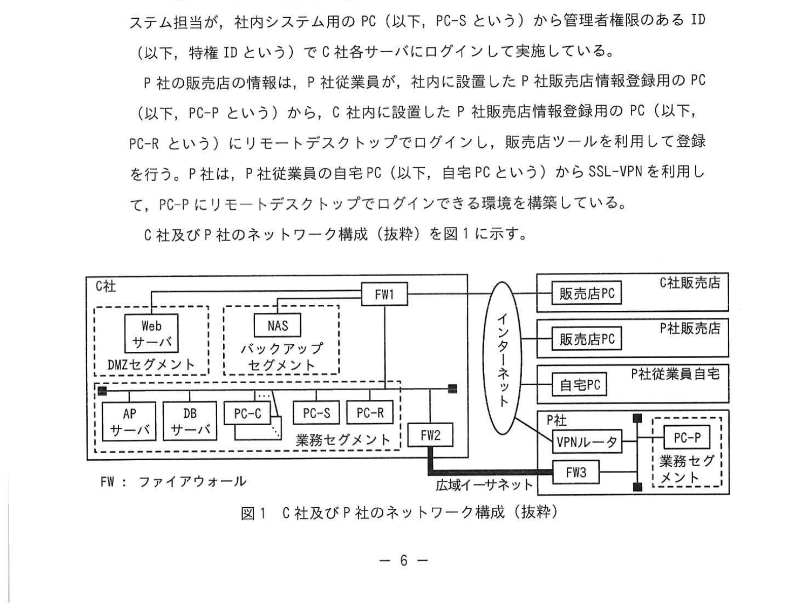
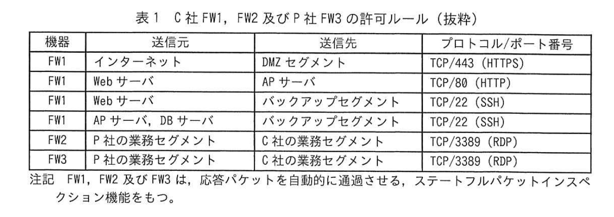
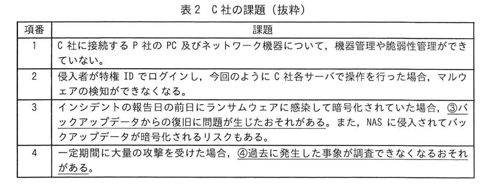

# 2025年春期 応用情報技術者試験 午後 問1（必須）
## 情報セキュリティ：サイバー攻撃への対策

---

## 問題文

**問1** サイバー攻撃への対策に関する次の記述を読んで、設問に答えよ。

C社は首都圏に複数の販売店をもつ、中堅の中古車販売会社である。

C社はS県に複数の中古車販売店舗を展開するP社と業務提携しており、P社の中古車情報もC社の販売管理システムに登録した上で販売を行っている。

---

### 〔C社販売管理システムの概要〕

販売管理システムは、Web サーバ、アプリケーション（以下、AP という）サーバ及びデータベース（以下、DB という）サーバから成り、C社及びP社の販売店は、Web サーバを経由して中古車情報や販売実績の登録を行う。C社の販売店の情報は、C社内のPC（以下、PC-Cという）から、APサーバの販売店情報登録ツール（以下、販売店ツールという）を利用して登録を行う。また、販売管理システムのWebサーバ、APサーバ及びDBサーバ（以下、C社各サーバという）のメンテナンスは、C社の社内システム担当が、社内システム用のPC（以下、PC-Sという）から管理者権限のあるID（以下、特権IDという）でC社各サーバにログインして実施している。

P社の販売店の情報は、P社従業員が、社内に設置したP社販売店情報登録用のPC（以下、PC-Pという）から、C社内に設置したP社販売店情報登録用のPC（以下、PC-Rという）にリモートデスクトップでログインし、販売店ツールを利用して登録を行う。P社は、P社従業員の自宅PC（以下、自宅PCという）からSSL-VPNを利用して、PC-Pにリモートデスクトップでログインできる環境を構築している。

C社及びP社のネットワーク構成（抜粋）を図1に示す。

### 図1 C社及びP社のネットワーク構成（抜粋）

> ※ C社側：DMZセグメント（Webサーバ）、バックアップセグメント（NAS）、業務セグメント（APサーバ、DBサーバ、PC-C、PC-S、PC-R）から成る。FW1がインターネット/各セグメント間を分離し、FW2が広域イーサネットへ接続する。
> ※ インターネット経由で C社販売店の販売店PC、P社販売店の販売店PC、P社従業員自宅の自宅PC が接続。
> ※ P社側：VPNルータ、FW3、業務セグメント（PC-P）から成り、広域イーサネットでC社（FW2）と接続する。

C社 FW1、FW2 及び P社 FW3 の許可ルール（抜粋）を表1に示す。

### 表1 C社FW1、FW2及びP社FW3の許可ルール（抜粋）

> | 機器 | 送信元 | 送信先 | プロトコル/ポート番号 |
> |---|---|---|---|
> | FW1 | インターネット | DMZセグメント | TCP/443 (HTTPS) |
> | FW1 | Webサーバ | APサーバ | TCP/80 (HTTP) |
> | FW1 | Webサーバ | バックアップセグメント | TCP/22 (SSH) |
> | FW1 | APサーバ、DBサーバ | バックアップセグメント | TCP/22 (SSH) |
> | FW2 | P社の業務セグメント | C社の業務セグメント | TCP/3389 (RDP) |
> | FW3 | P社の業務セグメント | C社の業務セグメント | TCP/3389 (RDP) |
> ※注記 FW1、FW2及びFW3は、応答パケットを自動的に通過させる、ステートフルパケットインスペクション機能をもつ。

C社各サーバにはマルウェア対策ソフトウェアがインストールされている。C社各サーバのデータは、毎日午前0時30分～午前1時30分の間にバックアップを行う。月曜日にデータのフルバックアップを行い、火曜日から日曜日まではデータの差分バックアップを行っている。NASには月曜日を起点として最大7日分のバックアップを1世代分保存しており、次の世代のデータは前の世代のデータに上書き保存される。また、C社各サーバのシステムバックアップもNASに保存している。

C社及びP社の各PC、各サーバ及びネットワーク機器のログは各機器内部に保存しており、ログのサイズが最大値に達した場合は、最も古い記録から上書きする設定になっている。
C社の各PC及び各サーバはログインのロックアウトのしきい値を5回に設定している。

---

### 〔セキュリティインシデントの発生〕

ある月曜日の午前9時頃、C社のシステム部門に、C社販売店から販売管理システムが利用できないとの報告があった。システム部門のR主任が販売管理システムを調査したところ、C社各サーバのデータが暗号化されていることが判明した。

R主任は外部のセキュリティ会社であるU社に連絡してインシデントの調査を依頼した。U社のX氏から"<u>①電磁的記録の証拠保全、調査及び分析</u>を行うので、C社内のインターネットと広域イーサネットに接続しているネットワークを遮断した後、全てのPCの使用を停止してください"との要請があり、R主任は要請に従った。

---

### 〔セキュリティインシデントの調査〕

X氏から「PC、サーバ及びネットワーク機器のログを分析した結果、侵入者は次の(1)～(4)の順序で攻撃したことが判明した」と報告があった。

(1) インシデントの報告日の午前3時15分に、PC-PからPC-Rにログインした。
(2) PC-Rと同じパスワードのログインIDがPC-Sに存在していた。PC-Rのログインに利用したパスワードで、PC-Sにリバースブルートフォース攻撃を行い、PC-Sにログインした。
(3) 「社内システム担当がサーバにログインする際に利用したIDとパスワードを、PC-Sのメモリ上に保存してしまう」というPC-SのAPソフトウェアの脆弱性を利用して、C社各サーバにログインした。
(4) C社各サーバのマルウェア対策ソフトウェアのプロセスを強制終了して、ランサムウェアを実行した。

X氏は「侵入経路であるP社の機器もC社と同様に電磁的記録の証拠保全、調査及び分析を行う必要があるので、P社へ連絡するように」とR主任に要請した。

X氏がPC-P及びP社のネットワーク機器を調査したところ、次の状況が判明した。

- VPNルータには認証に関する脆弱性があった。
- 攻撃に利用されたPC-PのIDとパスワードはPC-Rと同一であった。
- PC-PのIDは "admin"、パスワードは "password123456" であった。
- PC-Pへは "administrator" のIDに対して異なるパスワードで約1万回ログインに失敗した後、"admin" のIDに対して異なるパスワードで150回ログインに失敗し、151回目でログインに成功していた。

X氏は「侵入者はVPNルータの脆弱性を利用して、認証情報を取得した上でVPN接続を行い、PC-Pへ `[  a  ]` 攻撃を行い侵入した後、`[  b  ]` でPC-Rへログインした可能性が高い。PC-Pのログインに関する設定がPC-Rと異なっていたので、 `[  a  ]` 攻撃を防げずに侵入されたと推測される」とR主任へ報告した。

---

### 〔暫定対応及びシステムの復旧〕

侵入経路と原因が判明したので、R主任及び P社は次の暫定対応を実施し、C社各サーバのシステム及びデータをバックアップデータから復旧の後、販売管理システムの利用を再開した。

- VPN ルータと PC-S の AP ソフトウェアに、脆弱性に対応した修正プログラムを適用した。
- PC及びサーバのIDとパスワードを推測が困難で複雑なものへ変更した。
- <u>②今回と同様の攻撃を防御するために、PC-Pの設定を変更した。ただし、パスワードが漏えいし、リバースブルートフォース攻撃を受けた場合は、このPC-Pの設定変更では防御できないおそれがある</u>ので、PC-Rへのリモートデスクトップでのログインは、P社からの利用申請を受けてC社が許可したときだけ可能とするルールを設けることにした。

---

### 〔U社からC社への報告〕

U社はC社へ、C社の課題をまとめて報告した。C社の課題（抜粋）を表2に示す。

### 表2 C社の課題（抜粋）

> | 項番 | 課題 |
> |---|---|
> | 1 | C社に接続するP社のPC及びネットワーク機器について、機器管理や脆弱性管理ができていない。 |
> | 2 | 侵入者が特権IDでログインし、今回のようにC社各サーバで操作を行った場合、マルウェアの検知ができなくなる。 |
> | 3 | インシデントの報告日の前日にランサムウェアに感染して暗号化されていた場合、<u>③バックアップデータからの復旧に問題が生じたおそれがある</u>。また、NASに侵入されてバックアップデータが暗号化されるリスクもある。 |
> | 4 | 一定期間に大量の攻撃を受けた場合、<u>④過去に発生した事象が調査できなくなるおそれがある</u>。 |

R主任は、課題に対して次の対策案を検討した。

- 項番1の対策として、C社に接続するP社のPC及びネットワーク機器の情報をP社から提供してもらい、機器の一覧を作成する。また、P社に運用ルールの作成を依頼し、作成してもらった運用ルールが適切であることを確認する。
- 項番2の対策として、R主任を特権ID管理者とし、R主任が許可した場合だけ、特権IDを利用可能にする運用ルールを作成する。また、R主任が許可した場合には、特権 ID にワンタイムパスワードを設定し、利用者に払い出す仕組みを導入する。
- 項番3の対策として、バックアップデータが暗号化されないように、NAS に加えて、`[　c　]` バックアップに対応したストレージにバックアップデータを保存する。また、バックアップデータは3世代分保存する。
- 項番4の対策として、ログサーバを設置し、PC、サーバ及びネットワーク機器のログを保存する。

R主任は、C社内の再発防止会議で対策案の報告を行い、対策案は承認された。

---

## 設問

### 設問1

本文中の下線①の調査方法の名称を、片仮名 **12字以内**で答えよ。

### 設問2

本文中の `[　a　]` に入れる適切な字句、本文中の `[　b　]` に入れる適切なプロトコル名をそれぞれ解答群の中から選び、記号で答えよ。

**解答群**

| 記号 | 字句 |
|---|---|
| ア | HTTP |
| イ | HTTPS |
| ウ | RDP |
| エ | SSH |
| オ | 辞書 |
| カ | 中間者 |
| キ | パスワードスプレー |
| ク | リプレイ |

### 設問3

本文中の下線②について、変更した設定項目を、本文中の字句を用いて **15字以内**で答えよ。また、防御できなかった理由を、「同一」という字句を用いて **25字以内**で答えよ。

### 設問4

〔U社からC社への報告〕について答えよ。

**(1)** 表2中の下線③について、バックアップデータに発生していたおそれがある事象を **30字以内**で答えよ。

**(2)** 表2中の下線④について、調査ができなくなる理由を **20字以内**で答えよ。

### 設問5

本文中の `[　c　]` に入れる適切な字句を解答群の中から選び、記号で答えよ。

**解答群**

| 記号 | 字句 |
|---|---|
| ア | イミュータブル |
| イ | インクリメンタル |
| ウ | ディファレンシャル |
| エ | マルチプル |

---

## 解答と解説

### 設問1

**正解：デジタルフォレンジックス（12字）**

**理由：** デジタルフォレンジックス（Digital Forensics）は、コンピュータやネットワーク機器に残った電磁的記録を証拠として収集・保全・分析する手法。サイバー攻撃の調査や法的手続きに使用される。X氏が「電磁的記録の証拠保全の手続を行い、調査及び分析を行った」という記述がそのまま定義に対応する。

---

### 設問2

**正解：a=オ（辞書）、b=ウ（RDP）**

**a=オ（辞書）の理由：**
PC-Pへは"admin"という1つのIDに対して異なるパスワードを150回以上（大量に）試行しており、これは**辞書攻撃**（パスワードリストを用いた攻撃）。同一パスワードを多数のIDに試すリバースブルートフォースとは逆パターンである点に注意。

**b=ウ（RDP）の理由：**
「`[b]` でPC-Rへログイン」→ PC-P から PC-R へのリモートログインには **RDP（Remote Desktop Protocol, TCP/3389）** が使用される。FW2/FW3 でも TCP/3389 が許可されており、P社-C社間のリモートデスクトップ通信はRDPで行われる。

**IPA公式：a=オ（辞書）、b=ウ（RDP）**

---

### 設問3

**正解：設定項目=ロックアウトのしきい値（14字）**

**設定変更の理由：** 侵入者は "admin" に対して **151回目で成功** している。ログアウトのしきい値が5回なら本来ブロックされるはず。しかし「②変更した」とあるので変更前の設定が不適切であった。

**変更前の設定が防御できなかった理由（25字以内）：**
正解（解答例）：**同一のIDで2回以上ログイン試行しないから** または **同一のパスワードで異なるIDにログイン試行するから**

リバースブルートフォース攻撃では、1つのアカウントへの試行回数を制限以下に抑え、多数のアカウントに同じパスワードを試みるため、単純なログアウトしきい値だけでは防御できない。

---

### 設問4

**(1) 正解（解答例）：暗号化されたデータで上書きされている。（18字）**

**理由：** NAS のバックアップは最大7日分を1世代として上書き保存される。インシデントの報告日の前日にすでにランサムウェアに感染・暗号化されていた場合、その暗号化された状態でバックアップが実行され、バックアップデータ自体が暗号化されたデータで上書きされてしまう。

**IPA公式：暗号化されたデータで上書きされている。**

**(2) 正解（解答例）：古い記録のログが上書きされるから（15字）**

**理由：** 各機器のログは「最も古い記録から上書きする設定」になっているため、ログ容量が最大値に達すると古い記録から上書きされる。大量の攻撃で新しいログが大量に記録されると、過去の事象の記録（証跡）が上書き消去され、調査ができなくなる。

**IPA公式：古い記録のログが上書きされるから**

---

### 設問5

**正解：c=ア（イミュータブル）**

**理由：** **イミュータブル（Immutable）バックアップ**とは、一定期間は書き換え・削除ができないバックアップ。ランサムウェアに感染しても、バックアップデータが暗号化されないよう保護できる。

| 選択肢 | 意味 | 今回の対策との適合性 |
|---|---|---|
| ア イミュータブル | 書き換え不可の保護バックアップ | ✓ ランサムウェアによる上書きを防止 |
| イ インクリメンタル | 前回バックアップ以降の差分を追加 | ✗ 暗号化されてしまう |
| ウ ディファレンシャル | フルバックアップ以降の差分を追加 | ✗ 暗号化されてしまう |
| エ マルチプル | 複数コピー | ✗ 直接的な暗号化防止にならない |

---

## 参考：主要キーワード

| 用語 | 説明 |
|------|------|
| デジタルフォレンジックス | 電磁的記録を法的証拠として収集・保全・分析する技術・手続き |
| RDP（Remote Desktop Protocol） | Windowsのリモートデスクトップ接続に使うプロトコル（TCP/3389） |
| リバースブルートフォース攻撃 | 1つのパスワードを多数のIDに対して試行する攻撃。ロックアウトを回避できる |
| パスワードスプレー攻撃 | よく使われる少数のパスワードを多数のアカウントに試す攻撃 |
| ロックアウトのしきい値 | ログイン失敗が何回でアカウントをロックするかの設定値 |
| ランサムウェア | ファイルを暗号化して身代金を要求するマルウェア |
| SSL-VPN | SSLを使ったVPN。Webブラウザでも利用可能 |
| イミュータブルバックアップ | 一定期間は削除・上書き不可のバックアップ。ランサムウェア対策に有効 |
| ワンタイムパスワード（OTP） | 一度だけ使用できるパスワード。特権IDの不正利用防止に使う |
| NAS（Network Attached Storage） | ネットワーク接続型の共有ストレージ |
