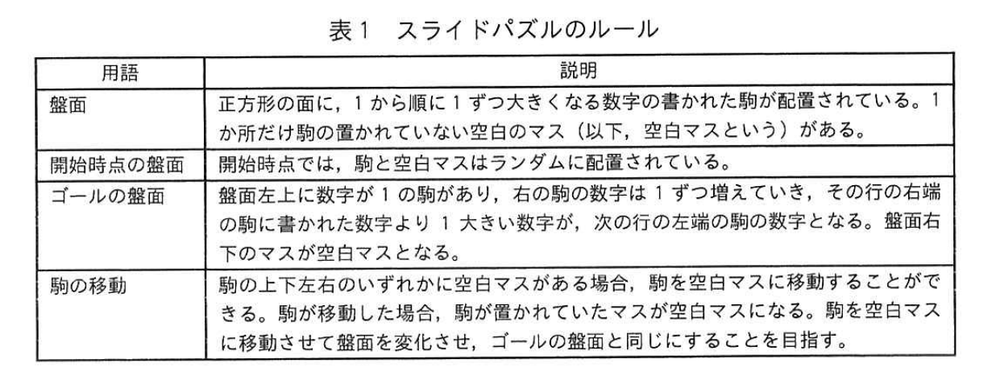
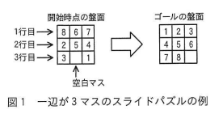
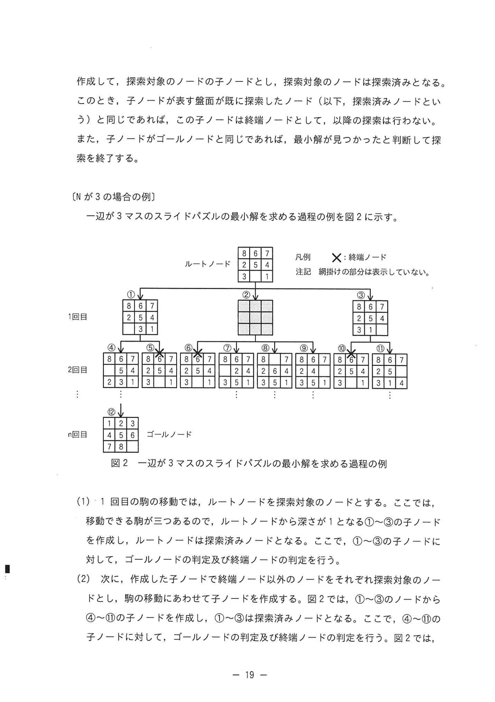
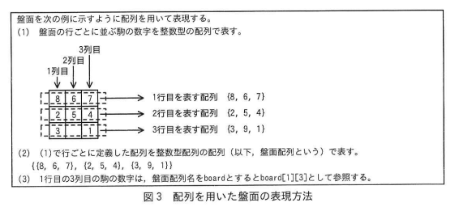
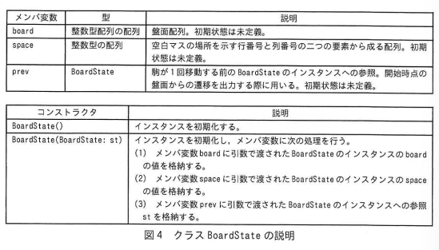
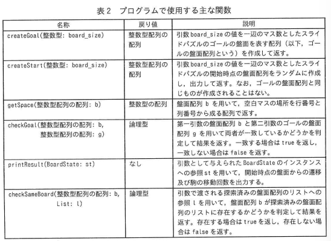
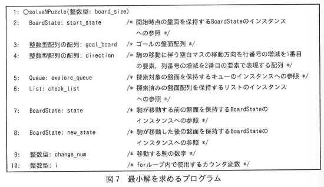
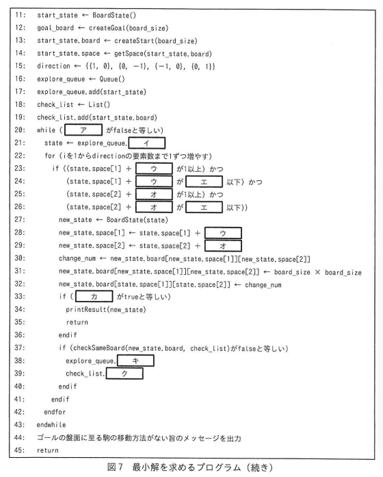

# 2025年春期 応用情報技術者試験 午後 問3（選択）
## プログラミング：スライドパズルを解くプログラム（幅優先探索）

---

## 問題文

**問3** スライドパズルを解くプログラムに関する次の記述を読んで、設問に答えよ。

表1のルールで定義されるスライドパズルについて考える。

### 表1 スライドパズルのルール



> | 用語 | 説明 |
> |---|---|
> | 盤面 | 正方形の面に、1から順に1ずつ大きくなる数字の書かれた駒が配置されている。1か所だけ駒の置かれていない空白のマス（以下、空白マスという）がある。 |
> | 開始時点の盤面 | 開始時点では、駒と空白マスはランダムに配置されている。 |
> | ゴールの盤面 | 盤面左上に数字が1の駒があり、右の駒の数字は1ずつ増えていき、その行の右端の駒に書かれた数字より1大きい数字が、次の行の左端の駒の数字となる。盤面右下のマスが空白マスとなる。 |
> | 駒の移動 | 駒の上下左右のいずれかに空白マスがある場合、駒を空白マスに移動することができる。駒が移動した場合、駒が置かれていたマスが空白マスになる。駒を空白マスに移動させて盤面を変化させ、ゴールの盤面と同じにすることを目指す。 |

一辺が3マスのスライドパズルの例を図1に示す。

### 図1 一辺が3マスのスライドパズルの例



> ※ 開始時点の盤面（例）:
> ```
> 8 6 7
> 2 5 4
> 3 _ 1
> ```
> ゴールの盤面:
> ```
> 1 2 3
> 4 5 6
> 7 8 _
> ```

本問では、一辺のマスの個数が任意のスライドパズルにおいて、ゴールの盤面になるまでの駒の移動回数が最小となる移動方法（以下、最小解という）を一つ求めるプログラムを作成する。

---

### 〔一辺がNマスのスライドパズルの最小解を幅優先探索を用いて求める方法〕

幅優先探索を行ったとき、スライドパズルの盤面の遷移を、グラフで表現する。開始時点の盤面をルートノード、ある時点の盤面をノード、駒の移動に伴う盤面の遷移をエッジで表現する。また、ゴールの盤面をゴールノードとして定義する。

幅優先探索で最小解を求める方法を次のように考える。ここで、N は2以上とする。

探索対象のノードに対して，移動できる駒ごとにその駒を移動した後のノードを作成して，探索対象のノードの子ノードとし，探索対象のノードは探索済みとなる。このとき，子ノードが表す盤面が既に探索したノード（以下，探索済みノードという）と同じであれば，この子ノードは終端ノードとして，以降の探索は行わない。また，子ノードがゴールノードと同じであれば，最小解が見つかったと判断して探索を終了する。

### 〔N が3の場合の例〕

一辺が3マスのスライドパズルの最小解を求める過程の例を図2に示す。

### 図2 一辺が3マスのスライドパズルの最小解を求める過程の例



> ※ 図中の × は終端ノード（探索済みノードまたはゴールノード判定で終端化されたノード）を表す。
> ※ 1回目（第1イテレーション）: ルートノードから①②③の3子ノードを作成
> ※ 2回目: ①から④⑤⑥の3子ノードを作成（②③は探索済みにより終端）
> ※ n回目: ゴールノードに到達

(1) 1回目の駒の移動では，ルートノードを探索対象のノードとする。ここでは，移動できる駒が三つあるので，ルートノードから深さが1となる①～③の子ノードを作成し，ルートノードは探索済みノードとなる。ここで，①～③の子ノードに対して，ゴールノードの判定及び終端ノードの判定を行う。

(2) 次に，作成した子ノードで終端ノード以外のノードをそれぞれ探索対象のノードとし，駒の移動にあわせて子ノードを作成する。図2では，①～③のノードから④～⑪の子ノードを作成し，①～③は探索済みノードとなる。ここで，④～⑪の子ノードに対して，ゴールノードの判定及び終端ノードの判定を行う。図2では，盤面が探索済みノードと一致する⑤，⑥及び⑩は終端ノードとなり，以降の探索は行わない。

(3) 以降，(2)で作成したノードの子ノードの作成と，ゴールノードの判定及び終端ノードの判定を繰り返す。図2の⑫は，n 回目の移動でゴールノードに至ったことを示している。なお，全てのリーフノードが終端ノードと判定された場合，ゴールの盤面に至る駒の移動方法がないことを意味しているので，その旨のメッセージを出力して探索を終了する。

---

次に，配列を用いた盤面の表現方法を図3に示す。ここで，空白マスを表す値は最も大きい駒の数字である8に1を加えた9とする。なお，配列の要素番号は1から始まる。

### 図3 配列を用いた盤面の表現方法



> 盤面を次の例に示すように配列を用いて表現する
> (1) 盤面の行ごとに並ぶ駒の数字を整数型の配列で表す。
> ```
> 盤面:
> 8 6 7    → 1行目を表す配列: {8, 6, 7}
> 2 5 4    → 2行目を表す配列: {2, 5, 4}
> 3 _ 1    → 3行目を表す配列: {3, 9, 1}  ※空白マスは9
> ```
> (2) (1)で行ごとに定義した配列を整数型配列の配列(以下、盤面配列という)で表す。
> {{8, 6, 7}, {2, 5, 4}, {3, 9, 1}}
> (3) 1行目の3列目の駒の数字は、盤面配列名をboardとするとboard[1][3]として参照する。

---

### 〔一辺がNマスのスライドパズルの最小解を求めるプログラム〕

一辺が N マスのスライドパズルにおいて、開始時点の盤面をランダムに作成し、最小解を求め、開始時点の盤面からの遷移及び駒の移動回数を出力するプログラムを作成する。開始時点からの盤面の遷移を保持する単方向連結リストの要素となるクラス BoardState の説明を図4に、キューを実現するクラス Queue の説明を図5に、リストを実現するクラス List の説明を図6に、プログラムで使用する主な関数を表2に、最小解を求めるプログラムを図7に示す。

### 図4〜図6 クラスの説明



> ** 図4 **
> | メンバ変数 | 型 | 説明 |
> |---|---|---|
> | board | 整数型配列の配列 | 盤面配列。初期状態は未定義。 |
> | space | 整数型の配列 | 空白マスの場所を示す行番号と列番号の二つの要素から成る配列。初期状態は未定義。 |
> | prev | BoardState | 駒が1回移動する前の BoardState のインスタンスへの参照。開始時点の盤面からの遷移を出力する際に用いる。初期状態は未定義。 |
> 
> | コンストラクタ | 説明 |
> |---|---|
> | BoardState() | インスタンスを初期化する。 |
> | BoardState(BoardState: st) | インスタンスを初期化し、メンバ変数に次の処理を行う。 (1)メンバ変数boardに引数で渡されたBoardStateのインスタンスのboardの値を格納する。 (2)メンバ変数spaceに引数で渡されたBoardStateのインスタンスのspaceの値を格納する。 (3)メンバ変数prevに引数で渡されたBoardStateのインスタンスへの参照stを格納する。 |

[図5 クラスQueueの説明](../images/2025春_問03_図05_クラスQueueの説明.png)

> ** 図5 **
> | コンストラクタ | 説明 |
> | --- | --- |
> | Queue() | 可変長のキューを生成する |
>
> | メソッド | 戻り値 | 説明 |
> | --- | --- | --- |
> | add(BoardState: st) | なし | キューにBoardStateのインスタンスへの参照stを追加する。
> | isEmpty() | 論理型 | キューが空の場合はtrueを返し、空でない場合はfalseを返す。
> | poll() | BoardState | 先頭のBoardStateのインスタンスへの参照を取り出して返す。
> | peek() | BoardState | 先頭のBoardStateのインスタンスへの参照を返す。

[図6 クラスListの説明](../images/2025春_問03_図06_クラスListの説明.png)

> ** 図6 **
> | コンストラクタ | 説明 |
> | --- | --- |
> | List() | 可変長のリストを生成する |
> 
> | メソッド | 戻り値 | 説明 |
> | --- | --- | --- |
> | add(整数型配列の配列: b) | なし | リストに盤面配列bを追加する。 |
> | isEmpty() | 論理型 | リストが空の場合はtrueを返し、空でない場合はfalseを返す。 |
> | peek() | 整数型配列の配列 | リストの先頭に存在する盤面配列を返す。 |


### 表2 プログラムで使用する主な関数



> ** 表2 **
> | 名称 | 戻り値 | 説明 |
> | createGoal(整数型: board_size) | 整数型配列の配列 | 引数board_sizeの値を一辺のマス数としたスライドパズルのゴールの盤面を表す配列（以下、ゴールの盤面配列という）を作成して返す。 |
> | createStart(整数型: board_size) | 整数型配列の配列 | 引数board_sizeの値を一辺のマス数としたスライドパズルの開始時点の盤面配列をランダムに作成し、出力して返す。なお、ゴールの盤面配列と同じものが作成されることはない。 |
> | getSpace(整数型配列の配列: b) | 整数型の配列 | 盤面配列bを用いて、空白マスの場所を行番号と列番号から成る配列で返す。 |
> | checkGoal(整数型配列の配列: b, 整数型配列の配列: g) | 論理型 | 第一引数の盤面配列bと第二引数のゴールの盤面配列gを用いて両者が一致しているかどうかを判定して結果を返す。一致する場合はtrueを返し、一致しない場合はfalseを返す。 |
> | printResult(BoardState: st) | なし | 引数として与えられたBoardStateのインスタンスへの参照stを用いて、開始時点の盤面からの遷移及び駒の移動回数を出力する。 |
> | checkSameBoard(整数型配列の配列: b, List: l) | 論理型 | 引数で渡される探索済みの盤面配列のリストへの参照lを用いて、盤面配列bが探索済みの盤面配列のリストに存在するかどうかを判定して結果を返す。存在する場合はtrueを返し、存在しない場合はfalseを返す。 |

### 図7 最小解を求めるプログラム




> ```
>  1: solveNPuzzle(整数型: board_size)
>  2:   BoardState: start_state  /* 開始時点の盤面を保持するBoardStateのインスタンスへの参照 */
>  3:   整数型配列の配列: goal_board  /* ゴールの盤面配列への参照 */
>  4:   整数型配列の配列: direction  /* 駒の移動に伴う空白マスの移動方向を行番号の増減を1番目の要素, 列番号の増減を2番目の要素で表現する配列 */
>  5:   Queue: explore_queue  /* 探索対象の盤面を保持するQueueのインスタンスへの参照 */
>  6:   List: check_list  /* 探索済み盤面を保持するListのインスタンスへの参照 */
>  7:   BoardState: state  /* 駒の移動前の盤面を保持するBoardStateのインスタンスへの参照 */
>  8:   BoardState: new_state  /* 駒が移動した後の盤面を保持するBoardStateのインスタンスへの参照 */
>  9:   整数型: change_num  /* 移動する駒の数字 */
> 10:   整数型: i  /* forループ内で使用するカウンタ変数 */
> 11:   start_state ← BoardState()
> 12:   goal_board ← createGoal(board_size)
> 13:   start_state.board ← createStart(board_size)
> 14:   start_state.space ← getSpace(start_state.board) 
> 15:   direction ← {{1, 0}, {0, −1}, {−1, 0}, {0, 1}}
> 16:   explore_queue ← Queue()
> 17:   explore_queue.add(start_state)
> 18:   check_list ← List()
> 19:   check_list.add(start_state.board)
> 20:   while ( [ア] がfalseと等しい)
> 21:     state ← explore_queue. [イ]
> 22:     for (iを1からdirection要素数まで1ずつ増やす)
> 23:       if ((state.space[1] + [ウ] が 1以上) かつ
> 24:           (state.space[1] + [ウ] が [エ] 以下) かつ
> 25:           (state.space[2] + [オ] が 1以上) かつ
> 26:           (state.space[2] + [オ] が [エ] 以下))
> 27:         new_state ← BoardState(state)
> 28:         new_state.space[1] ← state.space[1] + [ウ]
> 29:         new_state.space[2] ← state.space[2] + [オ]
> 30:         change_num ← new_state.board[new_state.space[1]][new_state.space[2]]
> 31:         new_state.board[new_state.space[1]][new_state.space[2]] ← board_size × board_size
> 32:         new_state.board[state.space[1]][state.space[2]] ← change_num
> 33:         if ( [カ] がtrueと等しい)
> 34:           printResult(new_state)
> 35:           return
> 36:         endif
> 37:         if (checkSameBoard(new_state.board, check_list)がfalseと等しい)
> 38:           explore_queue. [キ]
> 39:           check_list. [ク]
> 40:         endif
> 41:       endif
> 42:     endfor
> 43:   endwhile
> 44:   ゴールの盤面に至る駒の移動方法がない旨のメッセージを出力
> 45:   return
> ```

---

## 設問

### 設問1

図2中の②の盤面を図3に倣って、配列で答えよ。

### 設問2

図7中の `[ア]` 〜 `[ク]` に入れる適切な字句を答えよ。

---

## 解答と解説

### 設問1

**正解：{{8, 6, 7}, {2, 9, 4}, {3, 5, 1}}**

**解説：** 図2の1回目のイテレーションでは、ルートノード（開始盤面 8 6 7／2 5 4／3 _ 1、空白マスは3行2列）から3つの子ノード①②③が生成される。②は空白マスを上（direction=(−1,0)）に動かした盤面で、2行2列の駒5が空白マス位置（3行2列）へ移動する。結果は 8 6 7／2 _ 4／3 5 1 となり、空白マスを board_size²=9 で表現すると、図3の形式で {{8, 6, 7}, {2, 9, 4}, {3, 5, 1}} となる。

---

### 設問2

**正解：**

| 空欄 | 正解 | 説明 |
|---|---|---|
| **ア** | `explore_queue.isEmpty()` | whileループの継続条件。キューが空でない間（isEmpty()がfalseの間）探索を続ける |
| **イ** | `poll()` | キューの先頭要素を取り出す（FIFO：幅優先探索の核心） |
| **ウ** | `direction[i][1]` | 空白マスの移動方向の行成分（direction配列の1番目の要素） |
| **エ** | `board_size` | 空白移動先の列が盤面内かチェック（board_size以下であることを確認） |
| **オ** | `direction[i][2]` | 空白マスの移動方向の列成分（direction配列の2番目の要素） |
| **カ** | `checkGoal(new_state.board, goal_board)` | 新盤面がゴールに等しいかチェック |
| **キ** | `add(new_state)` | 探索キューに新状態を追加（次のイテレーションで探索対象にする） |
| **ク** | `add(new_state.board)` | 探索済みリストに新盤面を追加（再探索防止） |

**幅優先探索のアルゴリズム解説：**

```
BFS（幅優先探索）の概念:
  探索キュー(FIFO)を使い、ルートから近い順に全ノードを探索する。
  → 最初にゴールに到達した経路 = 最小手数（最小解）
  
  while（キューが空でない）:
    キューから先頭の状態を取り出す → poll()  [イ]
    for（各移動方向）:
      新状態を生成
      if（ゴール？）→ 終了
      if（未探索？）→ キューに追加 [キ]、探索済みリストに追加 [ク]
```

**direction配列の意味：**
```
direction ← ((1, 0), (0, -1), (-1, 0), (0, 1))
           = {下移動, 左移動, 上移動, 右移動}
         ※ direction[i][1] = 行方向の増減 [ウ]
            direction[i][2] = 列方向の増減 [オ]
```

**境界チェック（line 23-25）：**
```
空白マスの移動先が盤面内かを確認:
  行: space[1] + direction[i][1] ≥ 1 (上端チェック)
      space[1] + direction[i][1] ≤ board_size (下端チェック)
  列: space[2] + direction[i][2] ≥ 1 (左端チェック)
      space[2] + direction[i][2] ≤ board_size [エ] (右端チェック)
```

---

## 参考：主要キーワード

| 用語 | 説明 |
|------|------|
| スライドパズル（15パズル等） | N×N-1枚の駒と1つの空白マスを持つパズル。最小手数でゴール配置にする |
| 幅優先探索（BFS: Breadth-First Search） | グラフをルートに近い順に探索する手法。最短経路（最小手数）を保証する |
| キュー（Queue） | FIFO（先入れ先出し）データ構造。BFSの実装に不可欠 |
| ノード | グラフの頂点。スライドパズルでは各盤面状態に対応 |
| エッジ | ノード間の繋がり。スライドパズルでは1手の移動に対応 |
| ゴールノード | ゴール盤面に対応するノード。BFSがここに到達したときが最小解 |
| 終端ノード | 探索済みノードと同じ盤面、またはゴールノードとして探索を打ち切るノード |
| direction配列 | 移動方向（行/列の増減）を定義した配列。(1,0)=下, (0,-1)=左, (-1,0)=上, (0,1)=右 |
| explore_queue | 次に探索すべき状態を管理するFIFOキュー |
| check_list | 探索済み盤面のリスト。同じ盤面の再探索を防ぐ |
| poll() | キューから先頭要素を取り出すメソッド |
| isEmpty() | キューが空かどうかを返すメソッド。falseの間BFSを継続 |
