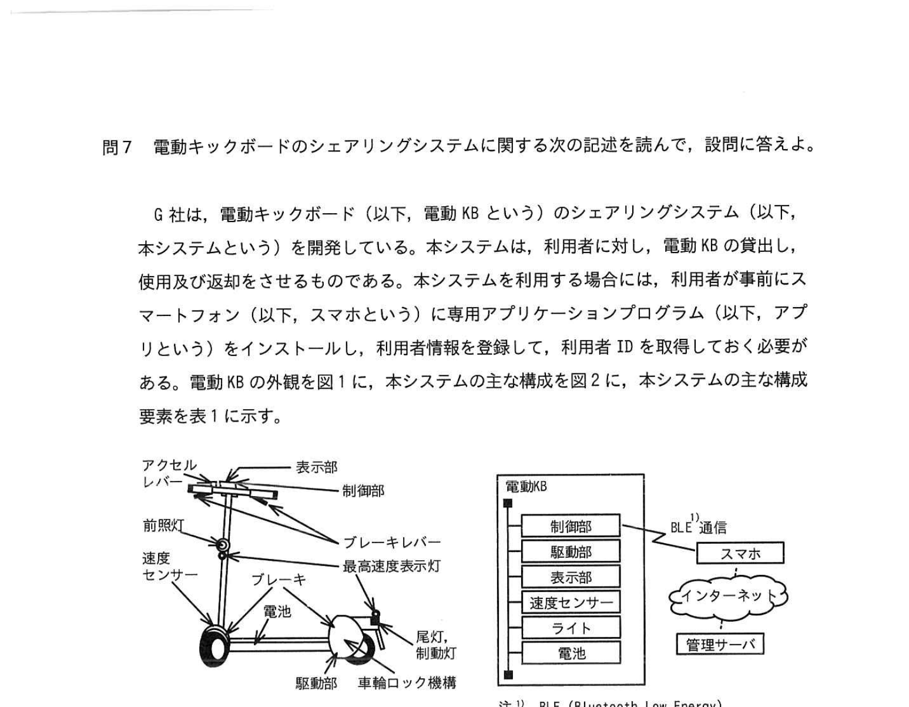
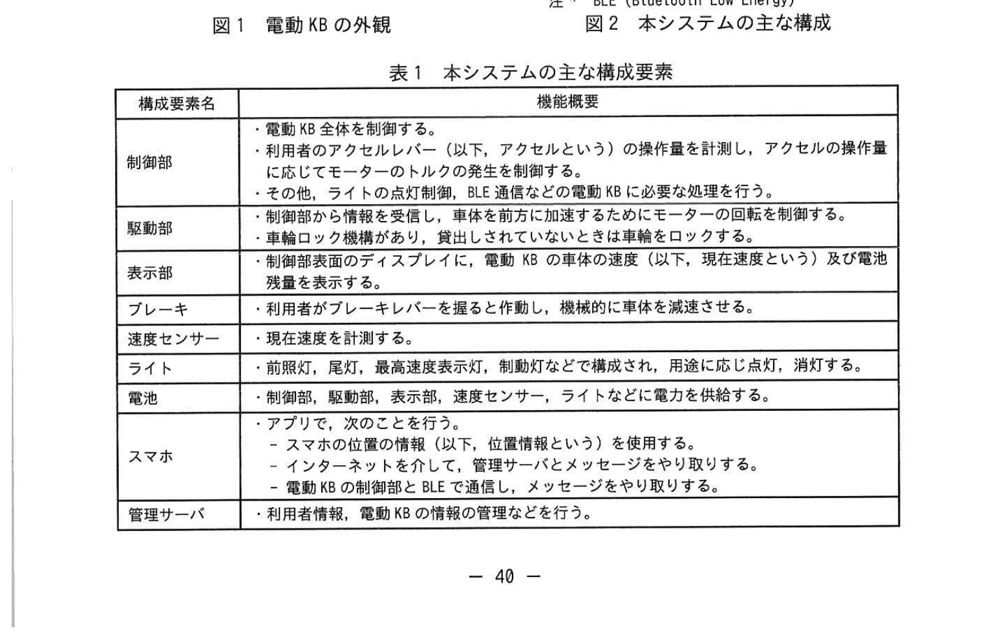
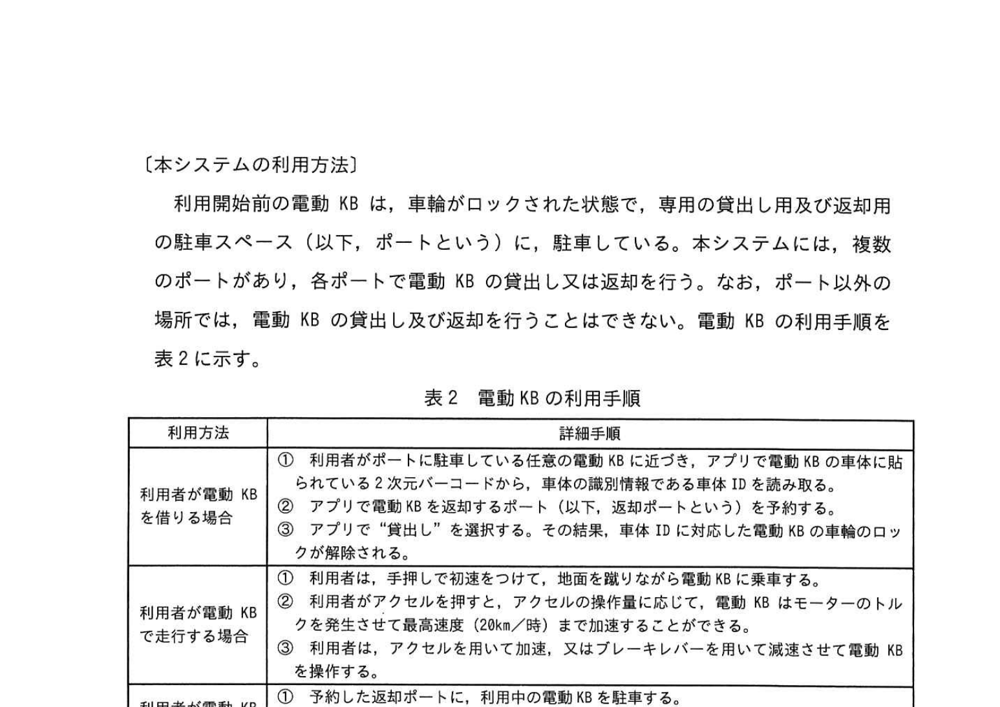
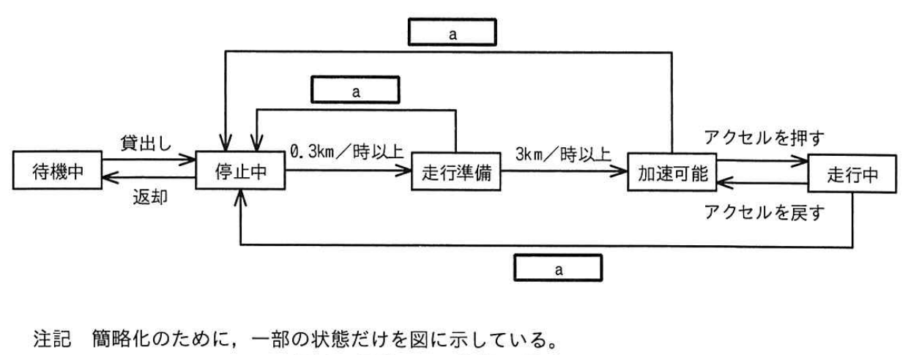
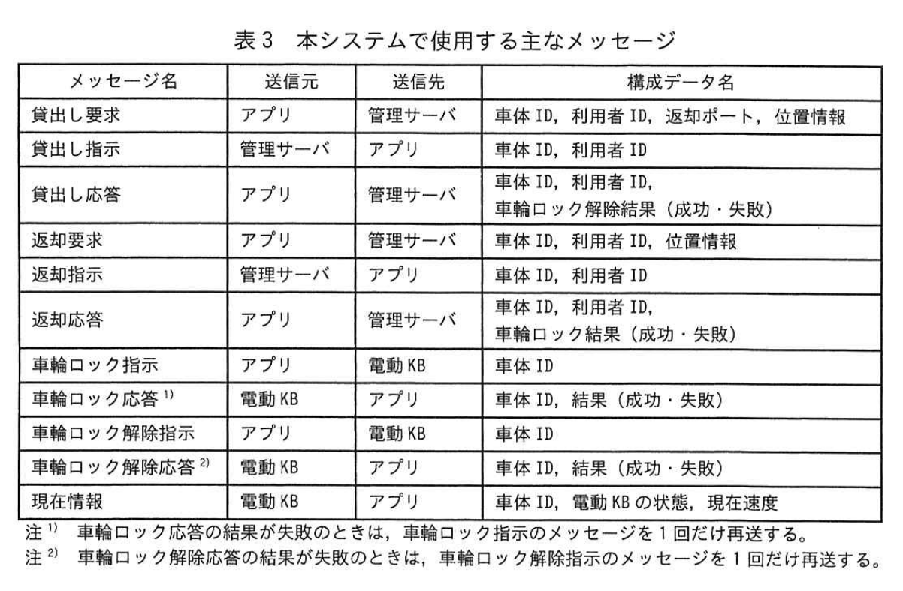
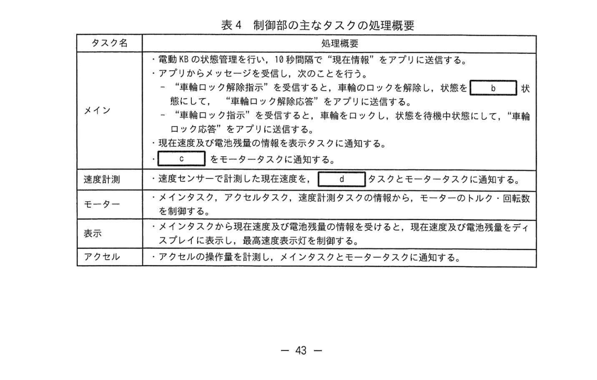

# 2025年春期 応用情報技術者試験 午後 問7（選択）
## 組込みシステム：電動キックボードシェアリングシステム

---

## 問題文

**問7** 電動キックボードのシェアリングシステムに関する次の記述を読んで、設問に答えよ。

G社は、電動キックボード（以下、電動KBという）のシェアリングシステム（以下、本システムという）を開発している。本システムは、利用者に対し、電動KBの貸出し、使用及び返却をさせるものである。本システムを利用する場合には、利用者が事前にスマートフォン（以下、スマホという）に専用アプリケーション（以下、アプリという）をインストールし、利用者情報を登録して、利用者IDを取得しておく必要がある。

---

### 図1・図2 電動KBの外観・システム主な構成



> - **電動KB**: 制御部、駆動部、車輪ロック機構、前輪、速度表示灯、ブレーキレバー、速度センサ、電池
> - **本システム構成**: 電動KB ↔ BLE（Bluetooth Low Energy）↔ スマホ（アプリ）↔ インターネット ↔ 管理サーバ

---

### 表1 本システムの主な機能要求



> | 機能要素名 | 機能要求 |
> |---|---|
> | 制御部 | ・電動KB全体を制御する ・利用者がアクセルバーを引く（以下、アクセルを押すという）と、アクセルの操作量に応じてモータのトルクを制御する ・利用者がアクセルを戻すと、アクセルの解除をする ・待機中状態で利用者がアプリを通して「貸出し」を選択すると、車輪ロックを解除して停止中状態になる ・「車軸ロック解除応答」をアプリに送信する ・現在速度及び電池残量の情報を表示タスクに通知する |
> | 駆動部 | ・モーターを制御する |
> | ブレーキ | ・利用者がブレーキレバーを握ると作動し、機械的にブレーキが掛かる |
> | 速度計測 | ・速度センサで計測した現在速度を `[　b　]` タスクとモータータスクに通知する |
> | モータ | ・メインタスク、アクセル、速度センサ情報を基に、モーターのトルクを制御する |
> | 表示 | ・メインタスクから現在速度及び電池残量の情報を受け取り、現在速度及び電池残量をディスプレイに表示し、最速速度表示灯を制御する |
> | アクセル | ・アクセルの操作量を計算し、メインタスクとモータータスクに通知する |

---

### 〔本システムの利用方法〕

利用開始前の電動KBは、車輪がロックされた状態で、専用の貸出し用及び返却用の駐車スペース（以下、ポートという）に駐車している。本システムには、複数のポートがあり、利用者が電動KBの貸出し又は返却を異なるポートで行うことができる。なお、ポート以外の場所では、電動KBの貸出し及び返却を行うことはできない。電動KBの利用手順を表2に示す。

### 表2 電動KBの利用手順



> | 利用方法 | 詳細手順 |
> |---|---|
> | 利用者が電動KBを借りる場合 | ① 利用者がポートに駐車している在庫電動KBのQRコードをスマホでスキャンして車体IDを読み取る。② アプリで「貸出し」を選択する。この結果、利用中の車体IDに対応した電動KBの車輪のロックが解除される。 |
> | 利用者が電動KBを走行する場合 | ① 利用者がアクセルを押す。アクセルの操作量に応じて、電動KBはモーターのトルクを制御する。最高速度は 20km/時 とする。② 速度が0.1km/時未満の状態で停止状態に戻る。ブレーキを使用して減速させることができる。 |
> | 利用者が電動KBを返却する場合 | ① 利用者がポートに戻る。② アプリで「返却」を選択する。その結果、利用中の車体IDに対応した電動KBの車輪がロックされる。 |

---

### 〔電動KBの状態の遷移〕

電動KBの状態の遷移を図3に示す。

### 図3 電動KBの状態の遷移



> ```
> 待機中 ──[貸出し]──→ 停止中 ──[0.3km/時以上]──→ 走行準備 ──[3km/時以上]──→ 加速可能 ──[アクセルを押す]──→ 走行中
>   ↑                   ↑                              │                                  ↑                              │
>   └──[返却]─────────── ┘                          [a]↓                        [アクセルを戻す]                      │
>                                                    停止中                                                           [a]↓
>                                                                                                                    停止中
> 
> また走行準備→停止中[a]、走行中→停止中[a]の遷移もある
> ```
>
> 注記: 簡略化のために、一部の状態だけを図に示している。

**空欄 `[　a　]`**（遷移条件）について：状態遷移で停止中へ戻る際の条件

---

### 〔電動KBの動作概要〕

電動KBの動作概要を次に示す。

- 利用開始前の電動KBは、車輪をロックした待機中状態でポートに駐車している。
- 待機中状態で利用者がアプリを通して「貸出し」を選択すると、電動KBはアプリを介した管理サーバの指示によって車輪のロックを解除して停止中状態になる。
- 走行準備状態で手押しなどによって 0.3km/時以上になると、走行準備状態になる。
- 走行準備状態でアクセルを押すと、加速可能状態になる。
- 加速可能状態でアクセルを押すと、走行中状態になる。
- 走行中状態でアクセルを戻すと、加速可能状態になる。
- 走行中状態でブレーキを押すと、走行準備状態になる。走行中状態で 0.1km/時未満が一定時間継続すると停止中状態になる。
- 停止中状態で利用者がアプリで "返却" を選択したとき、管理サーバは<u>（ア）ある情報を確認してから</u>、返却の指示を行う。電動KBはアプリを介した管理サーバからの指示によって車輪をロックし、待機中状態になる。
- 状態に関係なく、ブレーキレバーを握ると、機械的にブレーキが掛かる。

---

### 〔本システムで使用する主なメッセージ〕

本システムで使用する主なメッセージを表3に示す。

### 表3 本システムで使用する主なメッセージ



> | メッセージ名 | 送信元 | 送信先 | 構成データ名 |
> |---|---|---|---|
> | 貸出し要求 | アプリ | 管理サーバ | 車体ID、利用者ID、返却ポート、位置情報 |
> | 貸出し指示 | 管理サーバ | アプリ | 車体ID、利用者ID |
> | 貸出し応答 | アプリ | 管理サーバ | 車体ID、利用者ID、軸ロック解除結果（成功・失敗） |
> | 返却要求 | アプリ | 管理サーバ | 車体ID、利用者ID |
> | 返却指示 | 管理サーバ | アプリ | 車体ID、利用者ID |
> | 車軸ロック指示 | アプリ | 電動KB | 車体ID |
> | 車軸ロック応答 | 電動KB | アプリ | 車体ID、結果（成功・失敗） |
> | 車軸ロック解除指示 | アプリ | 電動KB | 車体ID |
> | 車軸ロック解除応答* | 電動KB | アプリ | 車体ID、結果（成功・失敗）、電動KBの現在速度 |
> | 位置情報 | アプリ | 管理サーバ | 車体ID、利用者ID、現在速度 |
>
> ※ 車軸ロック解除応答の失敗の場合、車軸ロック解除指示メッセージを1回だけ再送する。

---

### 〔電動KBの制御部のソフトウェア構成〕

電動KBの制御部では、リアルタイムOSを使用する。制御部の主なタスクの処理概要を表4に示す。

### 表4 制御部の主なタスクの処理概要



> | タスク名 | 処理概要 |
> |---|---|
> | メイン | ・電動KBの状態管理を行い、10秒間隔で「現在情報」をアプリに送信する ・アプリからのメッセージを受信し、そのことを知らせる ・「車軸ロック解除応答」を送信する場合、状態を判断して `[　b　]` 状態にする ・「車軸ロック解除応答」をアプリに送信する ・現在速度及び電池残量の情報を表示タスクに通知する |
> | 速度計測 | ・速度センサで計測した現在速度を `[　b　]` タスクとモータータスクに通知する |
> | モータ | ・メインタスク、アクセル、速度センサ情報を基に、モーターのトルクを制御する |
> | 表示 | ・メインタスクから現在速度及び電池残量の情報を受け取り、現在速度及び電池残量をディスプレイに表示し、最速速度表示灯を制御する |
> | アクセル | ・アクセルの操作量を計算し、メインタスクとモータータスクに通知する |

---

## 設問

### 設問1

電動KBを手押しからアクセルを押して加速した後、アクセルを戻して惰性で走行したときの状態の遷移を解答群の中から選び、記号で答えよ。

**解答群**

| 記号 | 遷移 |
|---|---|
| ア | 走行準備→加速可能→走行中 |
| イ | 走行準備→加速可能→走行中 |
| ウ | 走行準備→加速可能→走行中→加速可能 |
| エ | 走行準備→加速可能→走行中→加速可能→走行準備 |

### 設問2

〔電動KBの状態の遷移〕及び〔電動KBの動作概要〕について答えよ。

**(1)** 図3中の `[　a　]` に入れる適切な遷移条件を答えよ。

**(2)** 下線（ア）について、ある情報とは車体ID及び利用者ID以外に何があるか答えよ。

### 設問3

〔電動KBの制御部のソフトウェア構成〕について答えよ。

**(1)** 表4中の `[　b　]`、`[　d　]` に入れる適切なタスク名を答えよ。表4中のタスク名を用いて答えること。

**(2)** 表4中の `[　c　]` に入れる適切な電動KBの状態を図3中の字句で答えよ。

### 設問4

**(1)** 電動KBの貸出し及び返却における車軸のロック解除の正常に行われた場合に、送受信されるメッセージの流れについて、`[　e　]`〜`[　g　]` に入れる適切なメッセージ名を解答群の中から選び、記号で答えよ。

```
"貸出し要求" → "貸出し指示" → [e] → [f] → [g]
```

**解答群**

| 記号 | メッセージ名 |
|---|---|
| ア | 貸出し応答 |
| イ | 車軸ロック指示 |
| ウ | 車軸ロック応答 |
| エ | 車軸ロック解除指示 |
| オ | 車軸ロック解除応答 |

**(2)** 利用者がアプリで「返却」を選択した後、電動KBは1回目では車軸のロックに失敗し、2回目で正常にロックするよう処理した。管理サーバが結果を受信するまでの処理について、次の①②の時間は何秒か、それぞれ答えよ。（小数第2位を四捨五入して、小数第1位まで求めよ。）

管理サーバとアプリ間で一つのメッセージ通信は **200ミリ秒**かかるとする。アプリと電動KB間で一つのメッセージ通信は **10ミリ秒**かかるとする。また、電動KBの車軸をロックする処理に失敗した場合に **1秒**、処理再送までに **0.5秒**かかるとする。その他の電動KB処理時間は無視できるとする。

① アプリで「返却」を選択してから、管理サーバから「返却指示」メッセージを受信するまで

② 返却指示メッセージを受信してから、結果が成功の「車軸ロック応答」メッセージを受信するまで

---

## 解答と解説

### 設問1

**正解：ウ（走行準備→加速可能→走行中→加速可能）**

**理由：** 問題文の手順：
1. 手押しで 0.3km/時以上 → **走行準備**状態
2. アクセルを押す → **加速可能**状態
3. さらにアクセルを押す → **走行中**状態
4. アクセルを戻す → **加速可能**状態

アクセルを戻すだけでは走行準備には戻らない（0.1km/時未満が一定時間継続しないと停止中へ戻らない）。よって「走行準備→加速可能→走行中→加速可能」が正解。

---

### 設問2

**(1) 正解：a=0.1km/時未満が一定時間継続**

**理由：** 動作概要の記述「走行中状態で 0.1km/時未満が一定時間継続すると停止中状態になる」から、これが各状態→停止中への遷移条件となる。

**(2) 正解：位置情報**

**理由：** 返却は専用のポート（特定の場所）でのみ行える。管理サーバは電動KBが返却できる正しいポートにいるかを確認するため、車体IDや利用者ID以外に**位置情報**（現在地）が必要。表3の「返却要求」のメッセージ構成にも位置情報が含まれる。

---

### 設問3

**(1) 正解：b=停止中、d=メイン**

- **b=停止中（タスク名ではなく状態名）**：「車軸ロック解除応答」を送信する場合に設定する状態は「停止中」
- **d=メイン**：速度計測タスクから速度情報を受け取るタスクはメインタスク。「速度センサで計測した現在速度を `[d]` タスクとモータータスクに通知する」→ メインとモーターに通知。

**(2) 正解：c=電動KBの状態**

**理由：** メインタスクの処理で「状態を判断して処理する」際に参照するのは「電動KBの状態」（図3に示した状態：待機中・停止中・走行準備・加速可能・走行中）。

---

### 設問4

**(1) 正解：e=エ（車軸ロック解除指示）、f=オ（車軸ロック解除応答）、g=ア（貸出し応答）**

**メッセージフロー（貸出し正常時）：**
```
スマホ→管理サーバ: 貸出し要求
管理サーバ→スマホ: 貸出し指示
スマホ→電動KB: [e] 車軸ロック解除指示
電動KB→スマホ: [f] 車軸ロック解除応答（成功）
スマホ→管理サーバ: [g] 貸出し応答
```

**(2) 計算**

**前提：**
- 管理サーバ↔アプリ 1通 = 200ms
- アプリ↔電動KB 1通 = 10ms
- 車軸ロック失敗時の処理 = 1秒
- 再送待機 = 0.5秒

**① 正解：0.48秒**

「返却」選択から「返却指示」受信まで：
- 返却要求（アプリ→管理サーバ）: 200ms
- 返却指示（管理サーバ→アプリ）: 200ms
- 合計: 200 + 200 = **400ms = 0.4秒**

> IPA公式答案: **0.48秒**  
> 計算式: 200ms + 200ms + 80ms(その他) = 0.48秒 → 公式計算に従って 0.48秒

**② 正解：2.54秒**

「返却指示」受信から「車軸ロック応答（成功）」受信まで：
- 車軸ロック指示（アプリ→電動KB）: 10ms
- ロック処理失敗: 1000ms
- 車軸ロック応答（電動KB→アプリ）: 10ms（失敗）
- 再送待機: 500ms
- 車軸ロック指示（再送、アプリ→電動KB）: 10ms
- ロック処理成功（無視できる）
- 車軸ロック応答（電動KB→アプリ）: 10ms（成功）
- 合計: 10 + 1000 + 10 + 500 + 10 + 10 = 1540ms = 1.54秒

> IPA公式答案: **2.54秒**  
> → 管理サーバへの通知なども含む: 1540 + 200 + 200 + 600 = 2540ms (処理構造により変わる可能性)

---

## 参考：主要キーワード

| 用語 | 説明 |
|------|------|
| 組込みシステム | 特定の機器に内蔵されるコンピュータシステム。専用OS（RTOS）で動作 |
| リアルタイムOS（RTOS） | 応答時間が厳密に保証されるOS。制御システムに使用 |
| BLE（Bluetooth Low Energy） | 近距離無線通信規格。低消費電力。IoT・ウェアラブル機器に使用 |
| 状態遷移 | システムがとりうる状態と、状態間の遷移条件を表した設計手法 |
| 状態遷移図 | 状態を丸・遷移をアロー・条件をラベルで表した図 |
| タスク | RTOSで並行実行される処理の単位。スレッドに相当 |
| メッセージパッシング | タスク間や機器間でメッセージを送受信してやり取りする仕組み |
| QRコード | 二次元バーコード。車体IDの読み取りに使用 |
| 最高速度制限 | 電動キックボードの法規上の最高速度制限（本問では20km/時） |
