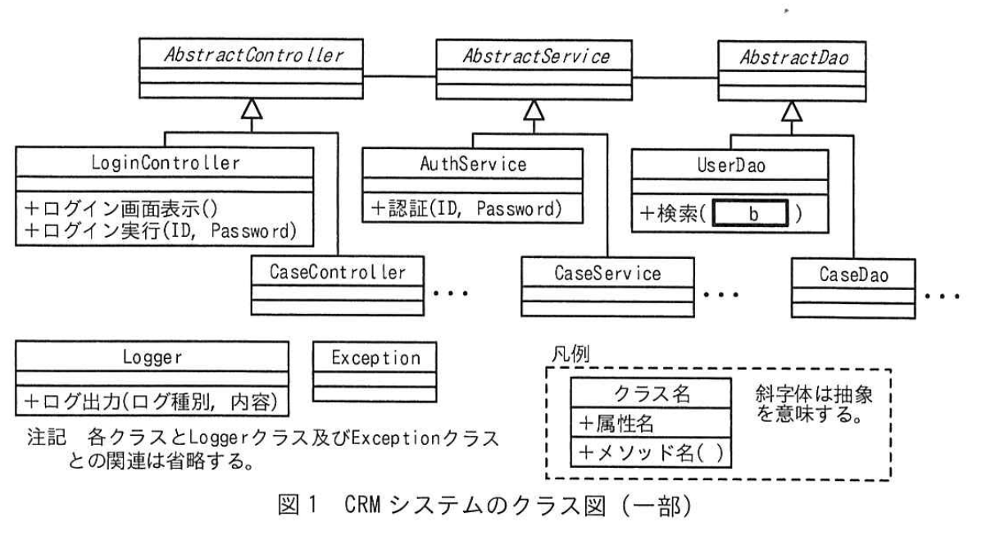
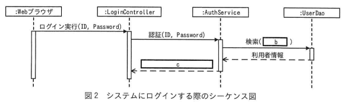
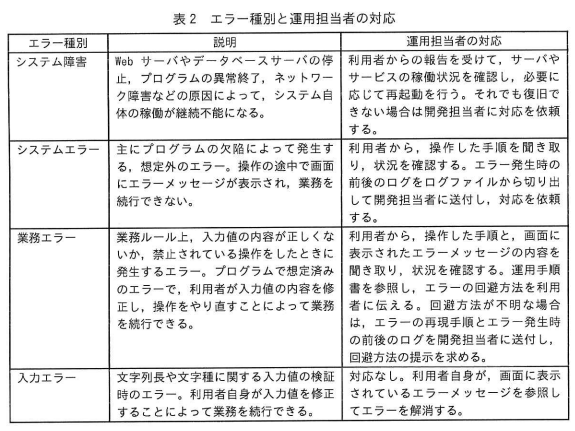
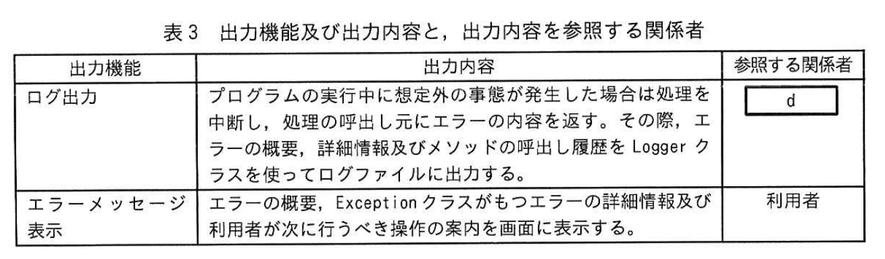

# 2025年春期 応用情報技術者試験 午後 問8（選択）
## 情報システム開発：CRMシステムのエラーハンドリング

---

## 問題文

**問8** CRMシステムの開発に関する次の記述を読んで、設問に答えよ。

Q社は、業務システムの受託開発会社である。Q社は、スーパーマーケットの複数の店舗を運営するB社から、CRM（Customer Relationship Management）システムの開発と運用保守業務を受託した。CRMシステムは各店舗で利用され、顧客からの意見やクレーム、店舗での対応の内容が登録・蓄積される。CRMシステムを運用する際の関係者の一覧を表1に示す。

---

### 表1 関係者の一覧

| 関係者 | 説明 |
| --- | --- | 
| 顧客 | B社の店舗に来店した顧客。意見やクレームを、店舗に勤務するB社の従業員に伝える。 |
| 利用者 | CRMシステムへのアクセスが許可されたB社の従業員。顧客からの意見やクレームをCRMシステムに入力し、過去の類似案件の記録を参考に顧客対応を行う。顧客から聞き取った氏名と連絡先を、CRMシステムに顧客情報として登録することがある。顧客情報は、B社の従業員が顧客に連絡するためだけに利用する。
| 運用担当者 | B社に常駐しているQ社の従業員。CRMシステムの運用手順書に従って、利用者からの質問や不具合発生時の問合せに対応する。問合せ時の状況や不具合の再現手順の確認のために、運用中のCRMシステムへのアクセスが許可されている。運用手順書で対応しきれない技術的な問題については、Q社の開発担当者に対応を依頼する。 |
| 開発担当者 | Q社内で勤務しているQ社の開発担当者。運用担当者からの問合せの際は、調査に必要な最小限の情報として、不具合の状況、再現手順及び発生時刻付近のログを受け取る。運用中のCRMシステムへの入力情報を、直接参照することはできない。 |

Q社は、システムのリリース後に想定される、店舗からの問合せに対する迅速な対応を可能にするために、想定される問合せのパターンと対応方法を事前に整理し、対応の際に必要な要件をシステムの設計に反映させることにした。

### 〔CRMシステムの構造〕

CRMシステムのクラス図（一部）を図1に示す。AbstractController, AbstractService及びAbstractDaoは、それぞれ画面遷移、ビジネスロジック及びデータベースアクセスの共通処理が実装された抽象クラスである。これらのクラスを `[  a  ]` したクラスを作成して、具体的な機能を実装する。ログを出力するには Logger クラスを利用する。ログの出力時には "DEBUG"、"ERROR" などの、ログの種別（以下、ログ種別という）が記録される。図1に示すクラスを使った処理の流れの例として、システムにログインする際のシーケンス図を、図2に示す。

### 〔CRMシステムのクラス（一部）〕

### 図1 CRMシステムのクラス図（一部）



> **クラス構成（UML）：**
> - `AbstractController`（抽象クラス）
>   - `LoginController`: +ログイン画面表示(), +ログイン実行(ID, Password)
>   - `CaseController`: ...
> - `AbstractService`（抽象クラス）
>   - `AuthService`: +認証(ID, Password)
>   - `CaseService`: ...
> - `AbstractDao`（抽象クラス）
>   - `UserDao`: +検索([ `　b　` ])
>   - `CaseDao`: ...
> - `Logger`: +ログ出力(ログ種別, 内容)
> - `Exception`: （ログ種別はない）

> 凡例：
> - クラス名
> - +属性名: 型
> - +メソッド名()

---

### 図2 システムにログインする際のシーケンス図



> ```
> 利用者 → LoginController: ログイン実行(ID, Password)
>          LoginController → AuthService: 認証(ID, Password)
>                            AuthService → UserDao: 検索([ b ])
>                                          UserDao → DB: 利用者情報
>                            AuthService ← UserDao
>          LoginController ← AuthService: [  c  ]
> 利用者 ← LoginController
> ```

利用者がログイン画面で必要な情報を入力しログインを実行すると、LoginController のログイン実行メソッドが呼び出される。ログイン実行メソッドは、画面から入力された情報を AuthService に引き渡す。AuthService は、UserDao に実装されている、利用者情報の検索を行う機能を用いて、認証の判定に必要な利用者情報をデータベースから取得する。AuthService は、取得した利用者情報を用いてログイン認証の判定を行い、結果を返す。

プログラムの実行中にエラーが発生した際の、例外処理用のクラスとして Exception クラスがある。Exception クラスは、エラーの詳細情報として、エラーの発生箇所のソースファイル名、行番号、メソッドの呼出し履歴及び直接的な原因を示すメッセージ文字列をもつ。エラー発生時には、エラーの発生箇所で Exception クラスのオブジェクトを作成し、呼出し元ではそれを使って例外処理を行う。

---

### 〔CRMシステムのエラーの種別の整理とその対応〕

Q社は、運用中に起き得るエラーの種別（以下、エラー種別という）を整理し、対応方法について検討した。エラー種別と運用担当者の対応を表2に、対応を行うために必要な出力機能及び出力内容と、出力内容を参照する関係者を表3に示す。

### 表2 エラー種別と運用担当者の対応



| エラー種別 | 説明 | 運用担当者の対応
| --- | --- | --- |
| システム障害 | Web サーバやデータベースサーバの停止、プログラムの異常終了、ネットワーク障害などの原因によって、システム全体の稼働が継続不能になる。 | 利用者からの報告を受けて、サーバやサービスの稼働状況を確認し、必要に応じて再起動を行う。それでも復旧できない場合は開発担当者に対応を依頼する。
| システムエラー | 主にプログラムの欠陥によって発生する、想定外のエラー。操作の途中で画面にエラーメッセージが表示され、業務を続行できない。 | 利用者から、操作した手順を聞き取り、状況を確認する。エラー発生時の前後のログをログファイルから切り出して開発担当者に送付し、対応を依頼する。
| 業務エラー | 業務ルール上、入力値の内容が正しくないか、禁止されている操作をしたときに発生するエラー。プログラムで想定済みのエラーで、利用者が入力内容を修正し、操作をやり直すことによって業務を続行できる。 | 利用者から、操作した手順と、画面に表示されたエラーメッセージの内容を聞き取り、状況を確認する。運用手順書を参照し、エラーの回避方法を利用者に伝える。回避方法が不明な場合は、エラーの再現手順とエラー発生時の前後のログを開発担当者に送付し、回避方法の提示を求める。
| 入力エラー | 文字列長や文字種に関する入力値の検証時のエラー。利用者自身を入力値を修正することによって業務を続行できる。 | 対応なし。利用者自身が、画面に表示されているエラーメッセージを参照してエラーを解消する。

### 表3 出力機能及び出力内容と、出力内容を参照する関係者



| 出力機能 | 出力内容 | 参照する関係者
| --- | --- | --- |
| ログ出力 | プログラムの実行中に想定外の事態が発生した場合は処理を中断し、処理の呼出し元にエラーの内容を返す。その際、エラーの概要、詳細情報及びメソッドの呼出し履歴を Logger クラスを使ってログファイルに出力する。 | [  d  ]
| エラーメッセージ表示 | エラーの概要、Exception クラスがもつエラーの詳細情報及び利用者が次に行うべき操作の案内を画面に表示する。 | 利用者

---

表2、表3についてレビューを行ったところ、次の3点が指摘された。
（1） 表2のシステム障害及びシステムエラーは、利用者の問合せの前にシステムが自動的に検出して運用担当者が対応を開始できるようにすべきである。
（2） 表3の出力内容には、セキュリティの観点における潜在的なリスクがある。
（3） 表3について、エラーに関するログだけでは、開発担当者が原因を調査するための情報としては不足するので、追加情報を出力する必要がある。

指摘事項の（1）に対応するために、①監視の機能を用意することにした。監視の機能は、監視対象の情報を定期的に取得し、エラー発生時の特徴を検出した場合に電子メールで運用担当者に通知する。指摘事項の（2）については、表3の②出力内容の一部変更することにした。指摘事項の（3）については、アスペクト指向プログラミングを導入して、プログラムの処理の中で、要所ごとにログを出力することにした。

---

### 〔アスペクト指向プログラミングの導入〕

レビューの指摘事項の（3）に関連して、利用者が行った操作内容を一律にログに出力することにし、これを実現するためにアスペクト指向プログラミングを導入することにした。

アスペクト指向プログラミングでは、特定のルールを定義しておくことによって、そのルールに合致する全ての箇所で同じ処理を実行させる。ルールの定義の条件にはクラス名、メソッド名に含まれる文字列のパターンが利用できる。また、特定の条件に合致する場合には実行の対象から除外するように指定することもできる。

ここでは、実装上の制約ができるだけ少なくなるようなルールの定義方法で、画面遷移に関するクラスに実装された全てのメソッドについて、クラス名、メソッド名及び全ての引数の内容をログに出力することにした。これを実現するために、 [  e  ] を親クラスにもつクラスの [  f  ] には必ず特定の文字列のパターンを含み、それ以外のクラスの [  f  ] には特定の文字列のパターンを含まないように命名規則を定義した。ただし、秘匿情報や個人情報の保護の観点から、認証に関する情報や、③顧客情報を扱う箇所はログに出力しないようにした。

Q社は、表2、表3に関する検討結果をシステムの設計に反映させ、開発を開始した。

---

## 設問

### 設問1

本文、図1及び図2中の `[　a　]`、`[　c　]` に入れる適切な字句を答えよ。

### 設問2

表3中の `[　d　]` について、どの関係者に向けた表現として出力すべきか表1の関係者からすべて選び答えよ。

**解答群**

### 設問3

本文中の下線①について、業務運用中のCRMシステムの何を対象に監視するか。システム障害とシステムエラーのそれぞれについて、最も適切なものを解答群の中から選び、記号で答えよ。

| 記号 | 関係者 |
|---|---|
| ア | 画面に表示されたエラーメッセージ |
| イ | データベースの接続確認の結果 |
| ウ | 電子メール送信履歴 |
| エ | ログ種別の文字列 |
| オ | ログファイルのサイズ |

### 設問4

本文中の下線②について、変更した出力機能を答えよ。また、その変更の内容を **20字以内**で答えよ。

### 設問5

〔アスペクト指向プログラミングの導入〕について答えよ。

**(1)** 本文中の `[　e　]`、`[　f　]` に入れる適切な字句を答えよ。

**(2)** 本文中の下線③について、出力しないようにした理由を **20字以内**で答えよ。

---

## 解答と解説

### 設問1

**正解：a=継承、b=ID、c=ログイン認証の判定結果（または認証結果）**

- **a=継承**：各Controllerクラスが共通の親クラス（AbstractController）の性質を引き継ぐ関係は**継承**。
- **b=ID**：UserDaoの検索メソッドに渡すのは利用者を識別する「ID」（認証の際にDBから利用者情報を取得するために必要な検索キー）。
- **c=ログイン認証の判定結果**：シーケンス図のAuthServiceからLoginControllerへ返すのは「認証結果」。ログインの成否（成功/失敗）を表す。

**IPA公式：a=継承、b=ID、c=ログイン認証の判定結果**

---

### 設問2

**正解：d=運用担当者、開発担当者**

**理由：** ログ出力の参照者は、システム障害・システムエラーを検知して対応する「運用担当者」と、プログラムの欠陥を調査・修正する「開発担当者」の両方。利用者はエラーメッセージ表示を参照し、ログは参照しない。

---

### 設問3

**正解：**
- **システム障害**：イ（データベースの接続確認の結果）
- **システムエラー**：ア（画面に表示されたエラーメッセージ）... または エ（ログ種別の文字列）

**IPA公式答案：**
- システム障害：イ
- システムエラー：エ

**理由：**
- **システム障害**：DBサーバ・ネットワーク障害など基盤の問題。定期的にDBへの接続確認を行って障害を検知するため、「データベースの接続確認の結果」を監視する。
- **システムエラー**：プログラムの欠陥によるエラー。ログにエラーが記録されるため、「ログ種別の文字列」を監視してシステムエラーが発生したかを検知する。

---

### 設問4

**正解：**
- **変更した出力機能**：エラーメッセージ表示
- **変更内容**：エラーの詳細情報を出力しないようにする。（20字以内）

**理由（指摘事項②）：** Exceptionクラスはエラーの発生箇所のソースファイル名、行番号、メソッド呼出し履歴などの詳細情報をもつ。これを画面に出力すると、攻撃者がシステム構造を把握するために利用できてしまう（情報漏洩リスク）。セキュリティ上の重大なリスクがあるため、エラーメッセージ表示からエラーの詳細情報を除去し、利用者向けの案内のみ表示する。

---

### 設問5

**(1) 正解：e=AbstractController、f=クラス名**

**理由：**
- **e=AbstractController**：画面遷移に関するクラス（LoginController、CaseControllerなど）の共通の根クラス（親クラス）は `AbstractController`。アスペクト指向プログラミングで「AbstractControllerを継承したクラス全体」にログ出力を適用する。
- **f=クラス名**：命名規則の条件として、クラス名に特定の文字列パターンを含む/含まないでフィルタリングする（認証系クラス・個人情報系クラスを除外するため）。

**(2) 正解：ログは開発担当者も参照するから**

**理由：** ログは運用担当者だけでなく**開発担当者も参照する**。認証情報や個人情報をログに出力すると、それらを参照する開発担当者に秘密情報・個人情報が渡ってしまうため、これらの情報はログに出力しないようにする。

**IPA公式：ログは開発担当者も参照するから**

---

## 参考：主要キーワード

| 用語 | 説明 |
|------|------|
| CRMシステム | Customer Relationship Management。顧客情報を管理するシステム |
| MVC（Model-View-Controller） | Webアプリの設計パターン。Controller・Service・Daoの階層構造 |
| DAO（Data Access Object） | データベースへのアクセスを抽象化するクラス。CRUD操作を提供 |
| Exception（例外） | 実行時エラーを表すオブジェクト。ソースファイル名・行番号・スタックトレースを含む |
| スタックトレース | 例外発生時のメソッド呼出し履歴。セキュリティリスクになるため外部表示は危険 |
| アスペクト指向プログラミング（AOP） | 横断的な関心事（ロギング、認証など）を共通のルールで一箇所に定義する開発手法 |
| ログ出力 | 実行状況や障害内容を記録するための出力。開発担当者・運用担当者が参照 |
| システム監視 | 定期的にDBや各コンポーネントの正常性を確認し、異常時にアラートを発する仕組み |
| セキュリティリスク（情報漏洩） | 詳細なエラー情報を画面表示すると攻撃者にシステム構造が露わになる |
| 個人情報保護 | 個人情報をログに出力しないことで漏洩リスクを防ぐ（GDPR・個人情報保護法準拠） |
