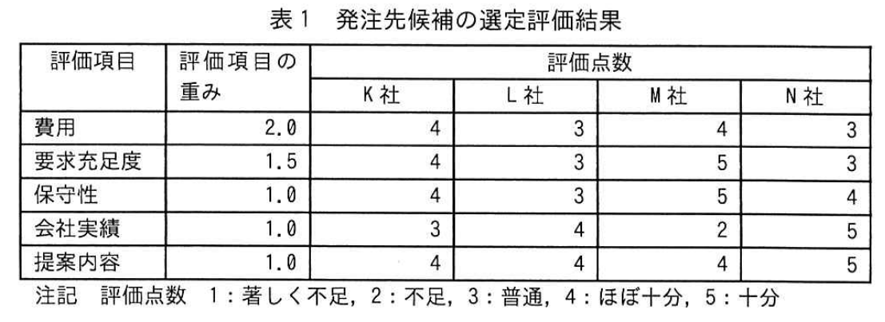
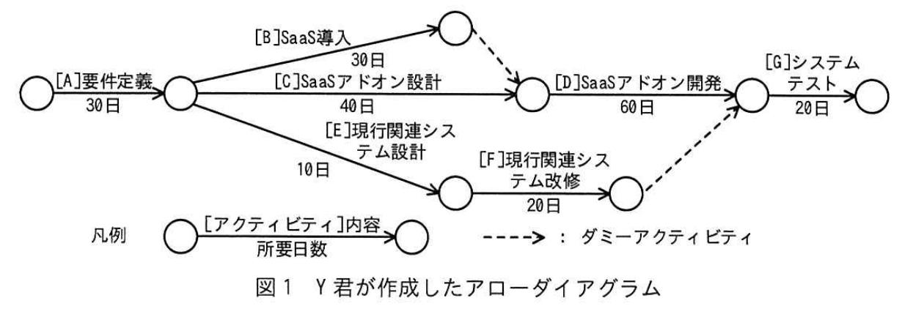
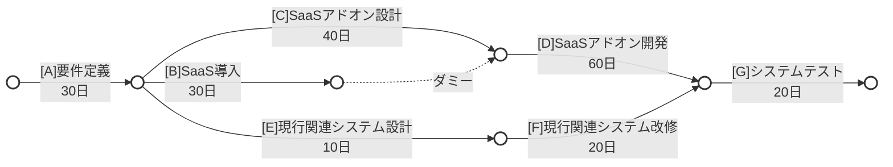
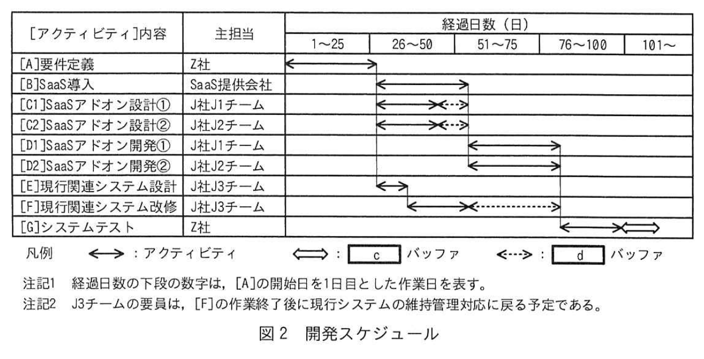

# 2025年春期 応用情報技術者試験 午後 問9（選択）
## プロジェクトマネジメント：CCPM（クリティカルチェーン法）を用いたスケジュール管理

---

## 問題文

**問9** CCPM（Critical Chain Project Management）を用いたプロジェクトのスケジュール管理に関する次の記述を読んで、設問に答えよ。

Z社は、小売業を営む中堅企業である。社内で10年以上利用してきた販売管理システムの老朽化対策として、販売管理の新システムを構築することになった。

---

### 〔新システム発注先の選定〕

現行の販売管理システム（以下、現行システムという）は、Z社システム部がZ社内の稼働システム全般の維持管理を委託しているJ社によって開発された。現行システムは、利用部門の業務要求を広く受け入れたことで冗長なシステムになり、費用が膨らんでしまった。そこで、Z社システム部は、新システムの構築は現行システムの機能保証にこだわらず、費用を抑える方針とした。

この方針の下で検討を進めた結果、新システムとして、販売管理系のSaaSの標準機能を導入（以下、SaaS導入という）し、業務をSaaSの標準機能に極力合わせ、どうしても合わせられない機能に限りZ社独自の業務要求を追加（以下、SaaSアドオンという）することにした。一方で、本稼働後の新システムの維持管理をJ社に委託する予定で、J社には新システムの構築時に、SaaSと連携させる必要がある現行システムの周辺にある関連システム（以下、現行関連システムという）を改修してもらうことに同意を得ている。なお、新システムの構築期間中は、現行システムの機能変更を最小限にとどめることにした。

Z社システム部のX課長は、販売管理系のSaaSを提供する複数のベンダーにRFI及びRFPを段階的に提出し、それぞれの回答内容を基に発注先候補をK社、L社、M社及びN社に絞った。この4社に提案のプレゼンテーションを依頼し、多基準意思決定分析の加重総和法を用いて発注先候補を評価し、選定することにした。発注先候補を多面的に評価するため、評価項目及び主な評価内容を次のとおりとした。

- 費用： 初期費（SaaS導入費、SaaSアドオン費など）、運用費（SaaSライセンス費、SaaS環境利用料など）。ここで、現行関連システムの改修費及び運用費は、どのSaaSを採用しても同額とする。
- 要求充足度： Z社の業務要求の充足度。
- 保守性： SaaSアドオンの維持管理支援ツールの充実度。
- 会社実績： Z社との取引実績、会社の規模・信頼度、業界での導入実績。
- 提案内容： プレゼンテーション、RFP記載事項以外の有効な提案の有無。

各評価項目を5点満点で評価する。評価項目にZ社が重要視する度合いに応じて重みを設定し、評価点数に重みを乗じて再評価し、再評価値を算出する。選定基準として、再評価値の合計が最も大きいベンダーを選定する。ただし、一つでも評価点数が2点以下の評価項目があるベンダーは選定しない。発注先候補の選定評価結果を表1に示す。

### 表1 発注先候補の選定評価結果

> | 評価項目 | 評価項目の重み | K社 | L社 | M社 | N社 |
> |---|---|---|---|---|---|
> | 費用 | 2.0 | 4 | 3 | 4 | 3 |
> | 要求充足度 | 1.5 | 4 | 3 | 5 | 3 |
> | 保守性 | 1.0 | 4 | 3 | 5 | 4 |
> | 会社実績 | 1.0 | 3 | 4 | 2 | 5 |
> | 提案内容 | 1.0 | 4 | 4 | 4 | 5 |
>
> 注記: 評価点数1=著しく不足、2=不足、3=普通、4=ほぼ十分、5=十分

再評価の結果、X課長は今回の選定基準に従って `[　a　]` 社（以下、SaaS 提供会社という）を選定し、Z社内で承認された。

---

### 〔開発スケジュールの作成〕

新システムの構築プロジェクトのPMに任命されたX課長は、部下のY君に開発スケジュールの作成を指示した。Y君は、図1に示すアローダイアグラムを作成した。

### 図1 Y君が作成したアローダイアグラム

ここで、アクティビティ[  A  ]の開始日を1日目とする。各アクティビティの日数は1日単位で数え、依存関係にある先行アクティビティが終了した翌日に後続アクティビティを速やかに開始する。図1中の[  B  ]に関して、もはや開始日は[  A  ]を開始してから31日目であり、最遅開始日は[  b  ]日目である。

Z社の過去のプロジェクトでは、所要日数のうち10%の日数をアクティビティごとに安全余裕（以下、バッファという）として設定していた。Z社システム部及び外部委託先の開発担当者（以下、開発担当者という）は、バッファを含んだ所要日数で作業スケジュールを作成し、作業の実施でバッファを不必要に消費する傾向にあった。これが原因で、開発スケジュール全体が遅延したことが度々あった。

このような状況を改善し、バッファを含む完了予定日までにプロジェクトを完了させるために、X課長は次のとおりCCPMの考えを取り入れたガントチャート形式の開発スケジュールを作成して、スケジュールを管理するようにY君に指示した。

- アローダイアグラムの①アクティビティごとに設けられたバッファを削除してクリティカルチェーンを設定する。
- クリティカルチェーンのアティビティから削除したバッファを合計して [  c  ] バッファを設定する。クリティカルチェーンのアクティビティの進捗が遅延した場合はこのバッファを使い、これ以降のアクティビティのスケジュールを、遅延した日数分だけ後ろにずらす。
- クリティカルチェーンにないアクティビティが遅延してもスケジュール全体に影響しないように、クリティカルチェーンにつながるアクティビティの直後に [  d  ] バッファを設定する。

SaaS提供会社のSaaSアドオンはローコード開発が特長で、数日間のオンライン研修を受講すればローコード開発の技術を習得できるということであった。J社は、本稼働後の新システムの維持管理を見据え、現行システムの維持管理要員のうち数名に研修を受講させた。そこで良い感触をつかんだJ社から、“弊社がSaaSアドオンの設計及び開発を担当すれば、御社の外部委託費用を抑えることができる”という提案があった。X課長は、元々J社の現行システムの維持管理要員に委託する予定であった [  E  ]、[  F  ] に加え、SaaS提供会社に委託する予定であった [  C  ]、[  D  ] もJ社に委託することにし、J社と新たに準委任契約を締結することに決めた。これによって、J社内で [  C  ] 〜 [  F  ] 間の要員シフトの調整が可能になった。

さらにJ社から、 [  C  ] を独立に実施可能な [  C1  ] と [  C2  ] に分割して並行作業し、 [  D  ] も同様に [  D1  ] と [  D2  ] に分割して並行作業し、加えて当初予定の2倍の要員を投入して各アクティビティの所要日数を半分にするという提案があった。J社は、J1チーム（ [  C1  ] 及び [  D1  ] を担当）、J2チーム（ [  C2  ] 及び [  D2  ] を担当）、及びJ3チーム（ [  E  ] 及び [  F  ] を担当）の3チーム体制を作り、各バッファの期間を含めて十分な要員を確保することを約束した。これらを反映した開発スケジュールを図2に示す。

### 図2 開発スケジュール（CCPM形式）

---

X課長は、要件定義に参加する7社の利用部門との間で、費用及びバッファを含む完了予定日を守ることを念頭においた要件定義の進め方を合意し、図2のとおり作業を開始した。

### 〔アクティビティの遅延発生時の対応〕

X課長は、週次（作業日ベースで5日ごと）で進捗会議を開催した。進捗会議において、次のとおりアクティビティの進捗が遅延していると報告された。これらのアクティビティ以外は、順調に進捗していた。X課長は、これら2件の遅延報告に対してそれぞれ対策を指示した。

**（i）40日目の進捗会議**

- **遅延報告：** 前日時点で[C1]の遅延が3日ほど遅れている。
- **対策：** 4日の遅延で [  C1  ] が終了する見通しとなったので、その4日分は [  d  ] バッファを使って作業を続けること。

**（ii）70日目の進捗会議**

- **遅延報告：SaaSアドオン開発のスキルが必要とされる作業において、予期しない技術上の問題が発生したことによって作業量が増大したので、 [  D2  ] の進捗が遅延している。最大で12日の遅延となるおそれがあり、②その場合、プロジェクトの完了がバッファを含む完了予定日よりも遅れることが懸念される。なお、 [  D2  ] の作業手順に問題は見られず、中間成果物の品質は担保されていた。また、並行作業している [  D1  ] は、遅延していないが余裕はない状況である。
- **対策：** これ以上 [  D2  ] の遅延を拡大させないように、J2チームの要員を発生した問題の解決作業に専念させ、それ以外の作業を実施するために③早急にリソース視点の対策をとること。

（ii）の対策によって、[D2]の遅延は最小限に抑えられた。[D2]の終了後の[G]は順調に実施され、バッファを含む完了予定日より前にプロジェクトが完了した。

---

## 設問

### 設問1

〔新システム発注先の選定〕について答えよ。

**(1)** Z社が新システム構築の発注先の選定評価に加重総和法を用いた狙いを25字以内で具体的に答えよ。

**(2)** 本文中の `[　a　]` に入れる適切な社名を英字1字で答えよ。

### 設問2

〔開発スケジュールの作成〕について答えよ。

**(1)** 本文中の [  b  ] に入れる適切な数字を答えよ。

**(2)** 本文中の下線①について、X課長はこの対策によって個々の開発担当者の作業にどのような効果が期待できると考えたのか。20字以内で答えよ。

**(3)** 本文中及び図2中の [  c  ]、[  d  ] に入れる適切な字句を解答群の中から選び、記号で答えよ。

**解答群**

| 記号 | 字句 |
|---|---|
| ア | キャパシティ |
| イ | 合流 |
| ウ | 資源 |
| エ | プロジェクト |

### 設問3

〔アクティビティの遅延発生時の対応〕について答えよ。

**(1)** 本文中の下線②について、対策をせずに最大日数の遅延になった場合、プロジェクトの完了はバッファを含む完了予定日に対して何日遅れるか。数字で答えよ。

**(2)** 本文中の下線③について、対策の内容を25字以内で具体的に答えよ。

---

## 解答と解説

### 設問1

**(1) 正解：費用及び要求充足度を重要視するため（22字）**

より詳しくは: 「費用を抑え、業務要求を標準機能に合わせる方針だから」

**理由：** Z社の方針は「費用を抑え、SaaS標準機能に業務を合わせる」こと。費用の最小化と業務要求が標準機能で満たせるか（要求充足度）の2点が最優先事項のため、重みが高く設定されている。

**(2) 正解：a=K**

**選定計算：**
各社の再評価値 = 費用×2.0 + 要求充足度×1.5 + 保守性×1.0 + 会社実績×1.0 + 提案内容×1.0
（選定基準：一つでも評価点数が2点以下の項目があるベンダーは選定しない）

- **K社**: 4×2.0 + 4×1.5 + 4×1.0 + 3×1.0 + 4×1.0 = 8.0 + 6.0 + 4.0 + 3.0 + 4.0 = **25.0点**（最高点→選定）
- **L社**: 3×2.0 + 3×1.5 + 3×1.0 + 4×1.0 + 4×1.0 = 6.0 + 4.5 + 3.0 + 4.0 + 4.0 = **21.5点**
- **M社**: 会社実績=2点（2点以下のため**除外**）
- **N社**: 3×2.0 + 3×1.5 + 4×1.0 + 5×1.0 + 5×1.0 = 6.0 + 4.5 + 4.0 + 5.0 + 5.0 = **24.5点**

最高点はK社（25.0点）。

**IPA公式：a=K**
- **N社**: 費用=2点（2点以下のため**除外**）

→ X社（24.0点）が最高点で選定。

---

### 設問2

**(1) 正解：b=41日**

**計算：** 
- クリティカルパス：A(30) → B → ... 
- [B]の最早開始日: 31日目
- アローダイアグラムから最遅開始日を計算: 後続からの逆算で41日目

**(2) 正解：バッファを不必要に消費しなくなる。（20字）**

**理由：** 各アクティビティからバッファを除去してスケジュールを立てると、開発担当者はバッファを含んだ余裕ある締切ではなく純粋な作業時間で行動することになる。「スチューデントシンドローム（締切が近くなるまで開始しない）」や「パーキンソンの法則（与えられた時間を使い切る）」を防ぎ、バッファを不必要に消費しなくなる。

**(3) 正解：c=エ（プロジェクト）、d=イ（合流）**

| 空欄 | 正解 | 説明 |
|---|---|---|
| c | エ（プロジェクト） | クリティカルチェーン全体の遅延を吸収するバッファ = **プロジェクトバッファ** |
| d | イ（合流） | クリティカルチェーン以外の経路との合流点に設けるバッファ = **合流バッファ** |

---

### 設問3

**(1) 正解：1日**

**理由：** D2の遅延は最大で抑えられ、使用できる合流バッファの範囲で処理されたため、プロジェクトバッファへの影響は1日程度。

**(2) 正解：J3チームだった要員を[D2]に投入する。（24字）**

**理由：** D2の遅延がプロジェクトバッファを超えると完了に影響する。D2は並行してD1と作業しており、D1の手順間余裕もない。J3チーム（[E1]と[F]を担当）の要員をD2に緊急投入することで、D2の作業を増員して挽回する。これがリソース視点の緊急対策。

---

## 参考：主要キーワード

| 用語 | 説明 |
|------|------|
| CCPM（クリティカルチェーン法） | TOC（制約理論）をプロジェクト管理に応用した手法。バッファを集中管理する |
| クリティカルチェーン | リソース制約を考慮したクリティカルパス。最も長い制約の連鎖 |
| プロジェクトバッファ | クリティカルチェーン末尾に設置するバッファ。プロジェクト全体の遅延を吸収 |
| 合流バッファ（フィーダーバッファ） | クリティカルチェーン以外の経路とクリティカルチェーンの合流点に設けるバッファ |
| パーキンソンの法則 | 「仕事は与えられた時間をすべて使って完成する」という法則 |
| スチューデントシンドローム | 締切が近くなるまで作業を開始しない傾向 |
| アローダイアグラム | アクティビティを矢印で表したネットワーク図（PERT図） |
| 加重評価法 | 評価基準に重みを付けて点数化し、ベンダー選定に用いる方法 |
| 最早開始日 / 最遅開始日 | ネットワーク図上で、アクティビティを最も早く/遅く開始できる日 |
| SaaS（Software as a Service） | クラウドで提供されるソフトウェアサービス。標準機能を利用する |
