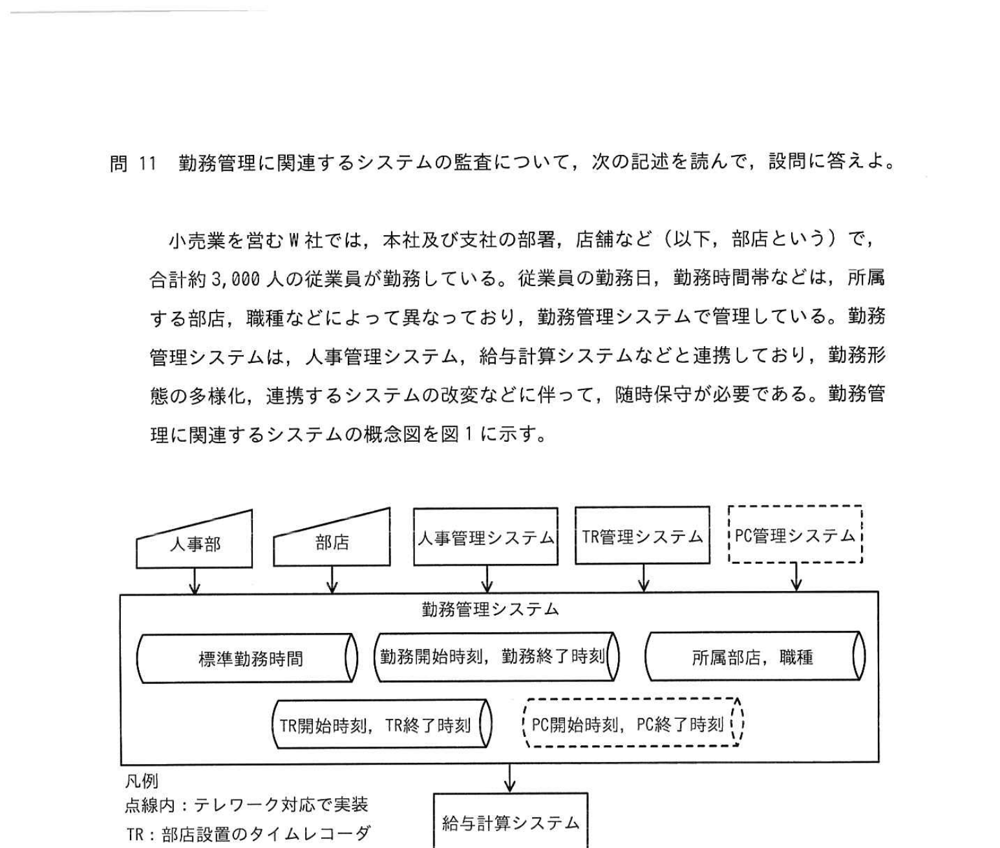
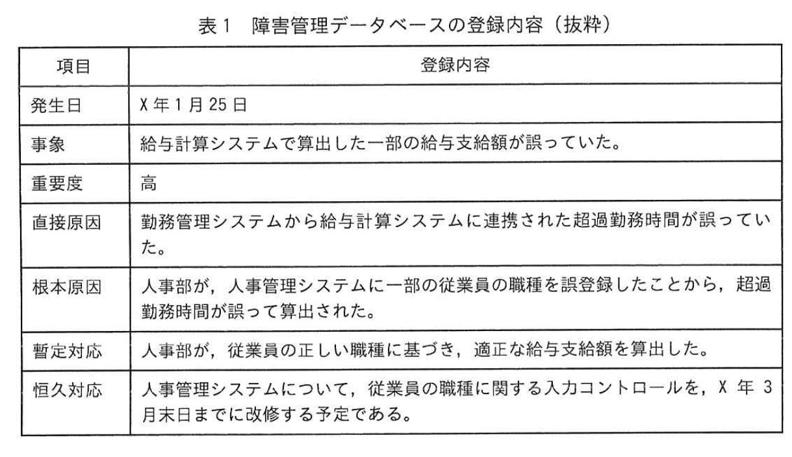

# 2025年春期 応用情報技術者試験 午後 問11（選択）
## システム監査：勤務管理に関連するシステムの監査

---

## 問題文

**問11** 勤務管理に関連するシステムの監査について、次の記述を読んで、設問に答えよ。

小売業を営む W 社では、本社及び支社の部署、店舗など（以下、部店という）で、合計約 3,000 人の従業員が勤務している。従業員の勤務日、勤務時間帯などは、所属する部店、職種などによって異なっており、勤務管理システムで管理している。勤務管理システムは、人事管理システム、給与計算システムなどと連携しており、勤務形態の多様化、連携するシステムの改変などに伴って、随時保守が必要である。勤務管理に関連するシステムの概念図を図1に示す。

### 図1 勤務管理に関連するシステムの概念図

> **連携図（概略）：**
> - 人事部 → 人事管理システム → TR管理システム → PC管理システム
> - 上記連携が → 勤務管理システム
> - 勤務管理システムの入力: 標準勤務時間、勤務開始時刻・終了時刻、所属部店・職種
> - 勤務管理システム → 給与計算システム

---

内部監査部長は、システム監査チームに対して、勤務管理に関連するシステムを監査するよう指示した。システム監査チームは、X 年 5 月に予備調査を行い、次の事項を把握した。

### 〔勤務管理の概要〕

（1） 人事部は、勤務管理規程に基づき、従業員一人当たりの毎月の標準勤務時間を部店別及び職種別に定め、全社勤務時間管理表に記載している。標準勤務時間は、例えば、営業企画部の企画職では、1 月 180 時間、2 月 165 時間、店舗の販売職では、1 月 140 時間、2 月 130 時間、店舗の事務職では、1 月 160 時間、2 月 150 時間などである。
（2） 標準勤務時間を超過した勤務時間（以下、超過勤務時間という）に対しては、給与規程に定めた超過勤務手当が支払われる。
（3） 従業員の毎月の勤務日数、勤務時間などの記録（以下、勤務記録という）は、翌月7日を確定日としている。
（4） TR に従業員用 IC カードを読み取らせることによって、従業員が部店に入室した時刻（以下、TR 開始時刻という）及び部店から退室した時刻（以下、TR 終了時刻という）が TR 管理システムに登録される。
（5） 従業員は、TR 開始時刻及び TR 終了時刻を参考にして、勤務記録の確定日までに、勤務開始時刻及び勤務終了時刻を勤務管理システムに登録する。
（6） 人事部は、一部の従業員について、X 年 10 月からテレワークでの勤務を認める予定である。テレワークでの勤務の場合、従業員は、PC の稼働開始時刻（以下、PC 開始時刻という）及び稼働終了時刻（以下、PC 終了時刻という）を参考にして、勤務開始時刻及び勤務終了時刻を勤務管理システムに登録する。
（7） X 年 10 月からは、勤務形態について、例えば、次のような一定の組合せが認められる。
① 8時〜12時：部店勤務, 13時〜17時：テレワーク
② 9時〜11時：テレワーク, 12時〜15時：部店勤務, 16時〜18時：テレワーク

### 〔勤務管理に関連するシステムの概要〕
（1） 人事部は、全社勤務時間管理表に基づき、勤務管理システムに標準勤務時間を手作業で登録する。
（2） 勤務管理システムは、TR 管理システムから TR 開始時刻及び TR 終了時刻を日次バッチ処理で取り込み、従業員別の勤務実績画面に表示する。TR 開始時刻と勤務開始時刻の差、又は TR 終了時刻と勤務終了時刻の差が一定時間以上の場合、勤務実績画面に警告メッセージ（以下、時差確認メッセージという）を表示する。
（3） 勤務管理システムのテレワーク対応では、PC 管理システムから PC 開始時刻及び PC 終了時刻を日次バッチ処理で取り込み、勤務実績画面に表示する予定である。また、時差確認メッセージの表示条件は、①PC 開始時刻と勤務開始時刻の差、又は PC 終了時刻と勤務終了時刻の差が一定時間以上の場合などを想定している。
（4） 従業員の超過勤務時間は、人事管理システムから月次バッチ処理で連携された従業員の所属部店及び職種、人事部が登録した標準勤務時間に基づき、算出される。
（5） 給与計算システムは、勤務記録の確定日の夜間バッチ処理で、勤務記録を勤務管理システムから取り込み、給与支給額を算出する。

### 〔勤務管理に関連するシステム障害〕

（1） W 社では、発生したシステム障害について、発生日、事象、重要度、直接原因、根本原因、暫定対応、恒久対応などを障害管理データベースに登録し、随時更新している。
（2） 障害管理データベースを閲覧した結果、X 年 1 月に、勤務管理に関連するシステム障害が発生していたことが分かった。X 年 2 月末日時点における障害管理データベースの登録内容（抜粋）を表1に示す。

### 表1 障害管理データベースの登録内容（抜粋）

| 項目 | 登録内容
| --- | --- |
| 発生日 | X 年 1 月 25 日
| 事象 | 給与計算システムで算出した一部の給与支給額が誤っていた。
| 重要度 | 高
| 直接原因 | 勤務管理システムから給与計算システムに連携された超過勤務時間が誤っていた。
| 根本原因 | 人事部が、人事管理システムに一部の従業員の職種を誤登録したことから、超過勤務時間が誤って算出された。
| 暫定対応 | 人事部が、従業員の正しい職種に基づき、適正な給与支給額を算出した。
| 恒久対応 | 人事管理システムについて、従業員の職種に関する入力コントロールを、X 年 3 月末日までに改修する予定である。

（3） さらに障害管理データベースを閲覧した結果、表1に示すシステム障害と同様の根本原因であるシステム障害が X 年 4 月に再発していた。

内部監査部長は、システム監査チームから予備調査の結果報告を受けて、X 年 7 月に実施予定の本調査での監査手続について、次のとおり指示した。

---

### 〔内部監査部長の指示〕

（1） 勤務管理システムにおいて、標準勤務時間の登録が [  a  ] であることから、ITに係る [  b  ] が適切に組み込まれているか、確認すること。
（2） 〔勤務管理に関連するシステムの概要〕（3）において、時差確認メッセージの表示条件について、下線①のほかに、 [  c  ] の [  d  ] を想定しているか、確認すること。
（3） 〔勤務管理に関連するシステム障害〕（3）を考慮したとき、 [  e  ] システムが、 [  f  ] を防止するために適切な内容で、 [  g  ] までに改修されていたか、確認すること。

---

## 設問

### 設問1

〔内部監査部長の指示〕（1）について答えよ。

**(1)** 本文中の `[　a　]` に入れる適切な字句を、**5字以内**で答えよ。

**(2)** 本文中の `[　b　]` に入れる適切な字句を、**10字以内**で答えよ。

### 設問2

〔内部監査部長の指示〕（2）について答えよ。

**(1)** 本文中の `[　c　]` に入れる適切な字句を、**5字以内**で答えよ。

**(2)** 本文中の `[　d　]` に入れる適切な字句を、**10字以内**で答えよ。

### 設問3

〔内部監査部長の指示〕（3）について答えよ。

**(1)** 本文中の `[　e　]` に入れる適切な字句を、**5字以内**で答えよ。

**(2)** 本文中の `[　f　]` に入れる適切な字句を、**15字以内**で答えよ。

**(3)** 本文中の `[　g　]` に入れる適切な字句を、**10字以内**で答えよ。

---

## 解答と解説

### 設問1

**(1) 正解：a=手作業**

**理由：** 勤務管理システムの概要（1）に「人事部は、全社勤務時間管理表に基づき、勤務管理システムに標準勤務時間を**手作業で登録する**」と明記されている。ITによる自動制御ではなく手作業であるため、誤入力のリスクがある。

**(2) 正解：b=入力コントロール**

**理由：** 手作業による登録では、入力ミスが起きやすい。ITシステムが提供する入力値の検証・チェック機能（**入力コントロール**）を適切に組み込むことで、誤入力を防止できる。障害管理DBの恒久対応にも「従業員の職種に関する入力コントロールを改修する」と記載されており、これが対策の核心。

---

### 設問2

**(1) 正解：c=勤務形態**

**理由：** X年10月からテレワークが導入され、部店勤務とテレワークの組み合わせ（勤務形態）が認められる。時差確認メッセージの表示条件は単純なTR開始/終了時刻の比較だけでは不十分で、**勤務形態**（部店勤務かテレワークか、あるいは組み合わせか）によって確認対象のシステム（TR vs PC）が変わることを想定すべき。

**(2) 正解：d=一定の組合せ**

**理由：** 勤務形態（7）に示すように、「部店勤務+テレワーク」「テレワーク+部店勤務+テレワーク」など、複数の勤務形態の**一定の組合せ**が認められる。時差確認メッセージの表示条件は、TR開始/終了時刻とPC開始/終了時刻の組合せのうち、適切な組合せを想定しているか確認が必要。

---

### 設問3

**(1) 正解：e=人事管理**

**理由：** 根本原因は「人事管理システムへの従業員職種の誤登録」。X年4月の再発も同様の根本原因。したがって確認対象は**人事管理**システム。

**(2) 正解：f=従業員の職種の誤登録（12字）**

**理由：** 根本原因が「人事管理システムへの**従業員の職種の誤登録**」であり、同じ問題が再発した。入力コントロールの改善によって防止すべき事象は、従業員の職種の誤登録である。

**IPA公式：f=従業員の職種の誤登録**

**(3) 正解：g=X年3月末日**

**理由：** 表1の恒久対応に「従業員の職種に関する入力コントロールを、X年3月末日までに改修する予定」と記載されている。ただし同様の障害がX年4月に再発しており、計画どおり改修されたか確認が必要。監査での確認期日は**X年3月末日**。

---

## 参考：主要キーワード

| 用語 | 説明 |
|------|------|
| システム監査 | 情報システムの有効性・効率性・信頼性・安全性を第三者が評価・検証するプロセス |
| 内部監査 | 組織内部の人員が行う監査。外部監査と独立して実施 |
| 入力コントロール | 入力データの正確性・完全性・妥当性をシステムが検証する内部統制の仕組み |
| 障害管理データベース | 発生した障害の記録・追跡・分析に使うDB。根本原因・対応状況を管理 |
| 根本原因分析（RCA） | 障害の表面的な原因ではなく、根本的な原因を特定する分析手法 |
| 暫定対応 / 恒久対応 | 暫定：一時的な対応。恒久：再発しないよう根本的に解決する対応 |
| TR（Time Recorder） | 従業員のICカードで入退室時刻を記録する機器。勤怠管理に使用 |
| テレワーク | 事業所以外（自宅等）での勤務形態。PC操作記録（PC開始/終了時刻）で勤務を管理 |
| 勤務管理システム | 勤務時間・超過勤務・勤務形態を管理するシステム。給与計算の元データ |
| 勤務形態 | 部店勤務・テレワーク・混在など、勤務の形式。時差確認の条件設計に影響 |
