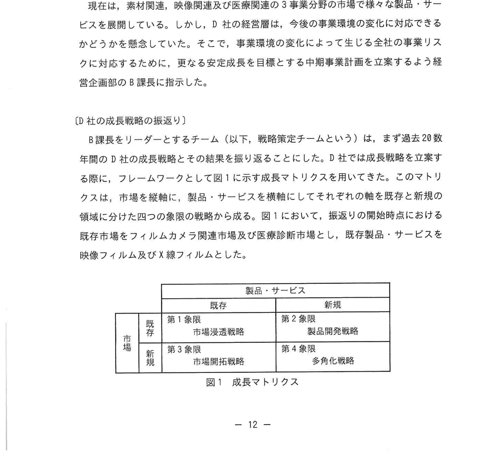

# 2025年春期 応用情報技術者試験 午後 問2（選択）
## 経営戦略：企業の成長戦略に関する考察

---

## 問題文

**問2** 企業の成長戦略に関する次の記述を読んで、設問に答えよ。

D社は大手の化学品製造・販売会社である。創業初期はフィルムカメラで使用する映像フィルムや医療診断等で使用する X線フィルムなどのフィルム事業を展開していた。20数年前に記録媒体がアナログからデジタルに変わっていくのに伴い、フィルム事業の売上が激減した。事業の危機に直面したD社は、保有技術を軸にして製品・サービスを展開していくことによって事業転換を進めた。

---

### 〔D社の成長戦略の振り返り〕

S課長をリーダーとする戦略策定チーム（以下、戦略策定チームという）は、まず過去20数年間のD社の成長戦略とその結果を振り返ることにした。D社では成長戦略を立案する際に、フレームワークとして図1に示す成長マトリクスを用いてきた。このマトリクスは、市場を縦軸に、製品・サービスを横軸にそれぞれ既存と新規の領域に分けた四つの象限の戦略から成る。図1において、振り返りの開始時点における既存市場をフィルムカメラ市場及び医療診断市場とした。

### 図1 成長マトリクス

> | | 既存製品・サービス | 新規製品・サービス |
> |---|---|---|
> | **既存市場** | 第1象限：市場浸透戦略 | 第2象限：製品開発戦略 |
> | **新規市場** | 第3象限：市場開拓戦略 | 第4象限：多角化戦略 |

戦略策定チームは、D社が第1象限の戦略に取り組みながら、①第2象限及び第3象限の戦略を用いて事業を拡張させてきたことを再認識した。

- 第2象限では、医療診断市場において、X線フィルムとデジタル画像処理の技術を応用した新たに医療用画像診断ネットワークサービスを立ち上げた。
- 第3象限では、新たな素材関連市場において、映像フィルムの製造で培った技術を応用し、フィルム、シート、膜の形状を持った工業用液晶フィルムなどの素材を製造して他メーカーに供給する事業を展開した。

これらの成功事例では、D社内の事業間で生産設備や技術を共用することによって、`[　a　]` 効果が生まれていた。

---

### 〔成長戦略策定のための環境分析とクロス SWOT 分析〕

過去の成長戦略を戦略策定チームは、次に現在のD社に関する外部環境及び内部環境を整理して分析した。

**(1) 外部環境**

- 素材関連市場では、日本は高い技術力によって個々の市場規模は小さいが海外市場でも高いシェアを占めている。しかし、国際的な競争激化や顧客ニーズの多様化によって、市場環境の変化に対応することが求められてきている。
- 映像関連市場では、情報記録媒体がアナログからデジタルに変わっているよになり、様な多様なコンテンツ作成・活用用途に移行している。映像関連市場でD社の中核となる製品が出てきている。
- 医療関連市場では、新しい医療法によりヘルスケアの需要拡大が注目されている。国と主導で再生医療の研究開発への普及及び法整備が進められている。また、高齢者及び女性の活躍増加及び中年期の健康増進ニーズの高まりに対して、ヘアケア・ボディケア関連の市場が大きな成長が期待できる。

**(2) 内部環境**

- 前年度のD社全体の売上に占める事業部別の売上の割合は、素材関連事業が5割、映像関連事業が2割、医療関連事業が3割であった。
- 素材関連事業の売上は、従来では量産が困難であった特殊な特徴や機能を備えた特殊な素材（以下、機能性素材という）の市場（以下、機能性素材市場）の増大が最高の売上に寄与し、壁画に拡大している。また、自社が最適化された生産プロセスを活用することで、顧客ニーズの多様な対応と短期間の開発・製造が可能になっている。
- 映像関連事業の売上は、この数数年間は低下し、他の事業部分の売上に占める割合は減少している。有望なコンテンツ作成・活用関連事業はほとんど行っていないので、現地点では問題が深刻化している。
- 医療関連事業の売上は、医療画像診断ネットワークサービスなどの診断型の事業の数大が大半を占め、この数年の特性化された医療機器の普及に伴うために、今後も市場は拡大すると見込まれる。

- D社は現在に至るまで数年にわたって、独自色と差別化で事業を進める上で独自にD社が培ってきたコア技術を維持している。現在のコア技術を応用した将来有望な新製品として、フィルムの劣化を防ぐ抗腫瘤技術を応用した再生医療向け製品など。

---

戦略策定チームは、これらを基にSWOT分析及びクロスSWOT分析を行った。クロスSWOT分析では、SWOT分析で抽出した外部環境及び外部環境におけるプラス要因及びマイナス要因の四つのマトリクスで表す。今回の環境分析の結果の一例として、素材関連市場では日本の優位性が見直されつつ `[　b　]` と `[　c　]` の組み合せとして、他社と差別化できる最先端の機能性素材を短期間で開発・製造する施策になるとなった。

その結果、クロスSWOT分析における組み合せを各戦略として位置付けられ、今後の事業の方向性として「医療事業への集中による安定成長」と「新規事業分野への多角化戦略」という2方向が示された。

---

### 〔多角化戦略の検討〕

その後の検討を経て、戦略策定チームは、再生医療事業と比較すると事業化まで要する期間が短いと想定される②新たなヘアケア市場への事業参入を多角化戦略の最初のターゲットとした。B課長は、ヘアケアを主力製品とする事業を立ち上げ、ここから多角化戦略を推進していくことにした。

- クロスSWOT分析から導かれている。しかし、ヘアケア市場においては、組合せとの組み合わせにより戦略を合意する事はできない。D社がもっていない技術について、戦略策定チームは内部調達ではなく外部から補うことにした。
- D社は、M&A などを通じて外部から補うことを検討した。内部調達に比べ `[　d　]` という課題は解消できる。

また、戦略策定チームは、有限であるD社の経営資源の活用に関して次のとおり考えた。

- 将来必要資源が進行する現在事業は選択と集中にしてある事業再開を求め、将来性のある新規事業に経営資源を集中する。
- 既存事業の映像関連市場でD社が維持する事業特性が続ける素材関連及び医療関連事業に経営資源を集約する。製品開発、MBA などの新規事業立ち上げの投資資金を確保するために、既存事業の再編施策として `[　d　]` することを検討した。

B課長は、ヘアケア事業の立ち上げを盛り込んだ中期事業計画を経営層に報告したところ、具体的な検討を更に進めるよう指示を受けた。

---

## 設問

### 設問1

〔D社の成長戦略の振り返り〕について答えよ。

**(1)** 本文中の下線①について、D社が過去にこれらの戦略を用いて事業を拡張させてきた内部要因として最も重要な成功要因は何か。本文中の字句を用いて **15字以内**で答えよ。

**(2)** 本文中の `[　a　]` に入れる適切な字句を **5字以内**で答えよ。

### 設問2

〔成長戦略策定のための環境分析とクロスSWOT分析〕について答えよ。

**(1)** 本文中の `[　b　]`、`[　c　]` に入れる適切な字句を解答群の中から選び、記号で答えよ。

**解答群**

| 記号 | 字句 |
|---|---|
| ア | 機会 |
| イ | 脅威 |
| ウ | 強み |
| エ | 弱み |

**(2)** 本文中の下線②について、戦略策定チームがクロスSWOT分析において組み合わせると特定した要因を解答群の中から選び、記号で答えよ。

**解答群**

| 記号 | 組み合わせ |
|---|---|
| ア | 機会と機会 |
| イ | 脅威と強み |
| ウ | 強みと機会 |
| エ | 弱みと脅威 |

### 設問3

〔多角化戦略の検討〕について答えよ。

**(1)** 本文中の下線②について、D社が具体的に取り組む事業の方向性を、本文中の字句を用いて **35字以内**で答えよ。

**(2)** 本文中の下線②について、多角化戦略は、D社の安定成長の実現に対してどのような点で寄与できるか。**38字以内**で答えよ。

**(3)** 本文中の `[　d　]` に入れる既存事業の再編施策を **15字以内**で答えよ。

**(4)** 戦略策定チームは内部調達ではなく外部から補うことをどのようなメリットを期待したか。本文中の字句を用いて **10字以内**で答えよ。

---

## 解答と解説

### 設問1

**(1) 正解：コア技術を維持してきたこと（15字）**

**理由：** D社が映像フィルムから医療診断・素材関連へ事業転換を成功させた共通の要因は、「コア技術（中核技術）」を活かし続けたことにある。フィルム製造の技術が医療画像処理・工業用素材へ応用されており、技術継承が新事業の礎になった。

**(2) 正解：a=シナジー（4字）**

**理由：** 生産設備や技術を事業間で共用することで生まれる相乗効果が**シナジー（Synergy）効果**。D社では映像フィルム製造技術を医療・素材事業に横展開することで、開発コスト削減・時間短縮のシナジーを得ていた。

---

### 設問2

**(1) 正解：b=イ（脅威）、c=ウ（強み）（順不同）**

**理由：** クロスSWOT分析で「日本の優位性が見直されつつある中で差別化戦略を打つ」文脈は：
- **脅威（イ）**：国際競争激化・シェア低下リスク（外部のマイナス要因）
- **強み（ウ）**：最先端の機能性素材技術・短期間開発能力（内部のプラス要因）

「脅威×強み」の組み合わせ（ST戦略）= 強みで脅威に対抗する戦略。

**(2) 正解：（解答例）ウ（強みと機会）**

**理由：** ヘアケア市場への参入はクロスSWOT分析の「SO戦略（強み×機会）」。D社の抗腫瘤・化学技術（強み）を、ヘアケア需要拡大（機会）に活用する方向。

---

### 設問3

**(1) 正解（解答例）：再生医療市場の拡大を見込み、抗腫瘤技術を活用した製品を開発する（35字）**

**理由：** D社が保有するコア技術（抗腫瘤技術、フィルム化学技術）を、成長が見込まれる再生医療市場に応用した製品開発が、具体的な多角化の方向性として提示されている。

**(2) 正解（解答例）：事業環境の変化による事業リスクを分散・軽減できること（26字）**

**理由：** 多角化戦略の主な利点は**リスク分散**。映像関連事業の衰退・素材市場の競争激化など、一つの事業に依存するリスクを複数事業への展開で軽減できる。安定した中長期成長を実現するための戦略的意義がある。

**(3) 正解：d=情報関連事業を売却（10字）**

**理由：** 将来性の低い映像（情報）関連事業への経営資源集中を避け、成長事業（医療・素材・新規ヘアケア）に資源を再配分するため、映像関連（情報関連）事業の**売却**による選択と集中が必要。

**(4) 正解：対応スピードの遅さ（9字）**

**理由：** M&A などによって外部から技術・人材を調達することで、内部開発の場合に生じる**「対応スピードの遅さ」**という課題を解消できる。新市場へのスピーディな参入が外部調達の最大のメリット。

---

## 参考：主要キーワード

| 用語 | 説明 |
|------|------|
| 成長マトリクス（アンゾフの成長マトリクス） | 市場（既存/新規）と製品（既存/新規）で4象限に分類した成長戦略フレームワーク |
| 第1象限：市場浸透戦略 | 既存市場×既存製品。シェア拡大・リピート率向上を目指す |
| 第2象限：製品開発戦略 | 既存市場×新規製品。既存顧客に新製品を提供する |
| 第3象限：市場開拓戦略 | 新規市場×既存製品。既存製品で新たな顧客・地域を開拓する |
| 第4象限：多角化戦略 | 新規市場×新規製品。最もリスクが高いが成長余地も大きい |
| クロスSWOT分析 | S（強み）・W（弱み）・O（機会）・T（脅威）を組み合わせ4戦略を導く分析手法 |
| SO戦略 | 強み×機会：強みを活かして機会を最大化する攻めの戦略 |
| ST戦略 | 強み×脅威：強みを活かして脅威を回避する戦略 |
| シナジー効果 | 複数の事業や技術を組み合わせることで生まれる相乗効果 |
| コア技術（コアコンピタンス） | 競合他社が模倣困難な自社固有の中核的技術・能力 |
| M&A（合併・買収） | 他社の買収・統合により技術・市場・人材を外部から調達する手法 |
| 選択と集中 | 経営資源を将来性の高い事業に集中させ、低成長事業から撤退すること |
