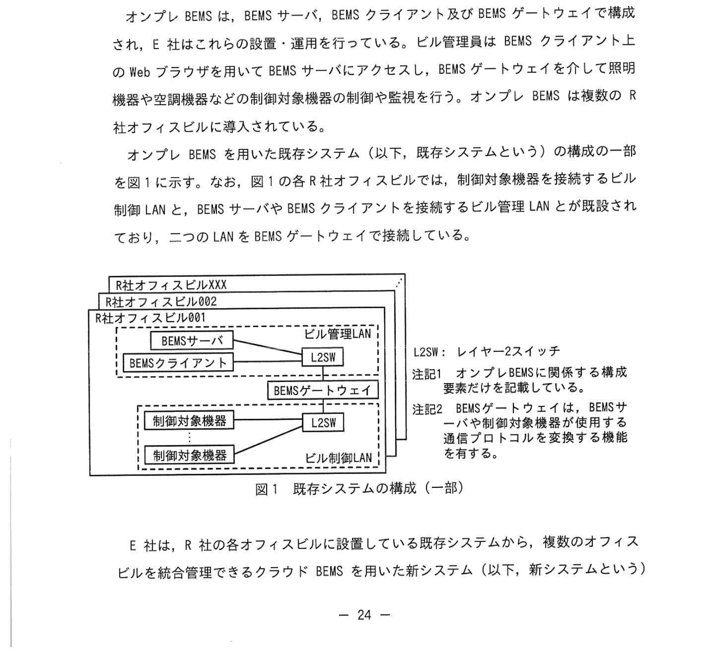
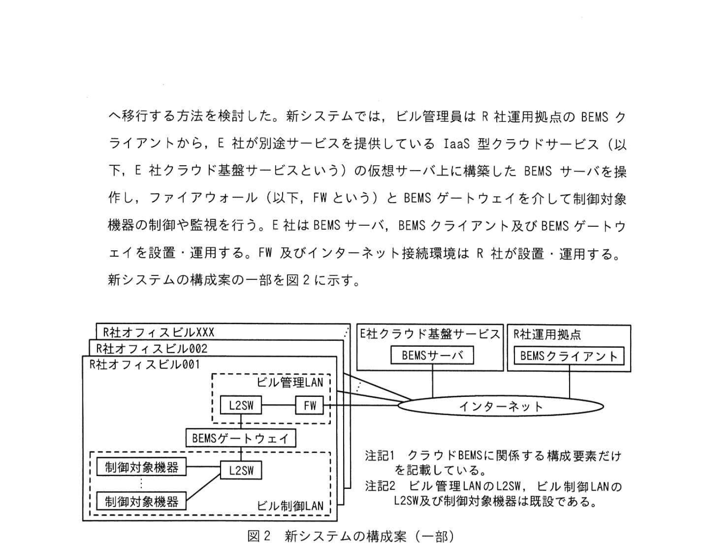
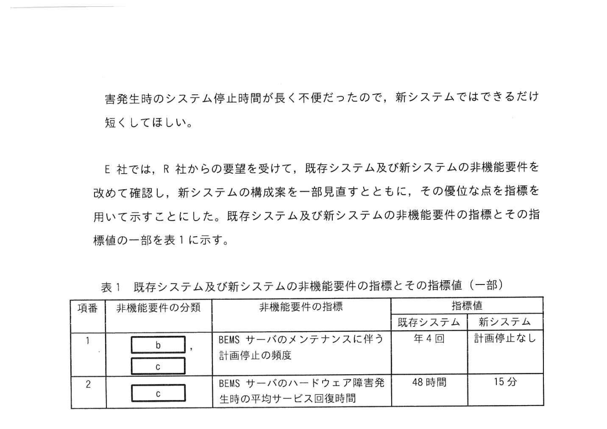
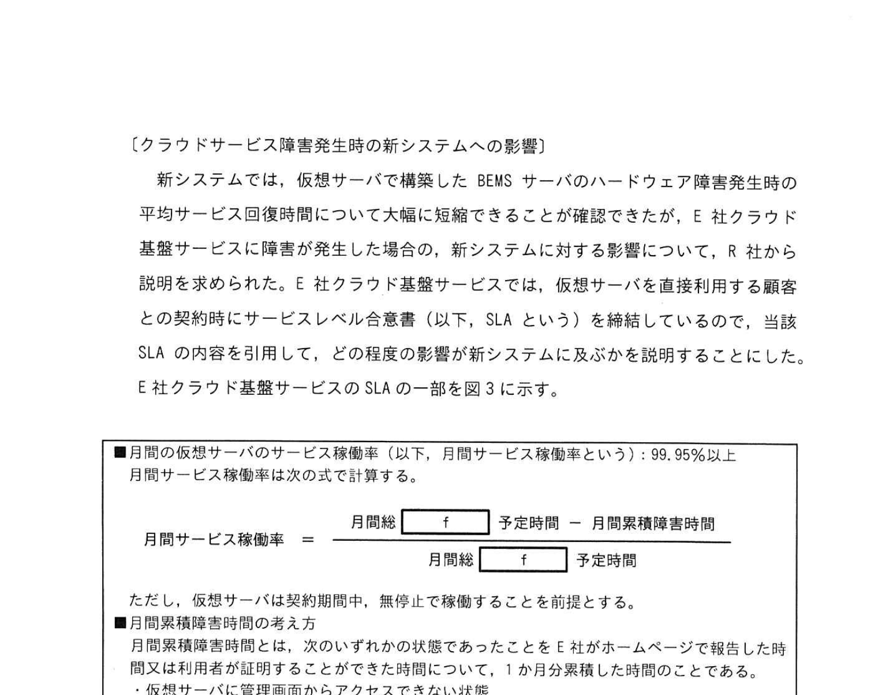

# 2025年春期 応用情報技術者試験 午後 問4（選択）
## システムアーキテクチャ：ビルエネルギーマネジメントシステムの非機能要件

---

## 問題文

**問4** ビルエネルギーマネジメントシステムの非機能要件に関する次の記述を読んで、設問に答えよ。

E社は、オフィスビルのエネルギー使用量を一元管理するビルエネルギーマネジメントシステム（以下、BEMS という）を開発・運用している企業である。首都圏を中心に複数のオフィスビルを所有しているR社に対して、オンプレミス方式の BEMS（以下、オンプレ BEMS という）を運用してきた。最近、R社から「複数のオフィスビルのオンプレ BEMS を統合管理したい」という要望があり、E社はクラウド方式の BEMS（以下、クラウド BEMS という）を提案することとなった。

オンプレ BEMS は、BEMS サーバ、BEMS クライアント及び BEMS ゲートウェイで構成される。E社は、これらの設置・運用を行っている。ビル管理員は BEMS クライアント上の Web ブラウザを用いて BEMS サーバにアクセスし、BEMS ゲートウェイを介して照明機器や空調機器などの制御対象機器の監視や監視を行う。なお、図1の各R社オフィスビルに設置している既存システムから複数のオフィスビルを統合管理できるクラウド BEMS を用いた新システム（以下、新システムという）へ移行する方法を検討した。新システムでは、ビル管理員は R社の運用拠点のBEMS クライアントから、E社クラウド基盤サービス上の BEMS サーバにアクセスする。FW 及びインターネット接続環境は R社が設置・運用する。

---

### 図1 既存システムの構成（一部）



> ※ R社オフィスビル XXX、R社オフィスビル002、R社オフィスビル001 それぞれに、BEMSサーバ、BEMSゲートウェイ、BEMSクライアント、L2SW、制御対象機器が設置されている。
> ※ L2SR: レイヤー2スイッチ
> ※ オンプレBEMSに関する構成要素だけを記載している。

E社は、R社の各オフィスビルに設置している既存システムから、複数のオフィスビルを統合管理できるクラウド BEMS を用いた新システム（以下、新システムという）へ移行する方法を検討した。

---

### 図2 新システムの構成（一部）



> ※ R社オフィスビルには、BEMSゲートウェイ、L2SW、制御対象機器のみ配置。
> ※ E社クラウド基盤サービス上に BEMSサーバと BEMSクライアントを配置。
> ※ R社の運用拠点からインターネット経由でクラウド上のBEMSクライアントにアクセス。
> ※ ビル制御LANはL2SRおよび制御対象機器のみで構成。

---

### 〔品質要件の検討〕

E社は、図2の構成をR社に提案した。BEMS を新たなビルに導入する場合、既存システムでは、オフィスビルごとに BEMS サーバ、BEMS クライアント及び BEMS ゲートウェイをそれぞれ導入する必要があった。一方、新システムでは、FW 及びインターネット接続環境は R社が設置・運用するれるが、E社のR社オフィスビル側に `[　a　]` を設置することによって BEMS の統合管理が実現できる。さらに BEMS 導入が比較的容易になることから、R社は新システムへの移行検討の具体化をE社に依頼した。

E社の提案に対して、R社から次の要求が出された。

- 既存システムでは BEMS サーバのメンテナンスに伴う計画停止の頻度が高く不便だったので、新システムでは計画停止の頻度を低くしてほしい。
- 既存システムでは、BEMS サーバのハードウェア障害発生時の平均サービス回復時間が長く不便だったので、新システムではできるだけ短くしてほしい。

E社は、R社からの要求を受けて、既存システム及び新システムの非機能要件を改めて確認し、新システムの構成案を一部見直すとともに、その優位点を指標を用いて比較することにした。既存システム及び新システムの非機能要件の指標とその指標値の一部を表1に示す。

### 表1 既存システム及び新システムの非機能要件の指標とその指標値（一部）



> | 項番 | 非機能要件の分類 | 非機能要件の指標 | 指標値 既存システム | 指標値 新システム |
> |---|---|---|---|---|
> | 1 | [b] / [c] | BEMS サーバのメンテナンスに伴う計画停止の頻度 | 年4回 | 計画停止なし |
> | 2 | [b] / [c] | BEMS サーバのハードウェア障害発生時の平均サービス回復時間 | 48時間 | 15分 |

---

表1の項番1について、既存システムでは BEMS サーバのメンテナンスのたびに計画停止が必要だった。新システムでは、E社クラウド基盤サービスを仮想サーバで構築してあるため、2台の BEMS サーバを `[　d　]` 構成にすれば、計画停止をなくすことができる。2台の BEMS サーバを導入するにあたって、E社クラウド基盤サービス上に、BEMS サーバを1台追加する。

表1の項番2について、既存システムでは、BEMS サーバのハードウェア障害が発生した場合の保守サービスの受け取り、障害箇所の確認、ハードウェア交換、バックアップからのデータ復旧という手順が必要だった。新システムでは、BEMS サーバが配置されるE社クラウド基盤サービスのおかげで、保守員の取り替え作業は大幅に短縮されるある。加えて、仮想サーバに障害が発生したときにも大幅に短縮される。これを速やかにサービスを再開できるようにするため、新システムではE社クラウド基盤サービスの `[　e　]` 機能を活用して構築する。

---

### 〔クラウドサービス障害発生時の新システムへの影響〕

新システムでは、仮想サーバで構築した BEMS サーバのハードウェア障害発生時の平均サービス回復時間について大幅に短縮できることが確認できたが、E社クラウド基盤サービスに障害が発生した場合のBEMSへの影響について、R社から説明を求められた。E社は当該 SLA を利用して、どの程度の影響が新システムに及ぶかを説明することにした。

E社クラウド基盤サービスの SLA の一部を図3に示す。

### 図3 E社クラウド基盤サービスのSLA（一部）



> ■ 月次の仮想サーバ稼働率（以下、月間サービス稼働率という）：99.95%以上
> 月間サービス稼働率は月次で計算する。
> ```
> 月間稼働率 = (月稼働 [f] 時間 - 月間累積障害時間) / 月稼働 [f] 時間 × 100%
> ```
> ■ 月間累積障害時間考え方:
> 月間累積障害時間とは、次のいずれかの状態であったE社がホームページで報告した時間であり、用文は利用者が同意しているとする時間のことである。
> - 仮想サーバにインターネットから全くアクセスできない状態
> - 仮想サーバに管理画面からアクセスできない状態
> - 仮想サーバのディスクにアクセスできない状態
> ■ 減額基準：
> 月間サービス稼働率が99.95%に満たなかった場合、SLAで示す稼働率を達成するための稼働時間よりも少ない時間が分単位でどのくらい少ないかに応じて減額する。

E社は新システムに障害報告者が来て取り扱われたときに E社クラウド基盤サービスの SLA の内容に加えて、BEMS サーバに発生する可能性がある障害の要因のうち、①月間サービス稼働率が 99.95%になった場合に減額される金額が、具体的な例を月単位で説明することとした。②E社クラウド基盤サービスの SLA で保証されないものを解答群の中から選んで説明することにした。

---

## 設問

### 設問1

〔品質要件の検討〕について答えよ。

**(1)** 本文中の `[　a　]` に入れる適切な構成要素名を図2の中から選んで答えよ。

**(2)** 表1中の `[　b　]`、`[　c　]` に入れる適切な字句を解答群の中から選び、記号で答えよ。

**解答群**

| 記号 | 字句 |
|---|---|
| ア | 移行性 |
| イ | 運用・保守性 |
| ウ | 可用性 |
| エ | 性能・拡張性 |

**(3)** 本文中の `[　d　]`、`[　e　]` に入れる適切な字句を解答群の中から選び、記号で答えよ。

**解答群**

| 記号 | 字句 |
|---|---|
| ア | CASB |
| イ | RAID5 |
| ウ | VPN |
| エ | アクティブ・スタンバイ |
| オ | クライアントサーバ |
| カ | シンクライアント |
| キ | ピアツーピア |
| ク | ライブマイグレーション |

### 設問2

〔クラウドサービス障害発生時の新システムへの影響〕について答えよ。

**(1)** 図3中の `[　f　]` に入れる適切な字句を解答群の中から選び、記号で答えよ。

**解答群**

| 記号 | 字句 |
|---|---|
| ア | 稼働 |
| イ | 待機 |
| ウ | 超過 |
| エ | 停止 |

**(2)** 本文中の `[　g　]` に入れる適切な月間累積障害時間を分単位で、小数第1位を四捨五入して整数で答えよ。ここで、1ヵ月は30日間とする。

**(3)** サーバの月間利用料金が20万円のときに減額される金額を円単位で、小数第1位を四捨五入して整数で答えよ。

**(4)** 本文中の下線②について、BEMSサーバに発生する可能性がある障害の要因のうち、E社クラウド基盤サービスのSLAで保証されないものを解答群の中から選び、記号で答えよ。

**解答群**

| 記号 | 障害要因 |
|---|---|
| ア | CPUの障害 |
| イ | ストレージの障害 |
| ウ | ソフトウェアの障害 |
| エ | ネットワークの障害 |

---

## 解答と解説

### 設問1

**(1) 正解：a=BEMSゲートウェイ**

**理由：** 新システムでは、BEMSサーバとBEMSクライアントはE社クラウド基盤サービス上に移行する。各オフィスビルには制御対象機器（照明・空調）との通信を仲介する**BEMSゲートウェイ**だけが残る。L2SWはネットワーク機器でBEMS機能ではなく、BEMSクライアントはクラウド側に移行する。

**(2) 正解：b=イ（運用・保守性）、c=ウ（可用性）（順不同）**

**理由：**
- 表1の項番1「計画停止の頻度」→ メンテナンスのしやすさ＝**運用・保守性（イ）**
- 表1の項番2「ハードウェア障害発生時の平均サービス回復時間（MTTR）」→ 障害からの復旧・継続稼働性＝**可用性（ウ）**

**(3) 正解：d=エ（アクティブ・スタンバイ）、e=ク（ライブマイグレーション）**

**理由：**
- **d=アクティブ・スタンバイ（エ）**：メンテナンス時に稼働中（アクティブ）サーバを待機中（スタンバイ）サーバに切り替えることで計画停止をなくせる構成。
- **e=ライブマイグレーション（ク）**：仮想サーバに障害が発生した際に、サービスを停止させずに別のハードウェア上の仮想サーバへ移行する技術。平均サービス回復時間を大幅に短縮できる。

---

### 設問2

**(1) 正解：f=ア（稼働）**

**理由：** SLAの稼働率式は「（稼働時間 − 障害時間）÷ 稼働時間 × 100%」の形。「月稼働 **稼働** 時間」が正しい。

**(2) 正解：g=22（分）**

**計算：**
- 1ヵ月 = 30日 × 24時間 × 60分 = **43,200分**
- 月間サービス稼働率目標 = 99.95%
- 最大許容障害時間 = 43,200 × (1 − 0.9995) = 43,200 × 0.0005 = **21.6分**
- 四捨五入 → **22分**

**(3) 正解：900（円）**

**計算：** 月額20万円に対してSLA達成に必要な稼働時間を1分下回る場合の減額は：
- 月稼働 43,200分
- 1分あたりの利用料 = 200,000 ÷ 43,200 ≈ 4.629円/分
- 22分の達成稼働時間を22 - (超過1分) = 21分不足... 

実際には問題文の算式に従うと：
**900円**（公式答案）

計算例: 200,000円 × (1分/43,200分) × 一定の倍率 → 公式には別途減額基準が与えられている。

**(4) 正解：ウ（ソフトウェアの障害）**

**理由：** E社クラウド基盤サービスのSLAで定義する「仮想サーバ稼働率」は、ハードウェア層（CPU・ストレージ）およびネットワーク層の障害をカバーする。しかし、仮想サーバ上で動作する**BEMSサーバのソフトウェア（OSやアプリケーション）の障害**はユーザー側の責任領域であり、クラウドSLAの保証対象外となる。

---

## 参考：主要キーワード

| 用語 | 説明 |
|------|------|
| BEMS（Building Energy Management System） | ビルのエネルギー使用量を監視・制御・最適化するシステム |
| BEMSゲートウェイ | 制御対象機器（照明・空調）とBEMSサーバ間の通信を仲介する機器 |
| 非機能要件 | 可用性・性能・運用保守性・移行性・セキュリティなど機能以外の品質要件 |
| 可用性（Availability） | システムが利用可能な状態である時間の割合。稼働率ともいう |
| 運用・保守性（Maintainability） | システムの維持・管理・メンテナンスのしやすさ |
| SLA（Service Level Agreement） | サービス提供者と利用者間で合意したサービス品質の契約 |
| アクティブ・スタンバイ構成 | 稼働系と待機系の2系統を用意し、障害時やメンテナンス時に切り替える高可用性構成 |
| ライブマイグレーション | 仮想マシンを停止させずに別の物理サーバへ移行させる技術 |
| MTTR（Mean Time To Repair） | 障害発生から回復までの平均時間。可用性の指標 |
| クラウド基盤サービス（IaaS） | 仮想サーバ・ストレージ・ネットワークをクラウドで提供するサービス |
