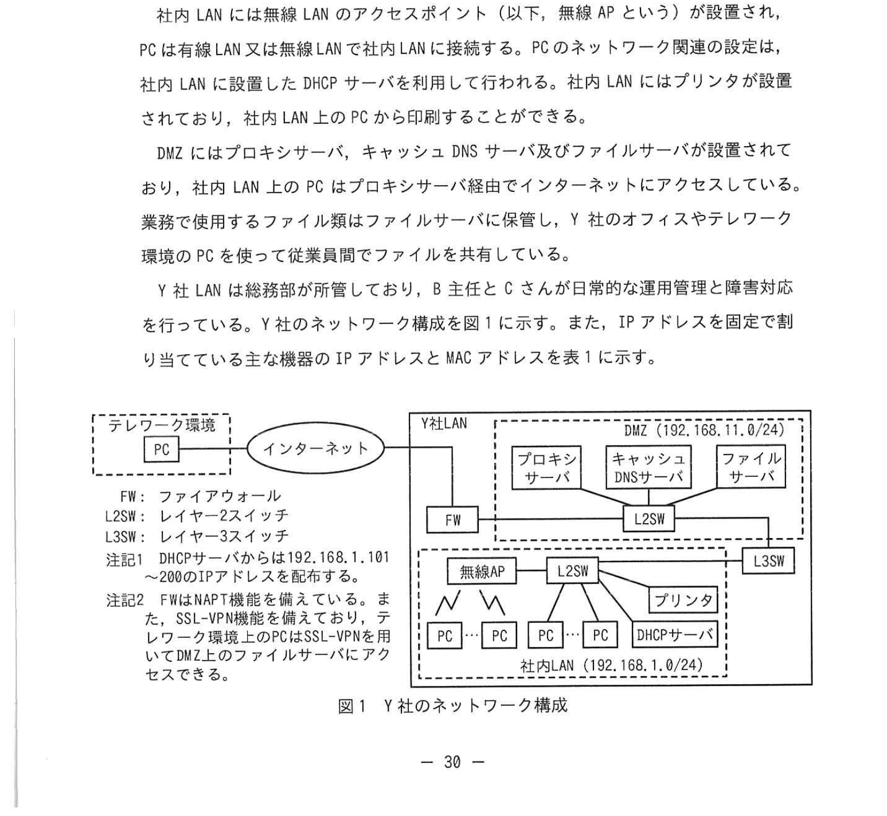
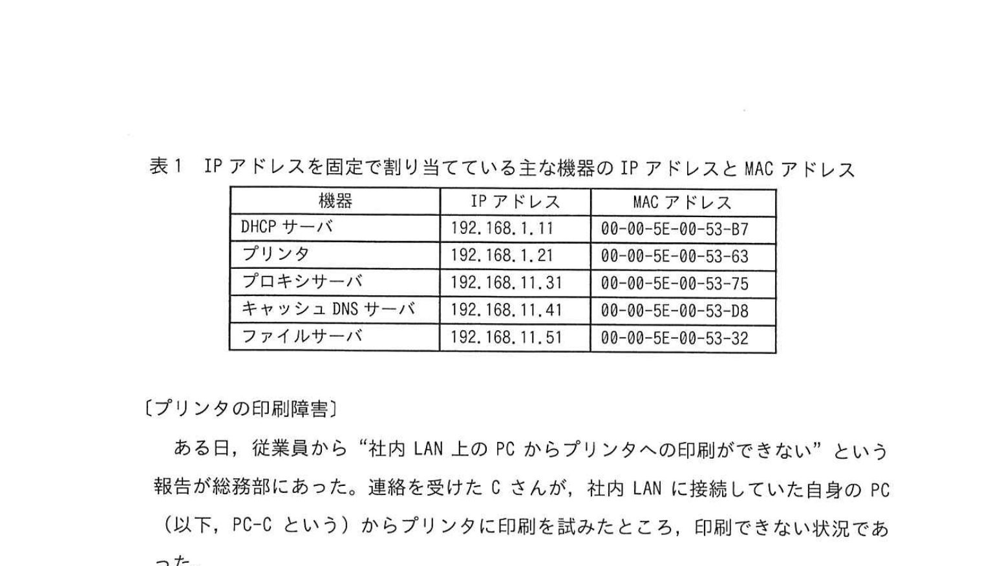
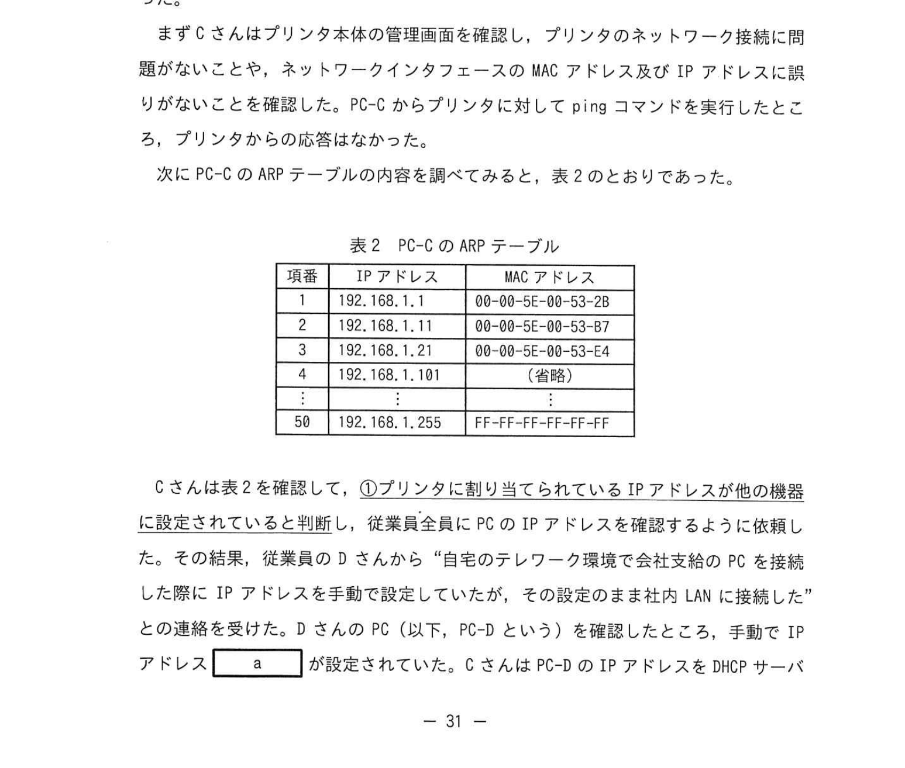
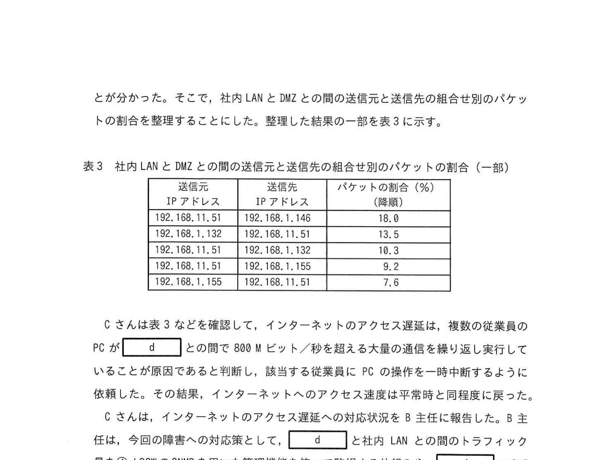

# 2025年春期 応用情報技術者試験 午後 問5（選択）
## ネットワーク：社内LAN の障害対応

---

## 問題文

**問5** 社内 LAN の障害対応に関する次の記述を読んで、設問に答えよ。

Y社は、従業員数 58 名の経営コンサルティングサービスを提供する企業である。従業員は会社支給の PC を使用して、Y社のオフィスや自宅などのテレワーク環境で日々の業務を行っている。該当 PC には、ディスク暗号化、PC 利用時の多要素認証や自らから Y社のファイルなどのセキュリティ機能が設定されており、業務では社内 PC から Y社の SSL-VPN 接続機能を利用できるようになっている。

Y社のオフィスの LAN（以下、Y社 LAN という）は、社内 LAN セグメント（以下、社内 LAN という）と DMZ セグメント（以下、DMZ という）で構成される。Y社のオフィス内では、PC は社内 LAN に接続して利用している。

社内 LAN には無線 LAN のアクセスポイント（以下、無線 AP という）が設置され、従業員は会社支給以外の PC を Y社 LAN に接続することは禁止されている。PC のネットワーク設定は、社内 LAN に設置した DHCP サーバを利用して行われる。社内 LAN にはプリンタが設置されており、社内 LAN 上の PC はプリンタに印刷することができる。

DMZ にはプロキシサーバ、キャッシュ DNS サーバ及びファイルサーバが設置されている。従業員は会社が管理している、B 主任（以下、さんが）が日常的な運用管理と障害対応を行っている。Y社のネットワーク構成を図1に示す。また、IP アドレスを固定で割り当てている主な機器の IP アドレスと MAC アドレスを表1に示す。

### 図1 Y社のネットワーク構成

> ※ テレワーク環境のPC → インターネット → FW → Y社LAN
> ※ Y社LAN: 社内LAN（192.168.1.0/24）と DMZ（192.168.11.8/29）がL2SW・L3SWで接続
> ※ DMZにはプロキシサーバ、キャッシュDNSサーバ、ファイルサーバが配置
> ※ 社内LANにはPC群、DHCP サーバ、プリンタが配置
> ※ 注記1: DHCPサーバはNAT機能を持ち、テレワーク環境のPCはSSL-VPN接続してDMZのファイルサーバにアクセスできる
> ※ 注記2: L3SWはルーティング機能をもつ

### 表1 IP アドレスを固定で割り当てている主な機器のIPアドレスとMACアドレス

> | 機器 | IP アドレス | MAC アドレス |
> |---|---|---|
> | DHCPサーバ | 192.168.1.11 | 00-00-5E-00-53-87 |
> | プリンタ | 192.168.1.21 | 00-00-5E-00-53-63 |
> | プロキシサーバ | 192.168.1.31 | 00-00-5E-00-53-75 |
> | キャッシュDNSサーバ | 192.168.1.41 | 00-00-5E-00-53-88 |
> | ファイルサーバ | 192.168.1.51 | 00-00-5E-00-53-32 |

---

### 〔プリンタの印刷障害〕

ある日、従業員から「社内 LAN 上の PC からプリンタへの印刷ができない」という報告が総務部に届いた。連絡を受けたC さんが、社内 LAN で調査しているPCのC さんの PC（以下、PC-C という）からプリンタへの印刷を試みたところ、印刷できない状況であった。

まずC さんはプリンタ本体の管理画面を確認し、プリンタのネットワーク接続に問題がないことを確認した。PC-C からプリンタに対し ping コマンドを実行したところ、プリンタからの応答はなかった。

次にPC-Cの ARP テーブルの内容を調べてみると、表2のとおりであった。

### 表2 PC-C の ARP テーブル

> | 項番 | IP アドレス | MACアドレス |
> |---|---|---|
> | 1 | 192.168.1.1 | 00-00-5E-00-53-2B |
> | 2 | 192.168.1.11 | 00-00-5E-00-53-87 |
> | 3 | 192.168.1.21 | 00-00-5E-00-53-E4 |
> | 4 | 192.168.1.181 | 00-00-5E-00-53-75 |
> | 50 | 192.168.1.255 | FF-FF-FF-FF-FF-FF |

C さんは表2を確認して、①プリンタに割り当てられているIPアドレスが他の機器に設定されていると判断し、従業員管理員にPC の IP アドレスを確認するように依頼した。その結果、テレワーク環境から会社の PCに接続したとある従業員のPCがある IP アドレスを手動で社内 LAN に接続したため、その設定 IP アドレスが `[　a　]` が設定されていた。C さんは PC-C のIP アドレスを DHCP サーバから自動的に取得する設定に変更した後、PC-C からプリンタに印刷できることを確認した。

C さんは、プリンタの印刷障害への対応状況をB主任に報告した。B主任は、今回のプリンタの障害への対応策として、②プリンタを二つのサブネットに分割して接続を担当するにC さんに指示した。また、セキュリティ対策として、社内LANに接続する際の MAC アドレス認証や認証サーバを用いた IEEE `[　b　]` 認証を導入することの検討と、PC の IP アドレスを DHCP サーバから自動取得させることを原則禁止とする旨の社内規程の明記及び従業員への周知をCさんに指示した。

---

### 〔インターネットのアクセス障害〕

ある日、従業員から「インターネットへのアクセスがとても遅い」という多数の報告が総務部に届いた。C さんは DMZ の L2SW にミラーポートを設置して、DMZ とインターネットとの間及び社内 LAN と DMZ との間で流通している通信パケットを一定時間パケットアナライザでキャプチャして分析することにした。分析の結果、DMZ とインターネットとの間の通信量は少ないが、社内 LAN と DMZ との間の通信量が非常に多いことが分かった。そこで、社内 LAN と DMZ との間の送信元と送信先の組み合わせ別のパケットの割合を整理することにした。整理した結果の一部を表3に示す。

### 表3 社内LANとDMZの間の送信元と送信先の組み合わせ別のパケットの割合（一部）

> | 送信元 IP アドレス | 送信先 IP アドレス | パケットの割合（%）（概略） |
> |---|---|---|
> | 192.168.11.51 | 192.168.1.146 | 18.0 |
> | 192.168.1.132 | 192.168.11.11 | 10.3 |
> | 192.168.11.51 | 192.168.1.155 | 9.2 |
> | 192.168.11.51 | 192.168.1.155 | 7.6 |

C さんは表3などを確認して、インターネットのアクセス遅延は、複数の従業員の PC が `[　d　]` との間で 800 メガビット/秒を超える大量の通信を繰り返し実行していることが原因だと分かった。Cさんはその結果、インターネットのアクセス遅延に依頼した従業員に作業を依頼し、その結果、インターネットへのアクセス遅延は平常時と同程度に戻った。

C さんは、インターネットのアクセス遅延への対応状況を B主任に報告した。B主任は、今回の障害への対応として、④L3SW の SNMP を用いた管理機能を使って `[　d　]` と社内との間のトラフィックを監視する仕組みや、`[　d　]` の QoS 機能を使って `[　e　]` を制限する仕組みについて、導入の検討を行うよう C さんに指示した。

また、キャッシュDNSサーバのソフトウェアに不具合が発生したときにインターネットへのアクセスが継続できる対策として、B主任は③キャッシュDNSサーバの不具合状況を監視する対策についても、最も適切なものをC さんに指示した。

---

## 設問

### 設問1

〔プリンタの印刷障害〕について答えよ。

**(1)** 本文中の下線①について、C さんが判断した理由を **35字以内**で答えよ。

**(2)** 本文中の `[　a　]` に入れる適切な IP アドレスを答えよ。

**(3)** 本文中の下線②について、サブネット分割した結果、社内 LAN 上の PC からプリンタに届かなくなる通信の種類を解答群の中から選び、記号で答えよ。

**解答群**

| 記号 | 通信の種類 |
|---|---|
| ア | FTP |
| イ | ICMP |
| ウ | ブロードキャスト |
| エ | ユニキャスト |

**(4)** 本文中の `[　b　]` に入れる適切な字句を解答群の中から選び、記号で答えよ。

**解答群**

| 記号 | 字句 |
|---|---|
| ア | 802.11a |
| イ | 802.11n |
| ウ | 802.1Q |
| エ | 802.1X |

### 設問2

〔インターネットのアクセス障害〕について答えよ。

**(1)** 本文中の `[　c　]` に入れる適切な字句を答えよ。

**(2)** 本文中の下線③について、キャッシュ DNS サーバのサービス継続に関して取るべき対策はどれか、最も適切なものを解答群の中から選び、記号で答えよ。

**解答群**

| 記号 | 対策 |
|---|---|
| ア | キャッシュDNSサーバのCPU数を増やす |
| イ | キャッシュDNSサーバのメモリを増やす |
| ウ | キャッシュDNSサーバを多重化する |
| エ | キャッシュDNSサーバを定期的に再起動する |

### 設問3

〔インターネットのアクセス遅延〕について答えよ。

**(1)** 本文中の `[　d　]` に入れる適切な字句を図1中の機器名で答えよ。

**(2)** 本文中の下線④について、L3SW から運用管理者に通知する際に用いる SNMP の通知機能の名称を答えよ。また、その通知を送信する条件を答えよ。

**(3)** 本文中の `[　e　]` に入れる適切な字句を解答群の中から選び、記号で答えよ。

**解答群**

| 記号 | 字句 |
|---|---|
| ア | DMZ内のトラフィック |
| イ | 特定のPCからDMZへのトラフィック |
| ウ | ファイルサーバから社内LANへのトラフィック |
| エ | ファイルサーバからプロキシサーバへのトラフィック |

---

## 解答と解説

### 設問1

**(1) 正解（解答例）：表2項番3のMACアドレスがプリンタのものと異なっていたから（33字）**

**理由：** 表1でプリンタ（192.168.1.21）の MAC アドレスは `00-00-5E-00-53-63` だが、PC-C の ARP テーブル（表2項番3）では同じ IP に `00-00-5E-00-53-E4` が登録されている。この不一致から、プリンタの IP アドレスが別の機器（不正接続した従業員PC）に使われていると判断できる。

**(2) 正解：a=192.168.1.21**

**理由：** 従業員が手動設定した PC が、プリンタの IP アドレス `192.168.1.21` を使用していた。そのため ARP テーブルに異なる MAC アドレスが登録され、プリンタへの通信が別の機器に届いていた（ARP キャッシュポイズニング状態）。

**(3) 正解：ウ（ブロードキャスト）**

**理由：** サブネットを分割すると、別サブネットのプリンタへの**ブロードキャスト通信**はルータで遮断される。ブロードキャストはサブネット内にしか届かないため、PC が別サブネットのプリンタへ ARP ブロードキャストを送っても届かなくなる。ユニキャストはルーティングで届く、ICMP や FTP もユニキャストで届く。

**(4) 正解：エ（802.1X）**

**理由：** **IEEE 802.1X** はネットワークへの接続認証（アクセス制御）プロトコル。認証サーバ（RADIUSサーバ）と組み合わせて、正規のデバイス・ユーザーだけが LAN に接続できるよう制御する。不正な PC の接続を防ぐのに使う。802.11a/n は無線 LAN 規格、802.1Q は VLAN タギング。

---

### 設問2

**(1) 正解：c=nslookup**

**理由：** DNS サーバの名前解決を調査するコマンドは `nslookup`。キャッシュ DNS サーバに対して問い合わせを行い、名前解決の問題を特定する際に使う。

**(2) 正解：ウ（キャッシュDNSサーバを多重化する）**

**理由：** ソフトウェア不具合による単一障害点（SPOF）を排除するには、**多重化（冗長化）**が最も効果的。DNSサーバを複数台にすることで、一方に障害が起きても名前解決が継続できる。CPU/メモリ増設や再起動は可用性の根本的な向上にならない。

---

### 設問3

**(1) 正解：d=ファイルサーバ**

**理由：** 表3を見ると送信元192.168.11.51（DMZ側のファイルサーバ相当）が複数の社内LAN宛に大量のパケット（18.0%、9.2%、7.6%）を送信している。このファイルサーバ（192.168.11.51）との間の通信が遅延の原因。

**(2) 正解：名称=SNMPトラップ（SNMP Trap）、条件=トラフィック量が800メガビット/秒を超える**

**理由：**
- **SNMPトラップ**：SNMPエージェント（L3SW）が設定した閾値を超えた際に、マネージャ（運用管理者）へ非同期に通知を送る機能。ポーリングと異なり、イベント発生時にのみ通知する。
- **送信条件**：問題文に「800メガビット/秒を超える大量の通信」とあることから、閾値は「トラフィック量が800メガビット/秒を超える」ことが条件となる。

**(3) 正解：e=ウ（ファイルサーバから社内LANへのトラフィック）**

**理由：** QoS（Quality of Service）で制限すべきは、インターネット遅延の直接原因となっている**ファイルサーバ（DMZ）から社内LAN宛の大量トラフィック**。これを帯域制限することで、正規のインターネット通信への影響を抑制できる。

---

## 参考：主要キーワード

| 用語 | 説明 |
|------|------|
| ARPテーブル | IPアドレスとMACアドレスの対応を保持するテーブル。同一サブネット内の通信に使用 |
| ARPキャッシュポイズニング | ARP応答を偽ることで、正規機器のMACアドレスを書き換える攻撃/状態 |
| DHCP（Dynamic Host Configuration Protocol） | PCに自動でIPアドレスを付与するプロトコル |
| IEEE 802.1X | LANポートへの接続を認証（RADIUSサーバ連携）するIEEE標準規格 |
| ブロードキャスト | サブネット内の全機器に送信するパケット（例: ARP要求）。ルータで転送されない |
| nslookup | DNSの名前解決確認コマンド。サーバのIPアドレスや名前解決のエラーを調べる |
| キャッシュDNSサーバ | 外部DNSへの問い合わせ結果をキャッシュし、名前解決を高速化するDNSサーバ |
| 多重化（冗長化） | 同一機能を複数台用意して可用性を高める構成。単一障害点の排除 |
| SNMP（Simple Network Management Protocol） | ネットワーク機器の監視・管理に使うプロトコル |
| SNMPトラップ | SNMP エージェントが閾値超過などのイベントを管理者に非同期通知する機能 |
| QoS（Quality of Service） | 特定のトラフィックを優先・制限して帯域を管理する技術 |
| パケットアナライザ（Wiresharkなど） | ネットワークパケットをキャプチャして内容を分析するツール |
