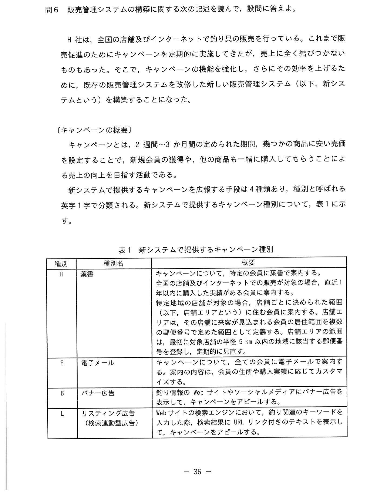
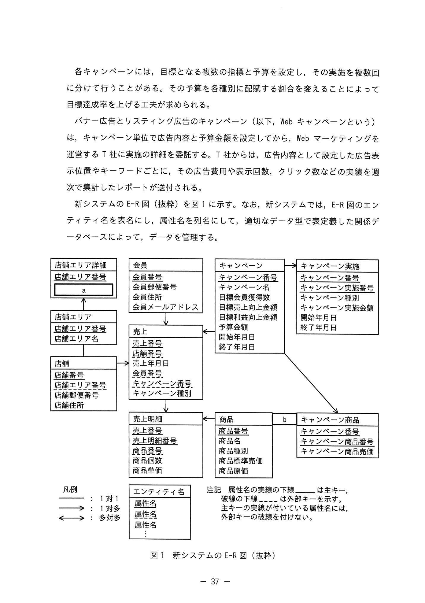
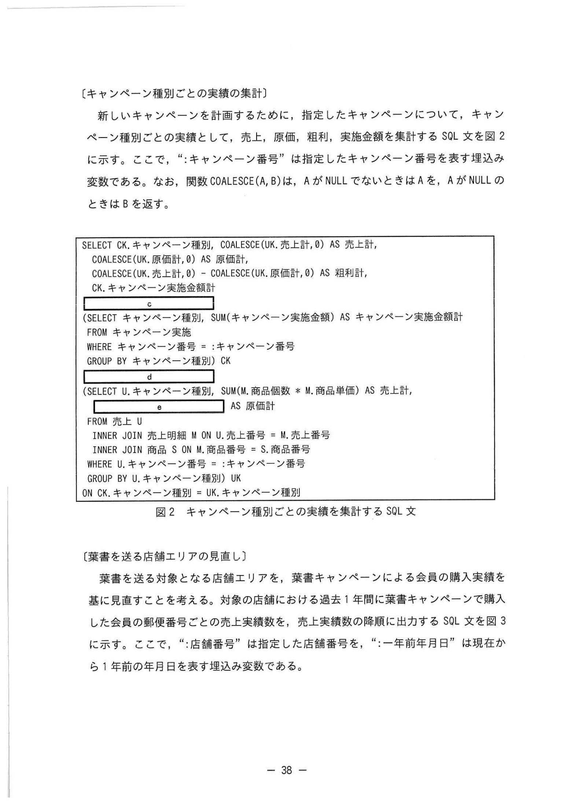
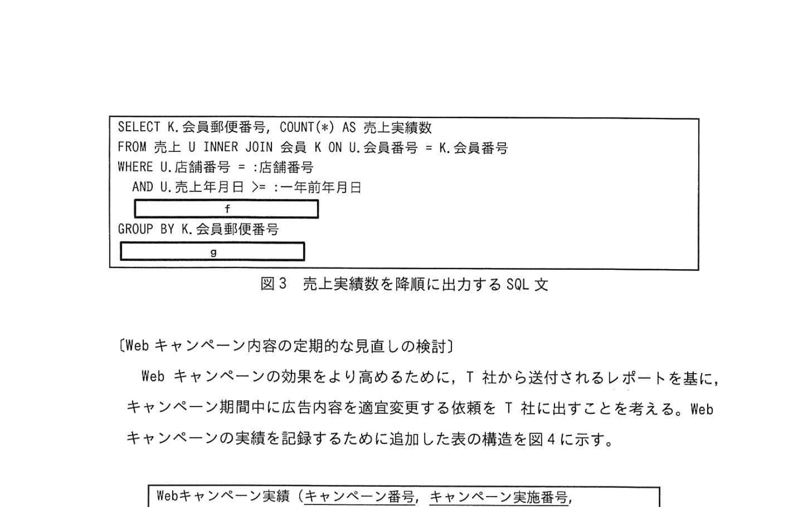
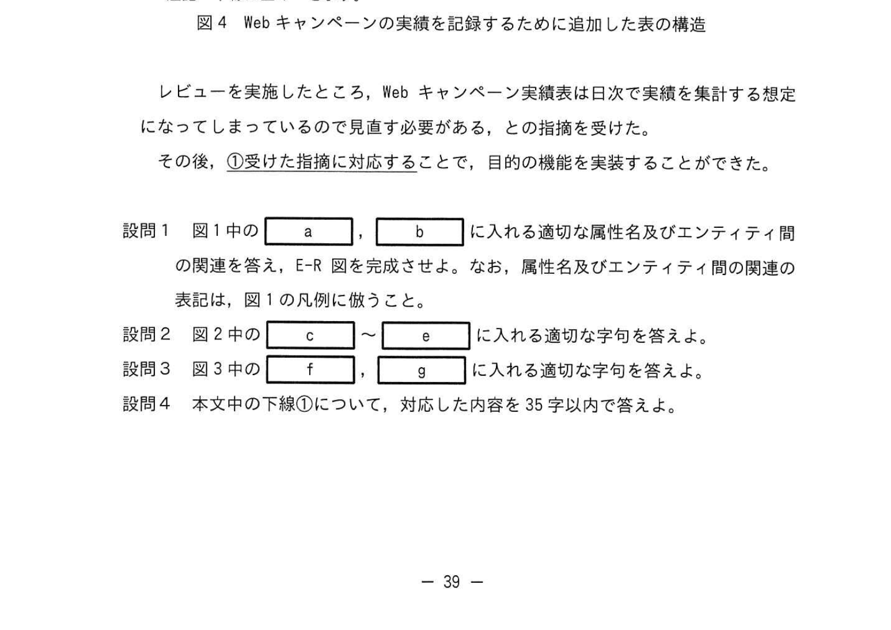

# 2025年春期 応用情報技術者試験 午後 問6（選択）
## データベース：販売管理システムのキャンペーン実績集計

---

## 問題文

**問6** 販売管理システムの構築に関する次の記述を読んで、設問に答えよ。

H社は、全国の店舗及びインターネットで釣り具の販売を行っている。これまで販売促進のためにキャンペーンを定期的に実施してきた。さらにその効率を上げるために、既存の販売管理システムを改修した新しい販売管理システム（以下、新システムという）を構築することになった。

---

### 〔キャンペーンの概要〕

キャンペーンとは、2週間〜3ヵ月間の定められた期間、幾つかの商品に安い売価を設定することで、新規会員の獲得や、特定の商品に複数回購入してもらうことによる売上の向上を目指す活動である。

新システムで提供するキャンペーンを広告する手段は4種類あり、種別と呼ばれる英字1字で分類される。新システムで提供するキャンペーン種別を表1に示す。

### 表1 新システムで提供するキャンペーン種別



> | 種別 | 種別名 | 概要 |
> |---|---|---|
> | W | 葉書 | キャンペーンについて、特定の会員に葉書で案内する。全国の店舗及びインターネットで販売が対象の場合、直近1年以内に取引があった全会員に案内する。店舗エリアという（以下、店舗エリアという）にも対象会員に案内する。店舗エリアとは、店舗の住所を基準として5km以内の地域を示す郵便番号のことである。 |
> | E | 電子メール | キャンペーンについて、全ての会員に電子メールで案内する。案内内容はH社がカスタマイズする。 |
> | B | バナー広告 | 釣り情報のWebサイトやソーシャルメディアにバナー広告を表示し、キャンペーンを告知する。 |
> | L | リスティング広告 | Webサイトの検索エンジンにキーワードを入力した際、検索結果URLリンク付きのテキストを表示し、キャンペーンをアピールする。 |

各キャンペーンには、目標となる複数の指標と予算を設定し、その実績を複数回に分けて行うことがある。各イテレーションの目標達成を上げる工夫が求められる。

バナー広告とリスティング広告（以下、Webキャンペーンという）は、キャンペーン単位で広告内容と予算額を設定しており、Webマーケティングを運営するT社に実施の詳細を委託している。T社からは広告内容として設定した広告表示数、クリック数や目標達成数を集計したレポートが送付される。

---

新システムのE-R図のエンティティ名及び属性名を列名として、適切なデータ型で表現した関係データベースを構築する。

### 図1 新システムのE-R図（抜粋）



> ※ 主なエンティティと関係:
> - 店舗エリア詳細: 店舗エリア番号、店舗エリア名、**`[　a　]`**
> - 会員: 会員番号、会員メールアドレス、郵便番号など
> - キャンペーン: キャンペーン番号、キャンペーン名、種別、予算額など
> - キャンペーン実施: キャンペーン実施金額、キャンペーン実施開始年月日など
> - 商品: 商品番号、商品名、商品原価、商品販売価格
> - 売上: 売上番号、売上年月日など
> - **`[　b　]`**（キャンペーン商品関連テーブル）: キャンペーン番号、商品番号、キャンペーン商品価格

---

### 〔キャンペーン種別ごとの実績の集計〕

新しいキャンペーンを計画するために、指定したキャンペーンについて、キャンペーン種別ごとの実績として、売上、原価、粗利、実施金額を集計する SQL文を図2に示す。なお、":キャンペーン番号"は指定したキャンペーン番号を表す埋め込み変数である。また、関数 COALESCE(A, B) は、A が NULL でないときは A を、A が NULL のときは B を返す。

### 図2 キャンペーン種別ごとの実績を集計する SQL文



> ```sql
> SELECT CK.キャンペーン種別, COALESCE(CK.売上計, 0) AS 売上計,
>        COALESCE(UK.原価計, 0) AS 原価計,
>        COALESCE(CK.売上計, 0) - COALESCE(UK.原価計, 0) AS 粗利計
>   FROM (SELECT キャンペーン番号, SUM(キャンペーン実施金額) AS キャンペーン実施金額計
>           FROM キャンペーン実施
>          GROUP BY キャンペーン番号, キャンペーン種別) CK
>        [　d　]
>        (SELECT U.キャンペーン種別, [　e　] AS 原価計
>           [　b　] 売上 U
>                  INNER JOIN 売上明細 M ON U.売上番号 = M.売上番号
>                  INNER JOIN 商品 S ON M.商品番号 = S.商品番号
>          WHERE U.キャンペーン番号 = :キャンペーン番号
>          GROUP BY U.キャンペーン種別) UK
>         ON CK.キャンペーン種別 = UK.キャンペーン種別
> ```

---

### 〔葉書を送る店舗エリアの見直し〕

葉書を送る対象となる店舗エリアを、葉書キャンペーンによる会員の購買実績を基に見直すことを考える。対象の店舗における過去1年間に葉書キャンペーンで購入した会員の郵便番号ごとの売上実績数、売上実績額を降順に出力する SQL文を図3に示す。ここで、":店舗番号"は指定した店舗番号を、":一年前の年月日"は現在から1年前の年月日を表す埋め込み変数である。

### 図3 売上実績数を降順に出力する SQL文



> ```sql
> SELECT K.会員番号, COUNT(*) AS 売上実績数
>   FROM 売上 U INNER JOIN 会員 K ON U.店舗番号 = K.会員番号
>  WHERE U.店舗番号 = :店舗番号
>    AND U.売上年月日 >= :一年前の年月日
>    [　f　]
>  GROUP BY K.会員番号
>  [　g　]
> ```

---

### 〔Webキャンペーン内容の定期的な見直し〕

Web キャンペーンの効果をより高めるために、T社から送付されるレポートを基に、キャンペーン期間中に広告内容の適度変更する T社に出すことを考える。Webキャンペーンの実績を記録するために追加した表の構造を図4に示す。

### 図4 Webキャンペーンの実績を記録するために追加した表の構造



> **Webキャンペーン実績（キャンペーン番号, キャンペーン実施金額, キャンペーン実績日時...）**
> - キーワード、広告費用、表示回数、クリック数、会員登録数

レビューを実施したところ、Web キャンペーン実績は日次で実績を集計する想定になっているのに、①目的の機能を達成するのに見直す必要があることへの指摘を受けた。その後、①受けた指摘に対応することで、目的の機能を実装することができた。

---

## 設問

### 設問1

図1中の `[　a　]`、`[　b　]` に入れる適切な属性名及びエンティティ間の関係名を答えよ。なお、属性名及びエンティティ間の関係名は、図1の凡例に倣うこと。

### 設問2

図2中の `[　c　]`〜`[　e　]` に入れる適切な字句を答えよ。

### 設問3

図3中の `[　f　]`〜`[　g　]` に入れる適切な字句を答えよ。

### 設問4

本文中の下線①について、対応した内容を **35字以内**で答えよ。

---

## 解答と解説

### 設問1

**正解：a=店舗エリア郵便番号、b=キャンペーン商品（エンティティ名）**

**a の理由：** 「店舗エリア」は店舗の住所を基準として5km以内の地域を示す**郵便番号**のこと（本文より）。店舗エリア詳細エンティティは店舗エリア番号・店舗エリア名に加え、対象エリアを識別する**店舗エリア郵便番号**を属性として持つ必要がある。

**b の理由：** キャンペーンには対象商品（キャンペーン商品価格）が設定される。E-R図でキャンペーンと商品の多対多の関係を解消するための関連エンティティ名は**キャンペーン商品**（キャンペーン番号、商品番号、キャンペーン商品価格を属性とする）。

---

### 設問2

**正解：**

| 空欄 | 正解 | 説明 |
|---|---|---|
| **c（FROM）** | `FROM` | 内側のサブクエリで売上テーブルを取得する際のFROM句 |
| **d** | `LEFT OUTER JOIN` | CKサブクエリとUKサブクエリを左外部結合する（種別にキャンペーン実施のみあり売上がない場合も含める） |
| **e** | `SUM(M.商品個数 × S.商品原価)` | 売上明細の商品個数と商品原価を掛けた合計（原価計） |

**解説：**
- **LEFT OUTER JOIN（d）の理由：** キャンペーン種別によっては売上がゼロの場合がある。その場合でもCKサブクエリ（キャンペーン実施）の行を残すため、LEFT OUTER JOINで結合する。COALESCE関数で NULL を0に変換している点がその証拠。
- **SUM(M.商品個数 × S.商品原価)（e）：** 原価計＝各明細の(商品個数×商品原価)の合計。売上明細テーブルに商品個数(M)、商品テーブルに商品原価(S)があるため、JOIN後にSUMで集計する。

---

### 設問3

**正解：**

| 空欄 | 正解 | 説明 |
|---|---|---|
| **f** | `AND U.キャンペーン種別 = 'H'` | 葉書（W種別）キャンペーンに限定する条件 |
| **g** | `ORDER BY 売上実績額 DESC` | 売上実績額の降順ソート |

**f の理由：** 葉書（Webまたは W）キャンペーンによる購買のみを対象とするため、種別でフィルタリングが必要。「H」は葉書の種別コード（Hagakiの頭文字）。

**g の理由：** 「売上実績額を降順に出力する」という目的に合わせて `ORDER BY 売上実績額 DESC` を追加する。

---

### 設問4

**正解（解答例）：Webキャンペーン実績表の集計粒度を日次から週次に修正する。（31字）**

**理由：** Webキャンペーンのレポートは週次でT社から送付される。しかし Webキャンペーン実績表は**日次集計**前提で設計されており、週次集計のT社レポートとの突き合わせができない。集計粒度を週次に合わせて修正することで、レポートとの比較分析が可能になる。

---

## 参考：主要キーワード

| 用語 | 説明 |
|------|------|
| E-R図（ER図） | エンティティと関連を表現した図。関係データベース設計の基本 |
| エンティティ | 現実世界の「もの」や「出来事」をモデル化した概念。テーブルに対応 |
| 多対多の関係 | 例：キャンペーン↔商品。交差テーブル（関連エンティティ）で解消 |
| 外部結合（LEFT OUTER JOIN） | 左テーブルの全行を保持し、右テーブルにマッチしない場合はNULLにする結合 |
| COALESCE(A, B) | AがNULLでなければAを、NULLであればBを返すSQL関数 |
| 集計関数 SUM() | 指定した式の合計値を計算するSQL集計関数 |
| GROUP BY | 指定した列の値でグループ分けして集計する |
| ORDER BY … DESC | 指定した列の降順でソートするSQL句 |
| 埋め込み変数（:変数名） | SQLに外部から値を渡すためのプレースホルダー（バインド変数） |
| 粒度（グラニュラリティ） | データ集計の細かさの単位。日次・週次・月次などの区別 |
