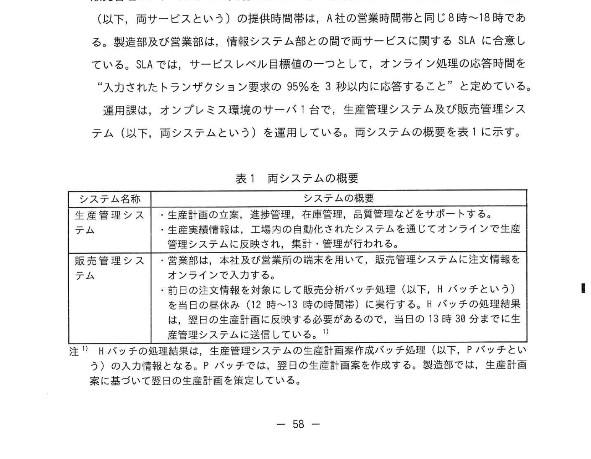
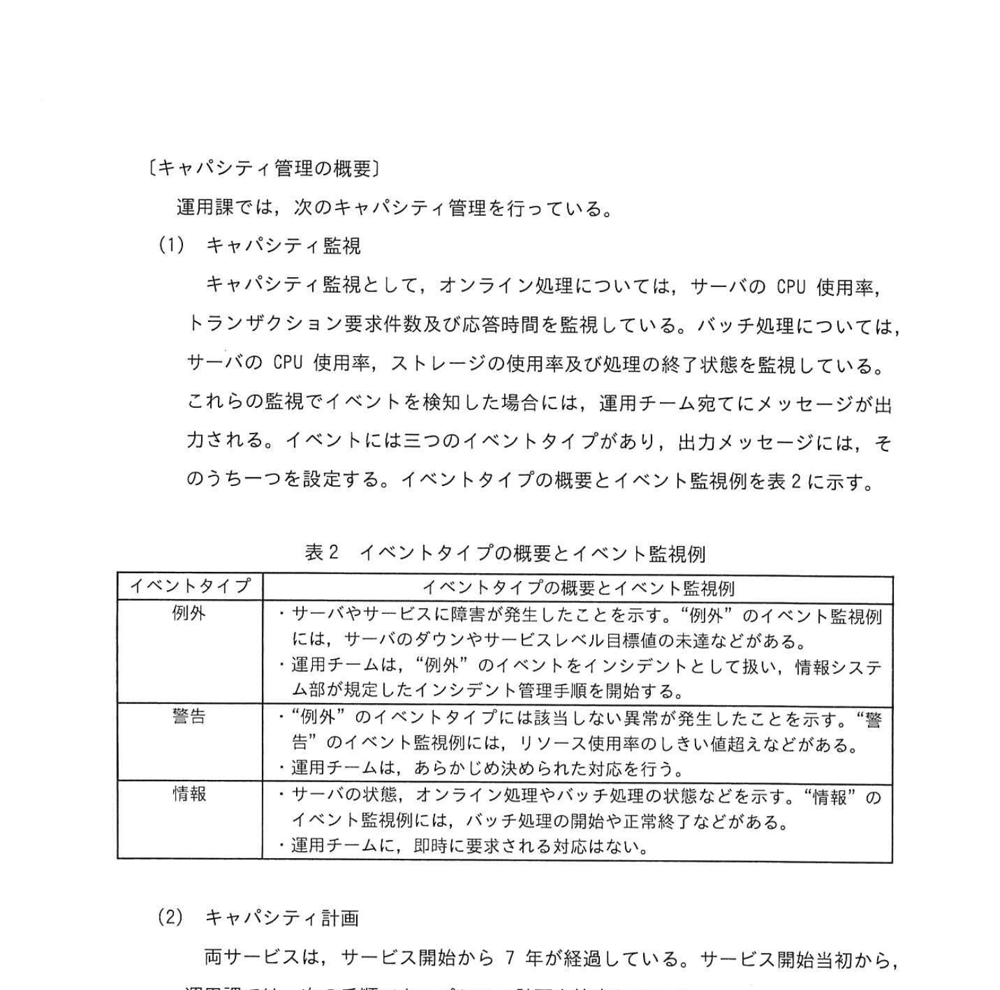
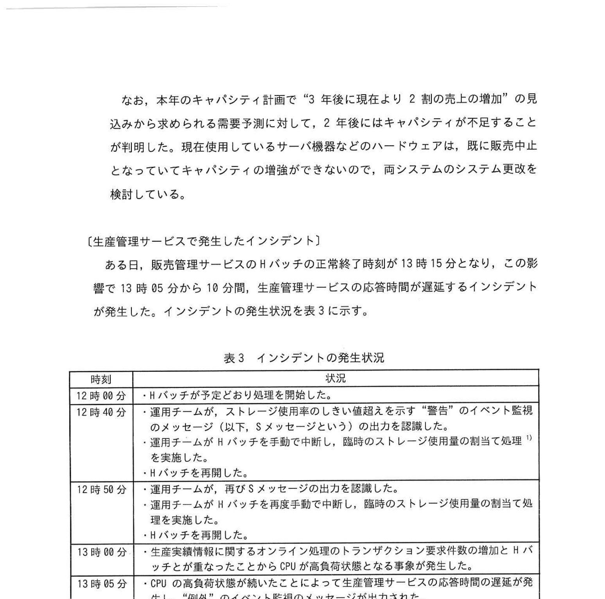

# 2025年春期 応用情報技術者試験 午後 問10（選択）
## サービスマネジメント：キャパシティ管理とクラウドサービスへの移行

---

## 問題文

**問10** 容量・能力管理に関する次の記述を読んで、設問に答えよ。

A社は製造業を営む企業で、本社に供給する製造部部和下の工場と営業部部下の2か所の営業所をもつ。A社の業績は好調であり、3年後の売上は、現在より2割の増加を見込んでいる。A社情報システム部は、システムの開発と保守を担当する開発課とシステムの運用を担当する運用課がある。C課長及びD君は、運用課の責任者とC課長が名のもとで君は、表表の運用担当者として構成されたC運用チームのリーダーとして、容量・能力（以下、キャパシティという）管理を含め、運用業務を行っている。

---

### 〔サービスの概要〕

情報システム部は、製造部に生産管理サービスを、営業部に販売管理サービスを提供している。生産管理サービスは生産管理システムによって、販売管理サービスは販売管理システムによって実現されている。生産管理システム及び販売管理システム（以下、両システムという）の提供時間帯は、A社の営業時間帯と同じ8時〜18時である。

運用環境は、オンプレミス環境のサーバ（以下、生産管理サービス及び販売管理システム（以下、両システムという）を運用している。両システムの概要を表1に示す。

### 表1 両システムの概要

> | システム名 | システムの概要 |
> |---|---|
> | 生産管理システム | 生産計画の立案、進捗管理、在庫管理、品質管理などをサポートする。生産量確認など、工場内が動かすシステムを通じてオンラインで生産管理システムに反映させる。毎日の生計・管理サポートを行う。 |
> | 販売管理システム | 営業は、本社及び営業所の間及び本社で、販売管理システムに注文情報をオンラインで入力する。Hバッチの処理概要及び、Hバッチの処理結果を翌日に生産管理システムへの注文情報として出力する。Hバッチの処理結果、翌日の生産計画として使用する。Hバッチは12時〜13時処理時間に実施する。 |
>
> 注記: Hバッチの処理概要は、生産管理システムの生計計算処理案内バッチ処理（以下、Hバッチという）として、Hバッチは前日の注文情報などを元に翌日の生産計画を作成する。生産部では、生産計画を基にして翌日の生計を計画する。

---

### 〔キャパシティ管理の概要〕

**（1）キャパシティ監視**

キャパシティ監視として、オンライン処理については、サーバのCPU使用率、トランザクション要求件数及び応答時間を監視している。バッチ処理については、サーバのCPU使用率、ストレージの使用量及び処理の終了状態を監視している。監視でイベントを検知した場合には、運用チームでメッセージが出力される。イベントには三つのイベントタイプがあり、出力メッセージには、そのうちの一つを設定する。イベントタイプの概要と監視例を表2に示す。

### 表2 イベントタイプの概要とイベント監視例

> | イベントタイプ | イベントタイプの概要とイベント監視例 |
> |---|---|
> | 例外 | ・サーバやサービスに障害が発生したことを示す。「例外」のイベント監視例には、サーバのダウンやサービスレベル目標値の未達などがある。・運用チームは「例外」のイベントをインシデントとして扱い、情報システム部がインシデント管理手順を実施する。 |
> | 警告 | ・「例外」のイベントタイプには該当しない異常が発生したことを示す。「警告」のイベント監視例には、リソース使用量が閾値を超えた場合などがある。・運用チームは、あらかじめ決められた復旧手順などを行う。 |
> | 情報 | ・サーバの状態、オンライン処理やバッチ処理の状況などを示す。「情報」のイベント監視例には、バッチ処理の開始や終了などがある。・運用チームは、即時に要求される対応はない。 |

**（2）キャパシティ計画**

両サービスは、サービス開始から7年が経過している。サービス開始初から、運用課では、次の手順でキャパシティ計画を策定している。

- 製造部と営業部から両サービスに対する将来の利用計画量を入手し、両サービスの利用者数、トランザクション要求件数、ストレージ使用量などを需要予測としてまとめる。
- 見積もった使用量をサービスレベル目標値を基に、毎年、今後3年間を見直したサービスコンポーネントのキャパシティを見積もる。必要に応じて、キャパシティを増強するための方式を計画する。

なお、本年のキャパシティ計画で「3年後に現在より2割の売上の増加」の見込みから求められる需要予測に対して、2年後はキャパシティが不足することが判明した。現在使用しているサーバ機器などのハードウェアは、既に販売中止となっていてキャパシティの増強ができないため、両システムのシステム更改を検討している。

---

### 〔生産管理サービスで発生したインシデント〕

ある日、販売管理サービスのHバッチの正常終了時刻が13時15分となり、この影響でHバッチを元に生成される連絡が13時05分から10分間、生産管理サービスの応答待機間が遅延するインシデントが発生した。インシデントの発生状況を表3に示す。

### 表3 インシデントの発生状況

> | 時刻 | 現象 |
> |---|---|
> | 12時30分 | Hバッチの予定どおり処理開始した。 |
> | 12時40分 | 運用チームが、ストレージ使用量が高い値を示す「警告」のイベント監視でSメッセージが出力された。 |
> | (中略) | 運用チームがHバッチを手動で中断し、臨時のストレージ使用量削減の監視処理を実施した。Hバッチを再開した。 |
> | 12時50分 | 運用チームが、再びSメッセージの出力を確認した。この場合、ストレージ使用量の割合を確認した。 |
> | 13時00分 | 生産管理業務でオンライン処理トランザクション要求件数及びHバッチのストレージ使用量増大によりCPUが高負荷状態になり、生産管理サービスの応答時間が遅延する状態が発生した。 |
> | 13時05分 | CPU高負荷状態が続いたことで生産管理サービスの応答時間の遅延が発生した。「例外」のイベントが出力され、インシデント解決チームが編成され対策の実施を開始した。 |
> | 13時10分 | Hバッチの開発担当者を含む関係者が招集された。インシデント解決チームが対策を実施した。 |
> | 13時15分 | Hバッチが終了し、インシデント対策が実施を完了し生産管理サービスは正常状態に戻った。 |

振り返り会議の内容を受けて、C課長は今後、Hバッチの処理中にSメッセージが複数回出力されるというイベントを規定し上で、②このイベントに適切なイベントタイプを設定することにした。

C課長は、今回のキャパシティ不足の事象に対して、早急に根本的な対策が必要と考えた。そこで、C課長はD君に、システム更改の検討をすぐに指示した。

---

### 〔クラウドサービスの調査〕

D君は、システム更改の検討の中で、クラウドサービスについて調査した。クラウドサービスは、利用者のリソースの利用量に応じて柔軟にリソースを追加・削除できる。なお、両システムのモデルウェアの仕様に関する指定があることを確認した。IaaS型のクラウドサービスの採用が適していることを確認した。

D君は、クラウド事業者にヒアリングし、F社のクラウドサービス（以下、Fクラウドという）を検討し選定した。Fクラウドの概要は次のとおりである。

- Fクラウドは、サービスストレージのリソースをサービスに応じて動的に割り当てること（以下、リソースオンデマンドという）ができる。
- Fクラウドは、キャパシティに応じて1からF5までの契約モデルがあり、クラウド利用料が異なる。
- F社からは、リソースオンデマンド用の管理ツールを利用してリソース上限利用制限に与えられる。管理ツールを利用すると購読に契約モデルのキャパシティを超えてリソースを増強できる。リソース増強を見込んだクラウド利用料が算出される。増強されたリソースが不要になれば、管理ツールを利用して元のキャパシティに戻すことができる。

---

C課長はFクラウドの導入を決定し、これによってキャパシティに関する問題を解決することが決定され、販売管理サービスの需要増加が見込まれた。そこで、C課長はFクラウドで新製品品のリリースや処理の対応のプロセスが必要となる前提で、事業環境の変化を踏まえて、D君に対して、「契約モデルを決定していく前提となるので、事業環境変化を踏まえ、両サービスの `[　c　]` を策定すること。」と指示した。

---

## 設問

### 設問1

〔生産管理サービスで発生したインシデント〕について答えよ。

**(1)** 本文中の下線①について、この場で協議する内容は何か、**25字以内**で答えよ。

**(2)** 本文中の下線②について、どのように設定するのか、**15字以内**で答えよ。

### 設問2

〔クラウドサービスの調査〕について答えよ。

**(1)** 本文中の `[　a　]` に入れる適切な内容を、〔生産管理サービスで発生したインシデント〕に記載の字句を用いて、**15字以内**で答えよ。

**(2)** 本文中の下線③について、実施内容をそれぞれ **20字以内**で答えよ。

**(3)** 本文中の `[　b　]` に入れる適切な内容を、本文中の字句を用いて、**25字以内**で答えよ。

**(4)** 本文中の `[　c　]` に入れる適切な内容を、本文中の字句を用いて答えよ。

---

## 解答と解説

### 設問1

**(1) 正解：前日の注文情報に基づく翌日の生産計画（22字）**

**理由：** Hバッチの正常終了が遅延したことで、生産管理サービスの応答時間が遅延するインシデントが発生した。この場の振り返り会議で最重要の協議内容は、バッチ処理遅延が翌日の「生産計画」（Hバッチの出力である前日の注文情報を元にした翌日の生産計画）への業務影響と対策。

**(2) 正解：例外になるように設定する。（15字）**

**理由：** Hバッチの処理中にSメッセージ（警告）が複数回出力された場合、それは単なる「警告」ではなく、このインシデントから分かるようにサービスに重大な影響（CPU高負荷・応答遅延）を引き起こすため、「例外」イベントとして分類するよう設定する。これにより、インシデント対応が即座に開始される。

---

### 設問2

**(1) 正解：Sメッセージの出力を止める（15字）**

**理由：** Fクラウドへの移行後、クラウドではリソースオンデマンドが可能。インシデント時（Hバッチ中にSメッセージ複数回出力）には、管理ツールでリソースを追加することで対応可能となる。そのため、Sメッセージの出力トリガーを止める（対応のあり方を変える）ことができる。

**(2) 正解：**
- **理由**：クラウド利用料が加算されるから（16字）
- **実施内容**：需要予測に基づくリソースの使用量の見積り（24字）

**解説：**
- Fクラウドではリソースオンデマンドによってキャパシティを超えたリソースが使えるが、その分クラウド利用料が増加する。
- 事前に将来の需要予測を立て、必要なリソース使用量を見積もることで、契約モデルを適切に設定しコスト増を抑える。

**(3) 正解：b=運用チームがSメッセージを検出した時点でリソースオンデマンド用の管理ツールを使って（25字以内）**

**解説：** Sメッセージ（警告:ストレージ使用量高）を検知した際に、即座に管理ツールを使ってリソースをオンデマンドで増強するタイミングが `[b]` に当たる。Hバッチ中のストレージ逼迫を早期に解消することで、インシデントへのエスカレーションを防ぐ。

**(4) 正解：c=キャパシティ計画**

**理由：** 「契約モデルを決定していく前提」とは、両サービスの将来の需要を踏まえたキャパシティ計画のこと。事業の成長見込みや需要予測に基づいてリソースの必要量を見積もり、適切なFクラウドの契約モデルを選定するには、キャパシティ計画の策定が必要。

---

## 参考：主要キーワード

| 用語 | 説明 |
|------|------|
| キャパシティ管理 | システムが要求される需要を満たすためにリソース（CPU・ストレージ等）の容量を管理するプロセス |
| イベントタイプ | 例外（障害）・警告（閾値超過）・情報（通常の状態通知）の3種類 |
| バッチ処理 | 一括処理。Hバッチは特定の時間帯にまとめてデータ処理を行う |
| インシデント | サービスの中断またはサービスの質を低下させる計画外のイベント |
| SLA（サービスレベル目標） | サービスとして達成すべき品質目標（応答時間・可用性など） |
| リソースオンデマンド | 需要に応じてクラウドのリソース（CPU・メモリ等）を動的に追加・削除する機能 |
| IaaS（Infrastructure as a Service） | インフラ（VM・ストレージ等）をクラウドで提供するサービスモデル |
| オンプレミス環境 | 自社設備内でサーバ・ネットワークを保有・運用する環境 |
| キャパシティ計画 | 将来の需要予測に基づいてリソースの必要量を見積もり、調達計画を立てるプロセス |
| 需要予測 | 将来の利用量・トランザクション数・ストレージ使用量などを予測すること |
