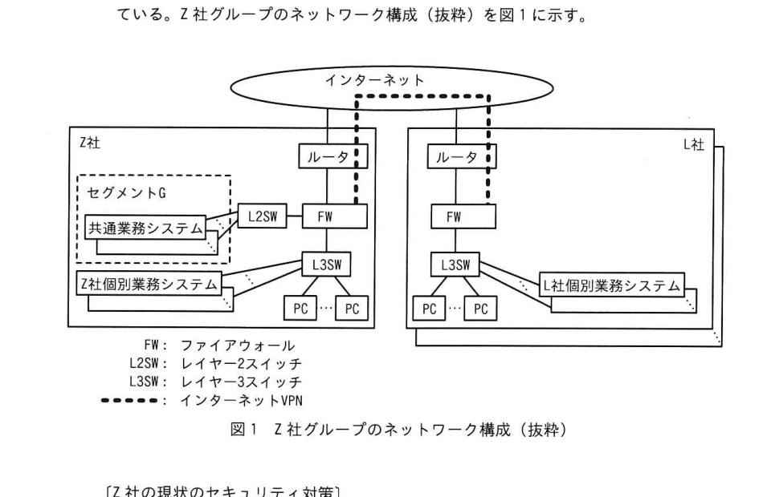

# 2025年秋期 応用情報技術者試験 午後 問1（必須）
## 情報セキュリティ：企業グループのセキュリティ対策

---

## 問題文

**問1** 企業グループのセキュリティ対策に関する次の記述を読んで、設問に答えよ。

Z社は、産業機械を製造する企業で、L社をはじめとする複数の子会社を含めてZ社グループを形成している。Z社グループでは、Webベースの業務システムが複数運用されており、グループ各社が共通で利用できる共通業務システムと各社内だけから利用できる個別業務システムの2種類がある。共通業務システムはZ社の内部ネットワーク内のセグメントG中に構築され、グループ各社の拠点間を接続したインターネットVPN経由でアクセスされる。個別業務システムは各社が個別に構築しており、インターネットVPN経由も含めて社外からはアクセスできない。

業務システムは全てZ社グループ外に委託して開発したものであり、共通業務システムの運用管理はZ社の情報システム部が、個別業務システムの運用管理は各社の情報システム部が、それぞれ行っている。業務システムが稼働しているサーバ及び従業員が使用しているPCについては、各社の情報システム部が設定及び運用管理をしている。

### 図1 Z社グループのネットワーク構成（抜粋）

> **凡例**  
> FW：ファイアウォール  
> L2SW：レイヤー2スイッチ  
> L3SW：レイヤー3スイッチ  
> `-------`：インターネットVPN

---

### 〔Z社の現状のセキュリティ対策〕

Z社は、信頼できる領域と信頼できない領域を定め、必要な管理策を実施している。Z社の現状のセキュリティ対策は次のとおりである。

**対策1：** [  a  ] の考え方に基づき、インターネットからZ社の内部ネットワークへの攻撃を入口となるFWで防いでいる。具体的には、子会社からのインターネットVPN経由での共通業務システムへのアクセスは許可し、インターネットからZ社内へのその他のアクセスは、共通業務システムへのアクセスも含めて禁止している。

**対策2：** Z社内の、PC及び業務システムが稼働しているサーバにはマルウェア対策ソフトを導入している。

**対策3：** Z社内の、PC、業務システムが稼働しているサーバ及びネットワーク機器に対し、各ベンダーからの脆弱性情報やアップデート情報を日次で確認して、適宜セキュリティパッチの適用やアップデートを実施している。

**対策4：** Z社内の業務システムは、導入時に脆弱性診断を実施している。脆弱性が発見された場合は、利用開始までに対応を実施している。

なお、各子会社については、それぞれ独自にセキュリティ対策を実施している。

---

### 〔サプライチェーン攻撃の調査〕

ある日、Z社の情報システム部のB部長は、同業他社においてサプライチェーン攻撃による被害の事例が複数報告されていることを知り、T主任にサプライチェーン攻撃の事例を調査して整理するように指示した。

T主任が調査した結果、サプライチェーン攻撃には幾つかのパターンがあることが分かった。T主任が整理したパターンを次に示す。

**(1) ビジネスサプライチェーン攻撃**

標的とする会社の、セキュリティ対策が不十分な子会社や取引先などの関連会社を攻撃して、そこのシステムを踏み台として、内部ネットワークなどを経由して標的とする会社を攻撃する。

**(2) サービスサプライチェーン攻撃**

標的とする会社が利用しているITサービスの運営事業者などを攻撃して、そのサービスのアカウントを乗っ取ったり、そのサービスを経由してマルウェアを配布したりすることによって、最終的に標的とする会社を攻撃する。

**(3) ソフトウェアサプライチェーン攻撃**

標的とする会社の業務システムなどに導入しているソフトウェアの開発会社を攻撃してソースコードを改ざんしたり、業務システムなどで利用しているオープンソースのソフトウェアライブラリの脆弱性を利用したりすることによって、最終的に標的とする会社を攻撃する。

---

(1)〜(3)のパターンについて、T主任がB部長に報告したときの会話を次に示す。

B部長： サプライチェーン攻撃に対して、Z社グループの現状のセキュリティ対策は十分ですか。

T主任： 不十分だと思います。Z社については、 [  a  ] の考え方で内部ネットワーク内の機器の防御を行っているので、攻撃者によって内部ネットワークに侵入されてしまうと、内部ネットワーク内の業務システムなどが容易に攻撃されるおそれがあります。

B部長： なるほど。実際、幾つかの共通業務システムは、インターネットVPN経由も含む内部ネットワークからであれば認証無しでアクセスすることが可能なので、内部ネットワークに侵入された場合に情報漏えいのリスクがあるということですね。その他の懸念はありますか。

T主任： 業務システムについても懸念があります。システム導入以降は脆弱性診断を実施しておらず、導入以降に明らかになった脆弱性への対応ができていないおそれがあります。また、Z社グループ全体に視野を広げると、マルウェア対策ソフトの選定やネットワーク機器の設定など、各社がそれぞれ独自にセキュリティ対策を実施しているので、セキュリティ対策が不十分な会社が存在するおそれがあります。

B部長： 分かりました。今後は各社任せにするのではなく、我々Z社が中心となってZ社グループ全体のセキュリティ対策を強化していく必要がありますね。Z社グループ全体として追加すべきセキュリティ対策を検討してください。

---

### 〔追加すべきセキュリティ対策〕

T主任はZ社グループ各社の現状のセキュリティ対策を調査し、追加すべきセキュリティ対策を検討して次のようにまとめた。なお、子会社に対してはこれらの対策に加えて、①Z社グループ全体の統制を強化しサプライチェーン攻撃のリスク又は被害を低減する施策の実施を依頼する。

**対策5：** 全ての業務システムへのアクセスに対しては、従業員ごとに割り当てたIDとパスワードによる認証を行う。また、パスワードは類推されにくいものだけが利用できるようにシステムで制限する。加えて、 [  b  ] の原則に従い、各従業員に対して過剰な権限を与えないようにする。

**対策6：** 機密性の高い内部情報を扱う業務システムへのアクセスに対しては、多要素認証を行う。

**対策7：** ネットワーク機器などの管理用アカウントのパスワードは類推されにくいものにする。特に、機器の型番ごとに共通であることが多い [  c  ] パスワードの利用は禁止する。

**対策8：** 業務システム、業務システムが稼働しているサーバ及びネットワーク機器へのアクセスについては監視及びログの記録を行い、それらのログを [  d  ] で分析することによって攻撃の予兆検知や早期発見を図る。また、業務システムやインターネットへのアクセスログが記録されていることをZ社グループ各社の従業員に周知し、②データの持出しなどの内部不正を抑止する。

**対策9：** 業務システム、業務システムが稼働しているサーバ及びネットワーク機器については、機密情報の取扱いの有無などの重要度に応じて3か月から1年の周期で定期的な脆弱性診断を行い、発見された脆弱性への対応を行う。

T主任が検討の結果をB部長に報告したところ、③ソフトウェアサプライチェーン攻撃への対策として“対策9”に加えて実施すべき内容があると指摘された。そこでT主任は、業務システムなどで使用しているソフトウェア製品及びライブラリについて、名称、バージョン、開発会社名などを一覧にまとめた [  e  ] を作成することを、“対策10”としてセキュリティ対策に追加することにした。

T主任は“対策10”も含めてB部長に改めて報告し、追加すべきセキュリティ対策が承認された。

---

## 設問

### 設問1

本文中の [  a  ] 〜 [  e  ] に入れる適切な字句を、それぞれ解答群の中から選び、記号で答えよ。

**解答群**

| 記号 | 字句 |
|------|------|
| ア | CASB |
| イ | MDM |
| ウ | need-to-know |
| エ | RASP |
| オ | SBOM |
| カ | SIEM |
| キ | SLCP |
| ク | 境界防御 |
| ケ | サンドボックス |
| コ | ゼロトラスト |
| サ | 多層防御 |

### 設問2

本文中の `[　c　]` に入れる適切な字句を、**5字以内**で答えよ。

### 設問3

〔追加すべきセキュリティ対策〕について答えよ。

**(1)** 本文中の下線①について、具体的な施策として**適切でないもの**を解答群の中から選び、記号で答えよ。

**解答群**

| 記号 | 内容 |
|------|------|
| ア | Z社グループ各社が業務システムを開発する場合、開発委託先の会社においてセキュリティ対策が十分に実施されているかを委託前に審査する。 |
| イ | Z社グループ各社でセキュリティインシデントが発生した場合の報告及び対応のフローを定める。 |
| ウ | Z社グループ各社の個別業務システムを全てセグメントGに移動し、システムの詳細を把握している各社の情報システム部が引き続き管理する。 |
| エ | Z社グループ各社のネットワーク機器の設定ポリシーを強固なものに統一する。 |

**(2)** 本文中の下線②について、内部不正の抑止につながる理由を**30字以内**で答えよ。

**(3)** 本文中の下線③について、B部長は何を懸念して指摘したと考えられるか。脆弱性対策の観点に着目して**35字以内**で答えよ。

---

## 解答と解説

### 設問1

| 空欄 | 正解 | 字句 | 理由 |
|------|------|------|------|
| a | **ク** | 境界防御 | 対策1はFWでインターネットとの境界を守る考え方。ゼロトラストは「何も信頼しない」前提で内部も検証するモデルであり、FWだけで防ぐ構成は**境界防御**に該当する |
| b | **ウ** | need-to-know | 対策5で「各従業員に適切な権限のみを与える」とあるのは、業務上必要な情報だけにアクセスを限定する**need-to-know（最小権限）の原則** |
| d | **カ** | SIEM | 対策8でログを一元収集・分析して「攻撃の予兆検知や早期発見を図る」のは**SIEM**（Security Information and Event Management）の機能そのもの |
| e | **オ** | SBOM | 対策10で「ソフトウェア製品及びライブラリの名称・バージョン・開発会社名を一覧にまとめたもの」は**SBOM**（Software Bill of Materials：ソフトウェア部品表） |

### 設問2

| 空欄 | 正解 | 理由 |
|------|------|------|
| c | **初期** | 対策7は「複数の担当者に共通であることが多い○○パスワード」の廃止。ネットワーク機器の出荷時設定のまま変更されていない**初期**パスワードが該当する（5字以内の条件も満たす） |

### 設問3

**(1) 正解：ウ**

> ウ：Z社グループ各社の個別業務システムを全てセグメントGに移動し、システムの詳細を把握している各社の情報システム部が引き続き管理する。

**理由：** 下線①は「サプライチェーン攻撃のリスクを低減する施策」を問うている。ア（委託先審査）・イ（インシデント対応フロー統一）・エ（ネットワーク設定ポリシー統一）はいずれもグループ全体の統制強化に直結する。一方、ウは個別業務システムを全てセグメントGに集約しているが、管理は「各社の情報システム部が引き続き」行うとあり、統制の強化にも攻撃面の縮小にも繋がらない。むしろ個別システムをセグメントGに集中させると攻撃時の影響範囲が広がるリスクもある。

**(2) 正解（解答例）：** 不正の発覚リスクが高いことが心理的障壁になるから

**理由：** 対策8でログの監視・記録・分析を徹底することで、不正行為が後から発覚する可能性が高まる。これが「やると見つかる」という心理的抑止力となり、内部不正を事前に防ぐ効果をもつ。

**(3) 正解（解答例）：** 脆弱性が発見された際に影響範囲を迅速に判断できないこと

**理由：** 下線③はソフトウェアサプライチェーン攻撃への追加対策として対策9（定期的な脆弱性診断）だけでは不十分という指摘。使用しているOSSやライブラリのバージョン・開発元が把握できていないと、新たな脆弱性（CVE等）が公開されたときに「自社システムが影響を受けるか」を即座に判断できない。そのためSBOM（対策10）の整備が必要になる。

---

## 参考：主要キーワード

| 用語 | 説明 |
|------|------|
| 境界防御 | 内部ネットワークと外部の境界にFWを設置して外部からの攻撃を防ぐ考え方 |
| ゼロトラスト | 「何も信頼しない」前提でユーザ・デバイス・通信を常に検証するセキュリティモデル |
| need-to-know | 業務上必要な情報だけにアクセスを限定する最小権限の原則 |
| SIEM | Security Information and Event Management。ログを一元収集・相関分析するセキュリティ監視システム |
| SBOM | Software Bill of Materials。ソフトウェアに含まれるコンポーネント・バージョン等の一覧（部品表） |
| CASB | Cloud Access Security Broker。クラウドサービスの利用を可視化・制御するセキュリティサービス |
| MDM | Mobile Device Management。モバイルデバイスを一元管理するシステム |
| RASP | Runtime Application Self-Protection。アプリ実行中にリアルタイムで攻撃を検知・防御する技術 |
| SLCP | Software Life Cycle Process。ソフトウェアのライフサイクル管理プロセス |
| サンドボックス | 不審なプログラムを隔離された環境で実行し安全性を確認する手法 |
