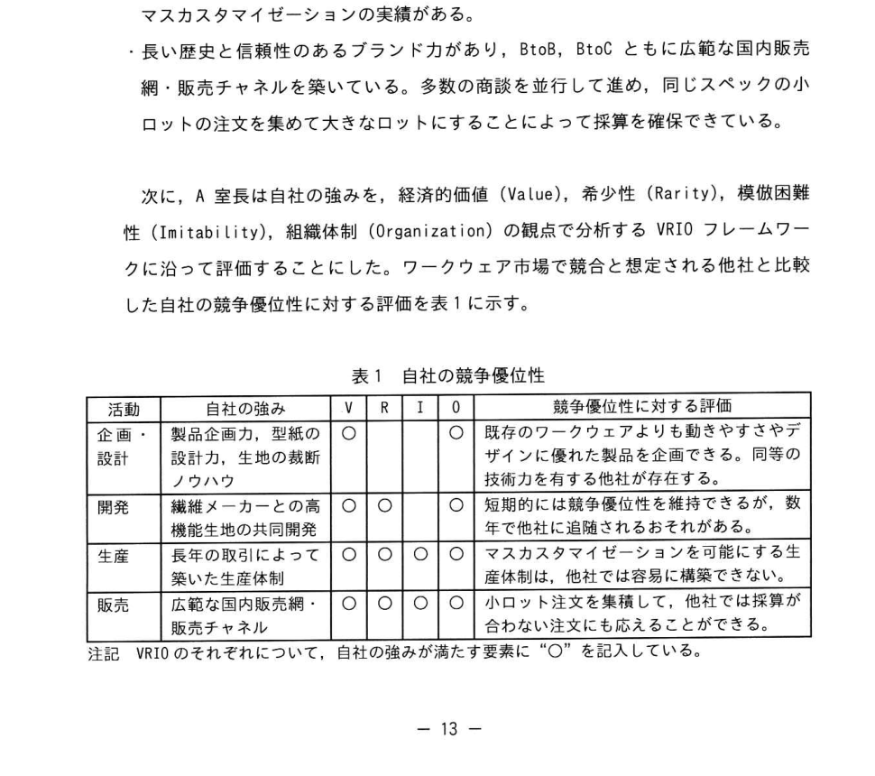

# 2025年秋期 応用情報技術者試験 午後 問2（選択）
## 経営戦略：スポーツウェアメーカーの事業領域拡大戦略

---

## 問題文

**問2** スポーツウェアメーカーの事業領域拡大戦略に関する次の記述を読んで、設問に答えよ。

K社は、主に中価格帯の製品を提供するスポーツウェアメーカーである。若年層の人口減少に伴う国内スポーツウェア市場の縮小によって、収益が頭打ちになっている。K社はこれまでも事業領域の拡大に取り組んできたが、新しい事業については社内の意思統一を図れず、結果を出せていない。今後の成長のためには、経営の方向性を明確にして、社内の意思統一を図った上で、事業領域を拡大する戦略を策定する必要がある。K社の経営陣は、経営企画室のA室長に事業領域拡大戦略を策定するよう指示した。

---

### 〔外部環境の分析〕

A室長は、まず自社の外部環境の分析を行った。その結果は次のとおりであった。

- スポーツウェア市場の縮小が進んでいて、スポーツウェアの需要は横ばい又は減少傾向にある。
- スポーツウェアは、動きやすさに加え、保温性、通気性などの機能、及び軽快さやスマートさをアピールできるデザインの良さが要求される。さらに、スポーツチームのユニフォームでは、色やロゴなどのオリジナル性が要求される。
- ワークウェアのメーカーが低価格帯のスポーツウェアを開発し、スポーツウェア市場に参入している。逆に、他のスポーツウェアメーカーがファッション性に富むワークウェアの発売を計画している。このように市場の垣根を越えた競争が生じている。
- ワークウェアはスポーツウェアと同程度の市場規模がある。法人需要が中心であり、業務の必需品として定期的に買替えが行われるので継続的な取引ができる。
- 従来、ワークウェアは消耗品扱いであり耐久性や低価格であることが重視されてきた。しかし、近年は従業員満足度を高めるために、ワークウェアにも快適さやデザインの良さを求める企業が増えており、需要が拡大している。しかし、ワークウェアメーカーは、いまだに市場の変化に対応する生産体制や販売体制を構築するまでには至っていない。

---

### 〔経営資源の分析〕

A室長は、ワークウェア市場が事業領域拡大の候補となり得るのか、自社の事業性を確認して判断するために、自社のバリューチェーン分析を行いワークウェア事業に適用できる自社の強みとなる活動を、次のように確認した。

- スポーツウェアで培った製品企画力、型紙の設計力、及び生地の裁断ノウハウによって、動きやすさやデザインにこだわった製品を企画・設計できている。
- 保温性、通気性、防水性及び速乾性に優れた繊維の研究を行い、共同開発した高機能生地を、繊維メーカーから調達して自社の製品に採用できている。
- 多様な製造委託先と提携してサプライチェーンを構築し、様々な顧客要望に対応できる生産体制を備えている。長年の取引によって築いた信頼関係を基にした生産体制で、大量生産の効率性と様々な顧客要望に対応できる柔軟性を両立させたマスカスタマイゼーションの実績がある。
- 長い歴史と信頼性のあるブランド力があり、BtoB、BtoCともに広範な国内販売網・販売チャネルを築いている。多数の商談を並行して進め、同じスペックの小ロットの注文を集めて大きなロットにすることによって採算を確保できている。

次に、A室長は自社の強みを、経済的価値（Value）、希少性（Rarity）、模倣困難性（Imitability）、組織体制（Organization）の観点で分析するVRIOフレームワークに沿って評価することにした。ワークウェア市場で競合と想定される他社と比較した自社の競争優位性に対する評価を表1に示す。

### 表1 自社の競争優位性

> 注記 VRIOのそれぞれについて、自社の強みが満たす要素には "○" を記入している。

---

A室長は、表1から自社の強みを次のように分析した。

- 「生産体制」と「国内販売網・販売チャネル」は、希少性のある模倣困難な強みである。「マスカスタマイゼーション力」によって、ワークウェアに色やロゴなどのオリジナル性を求める顧客の要望にも柔軟に対応できる。また、「小ロット注文の集積力」は、ワークウェアの生産販売にも生かすことができる。
- 「広範な国内販売網・販売チャネル」で集めた顧客の要望に、「長年の取引によって築いた生産体制」で対応できることが、他社が容易にまねできない自社のコアコンピタンスであり、競合他社に対して持続的な `[　a　]` を築ける。

---

### 〔ワークウェア市場への参入の検討〕

A室長は、<u>①ワークウェア市場の変化は自社のコアコンピタンスを生かせる新事業領域としての魅力を高めると考え</u>、ワークウェア市場に参入するための施策を次のように検討した。

- 法人からの需要に対して、スポーツウェアの軽量性、伸縮性、保温性、通気性などの機能を生かしたワークウェアを開発する。
- 生地やファスナーなどのスポーツウェアの素材をワークウェアにも使用することによって、作業中の動きやすさと快適性を提供する。
- ターゲットとなる企業の購買担当者や業界関係者の間で自然に共有されるような、信頼できる情報を提供する。
- ワークウェアとして会社や職場で着用するユニフォームに `[　b　]` を要求する顧客に対しては製品をカスタマイズする。
- 現場作業者から事務スタッフまでカバーする、実用的かつスタイリッシュなデザインをアピールする。
- 業種や業務に特有な作業特性に合致した製品を幅広く提供する。
- <u>②小規模な法人や大企業の中の特定部署といった少人数分の注文を集積し、大きなロットにする</u>。
- スポーツウェアの製造では経験したことのない機能を求められた場合には、自社のサプライチェーンを足掛かりにして、不足する技術を補う提携先を開拓する。
- スポーツウェアの素材を使用してワークウェアを生産することによって、調達において規模の経済性を発揮し、 `[　c　]` を実現する。

---

### 〔ブランド展開案〕

A室長は、自社の新事業の展開を市場に認知させるブランド戦略が重要であり、スポーツウェアメーカーとしての認知度と信頼を得ている自社の企業ブランドのイメージを再構築する必要があると考えた。<u>③自社の企業ドメインを“人々の活動のパフォーマンスを最大限に発揮させるウェアの提供”に再定義して</u>、新たな企業ブランドとワークウェアの製品ブランドを展開する次の案を検討した。

- 新たな企業ブランドにおいて自社が長期的に提供する価値を、`[　d　]` によって取引先、従業員、顧客、株主など広範なステークホルダーに向けて発信する。
- 自然にユーザーが口コミを拡散する手法であるバイラルマーケティングを通じて、製品が提供する価値に焦点を当てたメッセージを業界関係者に発信する。<u>④製品サンプルの提供などを受けて、使用した人たちに情報を広めてもらう</u>ことによって、ワークウェア市場への製品ブランドの浸透を図る。

A室長は、以上の事業領域拡大戦略を策定し、経営陣に報告した。

---

## 設問

### 設問1

本文中の `[　a　]` に入れる適切な字句を、本文中の字句を用いて、**5字**で答えよ。

### 設問2

〔ワークウェア市場への参入の検討〕について答えよ。

**(1)** 本文中の下線①について、A室長が魅力を高めると考えたのはワークウェア市場のどのような変化か。**45字以内**で答えよ。

**(2)** 本文中の `[　b　]` に入れる適切な字句を、本文中の字句を用いて、**15字以内**で答えよ。

**(3)** 本文中の下線②について、この対応を可能にするK社の経営資源を解答群の中から選び、記号で答えよ。

**解答群**

| 記号 | 字句 |
|------|------|
| ア | 研究開発力 |
| イ | 広範な国内販売網・販売チャネル |
| ウ | 製品企画力 |
| エ | マスカスタマイゼーション力 |

**(4)** 本文中の `[　c　]` に入れる適切な字句を**10字以内**で答えよ。

### 設問3

〔ブランド展開案〕について答えよ。

**(1)** 本文中の下線③について、企業ドメインを再定義することは、社内に向けてどのような意義があるか。本文中の字句を用いて、**30字以内**で答えよ。

**(2)** 本文中の `[　d　]` に入れる最も適切な字句を解答群の中から選び、記号で答えよ。

**解答群**

| 記号 | 字句 |
|------|------|
| ア | TCFD開示 |
| イ | 決算短信 |
| ウ | 統合報告書 |

**(3)** 本文中の下線④について、使用した人たちに情報を広めてもらうことは、ワークウェア市場への製品ブランドの浸透にどのような効果があるか。本文中の字句を用いて、**20字以内**で答えよ。

---

## 解答と解説

### 設問1

| 空欄 | 正解 | 理由 |
|------|------|------|
| a | **競争優位性** | 直前に「他社が容易にまねできない自社のコアコンピタンスであり、競合他社に対して持続的な〜を築ける」とある。VRIOフレームワークの文脈から、模倣困難な強みによって築くものは「競争優位性」（5字）。 |

### 設問2

**(1) 正解（解答例）：** ワークウェアに快適さやデザインの良さを求める企業が増加しており、需要が拡大している。（45字以内）

**理由：** 下線①は「ワークウェア市場の変化が自社のコアコンピタンスを生かせる新事業領域としての魅力を高める」理由を問う。本文〔外部環境の分析〕に「近年は従業員満足度を高めるために、ワークウェアにも快適さやデザインの良さを求める企業が増えており、需要が拡大している」とあり、これがK社の強み（スポーツウェアの機能・デザイン力）を生かせる市場変化に当たる。

**(2) 正解（解答例）：** 色やロゴなどのオリジナル性（15字以内）

**理由：** 空欄bは「ワークウェアとして職場で着用するユニフォームに〔b〕を要求する顧客」という文脈。本文〔外部環境の分析〕に「スポーツチームのユニフォームでは、色やロゴなどのオリジナル性が求められる」とあり、これをワークウェアの文脈に引き当てる。

**(3) 正解：イ**

**理由：** 下線②は「小規模な法人や大企業の中の特定部署といった少人数分の注文を集積し、大きなロットにする」施策。これを可能にする経営資源は「広範な国内販売網・販売チャネル（イ）」。本文〔経営資源の分析〕に「多数の商談を並行して進め、同じスペックの小ロットの注文を集めて大きなロットにすることによって採算を確保できている」と広範な販売網があるからこそ小口注文を集められると説明されている。

**(4) 正解（解答例）：** 調達コストの削減（10字以内）

**理由：** 空欄cは「スポーツウェアの素材を使用してワークウェアを生産→調達において規模の経済性を発揮し、〔c〕を実現する」という文脈。規模の経済性を発揮すると何が実現するかは「調達コストの削減」が自然な帰結。

### 設問3

**(1) 正解（解答例）：** 経営の方向性を明確にして社内の意思統一を図る。（30字以内）

**理由：** 下線③は「企業ドメインを再定義することが社内に向けてどのような意義があるか」を問う。本文冒頭に「新しい事業については社内の意思統一を図れず、結果を出せていない。（中略）経営の方向性を明確にして、社内の意思統一を図った上で事業領域を拡大する戦略を策定する必要がある」とあり、ドメイン再定義がその手段であることが読み取れる。

**(2) 正解：ウ（統合報告書）**

**理由：** 空欄dは「取引先、従業員、顧客、株主など広範なステークホルダーに向けて発信する」媒体。選択肢のうちTCFD開示（ア）は気候変動関連情報、決算短信（イ）は財務情報のみ、**統合報告書（ウ）**は財務・非財務を統合してすべてのステークホルダーに向けて自社の価値創造ストーリーを発信するもの。文脈に最も合致する。

**(3) 正解（解答例）：** 信頼できる情報として自然に共有される。（20字以内）

**理由：** 下線④の前の文に「ターゲットとなる企業の購買担当者や業界関係者の間で自然に共有されるような、信頼できる情報を提供する」とある。実際の使用者が口コミで情報を広めることで、購買担当者間に「信頼できる情報として自然に共有される」効果が生まれる。

---

## 参考：主要キーワード

| 用語 | 説明 |
|------|------|
| VRIOフレームワーク | 経営資源をValue（価値）・Rarity（希少性）・Imitability（模倣困難性）・Organization（組織体制）の4軸で評価し、持続的競争優位性を分析するフレームワーク |
| コアコンピタンス | 他社に真似されにくい、自社固有の中核的な強み・能力 |
| 競争優位性 | 競合他社に対して優れた立場にあること。VRIOで4条件を満たすと「持続的競争優位性」となる |
| マスカスタマイゼーション | 大量生産の効率性と個別カスタマイズの柔軟性を両立させる生産方式 |
| 規模の経済性 | 生産・調達量が増えるほど1単位当たりコストが下がる効果 |
| バイラルマーケティング | 口コミや情報共有を利用して自然に情報を拡散させるマーケティング手法 |
| 統合報告書 | 財務情報と非財務情報（ESG・ブランド・人的資本等）を統合し、広範なステークホルダーに向けて発信する報告書 |
| 企業ドメイン | 企業が定義する事業の存在領域・活動範囲。「何者であるか」を明示することで社内外の方向性を統一する |
