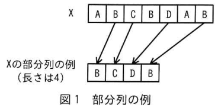
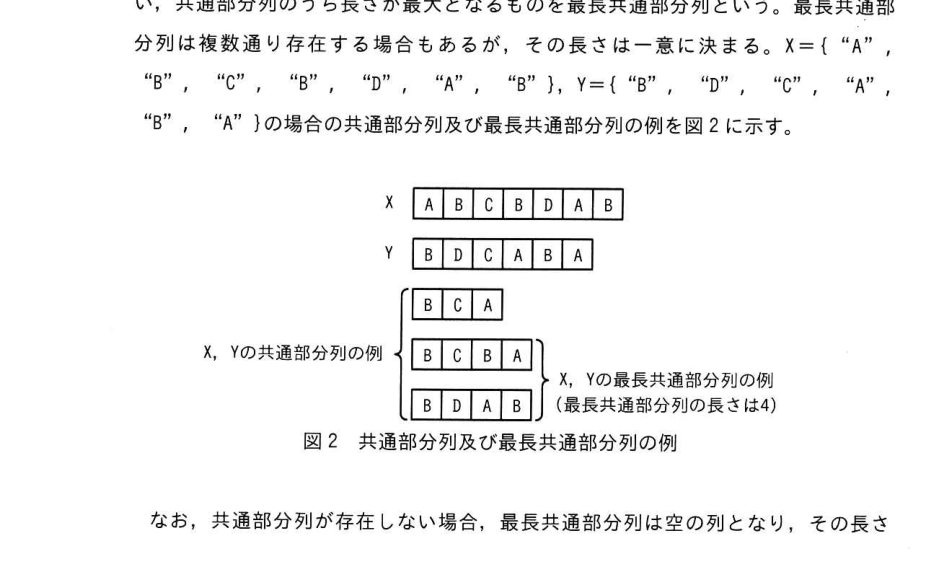
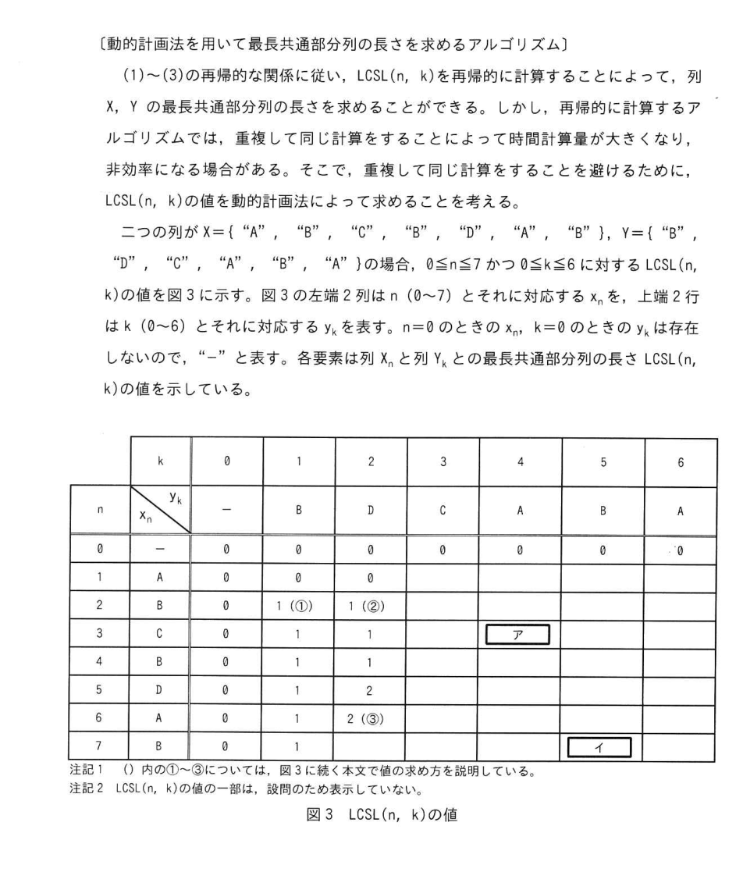
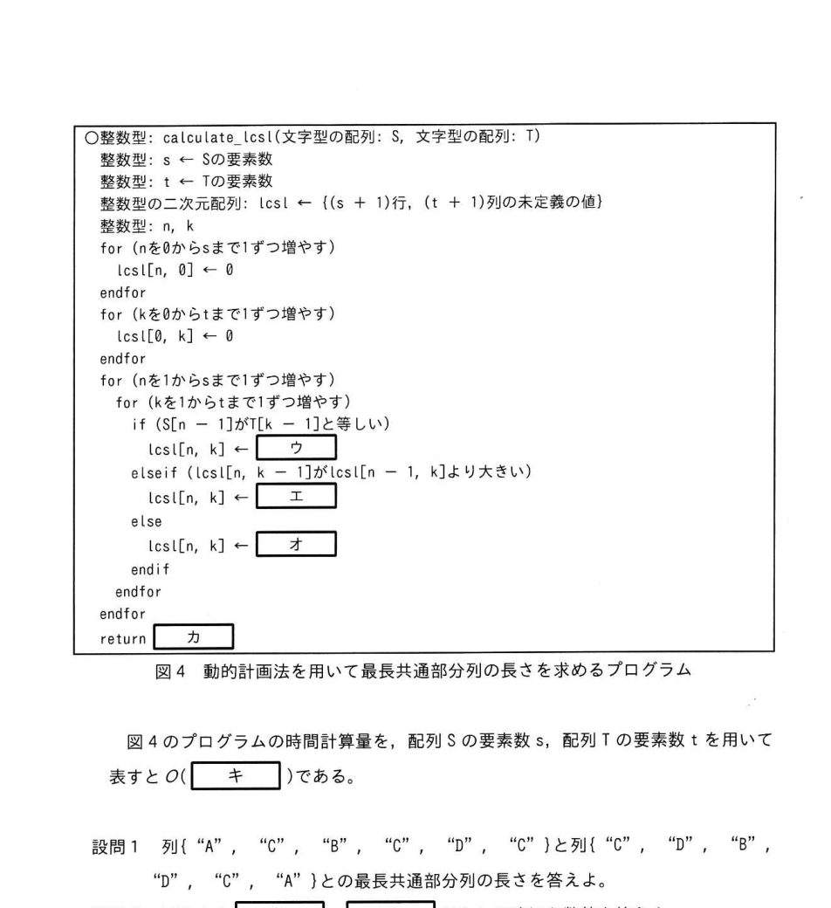

# 2025年秋期 応用情報技術者試験 午後 問3（選択）
## プログラミング：二つの列の最長共通部分列（Longest Common Subsequence）の長さを求めるアルゴリズム

---

## 問題文

**問3** 二つの列の最長共通部分列（Longest Common Subsequence）の長さを求めるアルゴリズムに関する次の記述を読んで、設問に答えよ。

列 X = (x₁, x₂, …, xₙ) に対して、順序を保持して要素を抽出した列を部分列という。また、列の長さはその列の要素の個数で定義される。ここでは、各要素が文字である列を考える。例えば、X = ("A", "B", "C", "B", "D", "A", "B") のとき、図1に示すように("B", "C", "D", "B")はXの部分列の例であり、その長さは4である。

### 図1 部分列の例



ある列Zが二つの列X、Y両方の部分列であるとき、ZをXとYとの共通部分列といい、共通部分列のうち長さが最大となるものを最長共通部分列という。最長共通部分列は複数通り存在する場合もあるが、その長さは一意に決まる。X = ("A", "B", "C", "B", "D", "A", "B")、Y = ("B", "D", "C", "A", "B", "A") の場合の共通部分列及び最長共通部分列の例を図2に示す。

### 図2 共通部分列及び最長共通部分列の例



なお、共通部分列が存在しない場合、最長共通部分列は空の列となり、その長さは0である。

最長共通部分列の長さは、2本のDNAの塩基配列間の類似度を測る目的などに用いられる。

---

### 〔最長共通部分列の長さを求めるアルゴリズム〕

二つの列 X、 Y の最長共通部分列の長さを求めるアルゴリズムを考える。 列 X、 Y それぞれについて、 先頭から n 個、 k 個の要素を抽出した列を Xn、 Yk と表記し、 それぞれの末尾の要素を xn、 yk と表記する。 例えば、 X = { "A"、 "B"、 "C"、 "B" } とすると、 X3 = { "A"、 "B"、 "C" }、 x3 = "C" である。 このとき、 列 Xn と列 Yk との最長共通部分列の中の一つを LCS(n、 k)、 最長共通部分列の長さを LCSL(n、 k) と表記する。 なお、 X0 と Y0 は空の列であり、 x0 と y0 は存在しない。

ここで、 xn と yk とが一致しているか否かに着目して次の (1) 〜 (3) に場合分けし、 再帰的な関係を用いて LCSL(n、 k) を求めることを考える。

(1) xn = yk の場合を考える。 例えば、 xn = yk = "A" とする。 このとき、 LCS(n、 k) の末尾の要素は "A" となる。 よって、 LCS(n、 k) は、 列 Xn-1、 Yk-1 の最長共通部分列 LCS(n-1、 k-1) の末尾に "A" を付加したものと一致する。 したがって、 LCSL(n、 k) = LCSL(n-1、 k-1) + 1 が成り立つ。

(2) xn != yk の場合を考える。 例えば、 xn = "A"、 yk = "B" とする。 ここで、 LCS(n、 k) の末尾の要素は "A" 又は "A" 以外となる。 LCS(n、 k) の末尾の要素が "A" である場合は、 列 Yk から末尾の "B" を取り除いても最長共通部分列には影響しないので、 LCS(n、 k) は LCS(n、 k-1) と一致する。 一方、 LCS(n、 k) の末尾の要素が "A" でない場合は、 列 Xn から末尾の "A" を取り除いても最長共通部分列には影響しないので、 LCS(n、 k) は LCS(n-1、 k) と一致する。 よって、 LCS(n、 k) は LCS(n、 k-1) 又は LCS(n-1、 k) のいずれかと一致する。 したがって、 LCSL(n、 k) は、 LCSL(n、 k-1) と LCSL(n-1、 k) のうちの最大値と一致する。

(3) n = 0 又は k = 0 の場合、 最長共通部分列は空の列となり、 LCSL(n、 k) = 0 である。

---

### 〔動的計画法を用いて最長共通部分列の長さを求めるアルゴリズム〕

(1)〜(3)の再帰的な関係に従い、LCSL(n, k)を再帰的に計算することによって、列X、Yの最長共通部分列の長さを求めることができる。しかし、再帰的に計算するアルゴリズムでは、同じ引数に対してLCSL(n, k)を複数回計算することがあり、計算量が大きくなる場合がある。そこで、重複して同じ計算をすることを避けるために、動的計画法によってLCSL(n, k)を求めることを考える。

二つの列がX = ("A", "B", "C", "B", "D", "A", "B")、Y = ("B", "D", "C", "A", "B", "A") の場合、0 <= n <= 7かつ0 <= k <= 6に対するLCSL(n, k)の値を図3に示す。図3の左端2列はn(0〜7)とそれに対応するxnを、上端2行はk(0〜6)とそれに対応するykを表す。n = 0のときのxn、k = 0のときのykは存在しないので、"-"と表す。各要素は列Xnと列Ykとの最長共通部分列の長さLCSL(n, k)の値を示している。

### 図3 LCSL(n, k)の値



| n | xn \ yk | - | 0 | 1 | 2 | 3 | 4 | 5 | 6
|---|---|---|---|---|---|---|---|---|---|
| - | - | - | - | B | D | C | A | B | A
| 0 | - | 0 | 0 | 0 | 0 | 0 | 0 | 0 | 0
| 1 | A | 0 | 0 | 0 | 0 | 0 | 0 | 0 | 0
| 2 | B | 0 | 0 | 1 ([  ①  ]) | 1 ([  ②  ]) |  |  |  | 
| 3 | C | 0 | 0 | 1 | 1 |  | [  ア  ] |  | 
| 4 | B | 0 | 0 | 1 | 1 |  |  |  | 
| 5 | D | 0 | 0 | 1 | 2 |  |  |  | 
| 6 | A | 0 | 0 | 1 | 2 ([  ③  ]) |  |  |  | 
| 7 | B | 0 | 0 | 1 |  |  |  | [  イ  ] | 

> 注記1 () 内の①〜③については、図3に続く本文で値の求め方を説明している。  
> 注記2 LCSL(n, k)の値の一部は、設問のため表示していない。

図3の各要素の値は、〔最長共通部分列の長さを求めるアルゴリズム〕の(1)〜(3)の再帰的な関係によって求められる。

まず、n=0 又はkは(3)に対応するので、LCSL(n, k) = 0 である。  
それ以外の値については、図3の①〜③から順に値が求まる。

**①について、** x₂ = y₁なので(1)に対応し、LCSL(2, 1) = LCSL(1, 0) + 1 = 1 となる。  
LCSL(1, 0) = 0なので、LCSL(2, 1) = 1 が成り立つ。

**②について、** x₂ ≠ y₂なので(2)に対応し、LCSL(2, 1) = 1、LCSL(2, 2) = 1 となる。  
LCSL(2, 2)はLCSL(2, 1)とLCSL(1, 2)のいずれかと一致し、LCSL(2, 1) = 1 なので 1 となる。

**③について、** x₆ ≠ y₂なので(2)に対応し、LCSL(6, 1) = 1、LCSL(5, 2) = 2 なので、  
LCSL(6, 2)はLCSL(5, 2) = 2 と一致する。

図3の要素の値を全て計算することによって列X、Yの最長共通部分列の長さが4であることが分かる。

---

### 〔動的計画法を用いて最長共通部分列の長さを求めるプログラム〕

〔動的計画法を用いて最長共通部分列の長さを求めるアルゴリズム〕に基づいて、二つの列の最長共通部分列の長さを求めるプログラムを考える。任意の二つの列をそれぞれ配列S、Tとして受け取り、動的計画法を用いて最長共通部分列の長さを求めるプログラムを図4に示す。ここで、配列の要素番号は0から始まり、整数型の二次元配列 lcsl は、行番号が0から配列Sの要素数sまでの(s + 1)行、列番号が0から配列Tの要素数tまでの(t + 1)列の大きさをもつ。

### 図4 動的計画法を用いて最長共通部分列の長さを求めるプログラム



図4のプログラムの時間計算量を、配列Sの要素数s、配列Tの要素数tを用いて表すとO(`[　キ　]`)である。

---

## 設問

### 設問1

列{"A", "C", "B", "C", "D", "C"}と列{"C", "D", "B", "D", "C", "A"}との最長共通部分列の長さを答えよ。

### 設問2

図3中の `[　ア　]`、`[　イ　]` に入れる適切な数値を答えよ。

### 設問3

図4中の `[　ウ　]` 〜 `[　カ　]` に入れる適切な字句を答えよ。

### 設問4

本文中の `[　キ　]` に入れる適切な字句を、sとtを用いて答えよ。

---

## 解答と解説

### 設問1

**正解：4**

X = {"A","C","B","C","D","C"}、Y = {"C","D","B","D","C","A"} に対して動的計画法でLCSLテーブルを計算すると、LCSL(6, 6) = 4 となる。最長共通部分列の例は ("C","B","C") や ("C","D","C") など（長さ4のものが複数存在する）。

### 設問2

| 空欄 | 正解 | 求め方 |
|------|------|--------|
| ア | **2** | LCSL(3, 4)：x₃="C"、y₄="A" で x₃≠y₄ なので(2)に対応。LCSL(3, 4) = max(LCSL(2, 4), LCSL(3, 3)) = max(1, 2) = **2** |
| イ | **4** | LCSL(7, 6)：x₇="B"、y₆="A" で x₇≠y₆ なので(2)に対応。LCSL(7, 6) = max(LCSL(6, 6), LCSL(7, 5)) = max(4, 4) = **4**（これが最終答えのLCS長と一致） |

### 設問3

| 空欄 | 正解 | 理由 |
|------|------|------|
| ウ | **lcsl[n − 1, k − 1] + 1** | S[n−1] = T[k−1] のとき、アルゴリズム(1)より LCSL(n, k) = LCSL(n−1, k−1) + 1 |
| エ | **lcsl[n, k − 1]** | elseif 条件 `lcsl[n, k−1] > lcsl[n−1, k]` が真のとき、大きい方である lcsl[n, k−1] を代入 |
| オ | **lcsl[n − 1, k]** | else（lcsl[n−1, k] ≥ lcsl[n, k−1]）のとき、大きい方である lcsl[n−1, k] を代入 |
| カ | **lcsl[s, t]** | 関数の戻り値。配列S（要素数s）と配列T（要素数t）の最長共通部分列の長さは lcsl[s][t] に格納される |

### 設問4

| 空欄 | 正解 | 理由 |
|------|------|------|
| キ | **st** | プログラムはn（1〜s）とk（1〜t）の二重ループで構成されており、各イテレーションの処理はO(1)。したがって全体の時間計算量は O(s × t) = **O(st)** |

---

## 参考：主要キーワード

| 用語 | 説明 |
|------|------|
| 最長共通部分列（LCS） | 2つの列の両方に共通する部分列のうち、最も長いもの。長さは一意に決まる |
| 動的計画法 | 問題を部分問題に分割し、その解を表に記録しながら再利用することで重複計算を避ける手法 |
| 再帰的関係（漸化式） | LCSL(n,k) を LCSL(n-1,k-1)、LCSL(n-1,k)、LCSL(n,k-1) で表す関係式 |
| 時間計算量 O(st) | s×t個のセルを各O(1)で計算するため、全体はO(st)となる |
| 擬似コード記法 | 本試験で使われる独自の擬似言語。`←` は代入、`elseif` は else if に相当 |

# Geminiの文字起こし

ご提示いただいた厳格なルール（正確性、半角徹底、読点の「、」統一、空欄表記、コードブロックのインデント維持、図の省略明示など）をすべて適用し、令和7年度秋期 応用情報技術者試験 午後問題の「問3」を完全に文字起こししました。

---

## 問3 文字起こし

問3 二つの列の最長共通部分列(Longest Common Subsequence) の長さを求めるアルゴリズムに関する次の記述を読んで、設問に答えよ。

列 $X = \{x_1, x_2, \dots, x_m\}$ に対して、順序を保持して要素を抽出した列を部分列という。また、列の長さはその列の要素の個数で定義される。ここでは、各要素が文字である列を考える。例えば、X = {"A"、 "B"、 "C"、 "B"、 "D"、 "A"、 "B"} のとき、図1に示すように {"B"、 "C"、 "D"、 "B"} は X の部分列の例であり、その長さは4である。

（図1 部分列の例 省略）

ある列 Z が二つの列 X、Y 両方の部分列であるとき、Z を X と Y との共通部分列といい、共通部分列のうち長さが最大となるものを最長共通部分列という。最長共通部分列は複数通り存在する場合もあるが、その長さは一意に決まる。X = {"A"、 "B"、 "C"、 "B"、 "D"、 "A"、 "B"}、Y = {"B"、 "D"、 "C"、 "A"、 "B"、 "A"} の場合の共通部分列及び最長共通部分列の例を図2に示す。

（図2 共通部分列及び最長共通部分列の例 省略）

なお、共通部分列が存在しない場合、最長共通部分列は空の列となり、その長さは0である。
最長共通部分列の長さは、2本の DNA の塩基配列間の類似度を測る目的などに用いられる。

〔最長共通部分列の長さを求めるアルゴリズム〕
二つの列 X、Y の最長共通部分列の長さを求めるアルゴリズムを考える。列 X、Y それぞれについて、先頭から n 個、k 個 of 要素を抽出した列を $X_n$、$Y_k$ と表記し、列 $X_n$、$Y_k$ それぞれの末尾の要素を $x_n$、$y_k$ と表記する。例えば、X = {"A"、 "B"、 "C"、 "B"} とすると、$X_3 = \{"A"、 "B"、 "C"\}$、$x_3 = "C"$ である。このとき、列 $X_n$ と列 $Y_k$ との最長共通部分列の中の一つを $LCS(n, k)$、最長共通部分列の長さを $LCSL(n, k)$ と表記する。なお、$X_0$ と $Y_0$ は空の列であり、$x_0$ と $y_0$ は存在しない。

ここで、$x_n$ と $y_k$ が一致しているか否かに着目して次の(1)〜(3)に場合分けし、再帰的な関係を用いて $LCSL(n, k)$ を求めることを考える。

(1) $x_n = y_k$ の場合を考える。例えば、$x_n = y_k = "A"$ とする。このとき、$LCS(n, k)$ の末尾の要素は "A" となる。よって、$LCS(n, k)$ は、列 $X_{n-1}$、 $Y_{k-1}$ の最長共通部分列 $LCS(n-1, k-1)$ の末尾に "A" を付加したものと一致する。したがって、$LCSL(n, k) = LCSL(n-1, k-1) + 1$ が成り立つ。

(2) $x_n \neq y_k$ の場合を考える。例えば、$x_n = "A"$、$y_k = "B"$ とする。ここで、$LCS(n, k)$ の末尾の要素は "A" 又は "A" 以外となる。$LCS(n, k)$ の末尾の要素が "A" である場合は、列 $Y_k$ から末尾の "B" を取り除いても最長共通部分列には影響しないので、$LCS(n, k)$ は $LCS(n, k-1)$ と一致する。一方、$LCS(n, k)$ の末尾の要素が "A" でない場合は、列 $X_n$ から末尾の "A" を取り除いても最長共通部分列には影響しないので、$LCS(n, k)$ は $LCS(n-1, k)$ と一致する。よって、$LCS(n, k)$ は $LCS(n, k-1)$ 又は $LCS(n-1, k)$ のいずれかと一致する。したがって、$LCSL(n, k)$ は、$LCSL(n, k-1)$ と $LCSL(n-1, k)$ のうちの最大値と一致する。

(3) n = 0 又は k = 0 の場合、最長共通部分列は空の列となり、$LCSL(n, k) = 0$ である。

〔動的計画法を用いて最長共通部分列の長さを求めるアルゴリズム〕
(1)〜(3)の再帰的な関係に従い $LCSL(n, k)$ を再帰的に計算することによって、列 X、Y の最長共通部分列の長さを求めることができる。しかし、再帰的に計算するアルゴリズムでは、重複して同じ計算をすることによって時間計算量が大きくなり、非効率になる場合がある。そこで、重複して同じ計算をすることを避けるために、$LCSL(n, k)$ の値を動的計画法によって求めることを考える。

二つの列が X = {"A"、 "B"、 "C"、 "B"、 "D"、 "A"、 "B"}、Y = {"B"、 "D"、 "C"、 "A"、 "B"、 "A"} の場合、0 ≦ n ≦ 7 かつ 0 ≦ k ≦ 6 に対する $LCSL(n, k)$ の値を図3に示す。図3の左端2列は n (0〜7) とそれに対応する $x_n$ を、上端2行は k (0〜6) とそれに対応する $y_k$ を表す。n = 0 のときの $x_n$、k = 0 のときの $y_k$ は存在しないので、“-”と表す。各要素は列 X と列 Y との最長共通部分列の長さ $LCSL(n, k)$ の値を示している。

| n | $x_n$ \ k | 0 | 1 | 2 | 3 | 4 | 5 | 6 |
| --- | --- | --- | --- | --- | --- | --- | --- | --- |
|  |  | $y_k$ | - | B | D | C | A | B |
| 0 | - |  | 0 | 0 | 0 | 0 | 0 | 0 |
| 1 | A |  | 0 | 0 | 0 | 0 |  |  |
| 2 | B |  | 0 | 1 ① | 1 ② |  |  |  |
| 3 | C |  | 0 | 1 | 1 |  | [  ア  ] |  |
| 4 | B |  | 0 | 1 | 1 |  |  |  |
| 5 | D |  | 0 | 1 | 2 |  |  |  |
| 6 | A |  | 0 | 1 | 2 ③ |  |  |  |
| 7 | B |  | 0 | 1 |  |  |  | [  イ  ] |

注記1 ()内の①〜③については、図3に続く本文で値の求め方を説明している。
注記2 LCSL(n, k)の値の一部は、設問のため表示していない。
図3 LCSL(n, k)の値

図3の各要素の値は、〔最長共通部分列の長さを求めるアルゴリズム〕の(1)〜(3)の再帰的な関係に従って求められる。
まず、n = 0 又は k = 0 のときは (3) に対応するので、$LCSL(n, k) = 0$ である。
それ以外の値について、例えば、図3の①〜③は次のように値が決まる。
①について、$x_2 = y_1$ なので (1)に対応し、$LCSL(2, 1) = LCSL(1, 0) + 1$ である。LCSL(1, 0) = 0 なので、LCSL(2, 1) = 1 となる。
②について、$x_2 \neq y_2$ なので(2)に対応し、$LCSL(2, 1) = 1$、LCSL(1, 2) = 0 なので、LCSL(2, 2) = 1 となる。
③について、$x_6 \neq y_2$ なので(2)に対応し、LCSL(6, 1) = 1、LCSL(5, 2) = 2 なので、$LCSL(6, 2) = 2$ となる。
図3の要素の値を全て計算することによって列 X、Y の最長共通部分列の長さが4であると分かる。

〔動的計画法を用いて最長共通部分列の長さを求めるプログラム〕
〔動的計画法を用いて最長共通部分列の長さを求めるアルゴリズム〕に基づいて、二つの列の最長共通部分列の長さを求めるプログラムを考える。任意の二つの列をそれぞれ配列 S、T として受け取り、動的計画法を用いて最長共通部分列の長さを求めるプログラムを図4に示す。ここで、配列の要素番号は0から始まり、整数型の二次元配列 lcsl は、行番号が0から配列の要素数 s までの (s + 1) 行、列番号が0から配列の要素数 t までの (t + 1) 列の大きさをもつ。

```
○整数型: calculate_lcsl(文字型の配列: S, 文字型の配列: T)
整数型: s
整数型: t
整数型の二次元配列: lcsl  /* (s + 1)行, (t + 1)列の未定義の値 */
整数型: n, k

for (nを0からsまで1ずつ増やす)
    lcsl[n, 0] ← 0
endfor
for (kを0からtまで1ずつ増やす)
    lcsl[0, k] ← 0
endfor

for (nを1からsまで1ずつ増やす)
    for (kを1からtまで1ずつ増やす)
        if (S[n - 1]がT[k - 1]と等しい)
            lcsl[n, k] ← [  ウ  ]
        elseif (lcsl[n, k - 1]がlcsl[n - 1, k]より大きい)
            lcsl[n, k] ← [  エ  ]
        else
            lcsl[n, k] ← [  オ  ]
        endif
    endfor
endfor

return [  カ  ]

```

図4 動的計画法を用いて最長共通部分列の長さを求めるプログラム

図4のプログラムの時間計算量を、配列の要素数 s、配列の要素数 t を用いて表すと ( [  キ  ] ) である。

設問1 列 {"A"、 "C"、 "B"、 "C"、 "D"、 "C"} と列 {"C"、 "D"、 "B"、 "D"、 "C"、 "A"} との最長共通部分列の長さを答えよ。
設問2 図3中の [  ア  ]、[  イ  ] に入れる適切な数値を答えよ。
設問3 図4中の [  ウ  ] 〜 [  カ  ] に入れる適切な字句を答えよ。
設問4 本文中の [  キ  ] に入れる適切な字句を、s と t を用いて答えよ。
