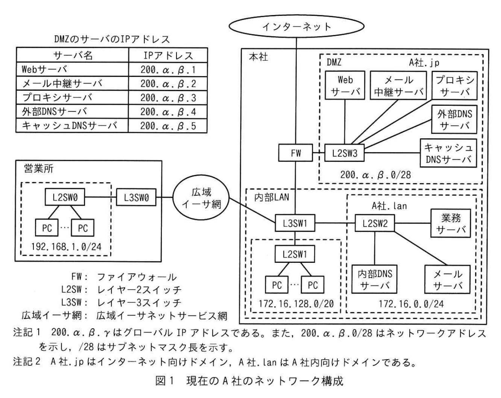
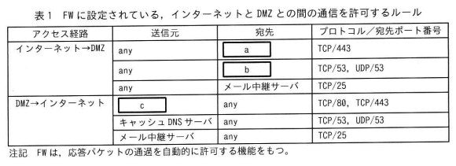
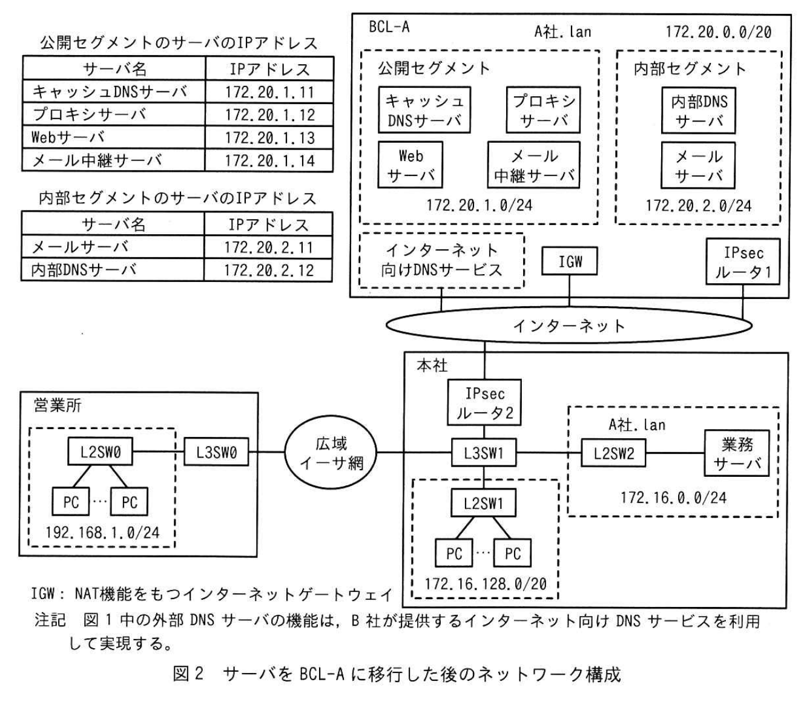

# 2025年秋期 応用情報技術者試験 午後 問5（選択）
## ネットワーク：クラウドサービスへの移行

---

## 問題文

**問5** クラウドサービスへの移行に関する次の記述を読んで、設問に答えよ。

A社は、本社と一つの営業所をもつオフィス機器の販売会社である。本社で、Webサーバ、電子メール（以下、メールという）サーバ、業務サーバなどを運用している。

このたび、A社では、サーバの運用管理及びセキュリティ対策の負荷軽減を図るために、社内で運用するサーバを、B社のクラウドサービスでA社が占有して利用できる環境（以下、BCL-Aという）に移行することを決定した。情報システム部のC主任が、サーバ移行に伴うネットワーク構成の設計を担当することになった。

---

### 〔現在のネットワーク構成と運用形態〕

現在のA社のネットワーク構成を図1に示す。

### 図1 現在のA社のネットワーク構成



> **DMZのサーバのIPアドレス**
>
> | サーバ名 | IPアドレス |
> |----------|-----------|
> | Webサーバ | 200.α.β.1 |
> | メール中継サーバ | 200.α.β.2 |
> | プロキシサーバ | 200.α.β.3 |
> | 外部DNSサーバ | 200.α.β.4 |
> | キャッシュDNSサーバ | 200.α.β.5 |
>
> 注記1 200.α.β.γ はグローバルIPアドレスである。また、200.α.β.0/28 はネットワークアドレスを示し、/28 はサブネットマスク長を示す。  
> 注記2 A社.jpはインターネット向けドメイン、A社.lanはA社内向けドメインである。

現在のA社のネットワークの構成及び運用形態を次に示す。

- 本社及び営業所のPC（以下、社内PCという）には、L3SW1上で稼働するDHCPサーバから配付されるIPアドレス、そのリース期間及びサブネットマスク、<u>①デフォルトゲートウェイのIPアドレス</u>並びにDNSサーバのIPアドレスを設定している。
- メールサーバは、本社及び営業所の従業員によるメール送受信に利用される。
- メール中継サーバは、メールサーバから送信された社外宛てのメールを社外のメールサーバに中継し、社外のメールサーバからA社宛てに送信されたメールをメールサーバに中継する。
- <u>②メール中継サーバでは、スパムメールの踏み台になることを避けるために、オープンリレー防止策を実施している</u>。
- 業務サーバは、社内PCとだけ通信する。
- 社内PCは、内部DNSサーバで名前解決を行う。
- 内部DNSサーバは、A社.lanのゾーン情報を管理し、管理外のドメインのホストの名前解決要求を受信したときは、名前解決要求をキャッシュDNSサーバに転送する。
- 外部DNSサーバは、A社.jpのゾーン情報を管理する。
- 業務サーバ及びDMZのWebサーバは、HTTP Over TLSによるアクセスだけを受け付ける。
- 社内PCは、インターネット上のWebサイト及びDMZのWebサーバに、DMZのプロキシサーバ経由でアクセスする。

FWに設定されている、インターネットとDMZの間の通信を許可するルールを表1に示す。

### 表1 FWに設定されている、インターネットとDMZの間の通信を許可するルール



> | アクセス経路 | 送信元 | 宛先 | プロトコル/宛先ポート番号 |
> |---|---|---|---|
> | インターネット→DMZ | any | `[　a　]` | TCP/443 |
> | インターネット→DMZ | any | `[　b　]` | TCP/53, UDP/53 |
> | DMZ→インターネット | `[　c　]` | any | TCP/80, TCP/443 |
> | DMZ→インターネット | キャッシュDNSサーバ | any | TCP/53, UDP/53 |
> | DMZ→インターネット | メール中継サーバ | any | TCP/25 |
>
> 注記 FWは、応答パケットの通過を自動的に許可する機能をもつ。

---

### 〔BCL-Aに移行後の構成の設計〕

C主任は、サーバをBCL-Aに移行した後の構成を、次の3点を前提として設計した。

- 社内PCを使用した業務の運用方法及びPCの操作法は変更しない。
- 移行作業時の障害によって業務が全面停止するのを避けるために、今回の移行では業務サーバを本社に残す。
- BCL-Aに移行後のサーバのインターネット向けのIPアドレスには、移行前のDMZの各サーバと同じグローバルIPアドレスを設定する。

サーバをBCL-Aに移行した後のネットワーク構成を図2に示す。

### 図2 サーバをBCL-Aに移行した後のネットワーク構成



> **公開セグメントのサーバのIPアドレス**
>
> | サーバ名 | IPアドレス |
> |----------|-----------|
> | キャッシュDNSサーバ | 172.20.1.11 |
> | プロキシサーバ | 172.20.1.12 |
> | Webサーバ | 172.20.1.13 |
> | メール中継サーバ | 172.20.1.14 |
>
> **内部セグメントのIPアドレス**
>
> | サーバ名 | IPアドレス |
> |----------|-----------|
> | メールサーバ | 172.20.2.11 |
> | 内部DNSサーバ | 172.20.2.12 |

サーバをBCL-Aに移行した後の各種設定、動作及び構成を次に示す。

- BCL-Aには、公開セグメントと内部セグメントを設定する。
- 公開セグメント及び内部セグメントには、それぞれ経路表を設定する。経路表には、サーバ同士の間及びサーバとインターネットとの間で移行前と同様な通信を行うことができる経路情報を登録する。
- BCL-Aのドメイン名は、A社内向けドメインのA社.lanとし、ネットワークアドレスは172.20.0.0/20を設定する。この172.20.0.0/20をサブネットに分割して、公開セグメントに172.20.1.0/24を、内部セグメントに172.20.2.0/24を設定する。
- A社.lanのゾーン情報は内部DNSサーバで管理する。
- 公開セグメントのサーバは、IGW経由でインターネットと通信する。IGWは、NATによって、公開セグメントの各サーバに設定された172.20.1.11〜172.20.1.14をインターネットに公開する各サーバの対応するIPアドレスである200.α.β.1〜200.α.β.3、200.α.β.5に変換する。
- 公開セグメントのインターネット向けドメイン名は、図1中のDMZと同様のA社.jpとし、A社.jpの各サーバには、図1と同じIPアドレスを設定する。
- A社.jpのゾーン情報はインターネット向けDNSサービスで管理する。
- <u>③インターネットから公開セグメントのサーバ宛てに送信されたパケットは、IGWが公開セグメントのサーバに中継する</u>。
- 本社は、IPsecルータ2及びIPsecルータ1を経由してBCL-Aと接続する。
- <u>④IPsecルータ2は、BCL-A宛てのパケットを、IPsecルータ1に転送する</u>。
- <u>⑤L3SW0とL3SW1の経路表及びDHCPサーバの配付情報を変更する</u>。

C主任は、設計内容を上司のD課長に説明し、移行方法が承認された。

---

## 設問

### 設問1

〔現在のネットワーク構成と運用形態〕について答えよ。

**(1)** 本文中の下線①について、営業所のPCに設定するデフォルトゲートウェイのIPアドレスをもつ機器を、図1の名称で答えよ。

**(2)** 本文中の下線②について、メール中継サーバが処理を止めるべき処理を、**40字以内**で答えよ。

**(3)** 表1中の `[　a　]` ～ `[　c　]` に入れる適切な機器名を、図1の名称で答えよ。

### 設問2

〔BCL-Aに移行後の構成の設計〕について答えよ。

**(1)** 本文中の下線③について、A社宛てのSMTPパケットがIGWを通過するとき、IGW通過前と通過後の宛先IPアドレスを、それぞれ答えよ。

**(2)** 本文中の下線④について、IPsecルータ1がBCL-Aのサーバに転送するパケットの送信元のネットワークアドレスを、図2中の表記で**全て**答えよ。

**(3)** 本文中の下線⑤について、L3SW0及びL3SW1の経路表中の社内PCを送信元とする経路の変更は、どのサーバがBCL-Aに移行することによって発生するか。図2中の名称で**全て**答えよ。

---

## 解答と解説

### 設問1

**(1) 正解：L3SW0**

**理由：** 営業所のPCはDHCPからデフォルトゲートウェイIPを取得する。図1より、営業所のPCが属するサブネット（192.168.1.0/24）のゲートウェイ機器はL3SW0（レイヤ3スイッチ）。本社のL3SW1は本社側のゲートウェイであり、営業所PCの直接のゲートウェイはL3SW0。

**(2) 正解（解答例）：社外のメールサーバから送信された社外宛てのメールを中継する処理（35字）**

**理由：** オープンリレーとは、第三者（社外）が差し出したメールを、無条件に他のメールサーバへ中継してしまう設定のこと。スパムメールの踏み台になるため、A社メール中継サーバは「社外→社外（A社と無関係）」のメール中継を拒否すべき。A社宛て（社外→A社）や社外宛て（A社→社外）のメールは正規の中継処理なので継続する。

**(3) 正解：a=Webサーバ、b=外部DNSサーバ、c=プロキシサーバ**

| 空欄 | 正解 | 理由 |
|------|------|------|
| a | **Webサーバ** | インターネット→DMZ の TCP/443（HTTPS）を受け付けるサーバ。Webサーバが HTTPS でサービスを提供する。 |
| b | **外部DNSサーバ** | インターネット→DMZ の TCP/53, UDP/53（DNS）を受け付けるサーバ。外部DNSサーバはA社.jpの権威DNSとして外部からの名前解決クエリを受ける。 |
| c | **プロキシサーバ** | DMZ→インターネット の TCP/80, TCP/443 の送信元。社内PCの代わりにインターネットへ HTTP/HTTPS アクセスを行うプロキシサーバ。 |

---

### 設問2

**(1) 正解：通過前 200.α.β.2、通過後 172.20.1.14**

**理由：** A社宛てのSMTPパケット（TCP/25）はメール中継サーバへ向かう。  
- **通過前（インターネット側の宛先）：** 移行前のメール中継サーバのグローバルIPアドレス = **200.α.β.2**（前提：移行後も同じグローバルIPを使用）  
- **通過後（BCL-A内の宛先）：** IGW がNATによりプライベートIPに変換 = **172.20.1.14**（図2の公開セグメントのメール中継サーバのIPアドレス）

```
インターネット → [宛先:200.α.β.2] → IGW → [宛先:172.20.1.14] → メール中継サーバ
                    ↑通過前                        ↑通過後
```

**(2) 正解：192.168.1.0/24、172.16.128.0/20**

**理由：** BCL-A宛てのパケットを送信する社内PCが属するネットワーク:
- **192.168.1.0/24**：営業所のPCが属するネットワーク（図2に記載）
- **172.16.128.0/20**：本社の社内PCが属するネットワーク（図2に記載）

IPsecルータ2はこれら2つのネットワークからのBCL-A向けパケットをIPsecルータ1に転送し、IPsecルータ1がBCL-A内サーバに届ける。

**(3) 正解：プロキシサーバ、メールサーバ、内部DNSサーバ**

**理由：** 社内PCを送信元とする通信先サーバがBCL-Aへ移行すると経路が変わる：

| サーバ | 社内PCとの通信 | 移行による経路変化 |
|--------|--------------|------------------|
| **プロキシサーバ** | 社内PCはWebアクセス時にプロキシへ接続 | 旧：社内LAN→FW→DMZ（プロキシ）→変更後：社内LAN→IPsec→BCL-A（プロキシ） |
| **メールサーバ** | 社内PCはメール送受信にメールサーバへ接続 | 旧：社内LAN→メールサーバ（本社）→変更後：社内LAN→IPsec→BCL-A（メールサーバ） |
| **内部DNSサーバ** | 社内PCはDNS解決のため内部DNSサーバへ接続 | 旧：社内LAN→内部DNSサーバ（本社）→変更後：社内LAN→IPsec→BCL-A（内部DNSサーバ） |

なお、Webサーバへは社内PCはプロキシ経由でアクセスするため直接の経路変更は不要。キャッシュDNSサーバは社内PCではなく内部DNSサーバが参照する。メール中継サーバへの直接接続は社内PCからは行わない。

---

## 参考：主要キーワード

| 用語 | 説明 |
|------|------|
| クラウドサービス（IaaS） | インフラ（サーバ・ネットワーク・ストレージ）をクラウド上で提供するサービス。自社運用よりも運用負荷を低減できる |
| DMZ（非武装地帯） | 外部ネットワーク（インターネット）と内部ネットワーク（社内LAN）の中間に設置されるネットワーク領域。Webサーバ・メールサーバなどを配置 |
| FW（ファイアウォール） | 設定したルールに基づいてパケットの通過・遮断を制御するネットワーク機器 |
| NAT（Network Address Translation） | プライベートIPアドレスとグローバルIPアドレスを相互変換する技術。IGWがNATを担う |
| IPsec | IP層でのVPN暗号化プロトコル。インターネット経由で安全な通信トンネルを確立する |
| オープンリレー | メールサーバが第三者のメールを無条件に中継してしまう設定。スパム送信の踏み台にされる脆弱性 |
| プロキシサーバ | 社内PCの代わりにインターネットへのHTTP/HTTPSリクエストを行う中継サーバ。セキュリティ強化・帯域制御が目的 |
| キャッシュDNS | 再帰的な名前解決を行い、結果をキャッシュするDNSサーバ。内部DNSサーバからの外部ドメイン解決要求を処理 |
| 権威DNSサーバ | 自ゾーン（例：A社.jp）の正式な回答を保持するDNSサーバ。外部DNSサーバがこれに相当 |
| IGW（インターネットゲートウェイ） | クラウド環境からインターネットへの出口となるゲートウェイ機器。NATやルーティングを担う |
