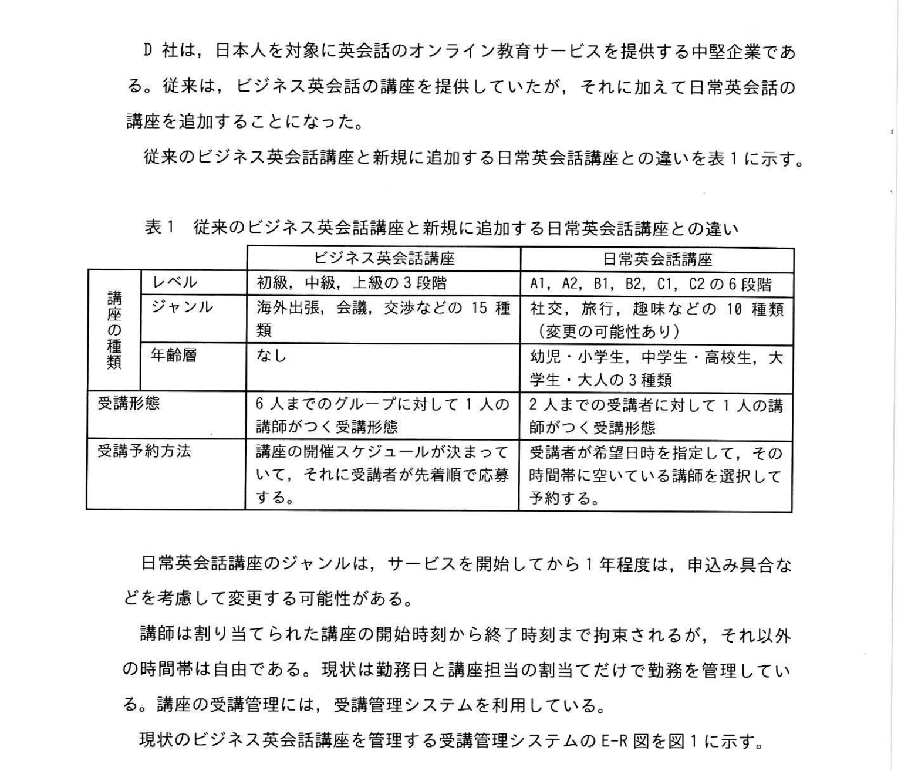
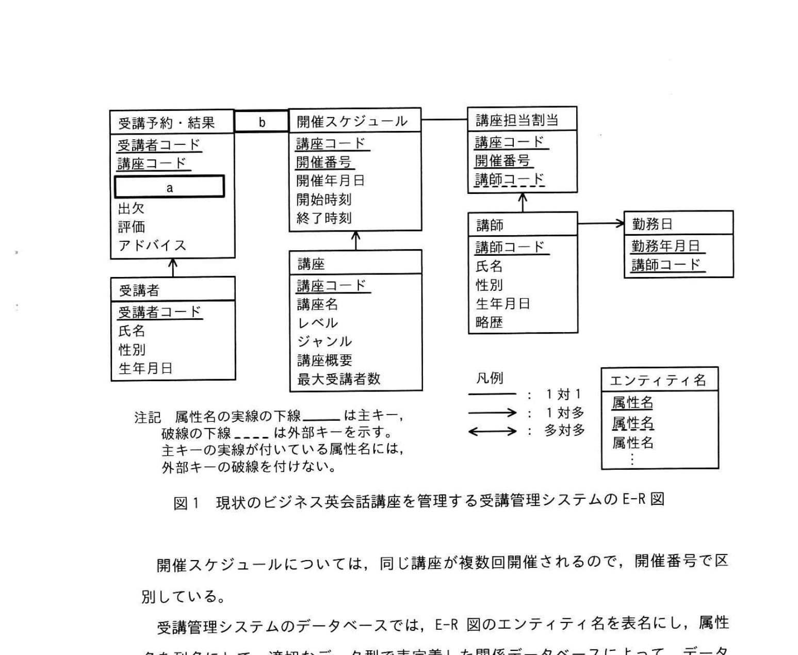
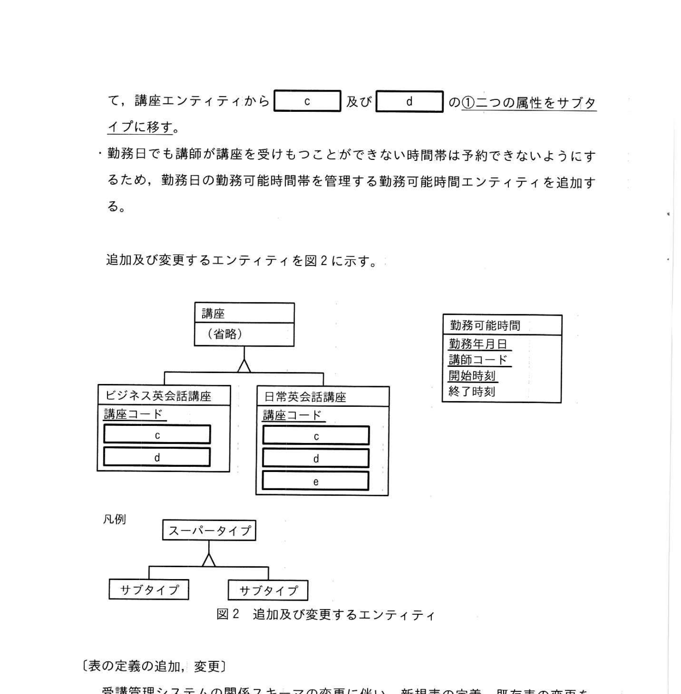
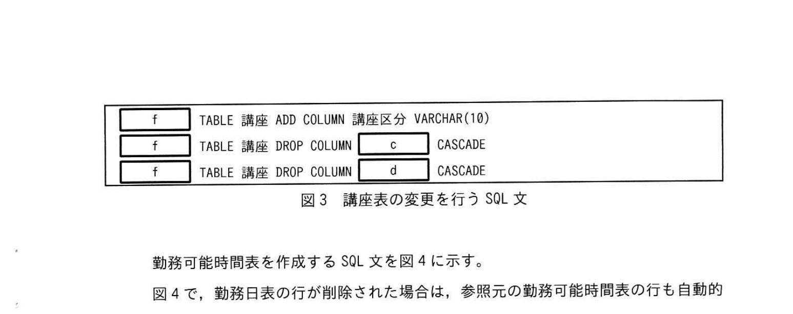
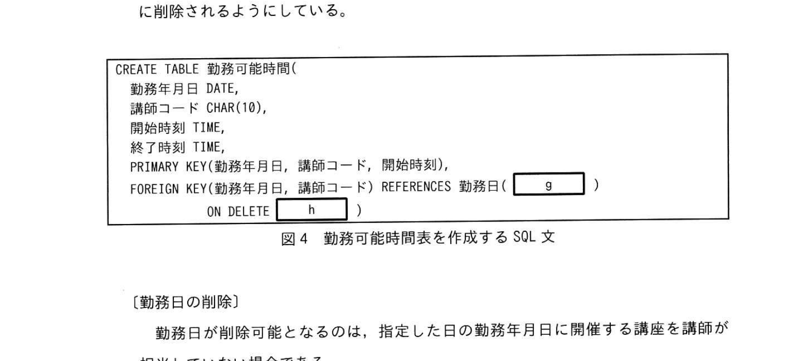
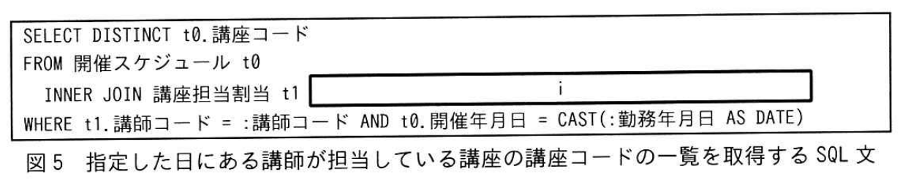

# 2025年秋期 応用情報技術者試験 午後 問6（選択）
## データベース：受講管理システムの改修（E-R図・SQL）

---

## 問題文

**問6** 受講管理システムの改修に関する次の記述を読んで、設問に答えよ。

D社は、日本人を対象に英会話のオンライン教育サービスを提供する中堅企業である。従来は、ビジネス英会話講座を提供していたが、さらに日常英会話講座を追加することになった。

従来のビジネス英会話講座と新規に追加する日常英会話講座の違いを表1に示す。

### 表1 従来のビジネス英会話講座と新規に追加する日常英会話講座との違い



> | | ビジネス英会話講座 | 日常英会話講座 |
> |---|---|---|
> | **レベル** | 初級・中級・上級の3段階 | A1、A2、B1、B2、C1、C2の6段階 |
> | **ジャンル** | 海外出張、交渉などの15種類（変更なし） | 社交、旅行などの14種類（変更の可能性あり） |
> | **年齢層** | なし | あり（社会人・高校生、大学生、大人の3種類） |
> | **受講形態** | 6人までのグループに対して1人の講師がつく受講形態 | 2人までの受講者に対して1人の講師がつく（マンツーマン形式） |
> | **受講予約方法** | 講座の開催スケジュールが決まってから受講する | 受講者が希望時刻を指定して、その時刻に空きのある講師を選択して予約する |

日常英会話講座のジャンルは、サービスを開始してから1年程度は、申込み具合などを考慮して変更する可能性がある。

講師は割り当てられた講座の開始時刻から終了時刻まで拘束されるが、それ以外の時間帯は自由である。現状は勤務日と講座担当の割当てだけで勤務を管理している。講座の受講管理には、受講管理システムを利用している。

現状のビジネス英会話講座を管理する受講管理システムのE-R図を図1に示す。

### 図1 現状のビジネス英会話講座を管理する受講管理システムのE-R図



> **ER図の主なエンティティと属性**
>
> | エンティティ | 主要属性 |
> |---|---|
> | 受講予約・結果 | 受講コード、講座コード、`[　a　]`、評価、講評、アドバイス |
> | 開催スケジュール | 講座コード、開催番号、開催年月日、開始時刻、終了時刻 |
> | 講座担当割当 | 講師コード、講座コード、開催番号 |
> | 講座 | 講座コード、講座名、レベル、ジャンル、講座概要、最多受講者数 |
> | 受講者 | 受講コード、氏名、性別、生年月日 |
> | 講師 | 講師コード、氏名、性別、生年月日 |
> | 勤務日 | 勤務年月日、講師コード |
>
> ※ 受講予約・結果と開催スケジュールの間のリレーション `[　b　]` が空欄

開催スケジュールについては、同じ講座が複数回開催されるので、開催番号で区別している。

受講管理システムのデータベースでは、E-R図のエンティティ名を表名に、属性名を列名として、適切なデータ型で表定義した関係データベースによって、データを管理する。

---

### 〔受講管理システムの関係スキーマの変更〕

講座の種類には、表1に示す内容に沿った値以外のものを格納できないように定義域制約を適用する。

日常英会話講座の追加に当たり、日常英会話講座のジャンルの変更の容易性と講師の勤務管理の厳密化を考慮して、受講管理システムの関係スキーマの変更内容を次のように検討した。

- 講座エンティティをスーパータイプにして、ビジネス英会話講座エンティティ、日常英会話講座エンティティをサブタイプとして追加する。講座エンティティにビジネス英会話講座か日常英会話講座かを区別する講座区分属性を追加する。
- 講座エンティティから `[　c　]` 及び `[　d　]` の<u>①二つの属性をサブタイプに移す</u>。
- 勤務日でも講師が講座を受けもつことができない時間帯は予約できないようにするため、勤務日の勤務可能時間帯を管理する勤務可能時間エンティティを追加する。

追加及び変更するエンティティを図2に示す。

### 図2 追加及び変更するエンティティ



> ```
> 講座（省略）
>   ├── ビジネス英会話講座（講座コード, [c], [d]）
>   └── 日常英会話講座（講座コード, [c], [d], [e]）
>
> 勤務可能時間（勤務年月日, 講師コード, 開始時刻, 終了時刻）
> ```
>
> ※ スーパータイプ→サブタイプの関係（三角形の継承記号）

---

### 〔表の定義の追加、変更〕

受講管理システムの関係スキーマの変更に伴い、新規表の定義、既存表の変更を行う。今回の変更では、スーパータイプ、サブタイプのエンティティごとに別の表にしている。講座表の変更に当たり、削除する列の情報は削除前に保存して、追加したサブタイプに反映する。

講座表の変更を行うSQL文を図3に示す。

### 図3 講座表の変更を行うSQL文



> ```sql
> [f]  TABLE 講座 ADD COLUMN 講座区分 VARCHAR(10);
> [f]  TABLE 講座 DROP COLUMN [c]  CASCADE;
> [f]  TABLE 講座 DROP COLUMN [d]  CASCADE;
> ```

勤務可能時間表を作成するSQL文を図4に示す。

図4で、勤務日表の行が削除された場合は、参照元の勤務可能時間表の行も自動的に削除されるようにしている。

### 図4 勤務可能時間表を作成するSQL文



> ```sql
> CREATE TABLE 勤務可能時間(
>     勤務年月日 DATE,
>     講師コード CHAR(10),
>     開始時刻 TIME,
>     終了時刻 TIME,
>     PRIMARY KEY(勤務年月日, 講師コード, 開始時刻),
>     FOREIGN KEY(勤務年月日, 講師コード) REFERENCES 勤務日( [g] )
>         ON DELETE [h]
> );
> ```

---

### 〔勤務日の削除〕

勤務日が削除可能となるのは、指定した日の勤務年月日に開催する講座を講師が担当していない場合である。

指定した日にある講師が担当している講座の講座コードの一覧を取得するSQL文を図5に示す。ここで、":講師コード" と ":勤務年月日" は、それぞれ対象となる講師の講師コードと指定した日の年月日を格納する埋込み変数である。なお、CAST指定は、データ型を変換する際に使用される。

### 図5 指定した日にある講師が担当している講座の講座コードの一覧を取得するSQL文



> ```sql
> SELECT DISTINCT t0.講座コード
> FROM 開催スケジュール t0
> INNER JOIN 講座担当割当 t1
>     [i]
> WHERE t1.講師コード = :講師コード
>   AND t0.開催年月日 = CAST(:勤務年月日 AS DATE);
> ```

---

## 設問

### 設問1

図1中の `[　a　]`、`[　b　]` に入れる適切な属性名及びエンティティ間の関連を答え、E-R図を完成させよ。なお、属性名の表記及びエンティティ間の関連は図1の凡例に従うこと。

### 設問2

〔受講管理システムの関係スキーマの変更〕について答えよ。

**(1)** 本文及び図2中の `[　c　]`、`[　d　]` に入れる適切な属性名を答えよ。

**(2)** 本文中の下線①について、二つの属性をサブタイプに移した理由を **20字以内** で答えよ。

**(3)** 図2中の `[　e　]` に入れる適切な属性名を答えよ。

### 設問3

図3中の `[　f　]` に入れる適切な字句を答えよ。

### 設問4

図4中の `[　g　]`、`[　h　]` に入れる適切な字句を答えよ。

### 設問5

図5中の `[　i　]` に入れる適切な字句を答えよ。

---

## 解答と解説

### 設問1

| 空欄 | 正解 | 理由 |
|------|------|------|
| a | **開催番号** | 受講予約・結果は特定の「開催スケジュール（講座コード＋開催番号）」に紐づく。開催スケジュールを一意に識別するためのキー属性として「開催番号」が受講予約・結果エンティティに必要。 |
| b | **←（矢印）** | 1つの開催スケジュールに対して複数の受講予約・結果が対応する（1:多関係）。IPA E-R図の凡例に従い、多側（受講予約・結果）から1側（開催スケジュール）へ向かう矢印を記入する。 |

**ER図の主要リレーション：**
- 開催スケジュール `1` ←── `多` 受講予約・結果（1つの開催に複数の受講予約）
- 開催スケジュール `1` ←── `多` 講座担当割当（1つの開催に複数の担当講師）
- 講座 `1` ←── `多` 開催スケジュール（1講座に複数の開催）

---

### 設問2

**(1) 正解：c=レベル、d=ジャンル（順不同）**

**理由：**
- **レベル**：ビジネス英会話は3段階、日常英会話は6段階と定義数が異なる
- **ジャンル**：ビジネス英会話は15種類（固定）、日常英会話は14種類（変更可能性あり）と異なる

これら2属性は講座区分によって定義域（取り得る値の集合）が異なるため、共通のスーパータイプに置くと定義域制約を適用できない。

**(2) 正解（解答例）：定義数が講座区分によって異なるから（18字）**

**理由：** レベルとジャンルの定義域（選択肢の数・内容）がビジネス英会話と日常英会話で異なる。スーパータイプに残すと区分ごとに異なる制約を設けられないため、各サブタイプで独立して定義域制約を管理できるようサブタイプに移した。

**(3) 正解：e=年齢層**

**理由：** 表1より、「年齢層」は日常英会話講座のみに存在する属性（ビジネス英会話にはなし）。図2の日常英会話講座サブタイプのみに追加される固有属性。

---

### 設問3

**正解：f=ALTER**

**理由：** 既存の「講座表」を変更（列の追加・削除）するSQL文は `ALTER TABLE` 文。
```sql
ALTER TABLE 講座 ADD COLUMN 講座区分 VARCHAR(10);
ALTER TABLE 講座 DROP COLUMN レベル CASCADE;
ALTER TABLE 講座 DROP COLUMN ジャンル CASCADE;
```
`CASCADE` は、この列を参照している他のビュー・制約なども連鎖的に削除することを意味する。

---

### 設問4

| 空欄 | 正解 | 理由 |
|------|------|------|
| g | **勤務年月日, 講師コード** | `FOREIGN KEY(勤務年月日, 講師コード) REFERENCES 勤務日(g)` の g は参照先テーブル「勤務日」の列名。勤務日表の主キーは（勤務年月日, 講師コード）なので、その列名を指定する。 |
| h | **CASCADE** | `ON DELETE CASCADE` = 参照先（勤務日表）の行が削除されたとき、参照元（勤務可能時間表）の対応する行も自動的に削除する。問題文に「自動的に削除されるようにしている」とある。 |

**完成SQL：**
```sql
CREATE TABLE 勤務可能時間(
    勤務年月日 DATE,
    講師コード CHAR(10),
    開始時刻 TIME,
    終了時刻 TIME,
    PRIMARY KEY(勤務年月日, 講師コード, 開始時刻),
    FOREIGN KEY(勤務年月日, 講師コード) REFERENCES 勤務日(勤務年月日, 講師コード)
        ON DELETE CASCADE
);
```

---

### 設問5

**正解：i=`ON t0.講座コード = t1.講座コード AND t0.開催番号 = t1.開催番号`**

**理由：** `INNER JOIN 講座担当割当 t1` の結合条件（ON句）を補完する。  
- `開催スケジュール`（t0）と`講座担当割当`（t1）を結合するには、両テーブルで共通のキーである（講座コード、開催番号）で結合する
- これにより「指定した講師が担当している開催スケジュール」が特定できる

**完成SQL：**
```sql
SELECT DISTINCT t0.講座コード
FROM 開催スケジュール t0
INNER JOIN 講座担当割当 t1
    ON t0.講座コード = t1.講座コード AND t0.開催番号 = t1.開催番号
WHERE t1.講師コード = :講師コード
  AND t0.開催年月日 = CAST(:勤務年月日 AS DATE);
```

**処理の意味：** 指定した講師コードの講師が、指定した勤務年月日に担当している講座コード一覧を重複なく取得する。この一覧が空なら勤務日を削除可能、空でなければ削除できない。

---

## 参考：主要キーワード

| 用語 | 説明 |
|------|------|
| E-R図（ERD） | エンティティ（実体）とリレーション（関係）でデータ構造を表す設計図 |
| スーパータイプ／サブタイプ | 汎化・特化の関係。スーパータイプは共通属性を持ち、サブタイプは固有属性を追加 |
| 定義域制約 | ある属性が取り得る値の範囲を制限する制約（CHECK制約など） |
| ALTER TABLE | 既存テーブルの構造を変更するSQL文（列の追加・削除、制約の変更など） |
| FOREIGN KEY ... ON DELETE CASCADE | 参照先行削除時に参照元行も自動削除する外部キー制約 |
| PRIMARY KEY | 行を一意に識別する列または列の組み合わせ。NULL不可・重複不可 |
| INNER JOIN | 2つのテーブルを結合し、結合条件を満たす行のみを返す操作 |
| DISTINCT | SELECT結果の重複行を除去するキーワード |
| CAST | データ型を変換するSQL関数（例：VARCHAR → DATE） |
| 埋込み変数 | SQLをプログラムに組み込む際に使用する変数（`:変数名` 形式） |
