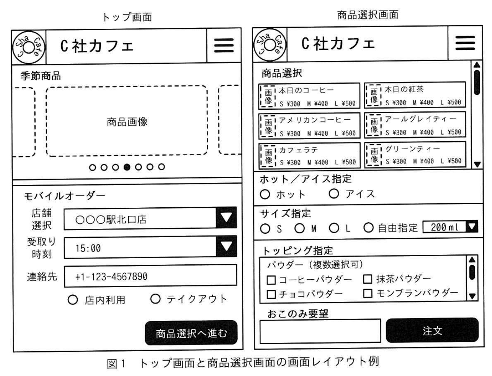
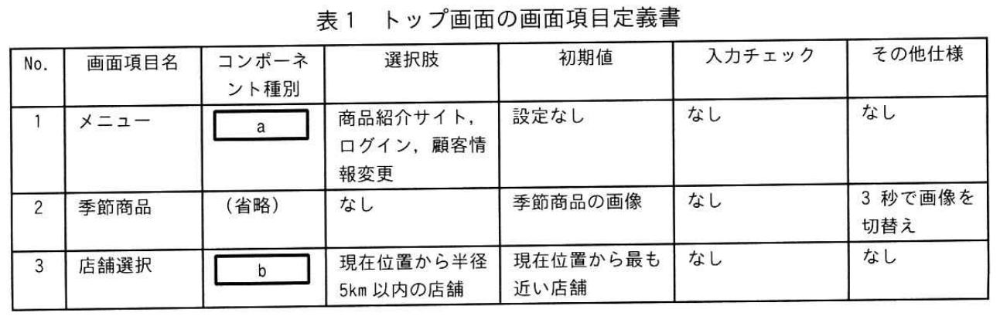
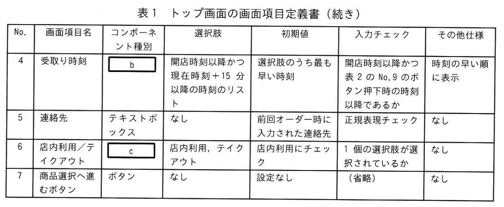
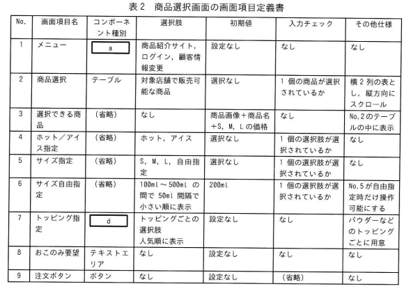

# 2025年秋期 応用情報技術者試験 午後 問8（選択）
## 情報システム開発：モバイルオーダーシステムの画面設計

---

## 問題文

**問8** モバイルオーダーシステムの画面設計に関する次の記述を読んで、設問に答えよ。

C社は、カフェを運営する会社であり、オフィス街の駅前を中心に約50店舗を運営している。C社の商品は、顧客の好みに応じたトッピングやサイズを細かくオーダーできることが人気を呼び、売上げを伸ばしている。しかし、朝や昼のピーク時間帯では、オーダーに時間が掛かることが原因で、顧客からクレームが来ている。

そこで、C社では、顧客自身のスマートフォン（以下、スマホという）でオーダーできるモバイルオーダーシステム（以下、新システムという）を構築することにした。新システムの構築は、C社情報システム部のR君が担当することになった。

---

### 〔新システムへの要望〕

R君は、C社の商品開発部の部員やスマホからのオーダーへのニーズがある店舗の店長を招集し、新システムに対する要望のヒアリングを行った。R君はヒアリング結果を次のように整理した。

- 顧客のスマホにC社専用のアプリケーションソフトウェアをあらかじめインストールして利用してもらう。
- 顧客が商品のオーダーから決済までをスマホでできるようにする。
- 店内利用かテイクアウトかを選択するとともに、連絡が取れる電話番号をハイフン記号を含めて入力できるようにする。顧客の中には海外からの観光客も多いので、プラス記号から始まる国番号を含む電話番号も入力できるようにする。
- 季節商品を顧客にアピールできるようにする。
- 店舗ごとのおすすめ商品や独自商品をアピールできるようにする。
- 選択された商品についてはアイス又はホットのいずれかを選択できるようにする。
- サイズの指定は、S（150ml）、M（200ml）、L（250ml）の3段階に加え、100ml〜500mlの間で50ml間隔で設定できるようにする。
- トッピングの指定は、コーヒーパウダー、チョコパウダーなど複数のトッピングも指定できるようにする。
- 商品に関する"おこのみ要望"を受け付けられるようにする。
- 商品の受取りは、対象店舗の当日の開店時刻から閉店時刻の30分前までとする。

R君は、これらの要望を満たすための要件定義書を作成した。

---

### 〔画面の設計〕

R君は、新システムの要件定義書を基に画面設計を開始した。R君が設計中のトップ画面と商品選択画面の画面レイアウト例を図1に示す。

### 図1 トップ画面と商品選択画面の画面レイアウト例

トップ画面の画面項目定義書を表1に、商品選択画面の画面項目定義書を表2に示す。

### 表1 トップ画面の画面項目定義書

> | No. | 画面項目名 | コンポーネント種別 | 選択肢 | 初期値 | 入力チェック | その他仕様 |
> |---|---|---|---|---|---|---|
> | 1 | メニュー | `[　a　]` | 商品紹介サイト、ログイン、顧客情報変更 | 設定なし | なし | なし |
> | 2 | 季節商品 | （省略） | なし | 季節商品の画像 | なし | 3秒で画像を切替え |
> | 3 | 店舗選択 | `[　b　]` | 現在位置から半径5km以内の店舗 | 現在位置から最も近い店舗 | なし | なし |
> | 4 | 受取り時刻 | `[　b　]` | 開店時刻以降かつ現在時刻+15分以降の時刻のリスト | 選択肢のうち最も早い時刻 | 開店時刻以降かつ表2のNo.9のボタン押下時の時刻以降であるか | 時刻の早い順に表示 |
> | 5 | 連絡先 | テキストボックス | なし | 前回オーダー時に入力された連絡先 | 正規表現チェック | なし |
> | 6 | 店内利用/テイクアウト | `[　c　]` | 店内利用、テイクアウト | 店内利用にチェック | 1個の選択肢が選択されているか | なし |
> | 7 | 商品選択へ進むボタン | ボタン | なし | 設定なし | （省略） | なし |

### 表2 商品選択画面の画面項目定義書

> | No. | 画面項目名 | コンポーネント種別 | 選択肢 | 初期値 | 入力チェック | その他仕様 |
> |---|---|---|---|---|---|---|
> | 1 | メニュー | `[　a　]` | 商品紹介サイト、ログイン、顧客情報変更 | 設定なし | なし | なし |
> | 2 | 商品選択 | テーブル | 対象店舗で販売可能な商品 | 選択なし | 1個の商品が選択されているか | 横2列の表とし、縦方向にスクロール |
> | 3 | 選択できる商品 | （省略） | なし | 商品画像+商品名+S,M,Lの価格 | なし | No.2のテーブルの中に表示 |
> | 4 | ホット/アイス指定 | （省略） | ホット、アイス | 選択なし | 1個の選択肢が選択されているか | なし |
> | 5 | サイズ指定 | （省略） | S、M、L、自由指定 | 選択なし | 1個の選択肢が選択されているか | なし |
> | 6 | サイズ自由指定 | （省略） | 100ml〜500mlの間で50ml間隔で小さい順に表示 | 200ml | 1個の選択肢が選択されているか | No.5が自由指定時だけ操作可能にする |
> | 7 | トッピング指定 | `[　d　]` | トッピングごとの選択肢 人気順に表示 | 設定なし | なし | パウダーなどのトッピングごとに用意 |
> | 8 | おこのみ要望 | テキストエリア | なし | 設定なし | なし | なし |
> | 9 | 注文ボタン | ボタン | なし | 設定なし | （省略） | なし |

二つの画面ともに、画面上部にC社のロゴと会社名を配置する。さらに、右上には商品紹介サイト、ログイン、顧客情報変更へのリンクを表示するための `[　a　]` 型の画面コンポーネントを配置する。

トップ画面には、季節商品を表示する領域を配置し、商品の画像を順に表示する。

店舗選択と受取り時刻の画面項目は、画面項目の選択時に選択肢のリストを表示し、表示された複数の選択肢から一つを選択する `[　b　]` 型の画面コンポーネントを利用する。連絡先の画面項目は、<u>①連絡先の電話番号</u>を入力できるようにする。また、店内利用／テイクアウトの画面項目は、あらかじめ表示された選択肢の中から一つを選択する `[　c　]` 型の画面コンポーネントを利用する。

商品選択画面には、商品を選択するための画面項目を配置する。サイズ指定の画面項目の、S、M、L、自由指定の選択肢のうち、<u>②自由指定を選択した場合だけサイズ自由指定の画面項目を操作可能にし、自由指定以外を選択した場合は操作できないようにする</u>。また、トッピング指定の画面項目は、あらかじめ表示された選択肢から任意の数のトッピングを選択可能とするために `[　d　]` 型の画面コンポーネントを利用する。

---

### 〔設計レビュー〕

R君は設計した画面について、R君の上司であるU課長にレビューを依頼した。U課長は、次のように指摘した。

**指摘1：** トップ画面の受取り時刻の画面項目について、選択肢と入力チェックに関して、設計に不備があるので修正すること。

**指摘2：** 商品選択画面の商品選択の画面項目について、テーブル型の画面コンポーネントを利用する場合、"店舗ごとのおすすめ商品や独自商品をアピールできるようにする"という要望の具体化不足が疑われる。これは商品の売行きに影響があるので、商品開発部に確認すること。

---

### 〔新システムのテスト〕

新システムの実装を完了し、R君が商品選択画面をテストしたところ、画面の初期表示に時間が掛かるという問題が検出された。この問題は、全商品の情報を一度に読み込むことが原因であったので、一度に読み込む商品数を少なくするために<u>③画面コンポーネントを追加した</u>。また、セキュリティ診断ツールを用いたテストを実施したところ、商品選択画面のおこのみ要望の画面項目に関して、<u>④SQLインジェクションに関する不具合</u>が検出された。

その後、R君は検出された不具合の修正を行い、新システムの構築を完了させ、C社は新システムの運用を開始した。

---

## 設問

### 設問1

〔画面の設計〕について答えよ。

**(1)** 表1、表2及び本文中の `[　a　]` ～ `[　d　]` に入れる、最も適切な字句を解答群の中から選び、記号で答えよ。

**解答群**
| 記号 | 字句 |
|---|---|
| ア | カルーセル |
| イ | コンボボックス |
| ウ | チェックボックス |
| エ | ドロップダウンリスト |
| オ | パンくずリスト |
| カ | ハンバーガーメニュー |
| キ | ラジオボタン |
| ク | リストボックス |

**(2)** 本文中の下線①について、電話番号の入力チェックに用いる正規表現として最も適切なものを解答群の中から選び、記号で答えよ。なお、正規表現の表記法は、`[]`は括弧内に含まれる1文字、`0-9`は数字1文字、`+`は直前の文字の1回以上の繰返し、`{m,n}`は直前の文字のm回以上n回以下の繰返し、`\`はエスケープ文字を表すものとする。

**解答群**
| 記号 | 正規表現 |
|---|---|
| ア | `[0-9]+` |
| イ | `[0-9\-]+` |
| ウ | `\+{0,1}[0-9]+` |
| エ | `\+{0,1}[0-9\-]+` |

**(3)** 本文中の下線②について、配置した画面コンポーネントを操作できない状態にすることを何というか。**10字以内**で答えよ。

### 設問2

〔設計レビュー〕について答えよ。

**(1)** 指摘1について、設計の不備を **20字以内** で答えよ。

**(2)** 指摘2について、商品開発部に確認すべきことは何か。**10字以内** で答えよ。

### 設問3

〔新システムのテスト〕について答えよ。

**(1)** 本文中の下線③について、どのような画面コンポーネントを追加したか。画面コンポーネント名を **15字以内** で答えよ。

**(2)** 本文中の下線④について、SQLインジェクションの対策に**ならない**ものを解答群の中から選び、記号で答えよ。

**解答群**
| 記号 | 対策 |
|---|---|
| ア | SQLで利用する記号を入力不可にする入力チェックを追加する。 |
| イ | SQL文の組立てにおいて、プレースホルダを使用する。 |
| ウ | 新システムへのアクセスはWAF経由とする。 |
| エ | 新システムを動作させるサーバにマルウェア対策ソフトを導入する。 |

---

## 解答と解説

### 設問1

**(1) 正解：a=カ（ハンバーガーメニュー）、b=エ（ドロップダウンリスト）、c=キ（ラジオボタン）、d=ウ（チェックボックス）**

| 空欄 | 正解 | 理由 |
|------|------|------|
| a | **カ（ハンバーガーメニュー）** | 画面右上のメニューリンク（商品紹介・ログイン・顧客情報更新）をまとめて格納するコンポーネント。三本線アイコン（≡）のハンバーガーメニューが適切。 |
| b | **エ（ドロップダウンリスト）** | 「選択肢のリストを表示し、複数の中から一つを選択する」という説明に合致。店舗選択・受取時刻どちらも1つだけ選ぶ。 |
| c | **キ（ラジオボタン）** | 「店内利用」か「テイクアウト」の2択から1つだけ選ぶ排他選択。ラジオボタンが適切。 |
| d | **ウ（チェックボックス）** | 「任意の数のトッピングを選択可能」= 複数選択。チェックボックスが適切。 |

**(2) 正解：エ（`\+{0,1}[0-9\-]+`）**

**要件：**
- ハイフン（-）を含む電話番号: `03-1234-5678`
- プラス記号（+）から始まる国番号付き: `+81-3-1234-5678`
- つまり、先頭に「+」が0個または1個、続いて数字とハイフンの組み合わせ

| 選択肢 | マッチ例 | 問題点 |
|---|---|---|
| ア `[0-9]+` | `0312345678` のみ | ハイフン・プラスを含めない |
| イ `[0-9\-]+` | `03-1234-5678` | 先頭の`+`が許可されない |
| ウ `\+{0,1}[0-9]+` | `+81312345678` | ハイフンが許可されない |
| **エ** `\+{0,1}[0-9\-]+` | `03-1234-5678`, `+81-3-1234-5678` | ✓ 要件を全て満たす |

**(3) 正解：非活性化（4字）**

**理由：** サイズ自由指定欄は、「自由指定」を選んだときのみ操作可能にし、S/M/L を選んだときは入力できないようにする。このように画面コンポーネントを操作不能にすることを**非活性化**（disabled状態）という。

---

### 設問2

**(1) 正解（解答例）：閉店時刻の30分前までとする。（16字）**

**理由：** 要望に「商品の受取りは、対象店舗の当日の開店時刻から閉店時刻の30分前まで」とある。受取時刻のドロップダウンの選択肢は「開店時刻〜閉店30分前」の範囲内に限るべきだが、表1の設計では最遅時刻（閉店30分前）が明示されていないのが不備。

**(2) 正解：商品の並び順（7字）**

**理由：** 店舗ごとのおすすめ・独自商品をアピールするには、テーブル内の商品をどの順に表示するかが重要。「おすすめ順」「新着順」「カテゴリ順」などの**並び順**（ソート順）の仕様を商品開発部に確認し、定義に追加する必要がある。

---

### 設問3

**(1) 正解：ページネーション（7字）**

**理由：** 全商品を一度に読み込むと初期表示が遅くなる。**ページネーション**（pagination）を追加し、商品リストを複数ページに分割して必要なページ分だけ読み込むことで初期表示速度を改善できる。

**(2) 正解：エ（新システムを動作させるサーバにマルウェア対策ソフトを導入する。）**

**理由：** SQLインジェクション対策の分類：

| 選択肢 | 対策の種類 | 有効か |
|---|---|---|
| ア | 入力バリデーション（サニタイジング） | ✓ 有効 |
| イ | パラメータ化クエリ（プレースホルダ） | ✓ 最も効果的 |
| ウ | WAFによる検出・遮断 | ✓ 有効 |
| エ | マルウェア対策ソフト | ✗ **SQLインジェクションはマルウェア感染ではなくWebアプリの脆弱性を悪用するもの。マルウェア対策ソフトでは防げない** |

---

## 参考：主要キーワード

| 用語 | 説明 |
|------|------|
| ハンバーガーメニュー | 三本線（≡）アイコンをタップすると展開するメニューUI。スマホ画面で多用 |
| ドロップダウンリスト | クリックで選択肢一覧が表示され、1つを選ぶUIコンポーネント |
| ラジオボタン | 複数の選択肢から必ず1つだけを選ぶ排他選択UI |
| チェックボックス | 複数の選択肢から0個以上を自由に選べるUI |
| カルーセル | 横スクロールで複数の画像・コンテンツを切り替えて表示するUI |
| 非活性化（disabled） | 画面コンポーネントを表示したまま操作できない状態にすること |
| ページネーション | 大量データを複数ページに分割して表示する手法。初期表示の高速化に有効 |
| 正規表現 | 文字列のパターンを表す記法。`[0-9]`=数字、`-`=ハイフン、`\+`=プラス、`{0,1}`=0or1個 |
| SQLインジェクション | Webフォームに悪意あるSQL文を入力し、DBを不正操作する攻撃 |
| プレースホルダ | SQL文のパラメータを変数として扱い、入力値を直接SQLに埋め込まない技法。SQLインジェクション対策として最も効果的 |
| WAF | Web Application Firewall。Webアプリへの攻撃（SQLi、XSSなど）を検出・遮断 |
