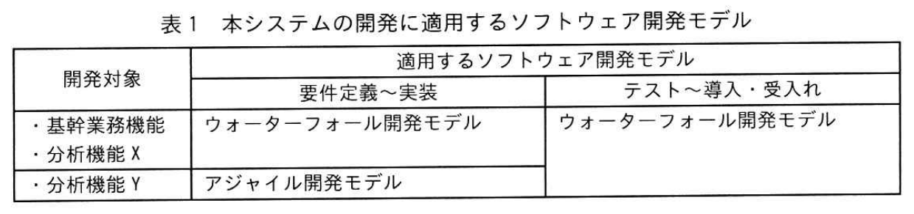
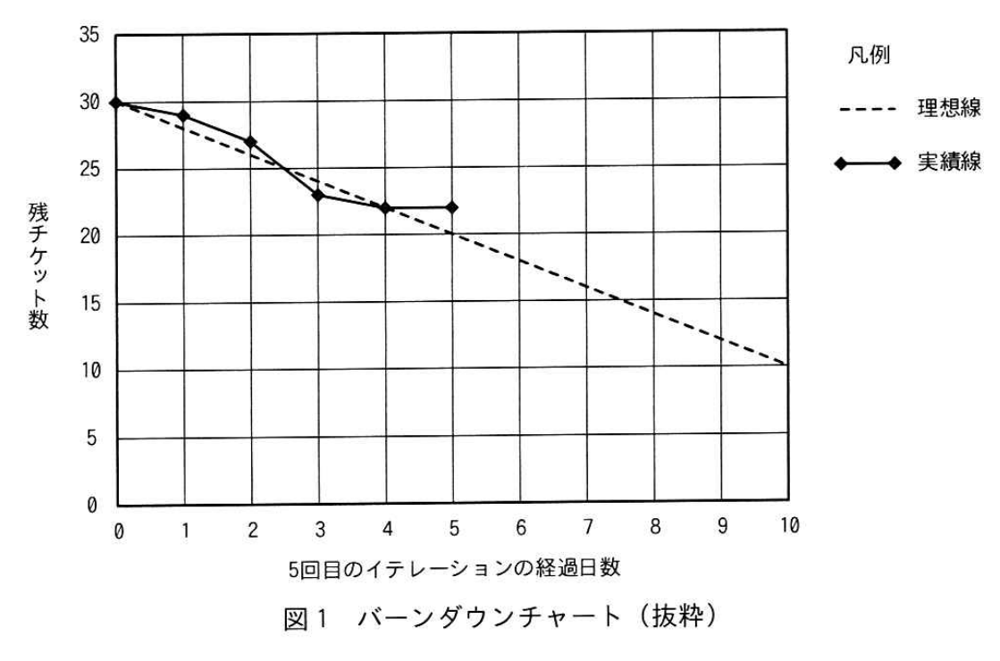

# 2025年秋期 応用情報技術者試験 午後 問9（選択）
## プロジェクトマネジメント：ソフトウェア開発モデルが混在するプロジェクト

---

## 問題文

**問9** ソフトウェア開発モデルが混在するプロジェクトのマネジメントに関する次の記述を読んで、設問に答えよ。

F社は中堅の電気機器メーカーで、製造拠点としてX工場をもつ。F社のITシステム部には開発課と保守課がある。開発課は、X工場向けにX工場生産管理システムを開発し、保守課が運用と保守を行っている。最近、F社は製品の需要増に対応するため、協業会社からY工場を買収した。

---

### 〔X工場生産管理システムの概要〕

X工場生産管理システムは、生産計画や生産実績管理などの基幹業務機能と、そのデータを活用して、品質問題などの分析や対策検討を行うためのデータ分析機能（以下、分析機能Xという）から成る、基幹業務機能はスクラッチで開発した。一方、分析機能Xは、Y社が提供するデータ分析用のソフトウェアツール（以下、Yツールという）を利用して開発した。基幹業務機能から出力されたデータは、分析機能Xで分析される。

---

### 〔X工場生産管理システムのY工場への展開〕

このたび、F社は、Y工場向けにY工場生産管理システム（以下、本システムという）を導入することとした。本システムの機能を基本に必要な追加や変更の開発を行うことにした。F社は、本システムの開発を行うプロジェクト（以下、本プロジェクトという）を立ち上げ、開発課のS君をプロジェクトマネージャに任命した。Y工場は、X工場と同じ製造方法が同じ製品だけでなく、製造方法が異なる製品も製造する予定である。本システムは3ヵ月後にリリースしなければならない。

本システムは基幹業務機能については、Y工場とX工場で製造方法が同じ製品については、X工場生産管理システムの機能を使用できる。X工場とY工場で製造方法が異なる製品については、新たな機能の開発が必要であるが、生産計画や生産実績管理などの業務に大きな違いはなく、Y工場のユーザー部門の要求事項は固まっている。また、データ分析機能へ出力するデータの仕様は製造方法や製品に依存しないので、新たなデータ出力機能の開発は必要ない。

一方、本システムのデータ分析機能について、要求事項を取りまとめるY工場のユーザー部門にS君がヒアリングした結果、次のような状況にあった。

- X工場とY工場は同じ製造方法が同じ分析機能Xのパラメータ設定を変更することで対応できる。しかし、製造方法が異なる製品については、Y ツールを利用した新たなY工場向けのデータ分析機能（以下、分析機能Yという）の開発が必要である。
- 分析機能Yに対する要求事項はまだ固まっていない。分析機能Yについては、基幹業務機能の開発と並行して、試行錯誤しながら開発を進める必要がある。

S君は、この状況に対応する本プロジェクトの計画の策定に着手した。

---

### 〔本プロジェクトの計画〕

本システムの基幹業務機能及び分析機能Xに対しては、F社で規定されているウォーターフォール開発モデルを適用することにした。また、<u>①分析機能Yに対しては、Y工場のユーザー部門の要件変更の状況を踏まえ、要件定義〜実装の工程にF社で規定されているアジャイル開発モデルを適用すること</u>にした。

本システムの開発に適用するソフトウェア開発モデルを表1に示す。

### 表1 本システムの開発に適用するソフトウェア開発モデル

> | 開発対象 | 要件定義〜実装 | テスト・導入・受入れ |
> |---|---|---|
> | 基幹業務機能 | ウォーターフォール開発モデル | ウォーターフォール開発モデル |
> | 分析機能X | ウォーターフォール開発モデル | ウォーターフォール開発モデル |
> | 分析機能Y | アジャイル開発モデル | ウォーターフォール開発モデル |

S君は、前半の要件定義〜実装の工程を実施するXチームと、分析機能Yを開発するYチームで構成することにした。後半のテスト・導入・受入れの工程に、両チームが一体となって作業することにした。X工場の作業期間を確保するため、Y工場のユーザー部門が本システムで確実に業務を実施できるようにするため、前半の要件定義〜実装の工程の前半と後半のテスト・導入・受入れの工程の作業期間は、それぞれ4.5ヵ月とした。

ウォーターフォール開発モデルを適用する工程では、プロジェクトオーナーであるY工場のユーザー部門の代表や、CCBを設置した。CCBでは仕様変更要望を審査して変更の可否を決定する。また、テスト工程以降の仕様変更要望は受け付けない。

---

### 〔本プロジェクトのマネジメント〕

S君は、ウォーターフォール開発モデルの適用工程では、開発成果に基づく指標を用いて進捗を管理するEVMを適用することにした。例えば、指標 `[　a　]` と指標 `[　b　]` とを比較し、`[　a　]` の方が小さい場合は進捗遅延があると判断する。

アジャイル開発モデルの適用では、週5日を稼働日とする3週間のイテレーションを6回繰り返す。各イテレーションの作業は、計画の作成、要件定義・実装、ユーザーレビュー及び振り返りの同作業に同じ作業を分割し、タスクに優先度を付与する。タスクに対してチケットを発行して進捗状況を把握する。Yチームのメンバーは毎日のチケットの発行と消化チケット数を平均し、バーンダウンチャートを用いて残日数を確認する。S君はその状況の確認を、<u>②翌日のミーティングで毎日バーンダウンチャートを用いて残日数を確認し、当日実施するタスクと担当者を決める</u>ことにした。

U課長からY工場のユーザー部門に提出された仕様変更要望は、仕様変更要望一覧にリストアップされる。リストアップされた仕様変更要望については、業務の有用性と受入れ作業量の観点から実施の可否を決定し、次の仕様変更要望の優先度を考慮して変更の実施の可否を決定し、変更を実施する場合は次のイテレーションで対応する。

それぞれのイテレーションのタスクとして `[　c　]` を行う。`[　c　]` では、次のイテレーションでの作業の効率や品質を向上させるとともに、分析機能Yの保守作業の効率を向上させるため、外部仕様を変えずにソースコードの構造を整理する。

---

### 〔プロジェクト実行における問題〕

S君が5回目のイテレーションの5日目の終了時点で、進捗状況をバーンダウンチャートで確認したところ、図1に示すとおりになっていた。

### 図1 バーンダウンチャート（抜粋）

> ※ 横軸: 5回目のイテレーションの経過日数（0〜10日）
> ※ 縦軸: 残チケット数
> ※ 理想線（破線）と実績線（実線）が描かれており、5日目時点で実績が理想を上回っている（遅延状態）

5日目の作業完了時点での進捗遅れが、稼働日で `[　d　]` 日発生していることから、S君は遅れが発生しているタスクの担当者であるE君に状況を聞いたところ、次の回答を得た。

- 4回目のイテレーションで、ある機能を分析機能Yに追加するという仕様変更要望がY工場のユーザー部門から提出された。これらの5回目のイテレーションの開発対象としたが、一部の機能についてYツールを利用した新発見の手法の調査に想定よりも多くの時間を要し、遅れが発生した。
- 調査の結果、YツールはパラメータA設定で対応でき、予定していたよりも少ない作業量で開発できることが分かった。

E君は、Yツールのパラメータ設定が追加のタスクのなので `[　e　]` し、S君がその内容を確認した。その後、タスクは予定どおり終了し、S君は計画どおりのリリースを維持した。

---

## 設問

### 設問1

本文中の下線①について、要件定義〜実装の工程にF社で規定されているアジャイル開発モデルを適用する要因となった、Y工場のユーザー部門の状況とは何か。**25字以内**で答えよ。

### 設問2

〔本プロジェクトのマネジメント〕について答えよ。

**(1)** 本文中の `[　a　]`、`[　b　]` に入れる適切な字句を解答群の中から選び、記号で答えよ。

**解答群**

| 記号 | 字句 |
|---|---|
| ア | AC |
| イ | BAC |
| ウ | CPI |
| エ | CV |
| オ | EAC |
| カ | EV |
| キ | PV |
| ク | SPI |
| ケ | VAC |

**(2)** 本文中の下線②について、バーンダウンチャートを用いて残日数を確認し、当日実施するタスクと担当者を決める目的は何か。本文中の字句を用いて、**25字以内**で答えよ。

**(3)** 本文中の `[　c　]` に入れる適切な字句を、**10字以内**で答えよ。

### 設問3

〔プロジェクト実行における問題〕について答えよ。

**(1)** 本文中の `[　d　]` に入れる適切な数値を整数で答えよ。

**(2)** 本文中の `[　e　]` に入れる適切な字句を、本文中の字句を用いて、**10字以内**で答えよ。

---

## 解答と解説

### 設問1

**正解（解答例）：試行錯誤しながら開発を進める必要があること（24字）**

**理由：** 分析機能Yのヒアリング結果に「分析機能Yに対する要求事項はまだ固まっていない。基幹業務機能の開発と並行して、**試行錯誤しながら開発を進める必要がある**」とある。ウォーターフォール開発は要件が確定している場合に適しており、要件が流動的でフィードバックを繰り返す必要がある場合にアジャイル開発が適する。

---

### 設問2

**(1) 正解：a=カ（EV）、b=キ（PV）**

**EVM（アーンドバリュー分析）の主要指標：**

| 指標 | 意味 | 計算式 |
|---|---|---|
| EV（Earned Value） | 完成した作業の計画価値（出来高） | 計画単価 × 完成量 |
| AC（Actual Cost） | 実際にかかったコスト | 実際の支出 |
| PV（Planned Value） | この時点での計画価値 | 計画単価 × 計画量 |

**スケジュール遅延の判断：**
開発成果物に基づく指標として、**EV と PV を比較**する。EV＜PVならスケジュール遅延（SV＝EV−PV＜0、SPI＝EV/PV＜1）。したがって a=EV（カ）、b=PV（キ）を比較し、EV＜PV のときに進捗が計画より遅れていると判断する。

**IPA公式：a=カ（EV）、b=キ（PV）**

**(2) 正解（解答例）：優先度の高いタスクを3週間で終了させるため（23字）**

**理由：** アジャイル開発では、残作業量をバーンダウンチャートで可視化し、イテレーション（3週間）内に終わりそうかを毎日確認する。終わらないリスクがあれば、高優先度タスクに集中し、低優先度タスクを次イテレーションに回すよう担当者を調整する。

**(3) 正解：c=リファクタリング（8字）**

**理由：** 「外部仕様を変えずにソースコードの構造を整理する」という説明が**リファクタリング**の定義そのもの。各イテレーションにリファクタリングを組み込むことで、累積的な技術的負債を防ぎ、以降の開発・保守効率を維持する。

---

### 設問3

**(1) 正解：d=1（日）**

**バーンダウンチャートの読み方：**

図1において、5回目のイテレーション（全10日間）の5日目終了時点を確認する。
- 理想線（10日で全タスク完了）の5日目時点の残チケット数 = 残タスクの半分
- 実績線（実線）が理想線より上 = 遅延中

チャートから、5日目時点で実績が理想より **1日分** 遅れていることが読み取れる。

**(2) 正解：e=チケットを発行（8字）**

**理由：** アジャイル開発では、追加の作業が生じた場合は**チケットを発行**してタスク管理ツール（Vツール）に登録する。これにより、新タスクが可視化され、バーンダウンチャートに反映されて進捗管理ができるようになる。E君はパラメータ設定という追加タスクのチケットを発行し、S君がその内容を確認することで正式にタスクとして扱われた。

---

## 参考：主要キーワード

| 用語 | 説明 |
|------|------|
| ウォーターフォール開発モデル | 要件定義→設計→実装→テストと順番に進める開発手法。要件が固まっている場合に適する |
| アジャイル開発モデル | 短い反復（イテレーション/スプリント）でリリースと改善を繰り返す開発手法。要件変更への柔軟な対応が可能 |
| イテレーション | アジャイル開発における1サイクルの反復期間（本問では3週間）。計画・実装・レビュー・振り返りを行う |
| バーンダウンチャート | 残作業量（チケット数など）の時間推移を示すグラフ。理想線と実績線を比較して進捗を管理する |
| EVM（アーンドバリュー分析） | コストと進捗を統合して管理するプロジェクト管理手法。EV・AC・PVを使って客観的に測定する |
| リファクタリング | 外部から見た動作を変えずに、内部構造（コード）を整理・改善すること。保守性・可読性の向上が目的 |
| CCB（変更管理委員会） | 仕様変更要望を審査し、変更の可否を決定する委員会 |
| チケット | アジャイル開発でのタスク管理単位。課題追跡ツールに登録し、発行・消化状況で進捗を把握する |
| CPI（Cost Performance Index） | コスト効率指数 = EV/AC。1を下回るとコスト超過 |
| SPI（Schedule Performance Index） | スケジュール効率指数 = EV/PV。1を下回るとスケジュール遅延 |
