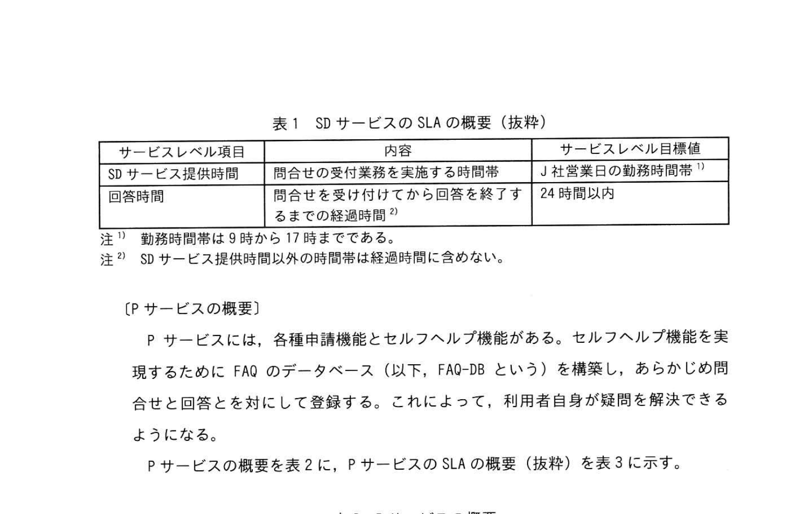
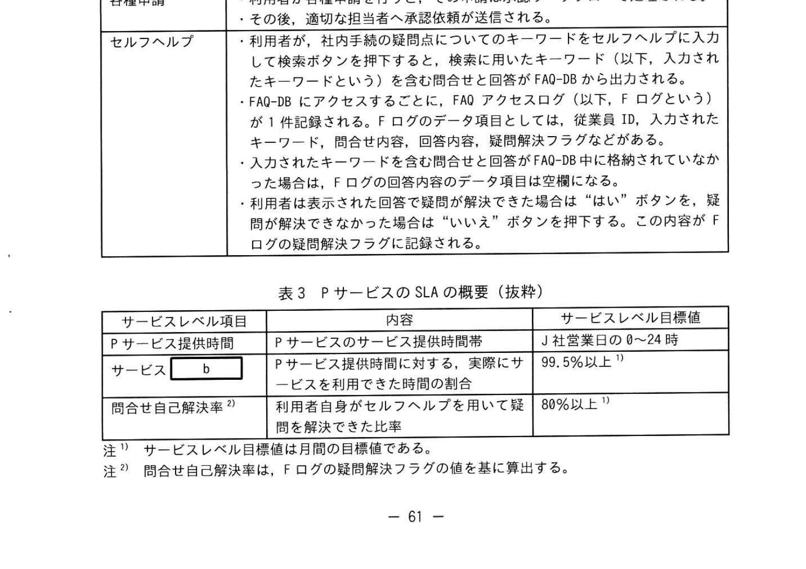
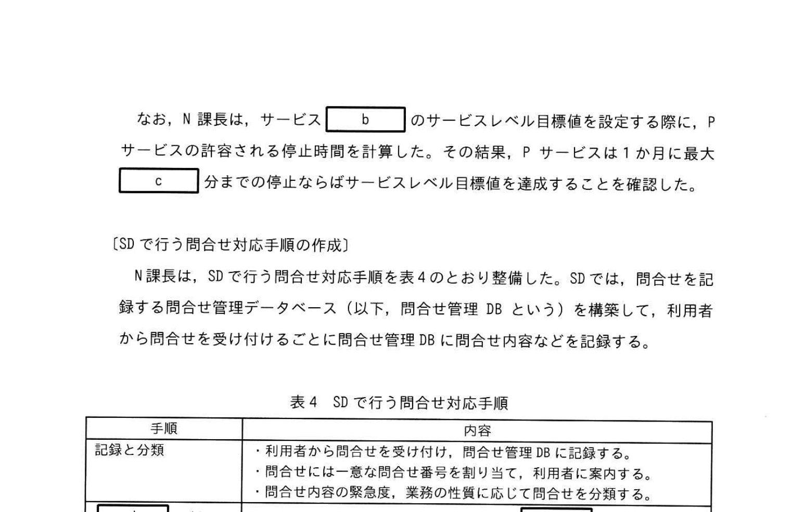
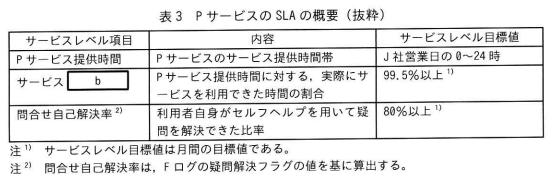
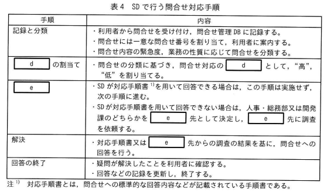
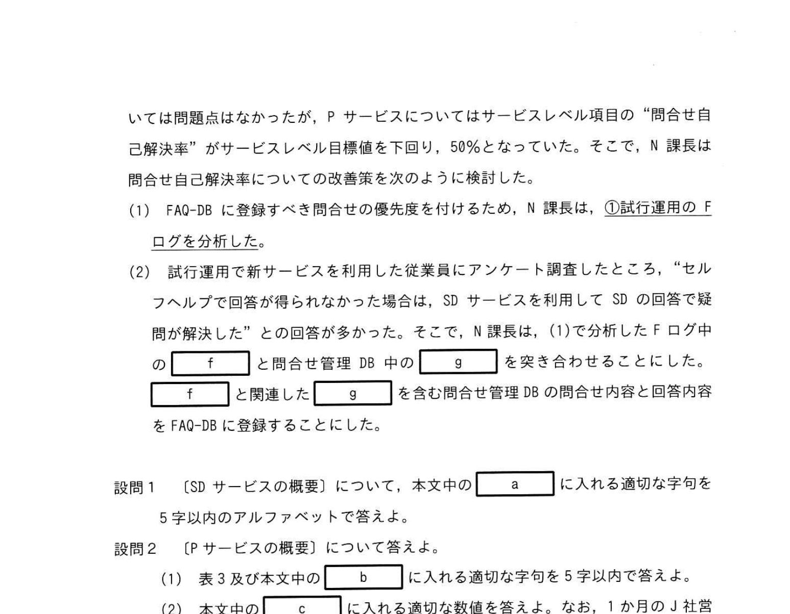

# 2025年秋期 応用情報技術者試験 午後 問10（選択）
## サービスマネジメント：社内手続を扱うサービスデスク

---

## 問題文

**問10** 社内手続を扱うサービスデスクに関する次の記述を読んで、設問に答えよ。

J社は通信会社であり、通信サービスや企業向けのアウトソーシング事業を提供している。J社の組織は、全国の営業所や技術部などの事業部門と、人事・総務部や情報システム部などのコーポレート部門に大別される。情報システム部には開発課と運用課があり、それぞれ社内システムの開発と運用を行っている。J社の人事・総務部は、従業員向けの社内手続の申請・承認に関わる業務や情報提供業務を行っていて、業務の担当者は、従業員からの問合せ対応で多忙を極めていた。一方、従業員は、"社内手続の疑問点を人事や総務のどの担当者に問合せすればよいのか分かりにくい"、"問合せができても、回答までに時間を要する"、"9時から17時までの勤務時間帯以外は社内手続ができない"など、適切なサポートを受けられていない状況であった。その結果、従業員の負担も増加し、作業効率の低下を招いていた。

この状況を踏まえ、人事・総務部と情報システム部（以下、両部という）を統括するW常務は、両部に対し、情報システムを使って、従業員向けのサービスを充実させるとともに、問合せ対応の負荷を軽減させるように指示した。両部が検討した結果、N課長をリーダーとする運用課が、従業員向けのサービスデスク（以下、SDという）サービスと、社内手続の申請や問合せを受け付けるポータルサービス（以下、Pサービスという）の二つのサービス（以下、新サービスという）を提供することになった。Pサービスは、開発課が社内Webを使って構築するポータルサイトで実現する。情報システム部は、利用者を代表する事業部門との間でSLAを合意し、新サービスを提供する。

---

### 〔SDサービスの概要〕

従来、人事・総務部で行っていた従業員からの問合せ対応に加えて、Pサービスに関する問合せも、SDが受け付けて回答を行う。疑問が解決したことを利用者に確認することで、回答の終了とする。

利用者からSDへの問合せ手段は電話や社内チャットである。従業員にとって問合せ対応窓口の一本化が図られ、SDの組織が `[　a　]` として機能する。SDは運用課の所属とし、SDの要員は、運用課の従業員及び人事・総務部から異動した従業員の5名で構成する。SDサービスのSLAの概要（抜粋）を表1に示す。

### 表1 SDサービスのSLAの概要（抜粋）

> | サービスレベル項目 | 内容 | サービスレベル目標値 |
> |---|---|---|
> | SDサービス提供時間 | 問合せの受付業務を実施する時間帯 | J社営業日の勤務時間帯 ※1 |
> | 回答時間 | 問合せを受け付けてから回答を終了するまでの経過時間 ※2 | 24時間以内 |
> ※1 勤務時間帯は9時から17時までである。
> ※2 SDサービス提供時間以外の時間帯は経過時間に含めない。

---

### 〔Pサービスの概要〕

Pサービスには、各種申請機能とセルフヘルプ機能がある。セルフヘルプ機能を実現するために FAQ のデータベース（以下、FAQ-DB という）を構築し、あらかじめ問合せと回答とを対にして登録する。これによって、利用者自身が疑問を解決できるようになる。

Pサービスの概要を表2に、PサービスのSLAの概要（抜粋）を表3に示す。

### 表2 Pサービスの概要（抜粋）

> | 機能 | 内容 |
> |---|---|
> | 各種申請 | ・利用者が各種申請を行うと、その申請は承認ワークフローで処理される。 ・その後、適切な担当者へ承認依頼が送信される。 |
> | セルフヘルプ | ・利用者が、社内手続の疑問点についてのキーワードをセルフヘルプに入力して検索ボタンを押下すると、検索に用いたキーワード（以下、入力されたキーワードという）を含む問合せと回答がFAQ-DBから出力される。 ・FAQ-DBにアクセスするごとに、FAQアクセスログ（以下、Fログという）が1件記録される。Fログのデータ項目としては、従業員ID、入力されたキーワード、問合せ内容、回答内容、疑問解決フラグなどがある。 ・入力されたキーワードを含む問合せと回答がFAQ-DB中に格納されていなかった場合は、Fログの回答内容のデータ項目は空欄になる。 ・利用者は表示された回答で疑問が解決できた場合は"はい"ボタンを、疑問が解決できなかった場合は"いいえ"ボタンを押下する。この内容がFログの疑問解決フラグに記録される。 |

### 表3 PサービスのSLAの概要（抜粋）

> | サービスレベル項目 | 内容 | サービスレベル目標値 |
> |---|---|---|
> | Pサービス提供時間 | Pサービスのサービス提供時間帯 | J社営業日の0〜24時 |
> | サービス `[　b　]` | Pサービス提供時間に対する、実際にサービスを利用できた時間の割合 | 99.5%以上 ※1 |
> | 問合せ自己解決率 ※2 | 利用者自身がセルフヘルプを用いて疑問を解決できた比率 | 80%以上 ※1 |
> ※1 サービスレベル目標値は月間の目標値である。
> ※2 問合せ自己解決率は、Fログの疑問解決フラグの値を基に算出する。

なお、N課長は、サービス `[　b　]` のサービスレベル目標値を設定する際に、Pサービスの許容される停止時間を計算した。その結果、Pサービスは1か月に最大 `[　c　]` 分までの停止ならばサービスレベル目標値を達成することを確認した。

---

### 〔SDで行う問合せ対応手順の作成〕

N課長は、SDで行う問合せ対応手順を表4のとおり整備した。SDでは、問合せを記録する問合せ管理データベース（以下、問合せ管理 DB という）を構築して、利用者から問合せを受け付けるごとに問合せ管理DBに問合せ内容などを記録する。

### 表4 SDで行う問合せ対応手順

> | 手順 | 内容 |
> |---|---|
> | 記録と分類 | ・利用者から問合せを受け付け、問合せ管理DBに記録する。 ・問合せには一意な問合せ番号を割り当て、利用者に案内する。 ・問合せ内容の緊急度、業務の性質に応じて問合せを分類する。 |
> | `[　d　]` の割当て | ・問合せの分類に基づき、問合せ対応の `[　d　]` として、"高"、"低"を割り当てる。 |
> | `[　e　]` | ・SDが対応手順書 ※1 を用いて回答できる場合は、この手順は実施せず、次の手順に進む。 ・SDが対応手順書を用いて回答できない場合は、人事・総務部又は開発課のどちらかを `[　e　]` 先として決定し、`[　e　]` 先に調査を依頼する。 |
> | 解決 | ・対応手順書又は `[　e　]` 先からの調査の結果を基に、問合せへの回答を行う。 |
> | 回答の終了 | ・疑問が解決したことを利用者に確認する。 ・回答などの記録を更新し、終了する。 |
> ※1 対応手順書とは、問合せへの標準的な回答内容などが記載されている手順書である。

問合せ管理DBには、問合せ番号、SD担当者の従業員ID、利用者の従業員ID、受付日時、問合せキーワード、問合せ内容、回答内容などのデータ項目がある。なお、問合せキーワードとは、SDが対応手順書を参照するときに用いた用語のことである。

---

### 〔新サービスの試行運用〕

試行部署を選定し、先行的に新サービスの提供を行う試行運用を1か月間実施した。N課長が新サービスのサービスレベル項目の実績を調査したところ、SDサービスについては問題点はなかったが、Pサービスについてはサービスレベル項目の"問合せ自己解決率"がサービスレベル目標値を下回り、50%となっていた。そこで、N課長は問合せ自己解決率についての改善策を次のように検討した。

(1) FAQ-DBに登録すべき問合せの優先度を付けるため、N課長は、<u>①試行運用のFログを分析した</u>。

(2) 試行運用で新サービスを利用した従業員にアンケート調査したところ、"セルフヘルプで回答が得られなかった場合は、SDサービスを利用してSDの回答で疑問が解決した"との回答が多かった。そこで、N課長は、(1)で分析したFログ中の `[　f　]` と問合せ管理DB中の `[　g　]` を突き合わせることにした。`[　f　]` と関連した `[　g　]` を含む問合せ管理DBの問合せ内容と回答内容をFAQ-DBに登録することにした。

---

## 設問

### 設問1

〔SDサービスの概要〕について、本文中の `[　a　]` に入れる適切な字句を **5字以内のアルファベット**で答えよ。

### 設問2

〔Pサービスの概要〕について答えよ。

**(1)** 表3及び本文中の `[　b　]` に入れる適切な字句を **5字以内**で答えよ。

**(2)** 本文中の `[　c　]` に入れる適切な数値を答えよ。なお、1ヵ月のJ社営業日は22日と計算し、計算結果に小数が発生する場合、答えは小数第1位を切り捨てて、整数で求めよ。

### 設問3

〔SDで行う問合せ対応手順の作成〕について答えよ。

**(1)** 表4中の `[　d　]` に入れる適切な字句を **5字以内**で答えよ。

**(2)** 表4中の `[　e　]` に入れる適切な字句を **10字以内**で答えよ。

### 設問4

〔新サービスの試行運用〕について答えよ。

**(1)** 本文中の下線①について、FAQ-DBに登録すべき問合せの優先度を付けるための分析方法を **40字以内**で答えよ。

**(2)** 本文中の `[　f　]` 及び `[　g　]` には、データ項目が入る。それぞれ適切な字句を **12字以内**で答えよ。

---

## 解答と解説

### 設問1

**正解：a=SPOC（5字）**

**理由：** SPOC（Single Point of Contact）は「単一窓口」の意味。サービスデスクは、利用者が複数の部署に個別問合せするのを避け、問合せを一本化して受け付ける役割を担う。本文で「問合せ対応窓口の一本化が可能となる」と述べられており、SDの担務がSPOCとなる。

---

### 設問2

**(1) 正解：b=可用性（又は稼働率）（3字）**

**理由：** 「Pサービス提供時間に対する、実際にサービスを利用できた時間の割合」という定義は、ITサービスマネジメントにおける**可用性（Availability）**（＝稼働率）のSLAの定義そのもの。可用性 = (稼働時間)/(提供時間) × 100[%] で表される。IPA公式は「可用性」又は「稼働率」を正解とする。

**(2) 正解：c=158（分）**

**計算：**
- Pサービスは99.5%以上の可用性が必要
- 月の最大停止許容時間 = 月の総提供時間 × (1 − 99.5%)
- 1ヵ月 = 22営業日（J社の定義）
- 1日 = 24時間提供（0〜24時）
- 総提供時間 = 22日 × 24時間 × 60分 = 31,680分
- 最大停止時間 = 31,680 × 0.005 = 158.4分
- 小数第1位切り捨て → **158分**

---

### 設問3

**(1) 正解：d=優先度（3字）**

**理由：** 問合せ対応においてSDは問合せを受け付けた後、問合せに一般的な問合せ「優先度」を割り当てる。ITSMではインシデント管理・問題管理において、対応の順番を決めるために優先度（Priority）を設定するのが標準的。

**(2) 正解：e=エスカレーション（7字）**

**理由：** SDが対応できない場合に、上位部署や専門担当者（人事・総務部や情報システム部）に対応を引き渡す行為を**エスカレーション（Escalation）**という。ITSMの用語として標準的。

---

### 設問4

**(1) 正解（解答例）：利用者の疑問が解決しなかった問合せの発生頻度を分析する（35字）**

**理由：** FAQ-DBに登録すべき問合せの優先度を付けるためには、どのキーワードで解決できていないか（問合せ自己解決率が低いもの）を特定する必要がある。Fログには「疑問解決フラグ」があり、疑問が解決しなかった（"いいえ"ボタンを押した）問合せの発生頻度を分析して、頻度の高いものから優先的にFAQ-DBに登録・補強する。

**(2) 正解：f=入力されたキーワード、g=問合せキーワード（各12字以内）**

**理由：**
- **f（FAQアクセスログのデータ項目）：入力されたキーワード**  
  FAQログには「入力されたキーワード」（利用者がセルフヘルプに入力した語句）が記録されている。
- **g（問合せ管理DBのデータ項目）：問合せキーワード**  
  問合せ管理DBには「問合せキーワード」（SDが対応手順書を参照するときに使った用語）が記録されている。

この二つを突き合わせることで、セルフヘルプでは解決できずSDに問合せた利用者が使ったキーワードを特定し、FAQの充実に役立てる。

---

## 参考：主要キーワード

| 用語 | 説明 |
|------|------|
| サービスデスク（SD） | ITサービスと利用者の間の単一窓口（SPOC）。問合せ受付・対応・記録を行う |
| SPOC（Single Point of Contact） | 利用者の問合せを一本化して受け付ける単一窓口のこと |
| SLA（Service Level Agreement） | サービス提供者と利用者の間で合意されたサービスレベルを定めた契約 |
| 可用性（Availability） | サービスが利用可能な時間の割合。稼働率とも呼ばれる |
| FAQ（Frequently Asked Questions） | よくある質問と回答をまとめたデータベース。セルフヘルプに活用 |
| セルフヘルプ | 利用者がFAQなどを使って自分で問題を解決できる機能 |
| エスカレーション | SDが解決できない問合せを上位・専門部署に引き渡すこと |
| 問合せ自己解決率 | 利用者がセルフヘルプで疑問を解決できた割合のKPI |
| 優先度（Priority） | インシデントや問合せへの対応順序を決める指標 |
| FAQアクセスログ | セルフヘルプ利用時に生成されるログ。キーワード・満足度フラグ等を含む |
