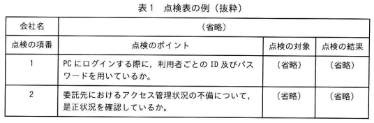
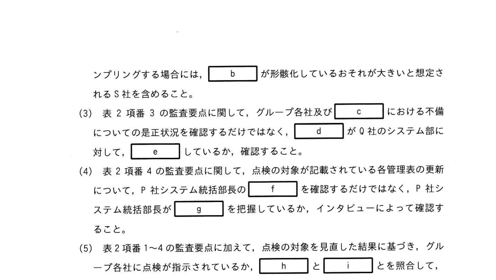

# 2025年秋期 応用情報技術者試験 午後 問11（選択）
## システム監査：情報システムのアクセス管理状況の点検に関する監査

---

## 問題文

**問11** 情報システムのアクセス管理状況の点検に関する監査について、次の記述を読んで、設問に答えよ。

P社グループは、持株会社P社、小売業O社、金融業R社、人材派遣業S社（以下、グループ各社という）から構成される企業グループであり、様々な情報システムを利用している。P社組織は、グループ各社が管理するサーバー、PCなどの識別子及びOS、業務委託などのコーポレート部門に大別される。情報システム部には開発課と運用課がある。グループ各社におけるアクセス管理状況に関して自主点検（以下、点検という）などを主導している。一方、P社グループでは、アクセス管理面の不備に起因する情報漏えい事案などが発生していた。

P社内部監査部は、このような状況を踏まえ、グループ各社を対象として、点検の実効性が確保されているかどうかを確認するため、監査を実施することにした。システム監査チームは、予備調査を実施して、P社グループの情報システムの運用状況及び点検の概要を次のとおり把握し、本調査での監査要点案を作成した。

---

### 〔情報システムの運用状況〕

- (1) P社システム統括部は、グループ各社のシステム部からの報告内容に基づき、IT機器管理表及びアプリケーションソフトウェア管理表（以下、各管理表という）を更新している。
- (2) IT機器管理表は、グループ各社が管理するサーバー、PCなどの識別子及びOS、業務委託などの有無などが記載されている。また、アプリケーションソフトウェア管理表には、グループ各社が利用するアプリケーションソフトウェア名、取り扱う情報の内容、業務委託の有無などが記載されている。
- (3) P社のアクセス管理規程に定められた管理策は、原則としてグループ各社に適用される。当該規程では、例えば以下のことが記されており、グループ各社に配置された人によってアクセスのIDとパスワードのログインすることが定められている。店舗のシステム管理者は当該パスワードを10営業日ごとに変更し、当該営業担当者に連絡する。P社グループ各社システム統括部は、当該管理策を承認している。
- (4) P社のアクセス管理規程において承認できない管理策を通常で使用できない場合には、P社のシステム部が代替の管理策を申請し、P社システム統括部が承認を与える。
- (5) P社は、グループ各社が共同利用するグループウェア、経理システム、人材管理システムなどのほか、グループ各社の営業情報などを収集、モニタリングするシステムとして経営情報システムを保有しており、T社に運用、保守を業務委託している。
- (6) Q社は、R社発行のクレジットカードを利用した顧客の購買履歴などを分析する顧客管理システムを保有しており、U社に運用、保守を業務委託している。
- (7) Q社の店舗には、複数の従業員が共用するPCがあり、顧客対応の必要業務として、共用のID及びパスワードでログインする。店舗のシステム管理者は当該パスワードを10営業日ごとに変更し、当該営業担当者に連絡する。P社グループ各社システム統括部は、当該管理策を承認している。
- (8) S社は、派遣スタッフの勤務、時間単価などを派遣システムで管理している。予備調査において1ヵ月前には、派遣システムのアクセス管理運用状況に起因する不備に起因して、派遣スタッフの個人情報が第三者に窃取される事案（以下、情報漏えい事案という）が発生していた。

---

### 〔点検の概要〕

- (1) 点検プロセスの概要は、次のとおりである。
  - ① P社システム統括部は、アクセス管理規程、各管理表などに基づき、点検のポイント、対象などを設定し、グループ各社の点検表を作成して、グループ各社のシステム部に点検を指示する。
  - ② グループ各社のシステム部は、点検に基づき点検を実施し、当該点検結果、当該点検状況が不適なときはP社システム統括部に報告する。
  - ③ P社システム統括部は、点検に関する報告内容を確認し、必要に応じて、不備について是正を進めるよう指導、支援する。
  - ④ P社グループ各社のシステム部からの点検に関する報告内容などを踏まえ、点検のポイント、対象などを見直す。
- (2) 各グループ各社の点検の担当者は、各管理表に点検を記録した内容及び理由について、1ヵ月ごとに更新している。システム統括部長は、担当者からの更新の内容及び理由について、適切に説明を聞き、各管理表の内容を確認していることを記録している。
- (3) グループ各社のシステム部は、融資情報、営業情報などを取り扱う情報システムの運用、保守を委託先の管理の下において、委託先のアクセス管理状況を確認している。P社システム統括部に報告することになっている。Q社のシステム部からは当該点検の担当員が報告されていなかった。
- (4) 予備調査までに S社以外のグループ各社で実施された点検では、何らかの不備が発見されていた。一方、S社で情報漏えい事案の発生を踏まえてから実施された点検では、派遣システムのアクセス管理運用状況を点検したものの、不備は全く発見されていなかった。
- (5) P社システム統括部が作成した点検表の例（抜粋）を表1に示す。

### 表1 点検表の例（抜粋）

> | 会社名 | （各社） |
> |---|---|
> | 点検の対象 | 点検のポイント（略） | 点検の対象 | 点検の結果 |
> | 1 | PCにログインする際に、利用者ごとのIDとパスワードを用いているか。 | （省略） | （省略） |
> | 2 | 委託先のアクセス管理状況の運用における不備について、状況及び是正内容を確認しているか。 | （省略） | （省略） |

---

### 〔監査要点案の作成〕

システム監査チームが予備調査の結果を踏まえて作成した当調査の監査要点案（抜粋）を表2に示す。

### 表2 監査要点案（抜粋）

> | 項番 | 監査要点 |
> |---|---|
> | 1 | 点検のポイントは、適切に設定されているか。 |
> | 2 | 点検の結果は、実態と整合しているか。 |
> | 3 | 点検で発見した不備は、適切に是正されているか。 |
> | 4 | 点検の対象は、適切に見直されているか。 |

---

### 〔内部監査部長の指示〕

内部監査部長は、本調査の監査要点案をレビューして、次のとおり指示した。

- (1) 表2項番1の監査要点に関して、グループ各社においてアクセス管理規程に定められた管理策が通常で使用できない場合の `[　a　]` も考慮して、点検のポイントを適切に設定しているかどうかを確認すること。
- (2) 表2項番2の監査要点に関して、効率よく監査を実施するために、サンプリングする場合は、`[　b　]` が形骸化しているおそれが大きいと想定されるS社を含めること。
- (3) 表2項番3の監査要点に関して、グループ各社及びS社における不備についての是正状況について、`[　c　]` の当該状況が当社のシステム部に対して、`[　d　]` が `[　e　]` しているかどうかを確認すること。
- (4) 表2項番4の監査要点に関して、点検の対象が記載されている各管理表の更新について、P社システム統括部長が `[　f　]` を確認するだけでなく、P社システム統括部長が `[　g　]` を適切に確認すること。
- (5) 表2項番1〜4の監査要点に加えて、点検の対象を精査した結果に基づき、グループ各社に点検が指示されているか、`[　h　]` と `[　i　]` とを照合して、確認すること。

---

## 設問

### 設問1

〔内部監査部長の指示〕(1)の `[　a　]` に入れる適切な字句を、**10字以内**で答えよ。

### 設問2

〔内部監査部長の指示〕(2)の `[　b　]` に入れる適切な字句を解答群の中から選び、記号で答えよ。

**解答群**

| 記号 | 字句 |
|---|---|
| ア | 監査 |
| イ | 承認 |
| ウ | 情報漏えい事案 |
| エ | 点検 |
| オ | 派遣システム |
| カ | 予備調査 |

### 設問3

〔内部監査部長の指示〕(3)について答えよ。

**(1)** 本文中の `[　c　]` に入れる適切な字句を、**5字以内**で答えよ。

**(2)** 本文中の `[　d　]` に入れる適切な字句を、**10字以内**で答えよ。

**(3)** 本文中の `[　e　]` に入れる適切な字句を、**15字以内**で答えよ。

### 設問4

〔内部監査部長の指示〕(4)について答えよ。

**(1)** 本文中の `[　f　]` に入れる適切な字句を、**5字以内**で答えよ。

**(2)** 本文中の `[　g　]` に入れる適切な字句を、**10字以内**で答えよ。

### 設問5

〔内部監査部長の指示〕(5)の `[　h　]`、`[　i　]` に入れる適切な字句を、それぞれ **5字以内**で答えよ。

---

## 解答と解説

### 設問1

**正解：a=代替の管理策の適用（10字）**

**理由：** 本文(4)に「P社のアクセス管理規程において承認できない管理策を通常で使用できない場合には、P社のシステム部が**代替の管理策**を申請し、P社システム統括部が承認を与える」とある。監査では通常の管理策だけでなく、例外として適用されている代替の管理策についても、点検ポイントとして設定されているか確認する必要がある。

---

### 設問2

**正解：b=エ（点検）**

**理由：** S社では、情報漏えい事案発生後に実施された点検で「不備が全く発見されていなかった」（実際には不備があったにもかかわらず）。このことは、**点検**そのものが形骸化（適切に実施されていない）していることを示唆している。効率的にサンプリングするなら、形骸化のリスクが高いS社を優先すべき。

---

### 設問3

**(1) 正解：c=委託先（3字）**

**理由：** 本文(3)に「グループ各社のシステム部は…**委託先**のアクセス管理状況を確認している」とある。不備の是正状況については、グループ各社内だけでなく、業務を委託している**委託先**の状況も確認対象となる。

**(2) 正解：d=P社システム統括部（9字）**

**理由：** 点検プロセス②③に「グループ各社のシステム部は報告→P社システム統括部は確認・指導」という流れがある。是正状況を「当社のシステム部に対して」確認する主体は**P社システム統括部**。

**(3) 正解：e=是正を進めるよう指導、支援（13字）**

**理由：** 本文点検プロセス③に「P社システム統括部は…不備について**是正を進めるよう指導、支援**する」とある。監査では、この指導・支援が実際に行われているかどうかを確認する。

---

### 設問4

**(1) 正解：f=承認の記録（5字）**

**理由：** 本文(2)に「システム統括部長は、担当者からの更新の内容及び理由について、適切に説明を聞き、各管理表の内容を確認していることを**記録**している」とある。従来の確認では、P社システム統括部長が「承認の記録」（確認した事実の記録）を残しているだけで不十分。

**(2) 正解：g=更新の内容及び理由（9字）**

**理由：** 本文(2)の「担当者からの**更新の内容及び理由**について、適切に説明を聞き」が根拠。P社システム統括部長が形式的な承認記録を確認するだけでなく、各管理表の更新内容と理由の妥当性を適切に確認することが必要。

---

### 設問5

**正解：h=各管理表、i=点検表（順不同）**

**理由：** 点検対象の精査には、次の二つを照合する必要がある。
- **各管理表**：グループ各社のシステム・機器・アプリの一覧（点検すべき対象の網羅的なリスト）
- **点検表**：実際に点検指示されている対象の一覧

両者を照合することで、各管理表に載っているのに点検表に含まれていない（点検漏れ）対象がないかを確認できる。

---

## 参考：主要キーワード

| 用語 | 説明 |
|------|------|
| システム監査 | 情報システムのリスク管理・コントロールの有効性を独立した立場から検証する活動 |
| 監査要点 | 監査において特に確認すべき重要事項 |
| 予備調査 | 本調査前に実施する情報収集。監査の方向性・範囲を決定するために行う |
| 本調査 | 予備調査の結果に基づき、監査要点を中心に詳細に調査する |
| アクセス管理規程 | IDとパスワードの管理・運用ルールを定めた規程 |
| 代替の管理策 | 規程の通常の管理策が適用できない場合に例外として承認された別の管理策 |
| 形骸化 | 手順や規程が名目上は存在するが、実際には機能していない状態 |
| 点検 | 規程・ルールへの準拠状況を自主的に確認すること（内部統制の一環） |
| 委託先管理 | 業務委託先のセキュリティ・コンプライアンス状況を管理・確認すること |
| IT機器管理表 | グループ各社が管理するサーバー・PCなどの情報をまとめた一覧 |
| 各管理表 | IT機器管理表とアプリケーションソフトウェア管理表の総称 |
| 是正 | 発見された不備・問題点を修正・改善すること |
