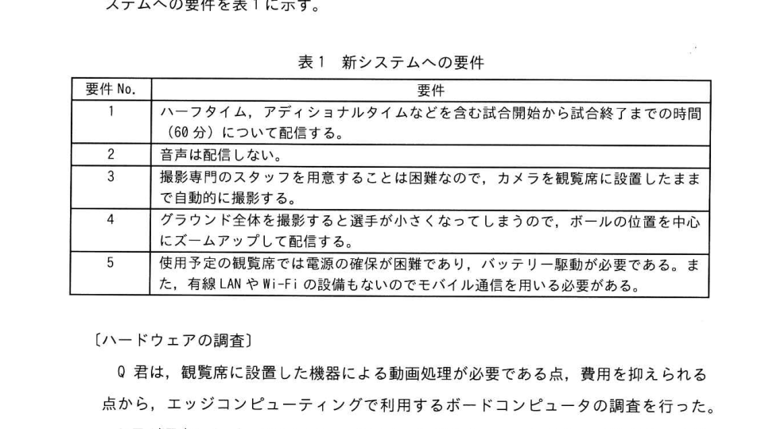
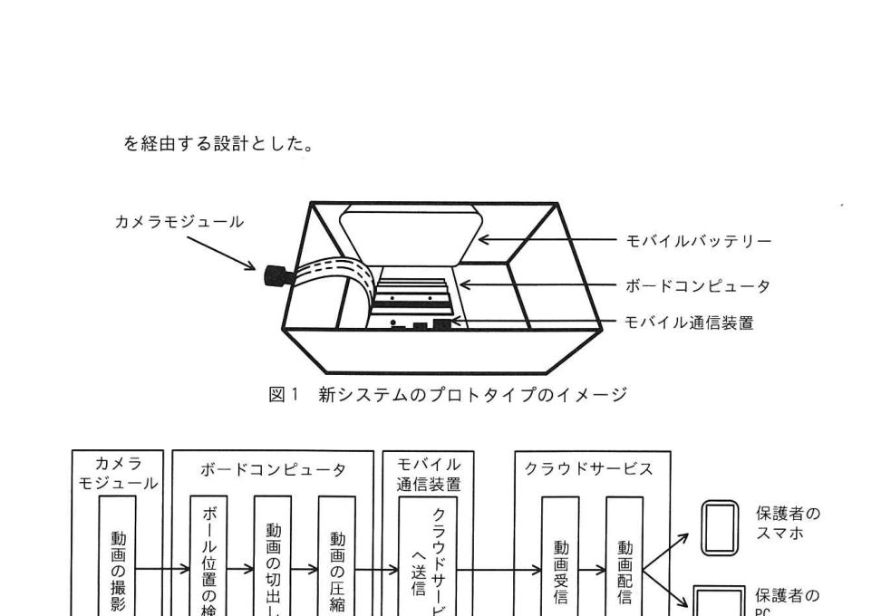
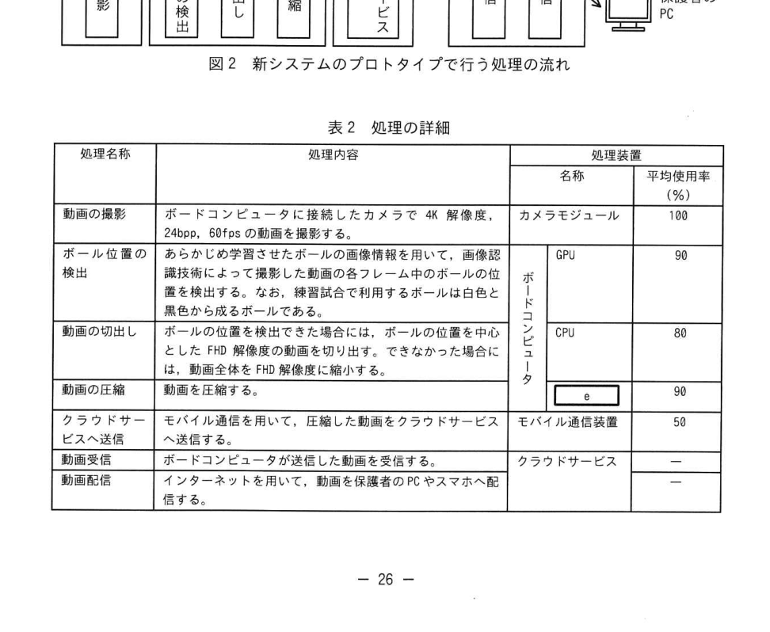

# 2025年秋期 応用情報技術者試験 午後 問4（選択）
## システムアーキテクチャ：エッジコンピューティング

---

## 問題文

**問4** エッジコンピューティングに関する次の記述を読んで、設問に答えよ。

E社は、小学生向けのサッカー教室を運営するスポーツクラブである。このスポーツクラブには約20個の教室があり、毎週ごとにサッカーチームを運営している。普段の練習試合では、地域の公園や小学校のグラウンドを借りて行っているが、3ヵ月に1回の練習試合では、サッカー用のグラウンドを使用しており、E社はその開催が多く困難な状況にある。

サッカー教室に通う小学生の保護者からは "練習試合の様子をスマホ（以下、スマートフォン）"（以下、スマホという）などで見たい" という要望があり、E社はサッカー教室の情報システム開発会社のH社とともに、練習試合の動画を保護者のPCやスマホへライブ配信するシステム（以下、新システムという）のプロトタイプを作成してPoC（概念実証）を行うことにした。

---

### 〔新システムへの要件〕

H社のQ君は、E社に所属するサッカー教室のコーチや保護者に、新システムに関する要望のヒアリングを行い、新システムへの要件をまとめた。Q君がまとめた新システムへの要件を表1に示す。

### 表1 新システムへの要件

> **要件一覧**
> - **要件1：** ハーフタイム、アディショナルタイムなどを含む試合開始から試合終了までの時間（60分）について配信する。
> - **要件2：** 音声は配信しない。
> - **要件3：** 撮影専門のスタッフを用意することは困難なので、カメラを観覧席に設置したままで自動的に撮影する。
> - **要件4：** グラウンド全体を撮影すると選手が小さくなってしまうので、ボールの位置を中心にズームアップして配信する。
> - **要件5：** 使用予定の観覧席では電源の確保が困難であり、バッテリー駆動が必要である。また、有線LANやWi-Fiの設備もないのでモバイル通信を用いる必要がある。

---

### 〔ハードウェアの調査〕

Q君は、観覧席に設置した機器による動画処理が必要である点、費用を抑えられる点から、エッジコンピューティングで利用するボードコンピュータの調査を行った。

Q君が選択したボードコンピュータには、複雑な命令セットをもつCPUではなく単純な命令セットをもつ `[　a　]` のCPU、画像認識などで利用するGPU、動画を圧縮・伸長する専用チップが搭載されている。また、外部インタフェースとして、キーボードやマウスを接続するインタフェース、ディスプレイを接続する `[　b　]`、カメラモジュールを接続するカメラインタフェース、モバイル通信装置を接続するインタフェースを装備している。

Q君は、ボードコンピュータの動作に必要な1時間当たりの電力量を測定した。その結果、各装置の使用率が100%の場合、カメラモジュールは1,800mWh、CPUは2,000mWh、GPUは3,000mWh、動画を圧縮・伸長する専用チップは400mWh、モバイル通信装置は100mWhであった。また、電力量は装置の使用率に比例することが分かった。

---

### 〔動画圧縮方式の検討〕

新システムでは、グラウンド全体を撮影しつつ、ボールの位置を中心にズームアップして配信することを考えると4K解像度（3,840×2,160ピクセル）で撮影することが求められる。4K解像度、24bpp（bits per pixel）、60fps（frames per second）の動画を無圧縮で転送する場合に必要な通信帯域は `[　c　]` Gbpsとなる。

モバイル通信を用いて動画を配信するためには、動画を圧縮などの対応が必要である。代表的な動画の圧縮方式には `[　d　]` があり、専用チップである `[　e　]` を利用することで、<u>①ソフトウェアで圧縮する場合と比較してメリットがある</u>。

---

### 〔新システムのプロトタイプの設計〕

Q君は新システムのプロトタイプの設計を行った。新システムのプロトタイプのイメージを図1に、新システムのプロトタイプで行う処理の流れを図2に、処理の詳細を表2に示す。

Q君は、<u>②ボール位置の検出処理と動画の切出し処理はクラウドサービスではなくボードコンピュータで行い</u>、保護者のPCやスマホへの動画配信はクラウドサービスを経由する設計とした。

### 図1 新システムのプロトタイプのイメージ

### 図2 新システムのプロトタイプで行う処理の流れ・表2 処理の詳細

> **表2 処理の詳細**
>
> | 処理名称 | 処理内容 | 処理装置 | 平均使用率(%) |
> |----------|----------|----------|--------------|
> | 動画の撮影 | ボードコンピュータに接続したカメラで4K解像度、24bpp、60fpsの動画を撮影する。 | カメラモジュール | 100 |
> | ボール位置の検出 | あらかじめ学習させたボールの画像情報を用いて、画像認識技術によって撮影した動画の各フレーム中のボールの位置を検出する。なお、練習試合で利用するボールは白色と黒色から成るボールである。 | GPU（ボードコンピュータ） | 90 |
> | 動画の切出し | ボールの位置を検出できた場合には、ボールの位置を中心としたFHD解像度の動画を切り出す。できなかった場合には、動画全体をFHD解像度の動画に縮小する。 | CPU（ボードコンピュータ） | 80 |
> | 動画の圧縮 | 動画を圧縮する。 | `[　e　]`（ボードコンピュータ） | 90 |
> | クラウドサービスへ送信 | モバイル通信を用いて、圧縮した動画をクラウドサービスへ送信する。 | モバイル通信装置 | 50 |
> | 動画受信 | ボードコンピュータが送信した動画を受信する。 | クラウドサービス | — |
> | 動画配信 | インターネットを用いて、動画を保護者のPCやスマホへ配信する。 | クラウドサービス | — |

---

### 〔新システムのプロトタイプのテスト〕

Q君は、観覧席に新システムのプロトタイプを設置し、実効容量が5,000mWhのモバイルバッテリーを接続してテストを開始した。試合開始から全ての処理は正常に動いたが、ボードコンピュータの温度の配信速度も安定していたが、<u>③試合の終盤に電力不足によってボードコンピュータが停止する問題が発生した</u>。

この問題の原因を調査したところ、GPUの使用率が高かったため、GPUが処理するデータ量を減らす対策を検討した。データ量を少なくする点は、ボールが高速に移動する点を考慮し、ボール位置の検出処理の前に<u>④集積した動画のデータ量を小さくする処理を追加した</u>、動画のデータ量と、GPUの使用率の低減によって必要な電力量が低減する方が多く、動画を試合終了まで配信できるようになった。

その後、Q君は新システムのプロトタイプを完成させ、練習試合のライブ配信のPoCを開始した。

---

## 設問

### 設問1

本文中の `[　a　]`、`[　b　]` に入れる適切な字句を解答群の中から選び、記号で答えよ。

**解答群**

| 記号 | 字句 |
|------|------|
| ア | CISC |
| イ | DCジャック |
| ウ | HDMI |
| エ | RISC |
| オ | RJ45 |

### 設問2

〔動画圧縮方式の検討〕について答えよ。

**(1)** 本文中の `[　c　]` に入れる適切な数値を答えよ。1Gbps = 10⁹bps とし、答えは小数第1位を四捨五入し、整数で求めよ。

**(2)** 本文及び表2中の `[　d　]`、`[　e　]` に入れる適切な字句を解答群の中から選び、記号で答えよ。

**解答群**

| 記号 | 字句 |
|------|------|
| ア | H.265 |
| イ | MP3 |
| ウ | PNG |
| エ | WebP |
| オ | エンコーダ |
| カ | デコーダ |

**(3)** 本文中の下線①について、どのようなメリットかを解答群の中から選び、記号で答えよ。

**解答群**

| 記号 | 内容 |
|------|------|
| ア | GPUをボール位置の検出処理などの他の処理に利用できる。 |
| イ | 音声と動画を合わせて一つのファイルに圧縮できる。 |
| ウ | ハードウェアを用いた方が動画のデータ量を小さくできる。 |
| エ | 保護者のスマホの種類に応じた多くの圧縮形式の動画が作成できる。 |

### 設問3

本文中の下線②について、Q君のどのような設計制約からか。**20字以内**で答えよ。

### 設問4

〔新システムのプロトタイプのテスト〕について答えよ。

**(1)** 本文中の下線③について、試合開始から試合終了までに必要な電力量を答えよ。答えはmWhを単位とし、整数で求めよ。

**(2)** 本文中の下線④について、どのような処理を追加したか。**15字以内**で答えよ。

---

## 解答と解説

### 設問1

| 空欄 | 正解 | 理由 |
|------|------|------|
| a | **エ（RISC）** | 「複雑な命令セットをもつCPUではなく**単純な命令セット**をもつ〔a〕のCPU」とある。単純な命令セットのアーキテクチャは**RISC**（Reduced Instruction Set Computer）。対義語はCISC（Complex ISC）。 |
| b | **ウ（HDMI）** | 「ディスプレイを接続する〔b〕」とある。ディスプレイ接続インタフェースは**HDMI**。RJ45はLANポート、DCジャックは電源コネクタ。 |

### 設問2

**(1) 正解：12（Gbps）**

**計算：**

$$3{,}840 \times 2{,}160 \times 24 \text{(bpp)} \times 60 \text{(fps)} = 11{,}943{,}936{,}000 \text{ bps} \approx 11.9 \text{ Gbps}$$

小数第1位を四捨五入 → **12 Gbps**

**(2) 正解：d=ア（H.265）、e=オ（エンコーダ）**

**理由：**
- d：代表的な**動画の圧縮方式**。MP3（イ）は音声、PNG（ウ）・WebP（エ）は静止画の圧縮形式。動画の圧縮方式は**H.265**（HEVC）。
- e：専用チップで動画を**圧縮**する処理を行う装置は**エンコーダ**。デコーダは伸長（復号）用。

**(3) 正解：ア**

**理由：** ハードウェア（専用チップ）でエンコードすることにより、ソフトウェアで圧縮する場合に必要だった**GPUのリソースが解放**され、ボール位置の検出などの他の処理にGPUを充てられる。ウ「データ量を小さくできる」は圧縮効率の話であり、ハードウェアとソフトウェアで差はない（同じ方式なら同じ圧縮率）。

### 設問3

**正解（解答例）：モバイル通信の帯域が不足する制約**（20字以内）

**理由：** 要件5に「モバイル通信を用いる必要がある」とあり、モバイル通信の実効速度（4G で約400Mbps程度）では4K非圧縮動画（約12Gbps）の転送は不可能。そのため帯域の制約から、ボール位置検出・切出しをボードコンピュータ（エッジ）でローカル処理してFHDに落とし、圧縮してからクラウドに送信する設計にした。

### 設問4

**(1) 正解：6,510（mWh）**

**計算：** 試合時間60分（= 1時間）× 各装置の消費電力

| 装置 | 100%時の消費電力 | 平均使用率 | 消費電力 |
|------|-----------------|-----------|---------|
| カメラモジュール | 1,800 mWh/h | 100% | 1,800 mWh |
| GPU | 3,000 mWh/h | 90% | 2,700 mWh |
| CPU | 2,000 mWh/h | 80% | 1,600 mWh |
| 専用チップ（圧縮） | 400 mWh/h | 90% | 360 mWh |
| モバイル通信装置 | 100 mWh/h | 50% | 50 mWh |
| **合計** | | | **6,510 mWh** |

実効容量5,000mWhのバッテリーでは**不足**（6,510 > 5,000）するため試合終盤に停止した。

**(2) 正解（解答例）：動画のbppを下げる。**（15字以内）

**理由：** ボール位置検出処理の前段でデータ量を削減するには、GPU に渡す前に動画の1フレームあたりのビット数（bpp）を下げることで処理するデータ量を削減できる。GPUの使用率低下 → 消費電力が下がり、バッテリーが試合終了まで持つようになる。

---

## 参考：主要キーワード

| 用語 | 説明 |
|------|------|
| エッジコンピューティング | データが発生する現場（エッジ）に近い場所で処理を行い、クラウドへの通信量や遅延を削減するアーキテクチャ |
| RISC | Reduced Instruction Set Computer。単純な命令セットで高速動作するCPUアーキテクチャ（ARMなど） |
| CISC | Complex Instruction Set Computer。多様・複雑な命令セットをもつCPUアーキテクチャ（x86など） |
| H.265（HEVC） | High Efficiency Video Coding。H.264の後継の動画圧縮標準。同等画質でデータ量を約半分に削減できる |
| エンコーダ | 動画・音声を圧縮（符号化）するハードウェアまたはソフトウェア |
| デコーダ | 圧縮された動画・音声を伸長（復号）するハードウェアまたはソフトウェア |
| bpp | bits per pixel。1ピクセルを表すのに使うビット数。値が大きいほど色情報が豊かで、データ量も増える |
| PoC | Proof of Concept（概念実証）。システムや技術の実現可能性を検証するための試験的な実装 |
| HDMI | High-Definition Multimedia Interface。映像・音声を1本のケーブルで伝送するデジタルインタフェース |
