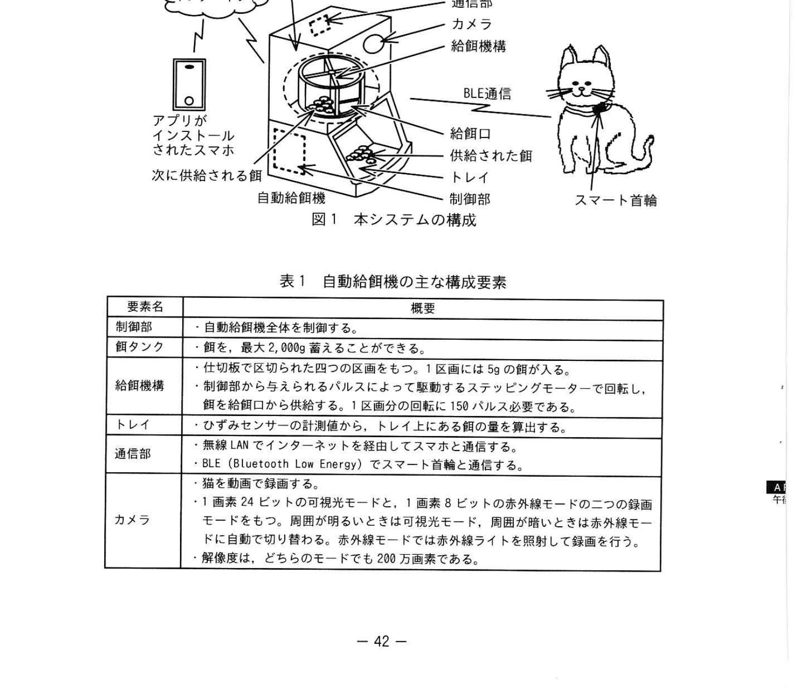
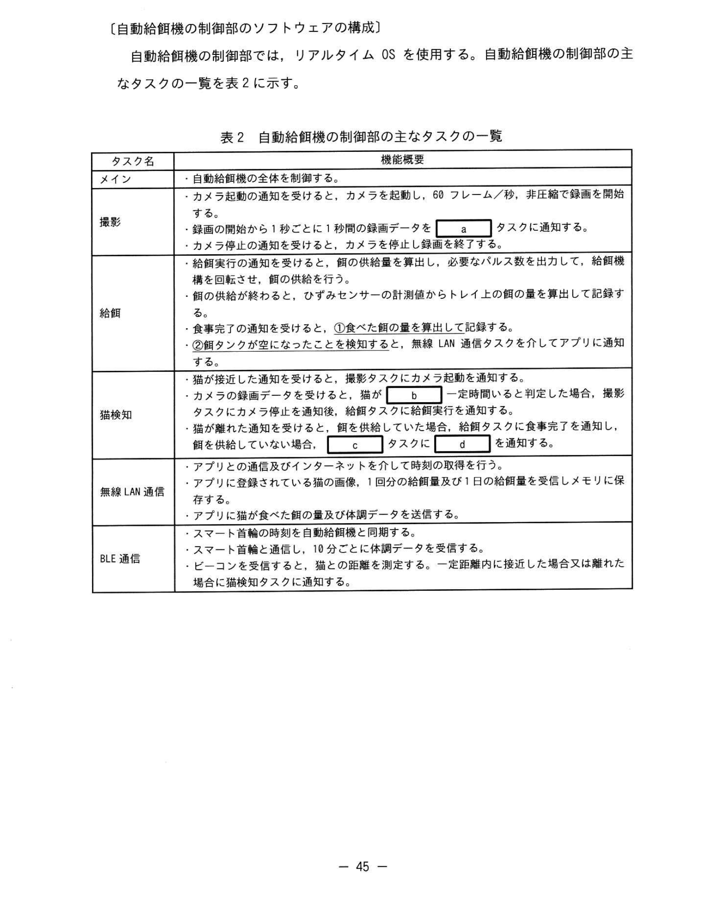
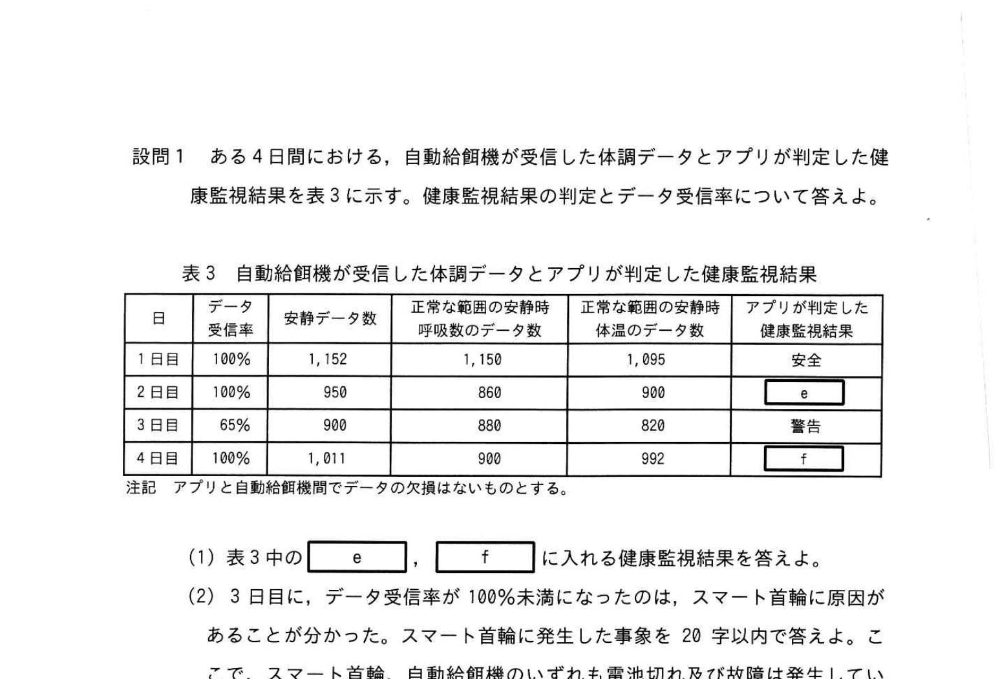

# 2025年秋期 応用情報技術者試験 午後 問7（選択）
## 組込みシステム開発：猫の自動給餌・健康監視システム

---

## 問題文

**問7** 猫の自動給餌・健康監視システムに関する次の記述を読んで、設問に答えよ。

G社は、猫の飼育に対応する自動給餌機と猫に装着するスマート首輪、及びスマートフォン（以下、スマホという）にインストールされた専用アプリケーションソフトウェア（以下、アプリという）から構成される、自動給餌・健康監視システム（以下、本システムという）の開発を行っている。本システムの構成を図1に、自動給餌機の主な構成要素を表1にそれぞれ示す。

### 図1・表1 本システムの構成と自動給餌機の主な構成要素

> **表1 自動給餌機の主な構成要素**
>
> | 要素名 | 概要 |
> |---|---|
> | 制御部 | 自動給餌機全体を制御する |
> | 餌タンク | 最大2,000g蓄えることができる |
> | 給餌機構 | 最小5gを1区切りとして切り取ることができる。1区切りはステッピングモーターへの150パルスに対応する。制御部からのパルスによって動作するステッピングモーターで駆動し、トレイへ餌を出す |
> | トレイ | 餌を入れる皿。ひずみセンサによって計測した重さからトレイ上の餌の量を記録する |
> | 通信部 | 無線LANとBLE（Bluetooth Low Energy）でスマホ等に通知する |
> | カメラ | 1画素24ビットの通常モードと、1画素8ビットの赤外線モードの二つの画像モードをもつ。解像度はどのモードでも200万画素。録画フレームレートは60フレーム/秒、非圧縮で録画を開始する |

---

### 〔スマート首輪の動作概要〕

スマート首輪は、加速度センサ、体温センサ及びBLE通信部を内蔵している。

スマート首輪の動作概要を次に示す。

- スマート首輪は、0.5秒ごとにBLEのビーコンを発信する。
- 1分ごとに、次の処理を行い、猫の体調に関するデータ（以下、体調データという）1回分の体調データを作成する。
  - 1分間の加速度センサの出力値を集計して、運動量に変換する。
  - 1分間の加速度センサの出力値の変化から、呼吸数を算出する。
  - 体温センサで体温を計測する。
  - 5回以上連続して運動量が一定値を下回った場合、安静フラグを有効に設定する。安静フラグが有効な体調データをそれぞれ安静時呼吸数と安静時体温とする。
- 体調データは最大60回分蓄積することができる。自動給餌機からの送信要求を受信すると、蓄積した体調データを送信する。何らかの理由で自動給餌機からの送信要求を受信できていない場合は、60分を超えると、新しい体調データを古いデータに上書きすることによって、体調データを更新する。蓄積したデータは、送信要求を受けた時点で最も古いデータから送信される。

---

### 〔データ受信率の定義〕

スマート首輪が作成した体調データのデータ数のうち、自動給餌機が受信できたデータの割合をデータ受信率という。24時間で自動給餌機が受信できたデータ数が936件の場合、データ受信率は936/1,440 = 65%となる。

---

### 〔自動給餌機の動作概要〕

自動給餌機1台につき、一つのスマート首輪が関連付けられている。また、アプリから1回分の給餌量、1日の給餌回数の画像の情報を受け取る。自動給餌機の動作概要を次に示す。

- スマート首輪からBLEのビーコンを受信する。ビーコンの受信信号強度から、猫の位置を推定して、次の動作を行う。
  - 猫が一定範囲内に来たら、カメラを起動し、録画を開始する。
  - 録画データから猫がトレイの正面に一定時間以上向いたと判定した場合、カメラを停止し、次の方法で計算した供給量の餌を、トレイに供給する。
    - （ア）1日の供給量から、その日に猫が食べた餌の量を引く。
    - （イ）（ア）の結果から1回分の供給量の小さい方を選択する。
    - （ウ）（イ）の結果からトレイに残っている餌の量を引き上げたものの供給量を5g単位で切り上げたものが今回の供給量。ただし、結果が負の場合は0とする。
  - 猫が離れると、餌を供給した場合、超タスクに食事完了を通知する。
- 10分に1回、スマート首輪に送信要求を送信し、体調データを受信し、蓄積する。
- アプリから送信要求を受信すると、蓄積している体調データ及び猫の食べた量をアプリに送信し、スマート首輪から受信して蓄積している体調データを送信する。
- 餌タンクが空になったことを検知し、アプリに空になったことを送信する。

---

### 〔アプリの動作概要〕

アプリの動作概要を次に示す。

- 自動給餌機の状態の確認、設定及び操作を行う。
- スマート首輪から自動給餌機を経由して受信した体調データ、自動給餌機から受信した食べた餌の量を保存する。
- 食べた餌の量の履歴をグラフで表示する。
- 自動給餌機から餌タンクが空であることを受信すると、アプリの利用者に通知する。
- 受信した体調データの安静時体温及び安静時呼吸数の数値から、健康監視結果を判定する。判定は毎日0:00から24時間の安静時呼吸数と安静時体温のデータ数から行う。正常な範囲のデータ数がどちらも95%以上の場合は**"安全"**、どちらか一つでも90%未満の場合は**"危険"**、それ以外は**"警告"**とする。

---

### 〔自動給餌機の制御部のソフトウェアの構成〕

自動給餌機の制御部では、リアルタイムOSを使用する。自動給餌機の制御部の主なタスクの一覧を表2に示す。

### 表2 自動給餌機の制御部の主なタスクの一覧

> | タスク名 | 機能概要 |
> |---|---|
> | メイン | 自動給餌機全体を制御する |
> | 撮影 | カメラ起動の通知を受けると、カメラを起動し、60フレーム/秒、非圧縮で録画を開始する。録画の開始から1秒ごとに1秒間の録画データを `[　a　]` タスクに通知する。カメラ停止の通知を受けると、カメラを停止し録画を終了する |
> | 給餌 | 給餌実行の通知を受けると、必要なパルス数を出力して、給餌機構を動かし、餌の供給を実行する。給餌実行の通知を受けると、ひずみセンサの計測値からトレイの上の餌の量を算出して記録する。食事完了の通知を受けると、ひずみセンサの計測値からトレイの上の餌の量を算出して記録する。<u>②餌タンクが空であるか否かを判定する</u>。猫が離れた通知を受けると、食事完了を通知する。猫が離れた場合、`[　c　]` タスクに `[　d　]` を通知する |
> | `[　a　]`（猫検知） | カメラ起動の通知を受ける。撮影タスクにカメラ起動を通知する。猫が録画範囲内に来たら `[　b　]` 向いたと判定した場合、カメラを停止し、録画を終了する |
> | 無線LAN通信 | アプリとのインターネットを介した通信の処理を行う。アプリに登録されている猫の画像、1回分の給餌量及び1日の給餌量を受信しメモリに保存する |
> | BLE通信 | スマート首輪の時刻を自動給餌機と同期する。18分ごとに体調データを受信する。ビーコンを受信すると、猫の位置を推定する。一定範囲内に接近した場合又は離れた場合は猫検知タスクに通知する |

---

### 〔設問1のデータ〕

表3 自動給餌機が受信した体調データとアプリが判定した健康監視結果

> | 日 | データ受信率 | 安静時呼吸数 正常範囲のデータ数 | 安静時体温 正常範囲のデータ数 | アプリが判定した健康監視結果 |
> |---|---|---|---|---|
> | 1日目 | 100% | 958 | 900 | `[　e　]` |
> | 2日目 | 100% | 960 | 820 | `[　f　]` |
> | 3日目 | 100% | — | — | 安全 |
> | 4日目 | 100% | 1,011 | 992 | — |
>
> 注記 アプリと自動給餌機のデータの矛盾がないものとする。

---

## 設問

### 設問1

ある4日間における、自動給餌機が受信した体調データとアプリが判定した健康監視結果を表3に示す。健康監視結果のデータ受信率について答えよ。

**(1)** 表3中の `[　e　]`、`[　f　]` に入れる健康監視結果を答えよ。

**(2)** 3日目に、データ受信率が100%未満になったのは、スマート首輪に原因があることが分かった。その原因を **20字以内** で答えよ。

### 設問2

自動給餌機について答えよ。

**(1)** 1秒間録画が行われたとき、生成された録画データのサイズの最大値、最小値をそれぞれ求めよ。答えはMバイトを単位とし、1Mバイト = 1,000,000バイトとし、小数第1位を切り上げて整数で求めよ。

**(2)** トレイに新たに10gの餌を供給した場合、ステッピングモーターに与えるパルス数を整数で求めよ。

### 設問3

〔自動給餌機の制御部のソフトウェアの構成〕について答えよ。

**(1)** 表2中の `[　a　]` ～ `[　d　]` に入れる適切な字句を答えよ。

**(2)** 表2中の下線②の算出方法を、**20字以内**で答えよ。

**(3)** 表2中の下線②の判定条件について、次の記述の `[　g　]` に入れる適切な字句を **15字以内** で答えよ。

> 餌を供給した直後の `[　g　]` が算出した餌の供給量より少ない場合、餌タンクが空であると判定する。

---

## 解答と解説

### 設問1

**(1) 正解：e=警告、f=危険**

**判定基準のおさらい：**
- **安全**：安静時呼吸数・安静時体温の正常範囲データ数の割合がどちらも **95%以上**
- **危険**：どちらか一つでも **90%未満**
- **警告**：それ以外（一方または両方が90%以上かつ95%未満）

| 日 | 呼吸数正常率 | 体温正常率 | 判定理由 |
|---|---|---|---|
| 1日目 | 958/安静数 | 900/安静数 | 一方が95%未満だが90%以上 → **警告** |
| 2日目 | 960/安静数 | 820/安静数 | 体温の値が極端に低く90%未満 → **危険** |

**(2) 正解（解答例）：古い体調データが上書きされた。（16字）**

**理由：** スマート首輪は自動給餌機からの送信要求を60分以上受信できない場合、新しいデータで古いデータを上書きする。3日目は何らかの通信障害で60分以上送信要求が届かず、上書きが発生したため、送信要求受信時にデータ数が減っていた。

---

### 設問2

**(1) 正解：最大値=360 Mバイト、最小値=120 Mバイト**

**計算：**

| | 最大（通常モード 24bpp） | 最小（赤外線モード 8bpp） |
|---|---|---|
| 画素数 | 2,000,000 pixel | 2,000,000 pixel |
| bpp | 24 bit | 8 bit |
| FPS | 60 fps | 60 fps |
| 録画時間 | 1秒 | 1秒 |
| バイト数 | 24 × 2,000,000 × 60 ÷ 8 | 8 × 2,000,000 × 60 ÷ 8 |
| **= Mバイト** | **360,000,000 = 360 MB** | **120,000,000 = 120 MB** |

**(2) 正解：300（パルス）**

**計算：**
- 最小単位：5g = 1区切り = 150パルス
- 10g = 10 ÷ 5 = 2区切り
- 2区切り × 150パルス/区切り = **300パルス**

---

### 設問3

**(1) 正解：a=猫検知、b=トレイの正面に、c=撮影、d=カメラ停止**

| 空欄 | 正解 | 理由 |
|------|------|------|
| a | **猫検知** | 撮影タスクが「1秒ごとに録画データを〔a〕タスクに通知する」→ 録画データを処理して猫の位置・向きを判定するタスク名 |
| b | **トレイの正面に** | 猫検知タスクが「猫が〔b〕向いたと判定した場合」→ 給餌のトリガー条件 |
| c | **撮影** | 猫が離れた場合に「〔c〕タスクに〔d〕を通知する」→ 離れたのでカメラを停止するために撮影タスクへ通知 |
| d | **カメラ停止** | 猫が離れたのでカメラを止める動作の通知内容 |

**(2) 正解（解答例）：餌を供給した直後のトレイ上の餌の量から食事完了時のトレイ上の餌の量を引く。（37字）**

**理由：**
- 給餌直後：ひずみセンサで「供給後のトレイ重量」を記録
- 食事完了後：ひずみセンサで「食事後のトレイ重量」を記録
- 食べた量 = 供給直後の量 − 食事完了後の量

**(3) 正解：g=トレイ上の餌の増量（10字）**

**理由：** 通常、給餌すればトレイの重量が供給量分だけ増加する。しかし餌タンクが空の場合、供給量が足りないのでトレイの増量が設定供給量より少なくなる。判定条件：「餌を供給した直後の**トレイ上の餌の増量**が算出した餌の供給量より少ない場合、餌タンクが空であると判定する。」

---

## 参考：主要キーワード

| 用語 | 説明 |
|------|------|
| 組込みシステム | 特定の機能を実現するためにハードウェアに組み込まれたコンピュータシステム |
| リアルタイムOS（RTOS） | 決められた時間内に処理を完了することを保証するOS。タスク管理・スケジューリングを行う |
| BLE（Bluetooth Low Energy） | 省電力Bluetoothの規格。IoTデバイスに多用される。ビーコン発信に使用 |
| ビーコン | 周囲に存在を知らせるための定期的な信号。BLEビーコンから距離を推定できる |
| ひずみセンサ | 物体の変形（ひずみ）を検出するセンサ。重量計として使用 |
| ステッピングモーター | パルス信号で精密な角度制御ができるモーター。パルス数 ∝ 回転量 |
| 安静時データ | 運動量が一定時間継続して低い状態（安静フラグ有効）のデータ。健康監視に使用 |
| データ受信率 | スマート首輪が作成したデータ数に対して自動給餌機が受信できた割合 |
